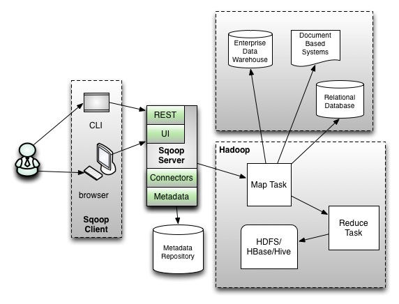
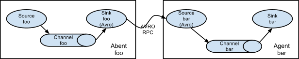

# ETL

## 一、介绍

ETL，是英文 Extract-Transform-Load 的缩写，用来描述将数据从来源端经过抽取(extract)、转换(transform)、加载(load)至目的端的过程。ETL 是构建数据仓库的重要一环，用户从数据源抽取出所需的数据，经过数据清洗，最终按照预先定义好的数据仓库模型，将数据加载到数据仓库中去。

**Extract（抽取）**：将数据从各种原始的业务系统中读取出来，这是所有工作的前提。一般抽取过程需要连接到不同的数据源，以便为随后的步骤提供数据。这一部分看上去简单而琐碎，实际上它是 ETL 解决方案的成功实施的一个主要障碍。

**Transform（转换）**：按照预先设计好的规则将抽取得数据进行转换，使本来异构的数据格式能统一起来。任何对数据的处理过程都是转换。这些处理过程通常包括（但不限于）下面一些操作：

1. 移动数据
2. 根据规则验证数据
3. 数据内容和数据结构的修改
4. 将多个数据源的数据集成
5. 根据处理后的数据计算派生值和聚集值

**Load（装载）**：将转换完的数据按计划增量或全部导入到数据仓库中。也就是说将数据加载到目标系统的所有操作。

## 二、解决方案

* 解决方案分两种情况。区分为是否需要中间转换
  * 不转换：只需要数据同步，只要确认配置好输入源与输出源就可以了。
  * 转换：中间需要进行数据出，之后才是进行数据同步。

* 下面介绍使用的是使用过的同步工具。
  * Kettle
  * DataX
  * Sqoop
  * Flume
  * StreamSets（未使用过）
* 下面表格是各工具的区分

| 工具       | 开源程度        | HDFS | RDBMS | File | 扩展 | UI | 数据处理 | 配置 | 分布式 | star |
| ---------- | --------------- | ---- | ----- | ---- | ---- | ---- | ---- | ---- | ---- | ---- |
| Kettle     | Pentaho         | √    | √     | √    | 2    | 4 | 5 | 4 | 4 |  |
| DataX      | Alibaba         | √    | √     |      | 5   | 0 | 3 | 5 | 0 |  |
| Scoop      | Apache          | √    | √     |      | 0    | 0 | 0 | 4 | 0 |  |
| Flume      | Apache/Cloudera | √    |       | √    | 5    | 0 | 5 | 4 | 4 |  |
| StreamSets |  | √ | √ | √ |      |  |  |      |      |  |

## 三、详细介绍

### 3.1 Kettle

#### 3.1.1 背景

* 官网：https://community.hitachivantara.com/s/article/data-integration-kettle
* Kettle 是 PDI 以前的名称，PDI 的全称是Pentaho Data Integeration，Kettle 本意是水壶的意思，表达了数据流的含义。
* Pentaho开源商业智能平台的搭建 pentaho是世界上最流行的开源商务智能软件。它是一个基于java平台的商业智能(Business Intelligence,BI)套件，之所以说是套件是因为它包括一个web server平台和几个工具软件：报表，分析，图表，数据集成，数据挖掘等，可以说包括了商务智能的方方面面。

#### 3.1.2 功能介绍

* Kettle是用java写的，跨平台Windows、Linux、Unix支持。
* Kettle是一个功能配置完善的数据集成工具，作为一款ETL功能，其功能是不可挑剔的。并且其友好的界面操作很容易入门。在这一个方面上，是其他开源软件所不能达到的效果。
* 数据源支持范围比较广，囊括了现在数据存储行业上大部分的数据源。
* 数据转换功能十分完全，支持各种复杂的数据处理。

#### 3.1.3 详细介绍

* Kettle包含了四个组件

  * Spoon(勺):图形界面工具，以图形化的方式开发转换和作业。
  * Kitchen(厨房):命令行调用Job
  * Pan(平底锅):命令行调用transformation
  * Carte(菜单):轻量级的Web容器，用于建立专用、远程的 Server

* Kettle的加载方式

  1. 利用Spoon构建转换或作业，并打包成一个文件。

  2. 文件打包执行。

  3. 部署执行

     * Kitchen执行，注意java环境、指定kjb文件(包含调度的transformation)、指定日志路径、指定参数、指定最小日志。

       ```json
       export JAVA_HOME=/opt/jdk1.8.0_221
       export PATH=$JAVA_HOME/bin:$PATH
       export CLASSPATH=.:$JAVA_HOME/lib/dt.jar:$JAVA_HOME/lib/tools.jar
       export JRE_HOME=$JAVA_HOME/jre
       /opt/data-integration/kitchen.sh -file=job.kjb -log=/home/bigdata/log/tbl_biz_log.log -param:tableName=tbl_biz_log -maxloglines=1000 -maxlogtimeout=1000
       ```

     * Carte 执行

       1. 启动Carte服务

          ```
          carte.sh 0.0.0.0 8080
          ```

       2. 在Spoon上配置远程服务。

       3. 在Spoon上启动远程服务。注意一个点，这个过程对于用户来说是一步，是分成三步的

          1. 打包成zip文件，除了kjb、ktr之外，还有一个启动配置的xml，里面包含了启动参数等一些条件。
          2. 上传zip到Carte服务，只是上传过程，并没有启动。
          3. 启动服务。

       4. 之后就可以在web页面上可以看到日志信息了

#### 3.1.4 遇到的问题处理

1. 数据库连接驱动找不到

   ```
   需要自己上传文件到lib目录下，这跟大部分的软件是一致的。
   ```

2. 具体的配置想了解

   ```markdown
   下面这个网址写了各个插件的用法
   https://wiki.pentaho.com/display/EAI/Pentaho+Data+Integration+Steps
   ```

3. 调用远程异常(windows端)

   ```
   Kettle windows端远程调用Linux服务器无法远程执行。报错Invalid byte 2 of 2-byte UTF-8 sequence。
   修改"spoon.bat":
   
   set OPT=%OPT% %PENTAHO_DI_JAVA_OPTIONS% "-Dfile.encoding=UTF-8" "-Dhttps.protocols=TLSv1,TLSv1.1,TLSv1.2"
   增加`"-Dfile.encoding=UTF-8"`，可见是由于编码问题导致的。
   ```

4. 时区不一致（linux端）

   ```
   修改"spoon.sh":
   set OPT= ....
   增加-Duser.timezone=GMT+8，可见是由于时区问题的。
   ```

5. 调整JVM内存大小

   ```
   实际过程中，会有大量的数据在内存中，修改"spoon.sh"，修改其内部的jvm大小，根据实际配置调整。
   ```

6. 调整日志限制

   ```
   任务中的日志保留在内存之中，过多的日志累计下来也会导致内存不足。
   实际开发更改为以xml文件启动，并配置日志大小：
   nohup sh carte.sh pwd/carte-8080.xml > carte-8080.out 2>&1 &
   
   <max_log_lines>500</max_log_lines>
   <max_log_timeout_minutes>240</max_log_timeout_minutes>
   <object_timeout_minutes>240</object_timeout_minutes>
   
   实际的日志可以通过控制台监控，也可以同步插入到数据库中。
   ```

任务中的日志保留在内存之中，过多的日志累计下来也会导致内存不足。

实际开发更改为以xml文件启动，并配置日志大小：

nohup sh carte.sh pwd/carte-8080.xml > carte-8080.out 2>&1 &

 

```
  <max_log_lines>500</max_log_lines>
  <max_log_timeout_minutes>240</max_log_timeout_minutes>
  <object_timeout_minutes>240</object_timeout_minutes>
```

实际的日志可以通过控制台监控，也可以同步插入到数据库中。

 修改"spoon.sh":

```
set OPT= ....
```

增加`-Duser.timezone=GMT+8`，可见是由于时区问题的.

#### 3.1.5 优缺点

**优点**：

1. 多数据源支持，包括Hadoop生态圈、RDBMS等等。
2. 丰富的数据处理功能。
3. 提供UI、几乎0代码实现数据处理。 

**缺点**：

1. 无法稳定支持服务运行，Carte虽然能提供Web Server，但是实际运行过程中，发现多次不稳定的情况。转而使用Kitchen同步，但是如果同步频率高，由于Kitchen频繁的启动性能，会加重系统压力。
2. 系统消耗大，如果有很大的数据处理需要，会消耗很多内存。
3. 插件开发难度大，一个是其官方的mvn仓库在国外，每次同步会比较耗时间；二是开发的时候，需要同时配置Spoon界面、同步文生成、解析文件、生成任务任务量会比较大。
4. 日志复杂，没有办法做到日志的详细监控，日志量也会很大。
5. 没有可视化的数据监控，无法知道同步数据的速度、同步量等。

**总结**：

	1. 强大这一点无可置疑
 	2. 不适合大量任务，可以考虑使用集群，但是没有实测其稳定性。
 	3. 使用简单、开发难。
 	4. 如果项目内需要集成Kettle、会比较麻烦。

### 3.2 DataX

#### 3.2.1 背景

* GitHub：https://github.com/alibaba/DataX
* DataX 是阿里巴巴集团内被广泛使用的离线数据同步工具/平台，实现包括 MySQL、Oracle、SqlServer、Postgre、HDFS、Hive、ADS、HBase、TableStore(OTS)、MaxCompute(ODPS)、DRDS 等各种异构数据源之间高效的数据同步功能。

#### 3.2.2 功能介绍

* DataX 是一个异构数据源离线同步工具，致力于实现包括关系型数据库(MySQL、Oracle等)、HDFS、Hive、ODPS、HBase、FTP等各种异构数据源之间稳定高效的数据同步功能。

* DataX本身作为数据同步框架，将不同数据源的同步抽象为从源头数据源读取数据的**Reader插件**，以及向目标端写入数据的**Writer插件**，理论上DataX框架可以支持任意数据源类型的数据同步工作。
* 同时DataX插件体系作为一套生态系统, 每接入一套新数据源该新加入的数据源即可实现和现有的数据源互通。
* DataX目前已经有了比较全面的插件体系，主流的RDBMS数据库、NOSQL、大数据计算系统都已经接入。

#### 3.2.3 详细介绍

* 框架设计

  ​	

* DataX本身作为离线数据同步框架，采用Framework + plugin架构构建。将数据源读取和写入抽象成为Reader/Writer插件，纳入到整个同步框架中。

  - Reader：Reader作为数据采集模块，负责采集数据源的数据，将数据发送给Framework。
  - Writer： Writer为数据写入模块，负责不断向Framework取数据，并将数据写入到目的端。
  - Framework：Framework用于连接reader和writer，作为两者的数据传输通道，并处理缓冲，流控，并发，数据转换等核心技术问题。

* 六大核心优势：

  * 可靠的数据质量监控
    * 完美解决数据传输个别类型失真问题，每一种数据源都会进行自己的数据类型转换策略
    * 提供作业全链路的流量、数据量的运行时监控
    * 提供脏数据探测
  * 丰富的数据转换功能
    * 可完成数据脱敏，补全，过滤等数据转换功能，另外还提供了自动groovy函数
  * 精准的速度控制
    * 通道(并发)、记录流、字节流三种流控模式，可以随意控制你的作业速度
  * 强劲的同步性能
    * 作业分配为多线程同步。
  * 健壮的容错机制
    * 线程内部重试
    * 线程级别重试
  * 极简的使用体验 
    * 配置json即可运行

* 配置文件介绍

  ```json
  #stream2stream.json
  {
    "job": {
      "content": [
        {
          "reader": {
            "name": "streamreader",
            "parameter": {
              "sliceRecordCount": 10,
              "column": [
                {
                  "type": "long",
                  "value": "10"
                },
                {
                  "type": "string",
                  "value": "hello，你好，世界-DataX"
                }
              ]
            }
          },
          "writer": {
            "name": "streamwriter",
            "parameter": {
              "encoding": "UTF-8",
              "print": true
            }
          }
        }
      ],
      "setting": {
        "speed": {
          "channel": 5
         }
      }
    }
  }
  ```

  ```
  python datax.py ./stream2stream.json 
  ```

#### 3.2.4 遇到的问题

* transformer详细介绍缺失

  ```
  尚未看到相关的文档介绍。
  ```

#### 3.2.5  优缺点

**优点**：

1. 使用便捷、体验极佳、实地部署运行快
2. 性能消耗小、并有完整的监控
3. 开发插件方便

**缺点**：

1. 
   DataX 3.0 开源版本支持单机多线程模式完成同步作业运行。
2. 不支持复杂数据处理，还有transformer的文档未找到

### 3.3 Sqoop

#### 3.3.1 背景

* 顶级Apache项目：http://sqoop.apache.org/
* Sqoop是apache旗下的一款 ”==Hadoop和关系数据库之间传输数据==”的工具

#### 3.3.2 功能介绍

* 将MySQL，Oracle导入数据到Hadoop的HDFS、HIVE、HBASE等数据存储系统

* 从Hadoop的文件系统中导出数据到关系数据库

  

#### 3.3.3 详细介绍

- 工作机制
  - 将导入和导出的命令翻译成mapreduce程序实现
  - 在翻译出的mapreduce中主要是对inputformat和outputformat进行定制

* 基本架构

  

  * 版本号为1.99x为sqoop2 
  * 在架构上：sqoop2引入了sqoop server，对connector实现了集中的管理 
  * 访问方式：REST API、 JAVA API、 WEB UI以及CLI控制台方式进行访问 

* 安装

  1. 修改配置文件

     ```bash
     # 重命名配置文件
     mv sqoop-env-template.sh  sqoop-env.sh
     
     #Set path to where bin/hadoop is available
     export HADOOP_COMMON_HOME=/opt/hadoop
     
     #Set path to where hadoop-*-core.jar is available
     export HADOOP_MAPRED_HOME=/opt/hadoop
     
     #set the path to where bin/hbase is available
     export HBASE_HOME=/opt/hbase
     
     #Set the path to where bin/hive is available
     export HIVE_HOME=/opt/hive
     ```

  2. 添加mysql jar包到sqoop的lib目录下。

  3. 修改环境变量

     ```
     export SQOOP_HOME=/opt/sqoop-1.4.7
     export PATH=$PATH:$SQOOP_HOME/bin
     ```

* 导入数据到HDFS

  ```bash
  sqoop import \
  --connect jdbc:mysql://node1:3306/userdb \
  --username root \
  --password 123456 \
  # 同步表
  --table emp \
  # 文件导出位置，空的话默认在用户目录下,ex:/user/hadoop
  --target-dir /sqoop/emp
  # 来判断导出目录是否存在，如果存在就删掉
  --delete-target-dir
  # 指定分隔符
  --fields-terminated-by '#' 
  # task个数
  --m 1
  ```

* 导入数据到Hive

  ```bash
  # 复制连接
  cp /opt/==/hive/lib/hive-exec-1.2.2.jar /opt/sqoop/lib/
  
  # hive 连接，创建数据库和表
  create database sqooptohive;
  
  create external table sqooptohive.emp_hive(id int,name string,deg string,salary double ,dept string) row format delimited fields terminated by '\001';
  
  # sqoop导入
  sqoop import \
  --connect jdbc:mysql://node1:3306/userdb \
  --username root \
  --password 123456 \
  --table emp \
  --fields-terminated-by '\001' \
  --hive-import \
  --hive-table sqooptohive.emp_hive \
  --hive-overwrite \
  --m 1
  ```

* 导入到mysql

  ```bash
  sqoop export \
  --connect jdbc:mysql://node1:3306/userdb \
  --username root --password 123456 \
  --table fromhdfs \
  --input-fields-terminated-by " " \
  --export-dir /user/hive/warehouse/hive_source
  ```

* sqoop作业
  
  * 可用于一个同步任务的暂时保存。

#### 3.2.4 遇到的问题

#### 3.2.5 优缺点

**优点**：

1. 配置简单
2. 支持RDBMS和HDFS的导入导出

**缺点**：

1. 性能未测试，估计也不会很差
2. 过滤只能sql处理，其他不方便

### 3.4 Flume

#### 3.4.1 背景

* Flume是Cloudera提供的一个高可用的，高可靠的，分布式的海量日志采集、聚合和传输的系统；
* Flume支持在日志系统中定制各类数据发送方，用于收集数据；
* Flume提供对数据进行简单处理，并写到各种数据接受方（可定制）的能力。

#### 3.4.2 功能介绍

* 架构图

  

* ==每一个agent相当于一个数据传递员，内部有三个组件==

  - **source**
    - 采集组件，用于跟数据源对接，以获取数据
  - **channel**
    - 传输通道组件，缓存数据，用于从source将数据传递到sink
  - **sink**
    - 下沉组件，数据发送给最终存储系统或者下一级agent中

* 复杂架构

  * 2个agent串联

	  

  * 多个agent串联
      

  * 多个channel
      

#### 3.4.3 详细介绍

* 安装

  1. 下载、解压

  2. 修改配置文件

     ```bash
     # 复制配置文件
     mv flume-env.sh.template flume-env.sh
     # 添加java环境变量
     vim flume-env.sh
     export JAVA_HOME=/opt/bigdata/jdk
     ```

  3. 设置环境变量

     ```
     # 配置flume的环境变量
     export FLUME_HOME=/opt/apache-flume-1.8.0-bin
     export PATH=$PATH:$FLUME_HOME/bin
     ```

* 部署

  ```properties
  # 一个目录中不断有新的文件产生，需要把目录中的文件不断地进行数据收集保存到HDFS上
  # Name the components on this agent
  a1.sources = r1
  a1.sinks = k1
  a1.channels = c1
  
  # 配置source
  ##注意：不能往监控目中重复丢同名文件
  a1.sources.r1.type = spooldir
  a1.sources.r1.spoolDir = /opt/bigdata/flumeData
  # 是否添加一个key存储目录下文件的绝对路径
  a1.sources.r1.fileHeader = true
  # 存储目录下文件的绝对路径key
  a1.sources.r1.fileHeaderKey = mm
  # 文件名
  a1.sources.r1.basenameHeader = true
  # 文件名 key
  a1.sources.r1.basenameHeaderKey = nn
  a1.sources.r1.channels = c1
  
  #配置channel
  a1.channels.c1.type = memory
  # capacity > transactionCapacity
  a1.channels.c1.capacity = 1000
  a1.channels.c1.transactionCapacity = 100
  
  #配置sink
  a1.sinks.k1.type = hdfs
  a1.sinks.k1.channel = c1
  a1.sinks.k1.hdfs.path = hdfs://node1:9000/spooldir/files/%y-%m-%d/%H%M/
  a1.sinks.k1.hdfs.filePrefix = events-
  # 滚动生成目录，每10minute生成一个新目录
  a1.sinks.k1.hdfs.round = true
  a1.sinks.k1.hdfs.roundValue = 10
  a1.sinks.k1.hdfs.roundUnit = minute
  # 达到一定时间写入
  a1.sinks.k1.hdfs.rollInterval = 60
  # 达到一定大小写入
  a1.sinks.k1.hdfs.rollSize = 50
  # 达到一定行数写入
  a1.sinks.k1.hdfs.rollCount = 10
  # 每批次数据
  a1.sinks.k1.hdfs.batchSize = 100
  a1.sinks.k1.hdfs.useLocalTimeStamp = true
  #生成的文件类型，默认是Sequencefile，可用DataStream，则为普通文本
  a1.sinks.k1.hdfs.fileType = DataStream
  ```

  ```bash
  # 启动
  flume-ng agent -n a1 -c /opt/flume/myconf -f /opt/flume/myconf/dir2Hdfs.conf -Dflume.root.logger=info,console
  ```

#### 3.4.4 遇到的问题

1. tail日志，如果是tail文件时，如果flume挂掉，可能日志就没有办法冲洗你监控了

   ```
   使用 TAILDIR
   # 监控一个目录下的新增的文件、以及文件中新增的内容
   # 并且可以记录每一给文件的采集位置
   agent1.sources.source1.type = TAILDIR
   agent1.sources.source1.positionFile = ./taildir_position.json
   
   
   a1.channels = ch1
   a1.sources = s1
   a1.sinks = hdfs-sink1
   
   #channel
   a1.channels.ch1.type = memory
   a1.channels.ch1.capacity=10000
   a1.channels.ch1.transactionCapacity=500
   
   #source
   a1.sources.s1.channels = ch1
   #监控一个目录下的多个文件新增的内容
   a1.sources.s1.type = taildir
   #通过 json 格式存下每个文件消费的偏移量，避免从头消费
   a1.sources.s1.positionFile = /opt/bigdata/flume/index/taildir_position.json
   a1.sources.s1.filegroups = f1 f2 f3 
   a1.sources.s1.filegroups.f1 = /home/hadoop/taillogs/access.log
   a1.sources.s1.filegroups.f2 = /home/hadoop/taillogs/nginx.log
   a1.sources.s1.filegroups.f3 = /home/hadoop/taillogs/web.log
   a1.sources.s1.headers.f1.headerKey = access
   a1.sources.s1.headers.f2.headerKey = nginx
   a1.sources.s1.headers.f3.headerKey = web
   a1.sources.s1.fileHeader  = true
   
   ##sink
   a1.sinks.hdfs-sink1.channel = ch1
   a1.sinks.hdfs-sink1.type = hdfs
   a1.sinks.hdfs-sink1.hdfs.path =hdfs://node1:9000/demo/data/%{headerKey}
   a1.sinks.hdfs-sink1.hdfs.filePrefix = event_data
   a1.sinks.hdfs-sink1.hdfs.fileSuffix = .log
   a1.sinks.hdfs-sink1.hdfs.rollSize = 1048576
   a1.sinks.hdfs-sink1.hdfs.rollInterval =20
   a1.sinks.hdfs-sink1.hdfs.rollCount = 10
   a1.sinks.hdfs-sink1.hdfs.batchSize = 1500
   a1.sinks.hdfs-sink1.hdfs.round = true
   a1.sinks.hdfs-sink1.hdfs.roundUnit = minute
   a1.sinks.hdfs-sink1.hdfs.threadsPoolSize = 25
   a1.sinks.hdfs-sink1.hdfs.fileType =DataStream
   a1.sinks.hdfs-sink1.hdfs.writeFormat = Text
   a1.sinks.hdfs-sink1.hdfs.callTimeout = 60000
   ```

2. 分时段处理

   | hdfs.round      | false  | Should the timestamp be rounded down (if true, affects all time based escape sequences except %t) |
   | --------------- | ------ | ------------------------------------------------------------ |
   | hdfs.roundValue | 1      | Rounded down to the highest multiple of this (in the unit configured usinghdfs.roundUnit), less than current time. |
   | hdfs.roundUnit  | second | The unit of the round down value - second, minute or hour.   |

   Ø round： 默认值：false 是否启用时间上的”舍弃”，这里的”舍弃”，类似于”四舍五入”

   Ø roundValue：默认值：1  时间上进行“舍弃”的值；

   Ø roundUnit： 默认值：seconds时间上进行”舍弃”的单位，包含：second,minute,hour

   ```
   案例一：
   a1.sinks.k1.hdfs.path = /flume/events/%y-%m-%d/%H:%M/%S
   a1.sinks.k1.hdfs.round = true
   a1.sinks.k1.hdfs.roundValue = 10
   a1.sinks.k1.hdfs.roundUnit = minute
   当时间为2015-10-16 17:38:59时候，hdfs.path依然会被解析为：
   /flume/events/2015-10-16/17:30/00
   /flume/events/2015-10-16/17:40/00
   /flume/events/2015-10-16/17:50/00
   因为设置的是舍弃10分钟内的时间，因此，该目录每10分钟新生成一个。
   
   案例二：
   a1.sinks.k1.hdfs.path = /flume/events/%y-%m-%d/%H:%M/%S
   a1.sinks.k1.hdfs.round = true
   a1.sinks.k1.hdfs.roundValue = 10
   a1.sinks.k1.hdfs.roundUnit = second
   现象：10秒为时间梯度生成对应的目录，目录下面包括很多小文件！！！
   格式如下：
   /flume/events/2016-07-28/18:45/10
   /flume/events/2016-07-28/18:45/20
   /flume/events/2016-07-28/18:45/30
   /flume/events/2016-07-28/18:45/40
   /flume/events/2016-07-28/18:45/50
   /flume/events/2016-07-28/18:46/10
   /flume/events/2016-07-28/18:46/20
   /flume/events/2016-07-28/18:46/30
   /flume/events/2016-07-28/18:46/40
   /flume/events/2016-07-28/18:46/50
   ```

#### 3.4.5 优缺点

**优点**：

1. 文件到HDFS
2. 分布式

**缺点**：

1. 是日志采集系统，没有数据库支持。

### 3.5 Logstash

#### 3.5.1 背景

* 想到Logstash是因为Flume和Logstash功能差不多，也是日志采集。
* 后面发现也Logstash不仅仅支持ElasticSearch，可以支持数据源、HDFS。

## 四、实际开发选择什么样的工具