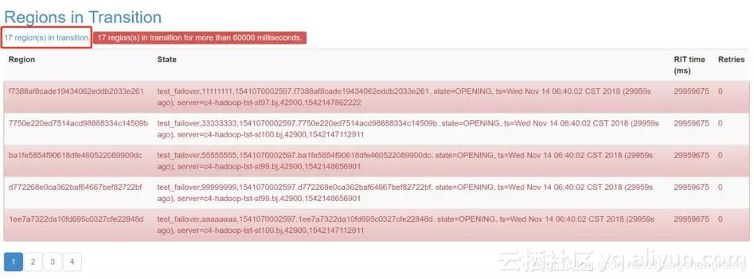
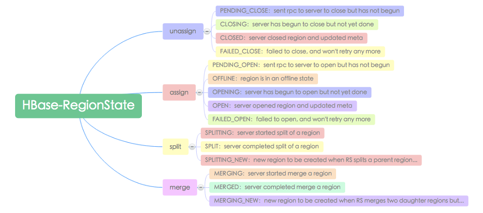
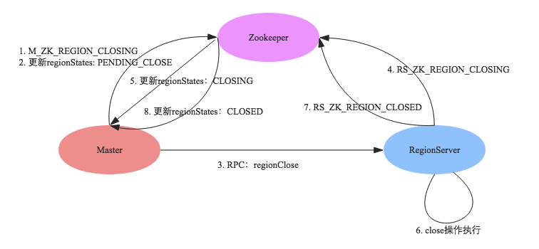
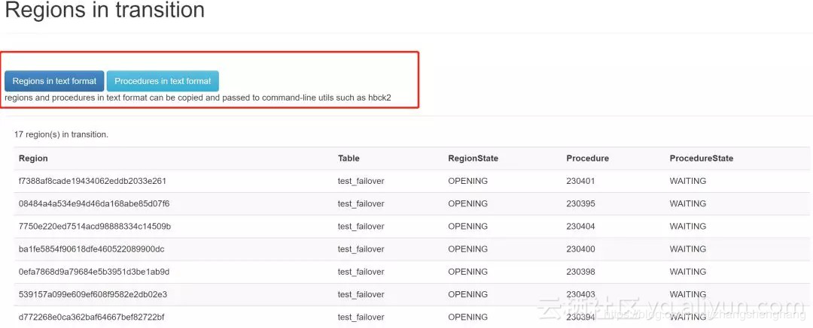

## HBase中的RIT机制

### 一、背景

某日，HBase中部分RegionServer节点宕机。当时宕机的时候，考虑到往常的经验，马上就去CDH上重启该RegionServer节点。然后等待其恢复，实际上，服务也正常恢复了，事情也就也完成了。

查看一下日志，因为分配内存内存不足，导致频繁的GC，一度一分种内GC的时间超过了40s(CDH告警阈值为60%)， 导致RegionServer宕机。

### 二、增加分配内存

CDH集群中增加RegionServer的堆栈大小，可根据实际情况酌情增加内存。

### 三、RIT

服务基本上正常了，在Master管理页面上也能看到节点上线，但是依赖于HBase之上的服务却异常。

但是Kylin查询功能频繁超时，部分Region请求超时，但是所有的节点服务都是正常的啊？

于是，重新看了查了一遍Master服务，发现大量的Region数据在处于RIT状态。

 

而且有一个共性，RIT中的Region块都是在上次宕机那台节点上的。

现在，问题有两个：

* 导致发生这种情况的原因是什么？
* 如何修复这些数据？

### 四、导致这种情况的原因

先看日志，日志是最好查询故障的原因，很不幸，当时着急关注问题解决，没有观察日志情况，只能在后续上排查问题。

#### 3.1 看看 hdfs中是否有副本丢失

* 此类问题的来源便是HDFS中副本丢失，导致Hbase的数据异常。

* 解决方案：

  * ```sh
    #更改已经上传文件的副本数，修复Missing blocks
    hadoop fs -setrep -R 3 /
    ```

  * ```sh
    # 删除损坏文件
    hdfs fsck -delete 
    ```

#### 3.2 RIT

* Region-In-Transition说的是Region变迁机制，实际上是指在一次特定操作行为中Region状态的变迁，那这里就涉及这么几个问题：

  1. Region存在多少种状态？
  2. HBase有哪些操作会触发Region状态变迁？
  3. 一次正常操作过程中Region状态变迁的完整流程是怎么样的？
  4. 如果Region状态在变迁的过程中出现异常又会怎么样？

* **RegionerState**

  

* **状态迁移**

  

  如图为所示是Region在close时的状态变迁图，其中红字部分就是发生的各种事件：

  1. 如果发生M_ZK_REGION_CLOSING事件，Region就会从OPEN状态迁移到PENDING_CLOSE状态
  2. 发生RS_ZK_REGION_CLOSING事件，Region会从PENDING_CLOSE状态迁移到CLOSING状态
  3. 发生RS_ZK_REGION_CLOSED事件，Region就会从CLOSING状态迁移到CLOSED状态

* **一次正常操作过程中Region状态变迁的完整流程**

  

  1. HMaster先执行事件M_ZK_REGION_CLOSING并更新RegionStates。
  2. 将该Region的状态改为PENDING_CLOSE，并在regionsInTransition中插入一条记录；
  3. 发送一条RPC命令给拥有该Region的RegionServer，责令其关闭该Region;
  4. RegionServer接收到HMaster发送过来的命令之后，首先生成一个RS_ZK_REGION_CLOSING事件，更新到Zookeeper。
  5. Master监听到ZK节点变动之后更新regionStates，将该Region的状态改为CLOSING;
  6. RegionServer执行真正的Region关闭操作：如果该Region正在执行flush或者compaction，等待操作完成；否则将该Region下的所有Memstore强制flush;
  7. 完成之后生成事件RS_ZK_REGION_CLOSED，更新到Zookeeper。
  8. Master监听到ZK节点变动之后更新regionStates，将该Region的状态改为CLOSED;

* **如果Region状态在变迁的过程中出现异常会怎么样？**

  * Master宕机重启：Master在宕机之后会丢失所有内存中的信息，也包括RIT信息以及Region状态信息，因此在重启之后会第一时间重建这些信息。重启之后会遍历Zookeeper上/hbase/regions-in-transition节点下的所有子节点，解析所有子节点对应的最后一个‘事件’，解析完成之后一方面借此重建全局的Region状态，另一方面根据状态机转移图对处于RIT状态的Region进行处理。比如如果发现当前Region的状态是PENDING_CLOSE，Master就会再次据此向RegionServer发送’关闭Region’的RPC命令。
  * 其他异常宕机：HBase会在后台开启一个线程定期检查内存中处于RIT中的Region，一旦这些Region处于RIT状态的时长超过一定的阈值（由参数**hbase.master.assignment.timeoutmonitor.timeout**定义，默认600000ms）就会重新执行unassign或者assign操作。比如如果当前Region的状态是PENDING_CLOSE，而且处于该状态的时间超过了600000ms，Master就会重新执行unassign操作，向RegionServer再次发送’关闭Region’的RPC命令。
  * 可见，HBase提供了基本的重试机制，保证在一些短暂异常的情况下能够通过不断重试拉起那些处于RIT状态的Region，进而保证操作的完整性和状态的一致性。然而不幸的是，因为各种各样的原因，很多Region还是会掉入长时间的RIT状态，甚至是永久的RIT状态，必须人为干预才能解决。

* RIT的整体机制我们明白了。回到我们出现的问题，我们所有的数据都是处于在OPENING状态，表示服务开始分配但是未分配完成，很有可能是在分配过程中直接宕机，导致这些Region一直处于Region状态。

* 处理方案：

  1. 重新assign Region，对每个异常的region进行数据处理

     ```sh
     # hbase shell
     # assign 'region名称'
     ```
  
     ````javascript
   let tds = $(".tab-pane tr[role=alert] > td:nth-child(2)");
     let tdArrays = [];
   for (let i = 0; i< tds.length; i++) {
     	if (tds[i] != null) {
  	 		let html = tds[i].innerHTML;
     		if (html != null && html.indexOf('KYLIN_') > 0) {
     			tdArrays.push(html.trim().split(' state=OPENING')[0]);
     		}
     	}
   }
     tdArrays.join("\";\nassign \"")
     ````
   ````
  
   ````
2. 使用修复工具类
  
   * hbase 2.0之后，不在提供默认的hbck工具类，需要使用hbck2，进行使用
    
   ```sh
     git  clone  https://github.com/apache/hbase-operator-tools.git
   mvn  clean  package
   ```
  
     
  
   点击红框圈住的这个链接，会展示所有的 region。
  
     
  
     因为我们最后是希望通过 HBCK2 来进行处理，那么最好是可以复制粘贴需要处理的 region 或者 procedure, 所以可以点击圈出的这两个按钮，会以 text 形式展示所有 region 或者所有 procedure。
  
     如下是一个简单的执行命令。
  
     ```
     # assigns 
     sudo -u hbase hbase hbck -j /data/hbase-hbck2-1.1.0-SNAPSHOT.jar assigns 726264093b4a9162f5dba531edcf58ac
     ```
  
     

#### 3.3 其他问题与参考方案

```sh
HBase的 Regions in Transition 问题
# 查看hbase中损坏的block
hbase hbck

# 修复hbase
hbase hbck -repair


The Load Balancer is not enabled which will eventually cause performance degradation in HBase as Regions will not be distributed across all RegionServers. The balancer is only expected to be disabled during rolling upgrade scenarios. 


关闭balance,防止在停掉服务后，原先节点上的分片会迁移到其他节点上，到时候在移回来，浪费时间。 
hbase(main):001:0> balance_switch true


2018-02-27 21:14:54,236 INFO  [hbasefsck-pool1-t38] util.HBaseFsckRepair: Region still in transition, waiting for it to become assigned: {ENCODED => e540df791e7fcdc93c118b8055d1c74f, NAME => 'pos_flow_summary_20170713,,1503656523513.e540df791e7fcdc93c118b8055d1c74f.', STARTKEY => '', ENDKEY => ''}
2018-02-27 21:14:54,236 INFO  [hbasefsck-pool1-t47] util.HBaseFsckRepair: Region still in transition, waiting for it to become assigned: {ENCODED => e59b1015c6fed189cdb9ba8493024563, NAME => 'pos_flow_summary_20180111,,1515768771542.e59b1015c6fed189cdb9ba8493024563.', STARTKEY => '', ENDKEY => ''}
2018-02-27 21:14:54,241 INFO  [hbasefsck-pool1-t44] util.HBaseFsckRepair: Region still in transition, waiting for it to become assigned: {ENCODED => d22e214e72ff89e87b4df3eebd9603f9, NAME => 'pos_flow_summary_20180112,,1515855181051.d22e214e72ff89e87b4df3eebd9603f9.', STARTKEY => '', ENDKEY => ''}
2018-02-27 21:14:54,244 INFO  [hbasefsck-pool1-t23] util.HBaseFsckRepair: Region still in transition, waiting for it to become assigned: {ENCODED => e8667191e988db9d65b52cfdb5e83a4d, NAME => 'pos_flow_summary_20170310,,1504229353726.e8667191e988db9d65b52cfdb5e83a4d.', STARTKEY => '', ENDKEY => ''}
2018-02-27 21:14:54,245 INFO  [hbasefsck-pool1-t45] util.HBaseFsckRepair: Region still in transition, waiting for it to become assigned: {ENCODED => d05b759994d757b8fc857993e3351648, NAME => 'app_point,5000,1510910952310.d05b759994d757b8fc857993e3351648.', STARTKEY => '5000', ENDKEY => '5505|1dcfb8c9a44c4147acc823c2e463d536'}

# 修复 .META表
hbase hbck -fixMeta

ERROR: Region { meta => pos_flow,2012|dd12dceee69c56f6776154d02e49f840,1518061965154.71eb7d463708010bc2a3f1e96deca135., hdfs => hdfs://namenode01:9000/hbase/data/default/pos_flow/71eb7d463708010bc2a3f1e96deca135, deployed => , replicaId => 0 } not deployed on any region server.
ERROR: Region { meta => pos_flow_summary_20180115,,1516115199923.70df944adbd82c1422be8f7ee8c24f3e., hdfs => hdfs://namenode01:9000/hbase/data/default/pos_flow_summary_20180115/70df944adbd82c1422be8f7ee8c24f3e, deployed => , replicaId => 0 } not deployed on any region server.
ERROR: Region { meta => pos_flow,5215|249f79b383f5c144cdd95cd1c29fdec3,1518380260884.67bfa42b4c45ec847c7eb27bbd7d86e5., hdfs => hdfs://namenode01:9000/hbase/data/default/pos_flow/67bfa42b4c45ec847c7eb27bbd7d86e5, deployed => , replicaId => 0 } not deployed on any region server.
ERROR: Region { meta => pos_flow_summary_20170528,,1504142971183.679bcdecd0335c99d847374db34de31d., hdfs => hdfs://namenode01:9000/hbase/data/default/pos_flow_summary_20170528/679bcdecd0335c99d847374db34de31d, deployed => , replicaId => 0 } not deployed on any region server.
ERROR: Region { meta => pos_flow,4744|dcf7bccc75f738986e5db100f1f54473,1518489513549.673e899d577f6111b5699b3374ba6adc., hdfs => hdfs://namenode01:9000/hbase/data/default/pos_flow/673e899d577f6111b5699b3374ba6adc, deployed => , replicaId => 0 } not deployed on any region server.
ERROR: Region { meta => pos_flow,1321|ab83f75ef25bdd0d2ecc363fe1fe0106,1518466350793.66b9622950bba42339f011ac745b080b., hdfs => hdfs://namenode01:9000/hbase/data/default/pos_flow/66b9622950bba42339f011ac745b080b, deployed => , replicaId => 0 } not deployed on any region server.
ERROR: Region { meta => pos_flow,9449|1ed33683e675c3e9ddbecf4d9bd42183,1518041132081.66b11e69bc62f356b3f81f351b8a6c68., hdfs => hdfs://namenode01:9000/hbase/data/default/pos_flow/66b11e69bc62f356b3f81f351b8a6c68, deployed => , replicaId => 0 } not deployed on any region server.
ERROR: Region { meta => access_log,1000,1517363823393.65c41f802af180f41af848f1fed8e725., hdfs => hdfs://namenode01:9000/hbase/data/default/access_log/65c41f802af180f41af848f1fed8e725, deployed => , replicaId => 0 } not deployed on any region server.


Table pos_flow_summary_20180222 is okay.
    Number of regions: 0
    Deployed on: 
Table pos_flow_summary_20180223 is okay.
    Number of regions: 0
    Deployed on: 
Table pos_flow_summary_20180224 is okay.
    Number of regions: 1
    Deployed on:  prd-bldb-hdp-data02,60020,1519734905071
Table pos_flow_summary_20180225 is okay.
    Number of regions: 1
    Deployed on:  prd-bldb-hdp-data02,60020,1519734905071
Table pos_flow_summary_20180226 is okay.
    Number of regions: 1
    Deployed on:  prd-bldb-hdp-data02,60020,1519734905071
Table hbase:namespace is okay.
    Number of regions: 1
    Deployed on:  prd-bldb-hdp-data02,60020,1519734905071
Table gb_app_active is inconsistent.
    Number of regions: 7
    Deployed on:  prd-bldb-hdp-data01,60020,1519734905393 prd-bldb-hdp-data02,60020,1519734905071 prd-bldb-hdp-data03,60020,1519734905043
Table app_point is inconsistent.
    Number of regions: 3
    Deployed on:  prd-bldb-hdp-data01,60020,1519734905393 prd-bldb-hdp-data03,60020,1519734905043
inconsistencies detected.
Status: INCONSISTENT
2018-02-27 21:40:59,644 INFO  [main] client.ConnectionManager$HConnectionImplementation: Closing master protocol: MasterService
2018-02-27 21:40:59,644 INFO  [main] client.ConnectionManager$HConnectionImplementation: Closing zookeeper sessionid=0x161d70981710083
2018-02-27 21:40:59,646 INFO  [main] zookeeper.ZooKeeper: Session: 0x161d70981710083 closed
2018-02-27 21:40:59,646 INFO  [main-EventThread] zookeeper.ClientCnxn: EventThread shut down


# 当出现漏洞  
hbase hbck -fixHdfsHoles 

# 缺少regioninfo  
hbase hbck -fixHdfsOrphans

# hbase region 引用文件出错
# Found lingering reference file hdfs：  
hbase hbck -fixReferenceFiles 

# 修复assignments问题
hbase hbck -fixAssignments

2018-02-28 14:07:57,814 INFO  [hbasefsck-pool1-t40] util.HBaseFsckRepair: Region still in transition, waiting for it to become assigned: {ENCODED => 0836651ac3e23c331ca049e2f333e19f, NAME => 'pos_flow,9139|62b0a7a92cb8c4d25cea82991856334e,1518205798951.0836651ac3e23c331ca049e2f333e19f.', STARTKEY => '9139|62b0a7a92cb8c4d25cea82991856334e', ENDKEY => '9159|441da161eba8d989493f9d2ca2a3e4a2'}
2018-02-28 14:07:57,814 INFO  [hbasefsck-pool1-t11] util.HBaseFsckRepair: Region still in transition, waiting for it to become assigned: {ENCODED => 0e4dbc902294c799db7029df118c61a4, NAME => 'app_point,9000,1510910950800.0e4dbc902294c799db7029df118c61a4.', STARTKEY => '9000', ENDKEY => '9509|05a93'}
2018-02-28 14:07:57,817 INFO  [hbasefsck-pool1-t10] util.HBaseFsckRepair: Region still in transition, waiting for it to become assigned: {ENCODED => 03f6d27f36e4f73e8030cfa6454dfadf, NAME => 'pos_flow_summary_20170913,,1505387404710.03f6d27f36e4f73e8030cfa6454dfadf.', STARTKEY => '', ENDKEY => ''}
2018-02-28 14:07:57,817 INFO  [hbasefsck-pool1-t35] util.HBaseFsckRepair: Region still in transition, waiting for it to become assigned: {ENCODED => 0634fab1259b036a5fbd024fd8da4ba7, NAME => 'pos_flow_summary_20171213,,1513262830799.0634fab1259b036a5fbd024fd8da4ba7.', STARTKEY => '', ENDKEY => ''}
2018-02-28 14:07:57,818 INFO  [hbasefsck-pool1-t29] util.HBaseFsckRepair: Region still in transition, waiting for it to become assigned: {ENCODED => 0666757ecbb89b60a52613cba2dab2f0, NAME => 'pos_flow,4344|8226741aea1eb243789f87abd6e44318,1518152887266.0666757ecbb89b60a52613cba2dab2f0.', STARTKEY => '4344|8226741aea1eb243789f87abd6e44318', ENDKEY => '4404|5fe6f71832f527f173696d3570556461'}
2018-02-28 14:07:57,819 INFO  [hbasefsck-pool1-t42] util.HBaseFsckRepair: Region still in transition, waiting for it to become assigned: {ENCODED => 037d3dff1101418ea3c3868dc9855ecc, NAME => 'pos_flow,7037|c0124cbc08feb233e745aae0d896195a,1518489580825.037d3dff1101418ea3c3868dc9855ecc.', STARTKEY => '7037|c0124cbc08feb233e745aae0d896195a', ENDKEY => '7057|9fae9bddd296a534155c02297532cd28'}
2018-02-28 14:07:57,820 INFO  [hbasefsck-pool1-t12] util.HBaseFsckRepair: Region still in transition, waiting for it to become assigned: {ENCODED => 01ff32a4f85c2de9e3e16c9b6156afa2, NAME => 'pos_flow_summary_20170902,,1504437004424.01ff32a4f85c2de9e3e16c9b6156afa2.', STARTKEY => '', ENDKEY => ''}
2018-02-28 14:07:57,823 INFO  [hbasefsck-pool1-t41] util.HBaseFsckRepair: Region still in transition, waiting for it to become assigned: {ENCODED => 0761d39042e2ec7002dbf291ce23e209, NAME => 'pos_flow_summary_20170725,,1503624161916.0761d39042e2ec7002dbf291ce23e209.', STARTKEY => '', ENDKEY => ''}
  

hbase master stop
hbase master start
service hbase-master restart


2018-02-28 14:41:39,547 INFO  [main] hdfs.DFSClient: No node available for BP-1225127698-172.31.132.71-1516782893469:blk_1073741999_1175 file=/hbase/data/default/pos_flow_summary_20170304/.tabledesc/.tableinfo.0000000001
2018-02-28 14:41:39,547 INFO  [main] hdfs.DFSClient: Could not obtain BP-1225127698-172.31.132.71-1516782893469:blk_1073741999_1175 from any node: java.io.IOException: No live nodes contain current block No live nodes contain current block Block locations: Dead nodes: . Will get new block locations from namenode and retry...
2018-02-28 14:41:39,547 WARN  [main] hdfs.DFSClient: DFS chooseDataNode: got # 1 IOException, will wait for 251.87213750182957 msec.
2018-02-28 14:41:39,799 INFO  [main] hdfs.DFSClient: No node available for BP-1225127698-172.31.132.71-1516782893469:blk_1073741999_1175 file=/hbase/data/default/pos_flow_summary_20170304/.tabledesc/.tableinfo.0000000001
2018-02-28 14:41:39,799 INFO  [main] hdfs.DFSClient: Could not obtain BP-1225127698-172.31.132.71-1516782893469:blk_1073741999_1175 from any node: java.io.IOException: No live nodes contain current block No live nodes contain current block Block locations: Dead nodes: . Will get new block locations from namenode and retry...
2018-02-28 14:41:39,799 WARN  [main] hdfs.DFSClient: DFS chooseDataNode: got # 2 IOException, will wait for 5083.97300871329 msec.
2018-02-28 14:41:44,883 INFO  [main] hdfs.DFSClient: No node available for BP-1225127698-172.31.132.71-1516782893469:blk_1073741999_1175 file=/hbase/data/default/pos_flow_summary_20170304/.tabledesc/.tableinfo.0000000001
2018-02-28 14:41:44,883 INFO  [main] hdfs.DFSClient: Could not obtain BP-1225127698-172.31.132.71-1516782893469:blk_1073741999_1175 from any node: java.io.IOException: No live nodes contain current block No live nodes contain current block Block locations: Dead nodes: . Will get new block locations from namenode and retry...
2018-02-28 14:41:44,883 WARN  [main] hdfs.DFSClient: DFS chooseDataNode: got # 3 IOException, will wait for 9836.488682902267 msec.
```

### 五、总结

* 问题出现了，第一时间去查看日志，找到问题之后才处理问题。
* 需要对HBase中的RegionState增加了解，特别状态切换的。