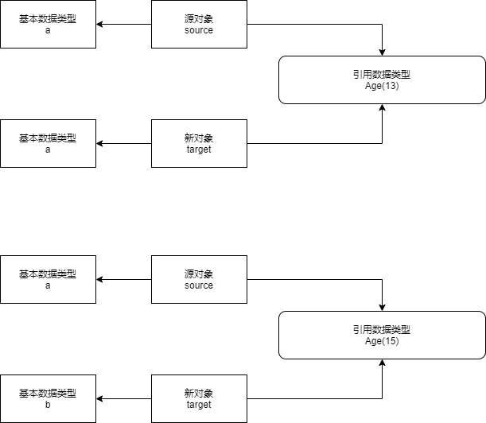
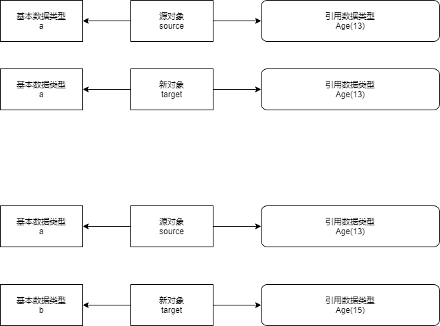

# Java的浅拷贝与深拷贝

## 一、概念

* 浅拷贝
  * 浅拷贝仅仅复制所考虑的对象（包括对象中的基本变量），而不复制它所引用的对象。
* 深拷贝
  * 深拷贝把要复制的对象所引用的对象都复制了一遍，并拷贝属性指向的动态分配的内存。
* 简单描述一下，就是浅拷贝引用了同一个对象地址，而深拷贝却是一个新的对象。

## 二、问题来源

* 在一个web请求接口中，返回对象多次封装了同一个结合，导致返回json中的内容体出现了$ref。

* 问题重现：

  * 定义一个Student(String name,Age age)，Age(Integer age)类

    ```java
    public static void main(String[] args) {
        Student student1 = new Student("张三",new Age(14));
        Student student2 = new Student("李四",new Age(15));
        List son = Arrays.asList(student1,student2);
        List<List> father = new ArrayList<>();
        father.add(son);
        father.add(son);
        System.out.println(JSON.toJSONString(father));
        System.out.println(JSON.toJSONString(father, SerializerFeature.DisableCircularReferenceDetect));
    }
    //[[{"age":14,"name":"张三"},{"age":15,"name":"李四"}],{"$ref":"$[0]"}]
    //[[{"age":14,"name":"张三"},{"age":15,"name":"李四"}],[{"age":14,"name":"张三"},{"age":15,"name":"李四"}]]
    ```

* FastJson循环引用问题

  * 解决方案一：

    * 简单转换

      ```java
      System.out.println(JSON.toJSONString(father, SerializerFeature.DisableCircularReferenceDetect));
      ```

    * 配置SpringBoot项目中的json序列化配置

      ```java
      fastJsonConfig.setSerializerFeatures(SerializerFeature.DisableCircularReferenceDetect);
      ```

  * 解决方案二：

    * 创建新对象，不循环引用。

* 当然，最好的解决办法是创建对象，FastJson提供了一个监测机制，防止循环解析导致StackOverflowError。某一次的问题可以判断为不是循环引用，但无法保证下一次的循环引用。把监测关了，下一次就可能出现StackOverflowError。避免这个问题，就要创建新的对象。于是就来到了数据的拷贝。

## 三、拷贝

先定义一个基本对象

```java
public class CopyObject implements Cloneable{
    // 基本类型
    private String name;
    // 引用类型
    private StringBuilder add;

    public CopyObject(String name, StringBuilder add) {
        this.name = name;
        this.add = add;
    }

    public String getName() {
        return name;
    }

    public void setName(String name) {
        this.name = name;
    }

    public StringBuilder getAdd() {
        return add;
    }

    public void setAdd(StringBuilder add) {
        this.add = add;
    }

    // 浅拷贝
    @Override
    protected Object clone() throws CloneNotSupportedException {
        return super.clone();
    }
}
```

### 3.1 浅拷贝

* 复制**基本数据类型**

* 引用老的**引用数据类型**

  ```java
  Student、Age类实现CloneAble接口，重写实现clone() 
      @Override
      protected Object clone() throws CloneNotSupportedException {
          return super.clone();
      }
  ```

  ```java
  
  
  public static void main(String[] args) throws CloneNotSupportedException, InvocationTargetException, NoSuchMethodException, InstantiationException, IllegalAccessException {
      Age age = new Age(13);
      Student source = new Student("a", age);
      Student target = (Student) source.clone();
      Student target =  SerializationUtils.clone(source);
      Student target = JSONObject.parseObject(JSONObject.toJSONString(source), Student.class);
      System.out.println("step1 =====================");
      System.out.println("source:" + source.getName() + "  " + source.getAge().getAge());
      //source:a  13
      System.out.println("target:" + target.getName() + "  " + target.getAge().getAge());
      target.setName("b");
      //target:a  13
      target.getAge().setAge(15);
      System.out.println("step2 =====================");
      System.out.println("source:" + source.getName() + "  " + source.getAge().getAge());
      //source:a  15
      System.out.println("target:" + target.getName() + "  " + target.getAge().getAge());
      //target:a  15
  }
  ```

* 图解：

  

### 3.1 深拷贝

* 复制所有的的**引用数据类型**

  ```java
  重写Student的实现clone() 
      @Override
      protected Student clone() throws CloneNotSupportedException {
          Student student = (Student) super.clone();
          student.setAge((Age) age.clone());
          return student;
      }
  ```

  ```java
  
  public static void main(String[] args) throws CloneNotSupportedException, InvocationTargetException, NoSuchMethodException, InstantiationException, IllegalAccessException {
      Age age = new Age(13);
      Student source = new Student("a", age);
      //        Student target = (Student) source.clone();
      //        Student target =  SerializationUtils.clone(source);
      Student target = JSONObject.parseObject(JSONObject.toJSONString(source), Student.class);
      System.out.println("step1 =====================");
      System.out.println("source:" + source.getName() + "  " + source.getAge().getAge());
      //source:a  13
      System.out.println("target:" + target.getName() + "  " + target.getAge().getAge());
      //target:a  13
      target.setName("b");
      target.getAge().setAge(15);
      System.out.println("step2 =====================");
      System.out.println("source:" + source.getName() + "  " + source.getAge().getAge());
      //source:a  13
      System.out.println("target:" + target.getName() + "  " + target.getAge().getAge());
      //target:b  15
  }
  ```

* 图解：

  

## 四、实现

* 浅拷贝

  * 默认Object就带有clone方法，但是属于protect。
  * 需要实现Cloneable工具类之后，重现clone方法。
  * **也有许多其他的工具类提供序列化，使用的时候一定要注意原理，再使用。**

* 深拷贝

  * 序列化与反序列化的机制存在下，会保证对象完成不一样。

  1. **利用common-lang序列化工具clone工具**：
  
     ```java
     // Student、Age需要实现Serializable
   Student targetShallow =  SerializationUtils.clone(source);
     ```

  2. **对于复杂的数组对象无法直接序列化，也可使用JSON序列化之后，再反序列化**
  
     ```java
   Student target = JSONObject.parseObject(JSONObject.toJSONString(source), Student.class);
     ```
  
* **【强制】避免用 Apache Beanutils 进行属性的 copy。**（阿里巴巴Java开发手册）

  * **Apache BeanUtils 性能较差，可以使用其他方案比如 Spring BeanUtils, Cglib BeanCopier，注意 均是浅拷贝。**

