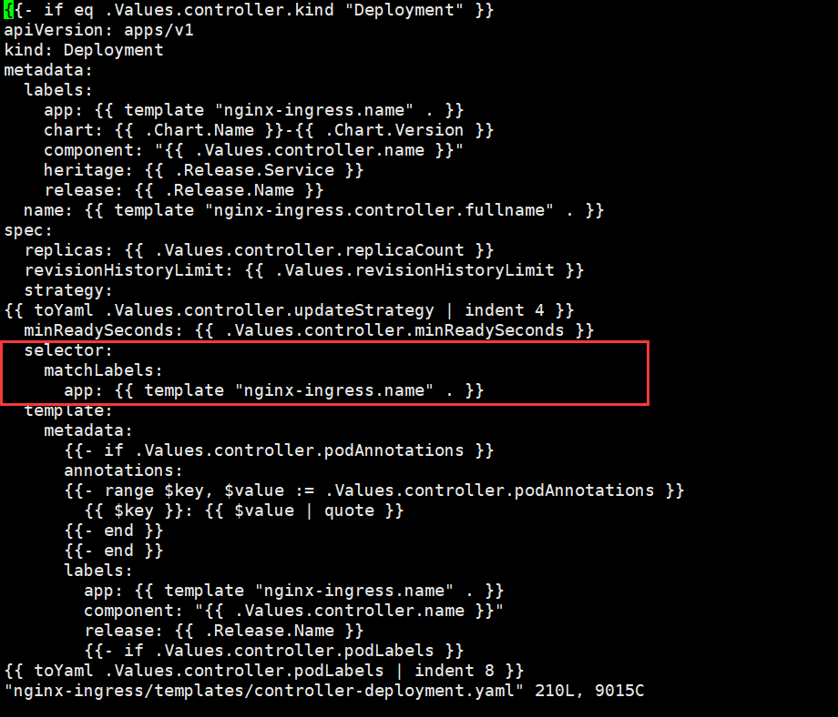
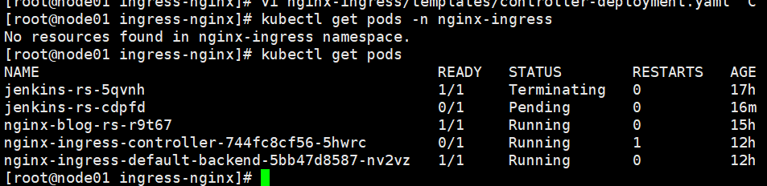
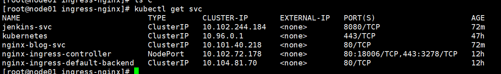

# K8S之Nginx-Ingress

Nginx-Ingress是k8s的入口。

负责安装的jenkins、nginx都要通过nginx-ingress作为统一入口访问。

之前看视频学习，是按照官方网站的方式，是下载了`mandatory.yaml`和`service-nodeport.yaml`，然后调用`kubectl apply -f`创建。

但是，我再次访问的时候https://kubernetes.github.io/ingress-nginx/已经没有这种方式安装了，唯一感觉可靠的，就是通过helm安装。于是，通过使用helm安装Nginx-Ingress

* 版本说明
  * k8s:v1.18.2
  * helm:v3.2.1
  * nginx-ingress:v0.25.0

## 一、安装HELM

先下载helm，访问github地址，选择适合自己系统的版本

https://github.com/helm/helm/releases

下载，解压

```sh
cp helm /usr/local/bin
chmod a+x /user/local/bin
helm version
```

## 二、下载Nginx-Ingress

官网的安装教程：https://kubernetes.github.io/ingress-nginx/deploy/，由于k8s是通过kubeadm安装的，在几个示例中都没有找到，选择Helm安装

```
helm repo add ingress-nginx https://kubernetes.github.io/ingress-nginx
helm install my-release ingress-nginx/ingress-nginx
```

实际过程中，github下载会比较慢，我们选择使用阿里的镜像地址。

注意一下，Github的镜像版本为0.30.0。阿里的镜像版本为0.25.0，

```sh
helm repo add apphub-incubator https://apphub.aliyuncs.com/incubator/
helm install my-release apphub-incubator/nginx-ingress
```

安装的过程中会提示异常，这里我们先把Chart下载下来，进行修改之后安装。

```
helm pull apphub-incubator/nginx-ingress
```

## 三、配置 nginx-ingress

修改values.yaml

```yaml
# 使用主机网络， 改为 true
hostNetwork: false
# 切换为NodePort， 改为 NodePort
type: LoadBalancer
# rbac是权限相关
rbac：
  create: false 改为 true
```

## 四、安装 nginx-ingress

```sh
# 第一个 nginx-ingress 是 release 名。
# 第二个 nginx-ingress 是 chart 解压目录。
# 不明白的可以复习一下helm的安装方法
helm install nginx-ingress nginx-ingress
```

### 4.1 修改 deployment version

```sh
Error: unable to build kubernetes objects from release manifest: unable to recognize "": no matches for kind "Deployment" in version "extensions/v1beta1"
```

如果有如上报错，需要修改 nginx-ingress deployment 文件的 apiVersion。

文件替换extensions/v1beta1更改为apps/v1

```sh
grep -irl "extensions/v1beta1" nginx-ingress | grep deploy | xargs sed -i 's#extensions/v1beta1#apps/v1#g'
```

* grep -irl "extensions/v1beta1" nginx-ingress
  * grep查找文件，
  * -i， 忽略字符大小写的差别。
  * -r，文件夹递归
  * -l，列出文件内容符合指定的样式的文件名称
* grep deploy
  * 搜索包含deploy的文件夹名称
* xargs sed -i 's#extensions/v1beta1#apps/v1#g'
  * 多文件替换

### 4.2 添加 deployment selector

```
Error: unable to build kubernetes objects from release manifest: error validating "": error validating data: ValidationError(Deployment.spec): missing required field "selector" in io.k8s.api.apps.v1.DeploymentSpec
```

​    如果有如上报错，需要在 deployment 文件添加 selector：

```
  selector:
    matchLabels:
      app: {{ template "nginx-ingress.name" . }}

```

```
vi nginx-ingress/templates/controller-deployment.yaml
```



```
vi nginx-ingress/templates/default-backend-deployment.yaml
```


修改后再次执行，安装成功：

## 五、nginx-ingress 组成

```
kubectl get pods
```



* 实际pod生成没有在指定的空间，在default空间了。

由上图可知，nginx-ingress 包括 2 个组件：

1）nginx-ingress-controller：nginx-ingress 控制器，负责 nginx-ingress pod 的生命周期管理。nginx-ingress pod 本质就是 nginx。用来处理请求路由等功能。这也是为什么称 nginx-ingress pod 是集群流量入口的缘故。

2）nginx-ingress-default-backend：默认后端。如果你没有配置路由或路由配错了，将会由此 pod 兜底，一般会显示 404 给你。


## 六、测试



可以看到，这里已经有了新的节点。

端口是随机分配的，ingress已经搭建成功，直接访问宿主机的18006端口即可访问，现在提示404。除了宿主机，所有的集群节点，18006。都可以访问通。

另外一个奇怪的点，就是关于80端口，宿主机是无法直接访问的，但是工作节点的80端口可以访问通。