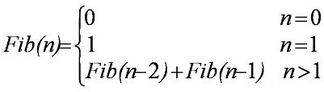
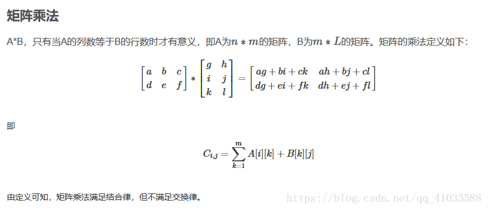
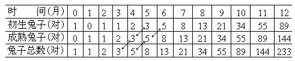

# 斐波纳契数列

## 一、介绍

* 斐波那契数列（Fibonacci sequence），又称[黄金分割](https://baike.baidu.com/item/黄金分割/115896)数列、因[数学家](https://baike.baidu.com/item/数学家/1210991)列昂纳多·斐波那契（Leonardoda Fibonacci）以兔子繁殖为例子而引入，故又称为“[兔子数列](https://baike.baidu.com/item/兔子数列/6849441)”，指的是这样一个数列：1、1、2、3、5、8、13、21、34、……在数学上，斐波那契数列以如下被以[递推](https://baike.baidu.com/item/递推/1740695)的方法定义：F(1)=1，F(2)=1,fn F(n)=F(n-1)+F(n-2)（n>=3，n∈N*）
* 

## 二、实现

### 2.1 递归

时间复杂度：O（N2），空间复杂度：O（N）

### 2.2 循环

时间复杂度：O（N），时间复杂度：O（1）

### 2.3 通项公式

时间复杂度：O（logn），空间复杂度：O（1）


### 2.4矩阵乘法实现

时间复杂度：O（logn），空间复杂度：O（1）



```python
# 递归
def fn(n):
    if n < 0:
        return 0
    elif n in (1, 2):
        return 1
    else:
        return fn(n - 1) + fn(n - 2)

# 循环
def fn_2(n):
    if n < 0:
        return 0
    elif n in (1, 2):
        return 1
    first = 1
    second = 1
    index = 3
    while index <= n:
        tmp = second
        second = first + second
        first = tmp
        index += 1
    return second


for i in range(1, 20):
    print(fn(i))
    print(fn_2(i))
```

## 三、应用

### 3.1 兔子问题

* 兔子问题：“假定一对大兔子每月能生一对小兔子，且每对新生的小兔子经过一个月可以长成一对大兔子,具备繁殖能力，如果不发生死亡，且每次均生下一雌一雄，问一年后共有多少对兔子？”

* 第一个月兔子没有繁殖能力,所以还是一对;两个月后生下一对兔子,共有两对;三个月后,老兔子生下一对,小兔子还没有繁殖能力,所以一共是三对,以此类推,可以列出下表

  

* 表中1,1,2,3,5,8,13.....构成一个序列,这个数列有一个特点就是前两项之和等于后一项

### 3.2 跳台阶

* n个台阶，一次走1阶或2阶，问走n阶有多少可能？
* 当在跳第n个台阶时，就相当于先走1个台阶，这种情况下和n-1的时候熟练相同，如果先走2个台阶，这种情况下和n-2的时候熟练相同。所以得到：F(n)=F(n-1)+F(n-2)。