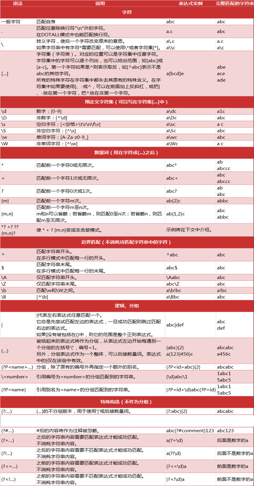

# 正则表达式

## 概述
正则表达式(regular expression)描述了一种字符串匹配的模式（pattern），可以用来检查一个串是否含有某种子串、将匹配的子串替换或者从某个串中取出符合某个条件的子串等。

## 特点

1. 灵活性、逻辑性和功能性非常的强；
2. 可以迅速地用极简单的方式达到字符串的复杂控制。


## 调试方式

1. [regexbuddy正则调试工具](http://www.regexbuddy.com/) 
    
    功能强大，可配置不通语言的调试环境

2. [在线调试工具](https://c.runoob.com/front-end/854)

## 规则

### 使用规则




### 贪婪模式与非贪婪模式

* **贪婪模式**：在整个表达式匹配成功的前提下，尽可能多的匹配。
* **非贪婪模式**：非贪婪模式在整个表达式匹配成功的前提下，尽可能少的匹配。**数量词后面加?**

    ```
    aa<div>test1</div>bb<div>test2</div>cc 

    # 贪婪模式
    <div>.*</div>
    -->
    <div>test1</div>bb<div>test2</div>

    # 非贪婪模式
    <div>.*?</div>
    -->
    <div>test1</div>
    <div>test2</div>

    # 特殊情况
    <div>.*</div>bb
    -->
    <div>test1</div>bb

    <div>.*?</div>cc
    -->
    <div>test1</div>bb<div>test2</div>cc
    ```
### ^与\A、$与\Z 区别

    ```
    匹配文本：abc
                abc
    ^abc -> abc abc
    \Aabc -> abc
    ```

### 分组

    ```
    Reg:
    <(div)><(?:a)><(b)>.*?</\1>.*?</\2>
    <(div)><(?:a)><(b)>.*?</\1>.*?</\2>
    Str:
    aa<div><a><b>test1</div>bb</a></b>
    ```

### 断言/环视

|   |  需要匹配  |  不需要匹配   |
| ------------ | ------------ | ------------ |
| 前  | 肯定顺序环视(?=)  | 否定顺序环视(?!)  |
| 后  | 肯定逆序环视(?<=)  | 否定逆序环视(?<!)  |

## 正则表达式的运用

1. 字符串格式校验 [正则表达式在线测试](https://c.runoob.com/front-end/854)

    网上有很多的例子可以提供常用的文本校验。
    ```java
    @Test
    public void patternCheck(){
        String str = "中文";
        String pattern = "^[\\u4e00-\\u9fa5]{0,}$";
        System.out.println(Pattern.matches(pattern,str));
    }
    ```
2. 文本替换 （replace）

    可以替换掉文本中不想要的内容，过滤不需要的内容。
    ```java
    @Test
    public void patternReplace(){
        String str = "test中文123🤝";
        System.out.println(str.replaceAll("[^\\u4e00-\\u9fa5]",""));
    }
    ```
3. 提取字符串 （group）

    ```java
    @Test
    public void patternMatch(){
        String str = "1.first 2.second 3.third 11.eleventh";
        Pattern orderPattern = Pattern.compile("(?<=\\d\\.)\\w*(?=\\s?)");
        Matcher matcher = orderPattern.matcher(str);
        while(matcher.find()){
            String title = matcher.group();
            System.out.println(title);
        }
    }
    ```

4. 查询过滤（linux:ls/find/grep）
    ```bash
    grep -E 'pattern' file
    ```

## 正则表达式示例

1. 解析Url

    ```java
    @Test
    public void group() {
        String url = "http://www.baidu.com:80/a/b.html";
        Pattern urlPattren = Pattern.compile("(\\w+):\\/\\/([^/:]+)(:\\d*)?([^# ]*)");
        // (\w+)  :\/\/   ([^/:]+)        (:\d*)   ?([^# ]*)
        // http   ://     www.baidu.com   :80      /a/b.html
        Matcher matcher = urlPattren.matcher(url);
        while (matcher.find()) {
            for (int i = 0; i <= matcher.groupCount(); i++) {
                System.out.println(matcher.group(i));
            }
        }
    }
    //http://www.baidu.com:80/a/b.html
    //http
    //www.baidu.com
    //:80
    ///a/b.html
    ```

2. 获取url的参数
    ```java
   
    @Test
    public void patternUrl() {
        String url = "https://www.baidu.com?name=jawil&age=23";
        Pattern urlPattren = Pattern.compile("(?<=[?&])(\\w+)=(\\w+)");
        Matcher matcher = urlPattren.matcher(url);
        while (matcher.find()) {
            System.out.println(matcher.group(1)+"="+matcher.group(2));
        }
    }
    // name=jawil
    // age=23
    ```

3. 两个相同的相邻单词
    ```java
    @Test
    public void findDuplicate() {
        String str = "Is is the cost of of gasoline going up up";
        Pattern pattern = Pattern.compile("\b([a-z]+) \1\b");
        Matcher matcher = pattern.matcher(str);
        while (matcher.find()) {
            System.out.println(matcher.group());
        }
    }
    //of of
    //up up
    ```