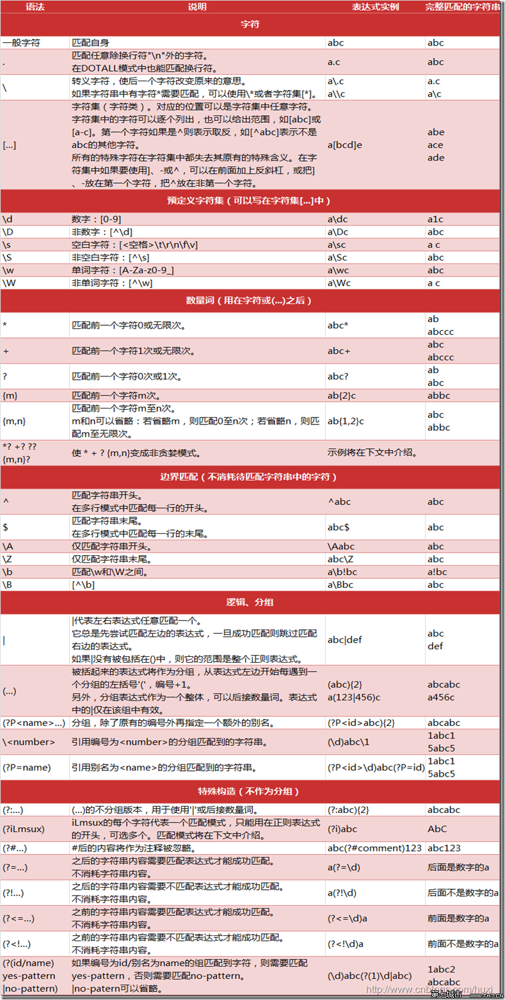

# 正则表达式

## 概述
正则表达式(regular expression)描述了一种字符串匹配的模式（pattern），可以用来检查一个串是否含有某种子串、将匹配的子串替换或者从某个串中取出符合某个条件的子串等。

## 规则
具体的使用规则可以参考如图显示。




## 正则表达式的妙用

1. 获取url的参数
```java
@Test
public void patternUrl(){
    System.out.println(getParam("https://www.baidu.com?name=jawil&age=23","name"));
}

public String getParam(String url, String key){
    Pattern urlPattren = Pattern.compile("[?&]"+key+"=\\w+");
    Matcher matcher = urlPattren.matcher("url");
    return matcher.find() ? matcher.group().split("=")[1] : "";
}
```