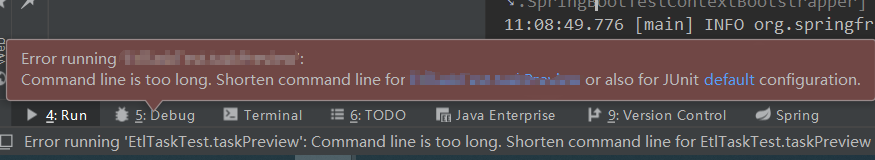
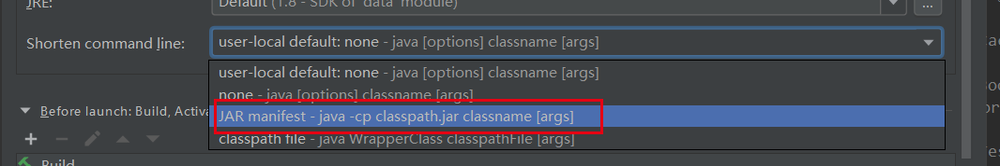

## 1. websocket测试异常 

// 默认情况下，@SpringBootTest不会启动服务器。您可以使用webEnvironment 属性@SpringBootTest来进一步优化测试的运行方式

```java
@SpringBootTest(webEnvironment = SpringBootTest.WebEnvironment.RANDOM_PORT)
```

## 2. Spring Security安全测试集成测试

Spring Test & Security: How to mock authentication

```xml

<!--spring-security单元测试-->
<dependency>
	<groupId>org.springframework.security</groupId>
    <artifactId>spring-security-test</artifactId>
    <version>4.2.3.RELEASE</version>
    <scope>test</scope>
</dependency>
```

## 3. mvn test报错

```
[ERROR]   DataApplicationTests.initializationError »  No runnable methods
[ERROR]   RsaUtilsTest.initializationError »  No runnable methods
```

解决方法：

* 如果部分类注解了`@RunWith(SpringRunner.class)
  `、`@SpringBootTest`，但是实际上并没有进行任何测试内容，也会报错。最好测试的时候，要么去掉类，要么加上方法。

* 类名中有Test的，也需要些`@Test`用法。要么类名去掉Test，要么加上@Test方法。

## 4.junit测试报错



Command line is too long.

windows*命令行*的最大长度为2047个字符。提示命令行太长了，修改debug配置，调整为jar manifest。

