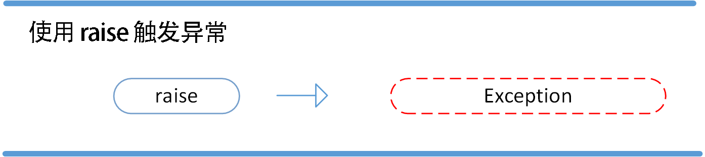

# Python3 

* **笔记说明：本笔记本并不记录全部内容，只做部分特殊内容**

## 一、简介

- **Python 是一种解释型语言：** 这意味着开发过程中没有了编译这个环节。类似于PHP和Perl语言。
- **Python 是交互式语言：** 这意味着，您可以在一个 Python 提示符 **>>>** 后直接执行代码。
- **Python 是面向对象语言:** 这意味着Python支持面向对象的风格或代码封装在对象的编程技术。
- **Python 是初学者的语言：**Python 对初级程序员而言，是一种伟大的语言，它支持广泛的应用程序开发，从简单的文字处理到 WWW 浏览器再到游戏。

## 二、基本语法

### 2.1 编码

```python
# -*- coding: cp-1252 -*-
# 指定编码
```

### 2.2 关键字

```python
>>> import keyword
>>> keyword.kwlist
['False', 'None', 'True', 'and', 'as', 'assert', 'break', 'class', 'continue', 'def', 'del', 'elif', 'else', 'except', 'finally', 'for', 'from', 'global', 'if', 'import', 'in', 'is', 'lambda', 'nonlocal', 'not', 'or', 'pass', 'raise', 'return', 'try', 'while', 'with', 'yield']
```

### 2.3 字符串

* 反斜杠可以用来转义，使用r可以让反斜杠不发生转义。。 如 r"this is a line with \n" 则\n会显示，并不是换行。
* 
  Python 中的字符串有两种索引方式，从左往右以 0 开始，从右往左以 -1 开始。
* Python中的字符串不能改变。
* Python 没有单独的字符类型，一个字符就是长度为 1 的字符串。
* 字符串的截取的语法格式如下：**变量[头下标:尾下标:步长]**

### 2.4 import 与 from ...  import

* 在 python 用 **import** 或者 **from...import** 来导入相应的模块。
  * 将整个模块(somemodule)导入，格式为： **import somemodule**
  * 从某个模块中导入某个函数,格式为： **from somemodule import somefunction**
  * 从某个模块中导入多个函数,格式为： **from somemodule import firstfunc, secondfunc, thirdfunc**
  * 将某个模块中的全部函数导入，格式为： **from somemodule import \***

## 三、基本数据类型

* Python3 中有六个标准的数据类型：
  * Number（数字）
  * String（字符串）
  * List（列表）
  * Tuple（元组）
  * Set（集合）
  * Dictionary（字典）

* Python3 的六个标准数据类型中：
  * **不可变数据（3 个）：**Number（数字）、String（字符串）、Tuple（元组）；
  * **可变数据（3 个）：**List（列表）、Dictionary（字典）、Set（集合）。

### 3.1 Number（数字）

* Python可以同时为多个变量赋值，如a, b = 1, 2。
* 一个变量可以通过赋值指向不同类型的对象。
* 数值的除法包含两个运算符：**/** 返回一个浮点数，**//** 返回一个整数。
* 在混合计算时，Python会把整型转换成为浮点数。

### 3.2 String（字符串）

* Python中的字符串用单引号 **'** 或双引号 **"** 括起来，同时使用反斜杠 **\** 转义特殊字符。
* Python 使用反斜杠(\)转义特殊字符，如果你不想让反斜杠发生转义，可以在字符串前面添加一个 r，表示原始字符串。
* 反斜杠(\)可以作为续行符，表示下一行是上一行的延续。也可以使用 **"""..."""** 或者 **'''...'''** 跨越多行。
* Python中的字符串有两种索引方式，从左往右以0开始，从右往左以-1开始。
* Python中的字符串不能改变。

### 3.3  List（列表）

* 和字符串一样，list可以被索引和切片。
* List可以使用+操作符进行拼接。
* List中的元素是可以改变的。

### 3.4 Tuple（元组）

* 元组（tuple）与列表类似，不同之处在于元组的元素不能修改。元组写在小括号 **()** 里，元素之间用逗号隔开。

### 3.5 Set（集合）

* 集合（set）是由一个或数个形态各异的大小整体组成的，构成集合的事物或对象称作元素或是成员。

* 基本功能是进行成员关系测试和删除重复元素。

* 可以使用大括号 **{ }** 或者 **set()** 函数创建集合，注意：创建一个空集合必须用 **set()** 而不是 **{ }**，因为 **{ }** 是用来创建一个空字典。

* ```python
  # set可以进行集合运算
  a = set('abracadabra')
  b = set('alacazam')
   
  print(a)
  print(a - b)     # a 和 b 的差集
  print(a | b)     # a 和 b 的并集
  print(a & b)     # a 和 b 的交集
  print(a ^ b)     # a 和 b 中不同时存在的元素
  
  
  {'b', 'a', 'c', 'r', 'd'}
  {'b', 'd', 'r'}
  {'l', 'r', 'a', 'c', 'z', 'm', 'b', 'd'}
  {'a', 'c'}
  {'l', 'r', 'z', 'm', 'b', 'd'}
  ```

### 3.6 Dictionary（字典）

* 列表是有序的对象集合，字典是无序的对象集合。两者之间的区别在于：字典当中的元素是通过键来存取的，而不是通过偏移存取。
* 
  字典是一种映射类型，字典用 **{ }** 标识，它是一个无序的 **键(key) : 值(value)** 的集合。
* 键(key)必须使用不可变类型。
* 键(key)必须是唯一、不可重复的。
* 创建空字典使用 **{ }**。

### 3.7 Python数据类型转换

| 函数                                                         | 描述                                                |
| :----------------------------------------------------------- | :-------------------------------------------------- |
| [int(x [,base])] | 将x转换为一个整数                                   |
| [float(x)] | 将x转换到一个浮点数                                 |
| [complex(real [,imag])] | 创建一个复数                                        |
| [str(x)]| 将对象 x 转换为字符串                               |
| [repr(x)]                                                    | 将对象 x 转换为表达式字符串                         |
| [eval(str)] | 用来计算在字符串中的有效Python表达式,并返回一个对象 |
| [tuple(s)]| 将序列 s 转换为一个元组                             |
| [list(s)] | 将序列 s 转换为一个列表                             |
| [set(s)]| 转换为可变集合                                      |
| [dict(d)] | 创建一个字典。d 必须是一个 (key, value)元组序列。   |
| [frozenset(s)]| 转换为不可变集合                                    |
| [chr(x)]| 将一个整数转换为一个字符                            |
| [ord(x)] | 将一个字符转换为它的整数值                          |
| [hex(x)]| 将一个整数转换为一个十六进制字符串                  |
| [oct(x)] | 将一个整数转换为一个八进制字符串                    |

## 四、运算符

### 4.1 算术运算符

* a = 10,b =20;

  | /    | 除 - x除以y                               | b / a 输出结果 2                                   |
  | ---- | ----------------------------------------- | -------------------------------------------------- |
  | %    | 取模 - 返回除法的余数                     | b % a 输出结果 0                                   |
  | **   | 幂 - 返回x的y次幂                         | a**b 为10的20次方， 输出结果 100000000000000000000 |
  | //   | 取整除 - 返回商的整数部分（**向下取整**） | >>> 9//2 4< >>> -9//2 -5                         |

### 4.2 逻辑运算符

* a = 10 ,b = 20;

  | 算符 | 逻辑表达式 | 描述                                                         | 实例                    |
  | :--- | :--------- | :----------------------------------------------------------- | :---------------------- |
  | and  | x and y    | 布尔"与" - 如果 x 为 False，x and y 返回 False，否则它返回 y 的计算值。 | **(a and b) 返回 20。** |
  | or   | x or y     | 布尔"或" - 如果 x 是非 0，它返回 x 的值，否则它返回 y 的计算值。 | **(a or b) 返回 10。**  |
  | not  | not x      | 布尔"非" - 如果 x 为 True，返回 False 。如果 x 为 False，它返回 True。 | not(a and b) 返回 False |

### 4.3 成员运算符

* | 运算符 | 描述                                                    | 实例                                              |
  | :----- | :------------------------------------------------------ | :------------------------------------------------ |
  | in     | 如果在指定的序列中找到值返回 True，否则返回 False。     | x 在 y 序列中 , 如果 x 在 y 序列中返回 True。     |
  | not in | 如果在指定的序列中没有找到值返回 True，否则返回 False。 | x 不在 y 序列中 , 如果 x 不在 y 序列中返回 True。 |

### 4.4 身份运算符

* 身份运算符用于比较两个对象的存储单元

  | 运算符 | 描述                                        | 实例                                                         |
  | :----- | :------------------------------------------ | :----------------------------------------------------------- |
  | is     | is 是判断两个标识符是不是引用自一个对象     | **x is y**, 类似 **id(x) == id(y)** , 如果引用的是同一个对象则返回 True，否则返回 False |
  | is not | is not 是判断两个标识符是不是引用自不同对象 | **x is not y** ， 类似 **id(a) != id(b)**。如果引用的不是同一个对象则返回结果 True，否则返回 False。 |

## 五、Number（数字）

* **Python 支持三种不同的数值类型：**

  * **整型(Int)** - 通常被称为是整型或整数，是正或负整数，不带小数点。Python3 整型是没有限制大小的，可以当作 Long 类型使用，所以 Python3 没有 Python2 的 Long 类型。
  * **浮点型(float)** - 浮点型由整数部分与小数部分组成，浮点型也可以使用科学计数法表示（2.5e2 = 2.5 x 102 = 250）
  * **复数( (complex))** - 复数由实数部分和虚数部分构成，可以用a + bj,或者complex(a,b)表示， 复数的实部a和虚部b都是浮点型。

* **Python 数字类型转换**

  - **int(x)** 将x转换为一个整数。
  - **float(x)** 将x转换到一个浮点数。
  - **complex(x)** 将x转换到一个复数，实数部分为 x，虚数部分为 0。
  - **complex(x, y)** 将 x 和 y 转换到一个复数，实数部分为 x，虚数部分为 y。x 和 y 是数字表达式。

* **数学函数**

  | 函数                                                         | 返回值 ( 描述 )                                              |
  | :----------------------------------------------------------- | :----------------------------------------------------------- |
  | [abs(x)](https://www.runoob.com/python3/python3-func-number-abs.html) | 返回数字的绝对值，如abs(-10) 返回 10                         |
  | [ceil(x)](https://www.runoob.com/python3/python3-func-number-ceil.html) | 返回数字的上入整数，如math.ceil(4.1) 返回 5                  |
  | cmp(x, y)                                                    | 如果 x < y 返回 -1, 如果 x == y 返回 0, 如果 x > y 返回 1。 **Python 3 已废弃，使用 (x>y)-(x<y) 替换**。 |
  | [exp(x)](https://www.runoob.com/python3/python3-func-number-exp.html) | 返回e的x次幂(ex),如math.exp(1) 返回2.718281828459045         |
  | [fabs(x)](https://www.runoob.com/python3/python3-func-number-fabs.html) | 返回数字的绝对值，如math.fabs(-10) 返回10.0                  |
  | [floor(x)](https://www.runoob.com/python3/python3-func-number-floor.html) | 返回数字的下舍整数，如math.floor(4.9)返回 4                  |
  | [log(x)](https://www.runoob.com/python3/python3-func-number-log.html) | 如math.log(math.e)返回1.0,math.log(100,10)返回2.0            |
  | [log10(x)](https://www.runoob.com/python3/python3-func-number-log10.html) | 返回以10为基数的x的对数，如math.log10(100)返回 2.0           |
  | [max(x1, x2,...)](https://www.runoob.com/python3/python3-func-number-max.html) | 返回给定参数的最大值，参数可以为序列。                       |
  | [min(x1, x2,...)](https://www.runoob.com/python3/python3-func-number-min.html) | 返回给定参数的最小值，参数可以为序列。                       |
  | [modf(x)](https://www.runoob.com/python3/python3-func-number-modf.html) | 返回x的整数部分与小数部分，两部分的数值符号与x相同，整数部分以浮点型表示。 |
  | [pow(x, y)](https://www.runoob.com/python3/python3-func-number-pow.html) | x**y 运算后的值。                                            |
  | [round(x [,n\])](https://www.runoob.com/python3/python3-func-number-round.html) | 返回浮点数x的四舍五入值，如给出n值，则代表舍入到小数点后的位数。 |
  | [sqrt(x)](https://www.runoob.com/python3/python3-func-number-sqrt.html) | 返回数字x的平方根。                                          |

* **随机数函数**

  | 函数                                                         | 描述                                                         |
  | :----------------------------------------------------------- | :----------------------------------------------------------- |
  | [choice(seq)](https://www.runoob.com/python3/python3-func-number-choice.html) | 从序列的元素中随机挑选一个元素，比如random.choice(range(10))，从0到9中随机挑选一个整数。 |
  | [randrange ([start,\] stop [,step])](https://www.runoob.com/python3/python3-func-number-randrange.html) | 从指定范围内，按指定基数递增的集合中获取一个随机数，基数默认值为 1 |
  | [random()](https://www.runoob.com/python3/python3-func-number-random.html) | 随机生成下一个实数，它在[0,1)范围内。                        |
  | [seed([x\])](https://www.runoob.com/python3/python3-func-number-seed.html) | 改变随机数生成器的种子seed。如果你不了解其原理，你不必特别去设定seed，Python会帮你选择seed。 |
  | [shuffle(lst)](https://www.runoob.com/python3/python3-func-number-shuffle.html) | 将序列的所有元素随机排序                                     |
  | [uniform(x, y)](https://www.runoob.com/python3/python3-func-number-uniform.html) | 随机生成下一个实数，它在[x,y]范围内。                        |

* **三角函数**

  | 函数                                                         | 描述                                              |
  | :----------------------------------------------------------- | :------------------------------------------------ |
  | [acos(x)](https://www.runoob.com/python3/python3-func-number-acos.html) | 返回x的反余弦弧度值。                             |
  | [asin(x)](https://www.runoob.com/python3/python3-func-number-asin.html) | 返回x的反正弦弧度值。                             |
  | [atan(x)](https://www.runoob.com/python3/python3-func-number-atan.html) | 返回x的反正切弧度值。                             |
  | [atan2(y, x)](https://www.runoob.com/python3/python3-func-number-atan2.html) | 返回给定的 X 及 Y 坐标值的反正切值。              |
  | [cos(x)](https://www.runoob.com/python3/python3-func-number-cos.html) | 返回x的弧度的余弦值。                             |
  | [hypot(x, y)](https://www.runoob.com/python3/python3-func-number-hypot.html) | 返回欧几里德范数 sqrt(x*x + y*y)。                |
  | [sin(x)](https://www.runoob.com/python3/python3-func-number-sin.html) | 返回的x弧度的正弦值。                             |
  | [tan(x)](https://www.runoob.com/python3/python3-func-number-tan.html) | 返回x弧度的正切值。                               |
  | [degrees(x)](https://www.runoob.com/python3/python3-func-number-degrees.html) | 将弧度转换为角度,如degrees(math.pi/2) ， 返回90.0 |
  | [radians(x)](https://www.runoob.com/python3/python3-func-number-radians.html) | 将角度转换为弧度                                  |

* **数学常量**

  | 常量 | 描述                                  |
  | :--- | :------------------------------------ |
  | pi   | 数学常量 pi（圆周率，一般以π来表示）  |
  | e    | 数学常量 e，e即自然常数（自然常数）。 |

* Python默认提供了很多函数，这些函数来说，都是比较简单、常用的函数。

## 六、String（字符串）

* **字符串格式化**

  | 符   号 | 描述                                 |
  | :------ | :----------------------------------- |
  | %c      | 格式化字符及其ASCII码                |
  | %s      | 格式化字符串                         |
  | %d      | 格式化整数                           |
  | %u      | 格式化无符号整型                     |
  | %o      | 格式化无符号八进制数                 |
  | %x      | 格式化无符号十六进制数               |
  | %X      | 格式化无符号十六进制数（大写）       |
  | %f      | 格式化浮点数字，可指定小数点后的精度 |
  | %e      | 用科学计数法格式化浮点数             |
  | %E      | 作用同%e，用科学计数法格式化浮点数   |
  | %g      | %f和%e的简写                         |
  | %G      | %f 和 %E 的简写                      |
  | %p      | 用十六进制数格式化变量的地址         |

* **三引号**

  ```python
  #!/usr/bin/python3
   
  para_str = """这是一个多行字符串的实例
  多行字符串可以使用制表符
  TAB ( \t )。
  也可以使用换行符 [ \n ]。
  """
  print (para_str)
  
  ---------
  
  这是一个多行字符串的实例
  多行字符串可以使用制表符
  TAB (    )。
  也可以使用换行符 [ 
   ]。
  ```

  ```
  三引号让程序员从引号和特殊字符串的泥潭里面解脱出来，自始至终保持一小块字符串的格式是所谓的WYSIWYG（所见即所得）格式的。
  
  一个典型的用例是，当你需要一块HTML或者SQL时，这时用字符串组合，特殊字符串转义将会非常的繁琐。
  ```

* **f-string**

  ```python
  >>> x = 1
  >>> print(f'{x+1}')   # Python 3.6
  2
  
  >>> x = 1
  >>> print(f'{x+1=}')   # Python 3.8
  'x+1=2'
  ```

* Unicode 字符串

  在Python2中，普通字符串是以8位ASCII码进行存储的，而Unicode字符串则存储为16位unicode字符串，这样能够表示更多的字符集。使用的语法是在字符串前面加上前缀 **u**。

  在Python3中，所有的字符串都是Unicode字符串。

## 七、List（列表）

* **删除列表元素**

  ```python
  del list[2]
  ```

* **列表脚本操作符**

  | Python 表达式                         | 结果                         | 描述                 |
  | :------------------------------------ | :--------------------------- | :------------------- |
  | len([1, 2, 3])                        | 3                            | 长度                 |
  | [1, 2, 3] + [4, 5, 6]                 | [1, 2, 3, 4, 5, 6]           | 组合                 |
  | ['Hi!'] * 4                           | ['Hi!', 'Hi!', 'Hi!', 'Hi!'] | 重复                 |
  | 3 in [1, 2, 3]                        | True                         | 元素是否存在于列表中 |
  | for x in [1, 2, 3]: print(x, end=" ") | 1 2 3                        | 迭代                 |

## 八、Tuple（元组）

* Python 的元组与列表类似，不同之处在于元组的元素不能修改。
* 元组使用小括号，列表使用方括号。
* 元组创建很简单，只需要在括号中添加元素，并使用逗号隔开即可。

* 元组中只包含一个元素时，需要在元素后面添加逗号，否则括号会被当作运算符使用：

  ```python
  >>>tup1 = (50)
  >>> type(tup1)     # 不加逗号，类型为整型
  <class 'int'>
   
  >>> tup1 = (50,)
  >>> type(tup1)     # 加上逗号，类型为元组
  <class 'tuple'>
  ```

## 九、Dictory（字典）

* 字典是另一种可变容器模型，且可存储任意类型对象。
* 感觉类似于List，List索引是数字，这个是任意类型对象

## 十、Set（集合）

* 集合（set）是一个无序的不重复元素序列。
* 可以使用大括号 **{ }** 或者 **set()** 函数创建集合，注意：创建一个空集合必须用 **set()** 而不是 **{ }**，因为 **{ }** 是用来创建一个空字典。

- 可以使用大括号 **{ }** 或者 **set()** 函数创建集合，注意：创建一个空集合必须用 **set()** 而不是 **{ }**，因为 **{ }** 是用来创建一个空字典。

## 十一、迭代器与生成器

* 迭代是Python最强大的功能之一，是访问集合元素的一种方式。

* 迭代器是一个可以记住遍历的位置的对象。

* 迭代器对象从集合的第一个元素开始访问，直到所有的元素被访问完结束。迭代器只能往前不会后退。

* 迭代器有两个基本的方法：**iter()** 和 **next()**。

* 字符串，列表或元组对象都可用于创建迭代器。

  ```python
  #!/usr/bin/python3
  list=[1,2,3,4]
  it = iter(list)    # 创建迭代器对象
  print (next(it))   # 输出迭代器的下一个元素
  1
  print (next(it))
  2
  
  #!/usr/bin/python3
  list=[1,2,3,4]
  it = iter(list)    # 创建迭代器对象
  for x in it:
      print (x, end=" ")
  
  #!/usr/bin/python3
  import sys         # 引入 sys 模块
  list=[1,2,3,4]
  it = iter(list)    # 创建迭代器对象
  while True:
      try:
          print (next(it))
      except StopIteration:
          sys.exit()
  ```

* 创建迭代器

  * 把一个类作为一个迭代器使用需要在类中实现两个方法 __iter__() 与 __next__() 。

    ```
    class MyNumbers:
      def __iter__(self):
        self.a = 1
        return self
     
      def __next__(self):
        x = self.a
        self.a += 1
        return x
     
    myclass = MyNumbers()
    myiter = iter(myclass)
     
    print(next(myiter))
    print(next(myiter))
    print(next(myiter))
    print(next(myiter))
    print(next(myiter))
    
    1
    2
    3
    4
    5
    ```

* StopIteration

  * StopIteration 异常用于标识迭代的完成，防止出现无限循环的情况，在 __next__() 方法中我们可以设置在完成指定循环次数后触发 StopIteration 异常来结束迭代。

    ```python
    class MyNumbers:
      def __iter__(self):
        self.a = 1
        return self
     
      def __next__(self):
        if self.a <= 20:
          x = self.a
          self.a += 1
          return x
        else:
          raise StopIteration
     
    myclass = MyNumbers()
    myiter = iter(myclass)
     
    for x in myiter:
      print(x)
    
    1
    2
    ..
    20
    ```

* 生成器

  * 在 Python 中，使用了 yield 的函数被称为生成器（generator）。

  * 跟普通函数不同的是，生成器是一个返回迭代器的函数，只能用于迭代操作，更简单点理解生成器就是一个迭代器。

  * 在调用生成器运行的过程中，每次遇到 yield 时函数会暂停并保存当前所有的运行信息，返回 yield 的值, 并在下一次执行 next() 方法时从当前位置继续运行。

  * 调用一个生成器函数，返回的是一个迭代器对象。

    ```
    #!/usr/bin/python3
     
    import sys
     
    def fibonacci(n): # 生成器函数 - 斐波那契
        a, b, counter = 0, 1, 0
        while True:
            if (counter > n): 
                return
            yield a
            a, b = b, a + b
            counter += 1
    f = fibonacci(10) # f 是一个迭代器，由生成器返回生成
     
    while True:
        try:
            print (next(f), end=" ")
        except StopIteration:
            sys.exit()
    ```

## 十二、函数

* 自定义函数

  * 函数代码块以 **def** 关键词开头，后接函数标识符名称和圆括号 **()**。
  * 任何传入参数和自变量必须放在圆括号中间，圆括号之间可以用于定义参数。
  * 函数的第一行语句可以选择性地使用文档字符串—用于存放函数说明。
  * 函数内容以冒号起始，并且缩进。
  * **return [表达式]** 结束函数，选择性地返回一个值给调用方。不带表达式的return相当于返回 None。

* 语法：

  ```python
  def 函数名（参数列表）:
      函数体
  ```

* **可变对象与不可变对象**

  * **不可变类型：**类似 c++ 的值传递，如 整数、字符串、元组。如fun（a），传递的只是a的值，没有影响a对象本身。比如在 fun（a）内部修改 a 的值，只是修改另一个复制的对象，不会影响 a 本身。
  * **可变类型：**类似 c++ 的引用传递，如 列表，字典。如 fun（la），则是将 la 真正的传过去，修改后fun外部的la也会受影响

* **参数**

  * 必需参数
    * 必需参数须以正确的顺序传入函数。调用时的数量必须和声明时的一样。
  * 关键字参数
    * 关键字参数和函数调用关系紧密，函数调用使用关键字参数来确定传入的参数值。
    * 使用关键字参数允许函数调用时参数的顺序与声明时不一致，因为 Python 解释器能够用参数名匹配参数值。
  * 默认参数
    * 调用函数时，如果没有传递参数，则会使用默认参数。
  * 不定长参数
    * 加了星号 ***** 的参数会以元组(tuple)的形式导入，存放所有未命名的变量参数。
    * 加了两个星号 ***\*** 的参数会以字典的形式导入。

* **匿名函数**

  * lambda 只是一个表达式，函数体比 def 简单很多。

  * lambda的主体是一个表达式，而不是一个代码块。仅仅能在lambda表达式中封装有限的逻辑进去。

  * lambda 函数拥有自己的命名空间，且不能访问自己参数列表之外或全局命名空间里的参数。

  * 虽然lambda函数看起来只能写一行，却不等同于C或C++的内联函数，后者的目的是调用小函数时不占用栈内存从而增加运行效率。

  * 语法：

    ```
    lambda [arg1 [,arg2,.....argn]]:expression
    ```

  * ```python
    #!/usr/bin/python3
     
    # 可写函数说明
    sum = lambda arg1, arg2: arg1 + arg2
     
    # 调用sum函数
    print ("相加后的值为 : ", sum( 10, 20 ))
    print ("相加后的值为 : ", sum( 20, 20 ))
    ```

  * **return语句**

    * **return [表达式]** 语句用于退出函数，选择性地向调用方返回一个表达式。不带参数值的return语句返回None。之前的例子都没有示范如何返回数值，以下实例演示了 return 语句的用法：

## 十三、数据结构

## 十四、模块

* 定义

  * 把这些定义存放在文件中，为一些脚本或者交互式的解释器实例使用，这个文件被称为模块。
  * 模块是一个包含所有你定义的函数和变量的文件，其后缀名是.py。
  * 模块可以被别的程序引入，以使用该模块中的函数等功能。这也是使用 python 标准库的方法。

* ```python
  #!/usr/bin/python3
  # 文件名: using_sys.py
   
  import sys
   
  print('命令行参数如下:')
  for i in sys.argv:
     print(i)
   
  print('\n\nPython 路径为：', sys.path, '\n')
  
  -------------------------------
  $ python using_sys.py 参数1 参数2
  命令行参数如下:
  using_sys.py
  参数1
  参数2
  
  Python 路径为： ['/root', '/usr/lib/python3.4', '/usr/lib/python3.4/plat-x86_64-linux-gnu', '/usr/lib/python3.4/lib-dynload', '/usr/local/lib/python3.4/dist-packages', '/usr/lib/python3/dist-packages']
  ```

  1. import sys 引入 python 标准库中的 sys.py 模块；这是引入某一模块的方法。
  2. sys.argv 是一个包含命令行参数的列表。
  3. sys.path 包含了一个 Python 解释器自动查找所需模块的路径的列表。

* **import语句**

  * ```
    import module1[, module2[,... moduleN]
    ```

  * 当解释器遇到 import 语句，如果模块在当前的搜索路径就会被导入。

    搜索路径是一个解释器会先进行搜索的所有目录的列表。如想要导入模块 support，需要把命令放在脚本的顶端：

    ```python
    #!/usr/bin/python3
    # Filename: support.py
     
    def print_func( par ):
        print ("Hello : ", par)
        return
    ```

    ```python
    #!/usr/bin/python3
    # Filename: test.py
     
    # 导入模块
    import support
     
    # 现在可以调用模块里包含的函数了
    support.print_func("Runoob")
    ```

  * 一个模块只会被导入一次，不管你执行了多少次import。这样可以防止导入模块被一遍又一遍地执行。

  * 当我们使用import语句的时候，Python解释器是怎样找到对应的文件的呢？这就涉及到Python的搜索路径，搜索路径是由一系列目录名组成的，Python解释器就依次从这些目录中去寻找所引入的模块。

  * 这看起来很像环境变量，事实上，也可以通过定义环境变量的方式来确定搜索路径。

  * 搜索路径是在Python编译或安装的时候确定的，安装新的库应该也会修改。搜索路径被存储在sys模块中的path变量，做一个简单的实验，在交互式解释器中，输入以下代码：

  * ```
    >>> import sys
    >>> sys.path
    ['', '/usr/lib/python3.4', '/usr/lib/python3.4/plat-x86_64-linux-gnu', '/usr/lib/python3.4/lib-dynload', '/usr/local/lib/python3.4/dist-packages', '/usr/lib/python3/dist-packages']
    >>> 
    ```

  * sys.path 输出是一个列表，其中第一项是空串''，代表当前目录（若是从一个脚本中打印出来的话，可以更清楚地看出是哪个目录），亦即我们执行python解释器的目录（对于脚本的话就是运行的脚本所在的目录）。

* **from … import 语句**

  *  import 直接把模块内（函数，变量的）名称导入到当前操作模块。

* **__name__属性**

  * 一个模块被另一个程序第一次引入时，其主程序将运行。如果我们想在模块被引入时，模块中的某一程序块不执行，我们可以用__name__属性来使该程序块仅在该模块自身运行时执行。

    ```python
    #!/usr/bin/python3
    # Filename: using_name.py
    
    if __name__ == '__main__':
       print('程序自身在运行')
    else:
       print('我来自另一模块')
    ```

    ```sh
    $ python using_name.py
    程序自身在运行
    $ python
    >>> import using_name
    我来自另一模块
    >>>
    ```

* **dir() 函数**

  * 内置的函数 dir() 可以找到模块内定义的所有名称。以一个字符串列表的形式返回

  * ```python
    >>> dir(fibo)
    ['__name__', 'fib', 'fib2']
    # 得到一个当前模块中定义的属性列表
    >>> dir() 
    ['__builtins__', '__name__', 'a', 'fib', 'fibo', 'sys']
    >>> a = 5 # 建立一个新的变量 'a'
    >>> dir()
    ['__builtins__', '__doc__', '__name__', 'a', 'sys']
    ```

* **标准模块**

  * Python 本身带着一些标准的模块库，在 Python 库参考文档中将会介绍到（就是后面的"库参考文档"）。

  * 有些模块直接被构建在解析器里，这些虽然不是一些语言内置的功能，但是他却能很高效的使用，甚至是系统级调用也没问题。

  * ```python
    >>> import sys
    >>> sys.ps1
    '>>> '
    >>> sys.ps2
    '... '
    >>> sys.ps1 = 'C> '
    C> print('Runoob!')
    Runoob!
    C> 
    ```

* 包

  * 包是一种管理 Python 模块命名空间的形式，采用"点模块名称"。

  * ```
    sound/                          顶层包
          __init__.py               初始化 sound 包
          formats/                  文件格式转换子包
                  __init__.py
                  wavread.py
                  wavwrite.py
                  aiffread.py
                  aiffwrite.py
                  auread.py
                  auwrite.py
                  ...
          effects/                  声音效果子包
                  __init__.py
                  echo.py
                  surround.py
                  reverse.py
                  ...
          filters/                  filters 子包
                  __init__.py
                  equalizer.py
                  vocoder.py
                  karaoke.py
    ```

  * 在导入一个包的时候，Python 会根据 sys.path 中的目录来寻找这个包中包含的子目录。

  * 目录只有包含一个叫做 __init__.py 的文件才会被认作是一个包，主要是为了避免一些滥俗的名字（比如叫做 string）不小心的影响搜索路径中的有效模块。

  * 最简单的情况，放一个空的 :file:__init__.py就可以了。当然这个文件中也可以包含一些初始化代码或者为（将在后面介绍的） __all__变量赋值。

  * ```python
    # 导入子模块:sound.effects.echo
    import sound.effects.echo
    # 导入子模块的防范
    from sound.effects import echo
    # 直接导入一个函数或者变量
    from sound.effects.echo import echofilter
    ```

  * 注意当使用 **from package import item** 这种形式的时候，对应的 item 既可以是包里面的子模块（子包），或者包里面定义的其他名称，比如函数，类或者变量。

  * import 语法会首先把 item 当作一个包定义的名称，如果没找到，再试图按照一个模块去导入。如果还没找到，抛出一个 **:exc:ImportError** 异常。

  * 如果使用形如 **import item.subitem.subsubitem** 这种导入形式，除了最后一项，都必须是包，而最后一项则可以是模块或者是包，但是不可以是类，函数或者变量的名字。

* **从一个包中导入* **

  * 如果我们使用 from sound.effects import *会发生什么？Python 会进入文件系统，找到这个包里面所有的子模块，一个一个的把它们都导入进来。

  * 如果包定义文件 __init__.py 存在一个叫做 __all__ 的列表变量，那么在使用 from package import * 的时候就把这个列表中的所有名字作为包内容导入。

  * ```
    # sounds/effects/__init__.py
    __all__ = ["echo", "surround", "reverse"]
    # 这表示当你使用from sound.effects import *这种用法时，你只会导入包里面这三个子模块。
    ```

## 十五、输入和输出

* **读取键盘输入**

  ```python
  #!/usr/bin/python3
  
  str = input("请输入：");
  print ("你输入的内容是: ", str)
  ```

* **输出格式美化**

  1. 表达式语句

     * **str()：** 函数返回一个用户易读的表达形式。
     * **repr()：** 产生一个解释器易读的表达形式。

     ```python
     >>> s = 'Hello, Runoob'
     >>> str(s)
     'Hello, Runoob'
     >>> repr(s)
     "'Hello, Runoob'"
     >>> str(1/7)
     '0.14285714285714285'
     ```

  2. print() 函数。

     ````python
     >>> x = 10 * 3.25
     >>> y = 200 * 200
     >>> s = 'x 的值为： ' + repr(x) + ',  y 的值为：' + repr(y) + '...'
     >>> print(s)
     x 的值为： 32.5,  y 的值为：40000...
     ````

  3. 使用文件对象的 write() 方法，标准输出文件可以用 sys.stdout 引用

* #### 读和写文件

## 十六、文件

## 十七、OS

## 十八、错误和异常

* **异常捕捉**

  

  ```
  try:
      runoob()
  except AssertionError as error:
      print(error)
  else:
      try:
          with open('file.log') as file:
              read_data = file.read()
      except FileNotFoundError as fnf_error:
          print(fnf_error)
  finally:
      print('这句话，无论异常是否发生都会执行。')
  ```

* 抛出异常

  * Python 使用 raise 语句抛出一个指定的异常。
  * raise 唯一的一个参数指定了要被抛出的异常。它必须是一个异常的实例或者是异常的类
  * ```
    raise [Exception [, args [, traceback]]]
    ```

  * 

  * ```python
    >>>try:
            raise NameError('HiThere')
        except NameError:
            print('An exception flew by!')
            raise
       
    An exception flew by!
    Traceback (most recent call last):
      File "<stdin>", line 2, in ?
    NameError: HiThere
    ```

* **用户自定义异常**

  * 异常类继承自 Exception 类，可以直接继承，或者间接继承。
  
  * ```
    >>>class MyError(Exception):
    		# 类 Exception 默认的 __init__() 被覆盖。
            def __init__(self, value):
                self.value = value
            def __str__(self):
                return repr(self.value)
       
    >>> try:
            raise MyError(2*2)
        except MyError as e:
            print('My exception occurred, value:', e.value)
       
    My exception occurred, value: 4
    >>> raise MyError('oops!')
    Traceback (most recent call last):
      File "<stdin>", line 1, in ?
    __main__.MyError: 'oops!'
    ```
  
* **定义清理行为**

  * try 语句还有另外一个可选的子句，它定义了无论在任何情况下都会执行的清理行为。 例如:

    ```python
    >>>try:
    ...     raise KeyboardInterrupt
    ... finally:
    ...     print('Goodbye, world!')
    ... 
    Goodbye, world!
    Traceback (most recent call last):
      File "<stdin>", line 2, in <module>
    KeyboardInterrupt
    ```

  * 以上例子不管 try 子句里面有没有发生异常，finally 子句都会执行。
  * 如果一个异常在 try 子句里（或者在 except 和 else 子句里）被抛出，而又没有任何的 except 把它截住，那么这个异常会在 finally 子句执行后被抛出。

* **预定义的清理行为** 

  * 一些对象定义了标准的清理行为，无论系统是否成功的使用了它，一旦不需要它了，那么这个标准的清理行为就会执行。

  * 这面这个例子展示了尝试打开一个文件，然后把内容打印到屏幕上:

    ```
    for line in open("myfile.txt"):
        print(line, end="")
    ```

  * 当执行完毕后，文件会保持打开状态，并没有被关闭。

  * 关键词 with 语句就可以保证诸如文件之类的对象在使用完之后一定会正确的执行他的清理方法:

    ```python
    with open("myfile.txt") as f:
        for line in f:
            print(line, end="")
    ```

    * 以上这段代码执行完毕后，就算在处理过程中出问题了，文件 f 总是会关闭。

## 十九、面向对象