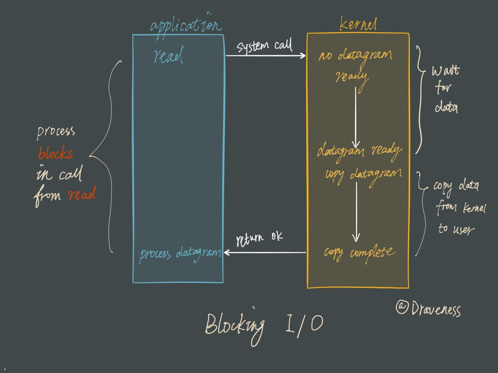
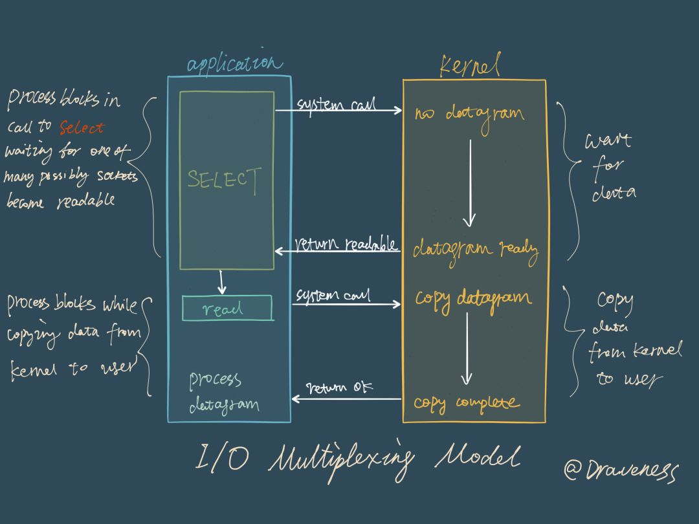
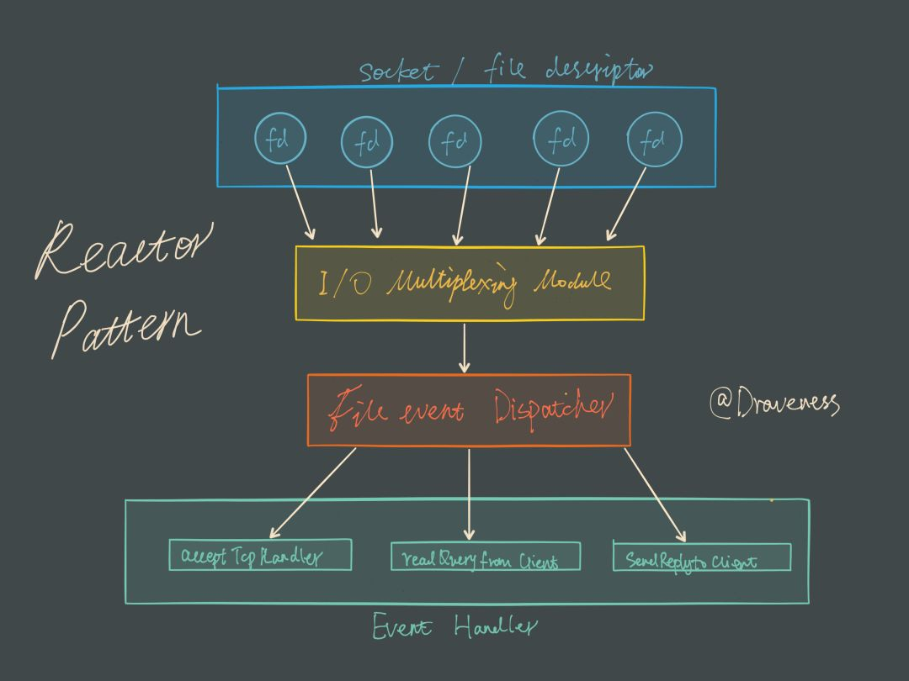

## Redis
Redis的架构

单线程 I/O多路复用

### Blocking I/O 阻塞IO

先来看一下传统的阻塞 I/O 模型到底是如何工作的：当使用 read 或者 write 对某一个文件描述符（File Descriptor 以下简称 FD)进行读写时，如果当前 FD 不可读或不可写，整个 Redis 服务就不会对其它的操作作出响应，导致整个服务不可用。

阻塞模型:

### I/O 多路复用

在 I/O 多路复用模型中，最重要的函数调用就是 select，该方法的能够同时监控多个文件描述符的可读可写情况，当其中的某些文件描述符可读或者可写时， select 方法就会返回可读以及可写的文件描述符个数。

阻塞模型:

## Reactor 设计模式

Redis 服务采用 Reactor 的方式来实现文件事件处理器（每一个网络连接其实都对应一个文件描述符）

文件事件处理器使用 I/O 多路复用模块同时监听多个 FD，当 accept、 read、 write 和 close 文件事件产生时，文件事件处理器就会回调 FD 绑定的事件处理器。

虽然整个文件事件处理器是在单线程上运行的，但是通过 I/O 多路复用模块的引入，实现了同时对多个 FD 读写的监控，提高了网络通信模型的性能，同时也可以保证整个 Redis 服务实现的简单。