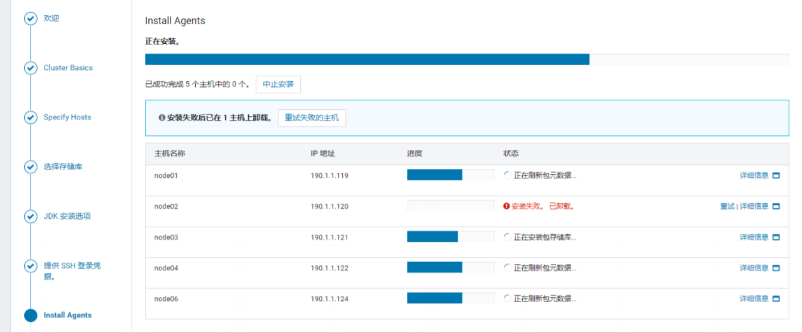
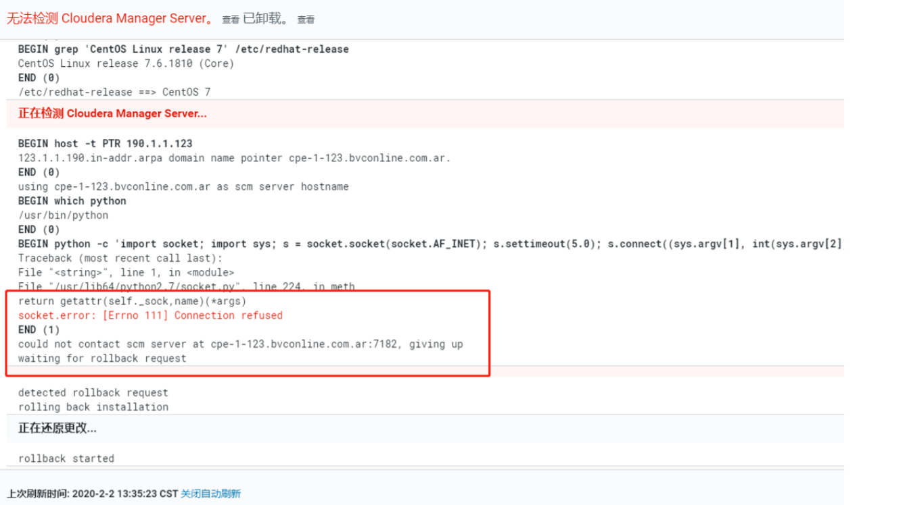

# 一、CDH介绍

## 1.1 为什么使用CDH，CDH的优势在哪里？

- 首先我们看下如果自己搭建Hadoop生态圈，可能遇到什么问题：

  1. 运维麻烦，安装、升级节点费时费力，需要花很长的时间、人力成本。
  2. 监控麻烦，如果节点发生故障怎么办？如何快速响应，自己安装势必会一个个节点去排查，万一集群数量大压力就很大。
  3. 版本控制，使用了Hadoop某个版泵之后，Hive、Hbase等版本有依赖，过高或者过低都会存在风险点。
  4. 资源监控，万一某个节点磁盘满了，需要其他监控数据排查。
  5. 项目交接，如果集群管理交接，需要把管理任务分配给另外的人，配置这些东西交接会很复杂。
  6. ....

- 那么，有没有工具可以帮我们界面化管理、小白式操作呢？有就是CDH、DHP，下面简单介绍下两款工具

  - CDH：全称(Cloudera’s Distribution Including Apache Hadoop)。目前国内大部分公司使用，最流行的版泵。可yum安装，安装后可使用免费版和企业版（免费体验60天）（6.3.3之后没有免费版本）。
  - DHP：全称(Hortonworks Data Platform)。18年Hortonworks就已经和Cloudera合并了，现在访问其官网自动跳转到了Cloudera，所以显然CDH更加厉害。

  

- CDH优势：

  - 节点管理方便，不在式传统的连接主机，只要管理页面配置即可。

  - 实时监控，可实时监控服务状态、服务器性能等。

  - 灵活配置，配置属性也是直接界面操作。

  - 版本稳定，基于Apache Hadoop作出了改动，编写代码要依赖cdh仓库的版本。

    

# 二、CDH安装

### 2.0 关闭系统防火墙

* systemctl stop firewalld

### 2.1 配置yum源（全部）

- rpm --import https://archive.cloudera.com/cm6/6.3.1/redhat7/yum/RPM-GPG-KEY-cloudera

### 2.2 安装jdk（全部）

- yum install java-1.8.0-openjdk-devel

### 2.3 安装Cloudera Manager（主）

- yum install cloudera-manager-daemon cloudera-manager-server

### 2.4 配置 Auto-TLS（全部）

- sudo JAVA_HOME=/usr/lib/jvm/java-1.8.0-openjdk-1.8.0.232.b09-0.el7_7.x86_64/ /opt/cloudera/cm-agent/bin/certmanager setup --configure-services

###     2.5 配置mysql

- wget https://dev.mysql.com/get/Downloads/Connector-J/mysql-connector-java-5.1.46.tar.gz
- tar zxvf mysql-connector-java-5.1.46.tar.gz
- cd mysql-connector-java-5.1.46
- sudo mkdir -p /usr/share/java/
- sudo cp mysql-connector-java-5.1.46-bin.jar /usr/share/java/mysql-connector-java.jar

### 2.6 连接mysql

- /opt/cloudera/cm/schema/scm_prepare_database.sh mysql scm scm -h 190.1.1.124 -P 3307 -p scm

### 2.7 启动

- systemctl start cloudera-scm-server
- tail -f /var/log/cloudera-scm-server/cloudera-scm-server.log

### 2.8 访问

- ip:7180端口即可访问（admin/admin，cloudera/cloudera） 
- 访问之后添加集群，先添加在主机上装agent节点

### 2.9 安装agent

- yum install cloudera-manager-agent cloudera-manager-daemon

### 3.0 完成

- 按提示操作，大部分过程会直接下载安装完成即可。
- 后面安装完成后，每一台节点安装agent，加入到集群即可。
- 注意，整个过程会安装完agent、和parcels才算是真正加入了集群，很有可能下载花了很多时间，建议先暂停节点加入，手动安装以下。

#  四、节点安装

## 4.1、提示安装

在第一登录系统之后，会默认提示部署集群，可以尝试获取安装单节点的Zookeeper，这样，基本上就能够体会到整个系统的安装过程。

这是成功安装好后的界面：


## 4.2、多节点集群安装

在各个节点配置一下yum源和jdk

- // 安装yum源
- rpm --import https://archive.cloudera.com/cm6/6.3.1/redhat7/yum/RPM-GPG-KEY-cloudera
- // 配置jdk
- yum install java-1.8.0-openjdk-devel -y

点击**集群**，选择**添加集群**


这里就是负责节点的维护工作，需要远程登录各个服务器节点，如图中，123节点中已经部署过了，其他节点需要重新在部署一下。


这里选择默认的包进行部署就可以了。里面的Parcels里已经包含了大部分所需要的包，我们就不进行再次下载。


配置**SSH登录凭证**，建议使用密钥登录，这样可以统一登录使用。

在下一步部署之前，我们先进行一个拷贝工作。

在之前单节点的时候，仅仅下载CDH-Parcels花费了大量的时间。同样的文件，我们不想下载多次。所以，我们把123节点上的资源拷贝到其他机器上。

- mkdir -p /opt/cloudera/parcel-repo
- scp /opt/cloudera/parcel-repo/CDH-6.3.2-1.cdh6.3.2.p0.1605554-el7.* root@node01:/opt/cloudera/parcel-repo/
- yum -y install deltarpm wget



依次进行拷贝，拷贝完成之后下一步安装Agents节点 

需要安装agent(10M)和daemon(93M)两个yum资源，到这里下载也就是很慢。于是，这个就使用手动下载rpm包并进行安装，下载地址https://archive.cloudera.com/cm6/6.3.1/repo-as-tarball/cm6.3.1-redhat7.tar.gz

这里node02节点安装失败了，查看详细信息：



需要执行

```
mv /usr/bin/host /usr/bin/host.bak
```

还有一种情况是一致在卡在**等待安装锁**，然后需要执行删除锁

```
# 杀进程
ps aux|grep scm_prepare_node|awk '{print $2}'|xargs kill -9
# 删除缓存文件
cd /tmp 
rm -rf scm_prepare_node.*
```

等待执行完成之后，agent节点安装也就完成了。

执行下一步，进行安装。

因为我们提前复制了parcel包，这里就很快了。


到这里，就开始配置集群配置。


我们只要配置一个zookeeper，其他的后面再开始配置：

选中自定义，选择zookeeper。

因为之前node01,node02,node03上有docker上的zookeeper，我们部署再node04,node05,node06节点上。


更改数据目录配置


点击继续，就开始安装了。

等待安装完成。


可以看到zookeeper就安装好了。

需要安装其他服务，直接添加服务即可。


服务安装就非常简单了，只是简单的点击就可以了。

CDH平台比服务器部署和Docker部署要简单很多，部署、升级简单便捷，同时提供很好的监控。


# 四、问题

- 如果是正常情况下，安装会很快，但是事情并不完全是这样。

## 3.1 Yum源

- 由于是国外的镜像资源，下载安装agent、daemon等会比较慢，所以建议使用VPN的PC下载之后复制并安装
- https://archive.cloudera.com/cm6/6.3.1/redhat7/yum/RPMS/x86_64/

## 3.2 Parcels下载

- 这个包里面包含了Hadoop、Hive等包。
- 同样是国外的镜像源，这个下载parcels也会很慢，注意下载版本
- https://archive.cloudera.com/cdh6/6.3.2/parcels/
- 下载完成之后复制到CDH配置的Parcel 目录，默认/opt/cloudera/parcel-repo，下载完成之后，复制到其他服务器并配置。

## 3.3 提示连接超时

- could not contact scm server at [cpe-1-123.bvconline.com.ar](http://cpe-1-123.bvconline.com.ar):7182, giving up
- ip解析异常，执行
- mv /usr/bin/host /usr/bin/host.bak

## 3.4 Install Agents保存可能的原因

- 安装失败的提示，会有提示失败原因。也有可能是其他原因：
  - 时区不一致，注意各个节点的时区、时间一致。

## 3.5 HIVE安装

- hive需要连接mysql作为元数据管理仓库，这里需要上传mysql的jdbc jar。以及创建数据库。 
- 需要上传mysql连接jar包到指定的节点到 /usr/share/java/mysql-connector-java.jar，注意文件名称一致。

# 五、Flink on Yarn

## 4.1 部署原因

- 之前使用的是Docker集群上部署的Flink Standalone模式的集群，存在节点掉线的情况。于是考虑在yarn上执行Flink调度任务。
- 在老的CDH版本集成上，无法直接把Flink和CDH 中的yarn整合。
- 而且Flink并不能完全适配CDH版本的Yarn，需要重新编译。整个过程会比较繁琐。
- 在19年底，CDH开始以自定义服务描述符(custom service descriptor)的方式支持。有了CDH的集成，可以开始更好的使用Flink

## 4.2 升级集成Flink

### 4.2.1 下载包

- 下载 https://archive.cloudera.com/csa/1.0.0.0/csd/ 中的jar包，到 /opt/cloudera/csd/ 目录中
- 下载 https://archive.cloudera.com/csa/1.0.0.0/parcels/ 中对应的parcel 、sha和manifest.json到/opt/cloudera/parcel-repo目录中

### 4.2.2 重启服务

- systemctl restart cloudera-scm-server

### 4.2.3 激活Flink

- 到【主机】，【parcel】页面分配并激活Flink

### 4.2.4 进入CM主页点击“添加服务”

### 4.2.5 重启CMS 

### 4.2.6 访问端口

- 8082 查询历史任务调度情况
- 随机ip:随机端口==>flink调度地址，重启会随机变化
  - 先运行，flink run -m yarn-cluster -yn 4 -yjm 1024 -ytm 1024 /opt/cloudera/parcels/FLINK/lib/flink/examples/streaming/WordCount.jar
  - 然后在yarn集群找到运行的flink任务，跳转到任务运行的Flink web界面。
  - 点击Submit New Job。提示本地址无法上传，但是会有一个新的链接，这个地址就是实际可调度的Flink任务地址。
- 问题：
  - 在前面几次任务调度中，都可以找到一个Flink web界面，后面实际调度flink任务时，就再也无法进入Flink 的web界面。
  - 那么可以通过flink脚本调度实现任务调度。
  - flink run -m yarn-cluster -yn 4 -yjm 1024 -ytm 1024 *.jar ETL uuid
  - 但是实际与数据中台调度任务所违背，提交了一个数据清洗任务。=>数据库查询uuid。=>脚本提交任务。
- Flink on yarn
  - Flink on yarn 的两种模式
    - flink：提交一个任务到yarn，单独占用资源，**用完就释放**。===> 相当于**临时会话**
    - yarn-session：提交一个会话到yarn，创建一个Flink任务集群，**全程占用资源**，提交任务到Flink 集群 ===>相当于**群会话**。
  - 前面我们用的是flink模式，现在使用yarn-session
    - 进入flink 工作目录，创建配置文件软链接
    - cd /opt/cloudera/parcels/FLINK-1.9.0-csa1.0.0.0-cdh6.3.0/lib/flink
    - ln -s /etc/flink/conf conf
    - 下载依赖包和组件
    - cd /opt/cloudera/parcels/FLINK-1.9.0-csa1.0.0.0-cdh6.3.0/lib/flink/lib
    - curl -O https://repo.maven.apache.org/maven2/org/apache/flink/flink-shaded-hadoop-2-uber/2.8.3-10.0/flink-shaded-hadoop-2-uber-2.8.3-10.0.jar
    - 启动yarn-session
    - ./bin/yarn-session.sh -d -n 8 -jm 1024m -tm 4096m
    - 此时，会在yarn上启动一个任务，同时，控制台会有一个flink 的web集群页面