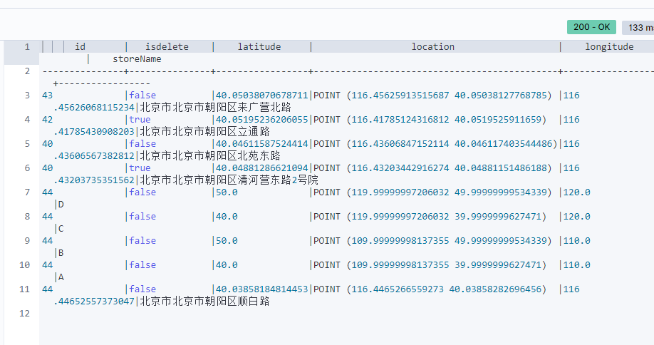
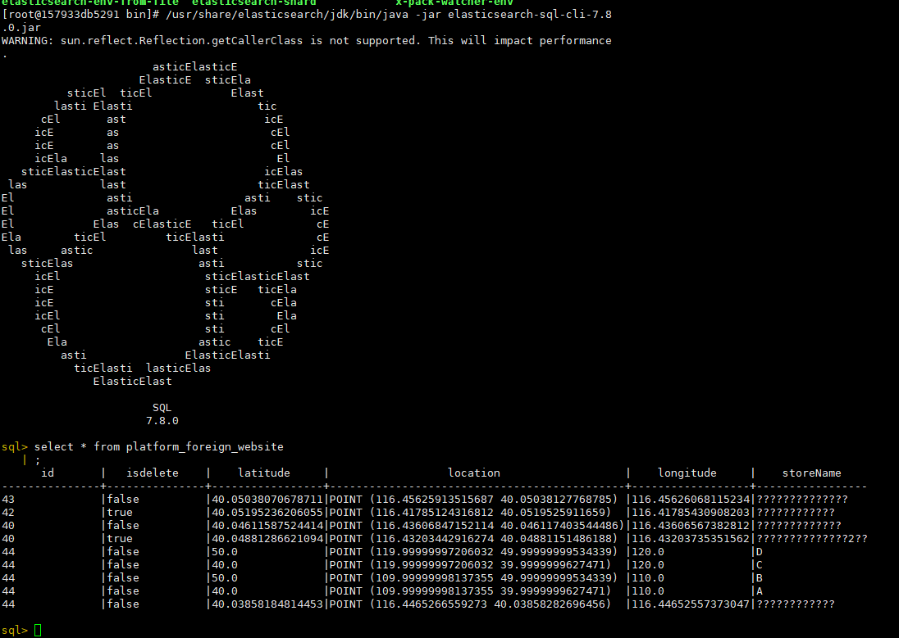

# ElasticSearch

## 一、介绍

* Elaticsearch，简称为es， es是一个开源的高扩展的分布式全文检索引擎，它可以近乎实时的存储、检索数据；本身扩展性很好，可以扩展到上百台服务器，处理PB级别的数据。es也使用Java开发并使用Lucene作为其核心来实现所有索引和搜索的功能，但是它的目的是通过简单的RESTful API来隐藏Lucene的复杂性，从而让全文搜索变得简单。

## 二、ElasticSearch使用案例

* 2013年初，GitHub抛弃了Solr，采取ElasticSearch 来做PB级的搜索。 “GitHub使用ElasticSearch搜索20TB的数据，包括13亿文件和1300亿行代码”
* 维基百科：启动以elasticsearch为基础的核心搜索架构
* SoundCloud：“SoundCloud使用ElasticSearch为1.8亿用户提供即时而精准的音乐搜索服务”
* 百度：百度目前广泛使用ElasticSearch作为文本数据分析，采集百度所有服务器上的各类指标数据及用户自定义数据，通过对各种数据进行多维分析展示，辅助定位分析实例异常或业务层面异常。目前覆盖百度内部20多个业务线（包括casio、云分析、网盟、预测、文库、直达号、钱包、风控等），单集群最大100台机器，200个ES节点，每天导入30TB+数据
* 新浪使用ES 分析处理32亿条实时日志
* 阿里使用ES 构建挖财自己的日志采集和分析体系

## 三、ElasticSearch安装

### 3.1 ElasticSearch安装

* 注意：ES不能使用root用户来启动，需要创建用户来执行操作。

* 官网下载解压

* 修改配置文件elastocsearch.yaml

  ```yaml
  #vim config/elastocsearch.yaml
  cluster.name: myes
  node.name: node01
  path.data: /kkb/install/elasticsearch-6.7.0/datas
  path.logs: /kkb/install/elasticsearch-6.7.0/logs
  network.host: 192.168.0.2
  http.port: 9200
  discovery.zen.ping.unicast.hosts: ["node01", "node02", "node03"]
  bootstrap.system_call_filter: false
  bootstrap.memory_lock: false
  http.cors.enabled: true
  http.cors.allow-origin: "*"
  ```

* 修改jvm.options

  ```sh
  # vim config/jvm.options
  
  -Xms2g
  -Xmx2g
  ```

* 项目发送到其他节点服务器

  ```sh
  scp ...
  ```

* 修改其他节点服务名称

  ```yaml
  #vim config/elastocsearch.yaml
  node.name: node02
  network.host: 192.168.0.3
  ```

* 修改系统配置

  ```sh
  # 解除打开文件数据的限制
  sudo vi /etc/security/limits.conf
  * soft nofile 65536
  * hard nofile 131072
  * soft nproc 2048
  * hard nproc 4096
  # 启动线程数限制
  sudo vi /etc/sysctl.conf
  vm.max_map_count=655360
  fs.file-max=655360
  # 启动生效
  sudo sysctl -p
  # 重新连接linux服务器
  # 验证结果
  [hadoop@node01 ~]$ ulimit -Hn
  131072
  [hadoop@node01 ~]$ ulimit -Sn
  65536
  [hadoop@node01 ~]$ ulimit -Hu
  4096
  [hadoop@node01 ~]$ ulimit -Su
  4096
  ```

* 执行启动

  ```sh
  nohup /bin/elasticsearch 2>&1 &
  ```

* 访问http://node01:9200

### 3.2 ElasticSearch-Head安装

* 克隆编译包并进行安装

  ```sh
  git clone https://github.com/mobz/elasticsearch-head.git
  # 进入安装目录
  cd elasticsearch-head
  # intall 才会有 node-modules
  npm install
  ```

* 修改Gruntfile.js

  ```sh
  # vim Gruntfile.js
  # 搜索hostname，修改到node01节点
  ```

* 修改app.js

  ```sh
  # vim _site/app.js
  # 更改 http://localhost:9200 为 http://node01:9200
  ```

* 启动

  ```
  nohup node_modules/grunt/bin/grunt server >/dev/null 2>&1 &
  ```

* 访问http://node01:9100

### 3.3 Kibana安装

* 下载解压

* 修改kibana.yml

  ```sh
  # vim config/kibana.yaml
  server.host: "node01"
  elasticsearch.hosts: ["http://node01:9200"]
  ```

* 启动

  ```
  nohup bin/kibana >/dev/null 2>&1 &
  ```

* 访问http://node01:5601

### 3.1 Docker 安装部署（Deployment）

```sh
# ElasticSearch
docker pull elasticsearch:7.8.0
docker rm -f elasticsearch
docker run -d --name elasticsearch -v /opt/docker/elasticsearch/data:/usr/share/elasticsearch/data -p 9200:9200 -p 9300:9300 -e "discovery.type=single-node" elasticsearch:7.8.0

# elasticsearch-head
docker pull mobz/elasticsearch-head:5
docker rm -f elasticsearch-head
docker run -d --name elasticsearch-head -p 9100:9100 docker.io/mobz/elasticsearch-head:5

# kibana
docker pull kibana:7.8.0
docker rm -f kibana
# --link A:B
# 容器中域名B地址将会解析到A容器地址
# 就算重新创建容器，网络不一致，也可以网络通信
docker run -d --name kibana --link elasticsearch:elasticsearch -p 5601:5601 kibana:7.8.0
```

* 如果elasticsearch-head无法连接ElasticSearch集群，因为跨域，修改浏览器，允许跨域即可。

## 四、ElasticSearch核心概念

### 4.1 概述

Elasticsearch是面向文档(document oriented)的，这意味着它可以存储整个对象或文档(document)。然而它不仅仅是存储，还会索引(index)每个文档的内容使之可以被搜索。在Elasticsearch中，你可以对文档（而非成行成列的数据）进行索引、搜索、排序、过滤。

Elasticsearch比传统关系型数据库如下：

Relational DB -> Databases -> Tables -> Rows -> Columns
Elasticsearch -> Indices   -> Types  -> Documents -> Fields

#### 4.1.1 索引 index

* 一个索引就是一个拥有几分相似特征的文档的集合。比如说，你可以有一个客户数据的索引，另一个产品目录的索引，还有一个订单数据的索引。一个索引由一个名字来标识（必须全部是小写字母的），并且当我们要对对应于这个索引中的文档进行索引、搜索、更新和删除的时候，都要使用到这个名字。在一个集群中，可以定义任意多的索引。

#### 4.1.2 类型 type

* 在一个索引中，你可以定义一种或多种类型。一个类型是你的索引的一个逻辑上的分类/分区，其语义完全由你来定。通常，会为具有一组共同字段的文档定义一个类型。比如说，我们假设你运营一个博客平台并且将你所有的数据存储到一个索引中。在这个索引中，你可以为用户数据定义一个类型，为博客数据定义另一个类型，当然，也可以为评论数据定义另一个类型。

#### 4.1.3 文档 doucument

* 一个文档是一个可被索引的基础信息单元。比如，你可以拥有某一个客户的文档，某一个产品的一个文档，当然，也可以拥有某个订单的一个文档。文档以JSON（Javascript Object Notation）格式来表示，而JSON是一个到处存在的互联网数据交互格式。

  在一个index/type/type

#### 4.1.4 字段 field

* 相当于是数据表的字段，对文档数据根据不同属性进行的分类标识

#### 4.1.5 映射 mapping

* mapping是处理数据的方式和规则方面做一些限制，如某个字段的数据类型、默认值、分析器、是否被索引等等，这些都是映射里面可以设置的，其它就是处理es里面数据的一些使用规则设置也叫做映射，按着最优规则处理数据对性能提高很大，因此才需要建立映射，并且需要思考如何建立映射才能对性能更好。 

#### 4.1.6 接近实时 NRT

* ####  Elasticsearch是一个接近实时的搜索平台。这意味着，从索引一个文档直到这个文档能够被搜索到有一个轻微的延迟（通常是1秒以内）

#### 4.1.7 集群 cluster

* 一个集群就是由一个或多个节点组织在一起，它们共同持有整个的数据，并一起提供索引和搜索功能。一个集群由一个唯一的名字标识，这个名字默认就是“elasticsearch”。这个名字是重要的，因为一个节点只能通过指定某个集群的名字，来加入这个集群.

#### 4.1.8 节点 node

* 一个节点是集群中的一个服务器，作为集群的一部分，它存储数据，参与集群的索引和搜索功能。和集群类似，一个节点也是由一个名字来标识的，默认情况下，这个名字是一个随机的漫威漫画角色的名字，这个名字会在启动的时候赋予节点。这个名字对于管理工作来说挺重要的，因为在这个管理过程中，你会去确定网络中的哪些服务器对应于Elasticsearch集群中的哪些节点。
* 一个节点可以通过配置集群名称的方式来加入一个指定的集群。默认情况下，每个节点都会被安排加入到一个叫做“elasticsearch”的集群中，这意味着，如果你在你的网络中启动了若干个节点，并假定它们能够相互发现彼此，它们将会自动地形成并加入到一个叫做“elasticsearch”的集群中。
* 在一个集群里，只要你想，可以拥有任意多个节点。而且，如果当前你的网络中没有运行任何Elasticsearch节点，这时启动一个节点，会默认创建并加入一个叫做“elasticsearch”的集群。

#### 4.1.9 分片和复制 shards & replicas

* Elasticsearch提供了将索引划分成多份的能力，这些份就叫做分片。当你创建一个索引的时候，你可以指定你想要的分片的数量。每个分片本身也是一个功能完善并且独立的“索引”，这个“索引”可以被放置到集群中的任何节点上。分片很重要，主要有两方面的原因： 
  * 允许你**水平分割/扩展你的内容容量**。
  * 允许你在分片（潜在地，位于多个节点上）之上进行**分布式的、并行的操作**，进而提高性能/吞吐量。
* 至于一个分片怎样分布，它的文档怎样聚合回搜索请求，是完全由Elasticsearch管理的，对于作为用户的你来说，这些都是透明的。
* 在一个网络/云的环境里，失败随时都可能发生，在某个分片/节点不知怎么的就处于离线状态，或者由于任何原因消失了，这种情况下，有一个故障转移机制是非常有用并且是强烈推荐的。为此目的，Elasticsearch允许你创建分片的一份或多份拷贝，这些拷贝叫做**复制**分片。

* 复制之所以重要，有两个主要原因： 
  * 在分片/节点失败的情况下，提供了**高可用性**。因为这个原因，注意到复制分片从不与原/主要（original/primary）分片置于同一节点上是非常重要的。
  * 扩展你的**搜索量/吞吐量**，因为搜索可以在所有的复制上并行运行。
* 每个索引可以被分成多个分片。一个索引也可以被复制0次（意思是没有复制）或多次。一旦复制了，每个索引就有了主分片（作为复制源的原来的分片）和复制分片（主分片的拷贝）之别。**分片和复制的数量可以在索引创建的时候指定。在索引创建之后，你可以在任何时候动态地改变复制的数量，但是你事后不能改变分片的数量。**
* 默认情况下，Elasticsearch中的每个索引被分片5个主分片和1个复制，这意味着，如果你的集群中至少有两个节点，你的索引将会有5个主分片和另外5个复制分片（1个完全拷贝），这样的话每个索引总共就有10个分片。

## 五、管理索引

### 5.1 创建索引

```sh
# 创建名称为blog的索引
PUT /blog/?pretty
```

### 5.2 插入文档

```sh
# 在blog下，article类型中添加ID的为1的数据
PUT /blog/article/1?pretty
{"id": "1", "title": "What is lucene"}
```

### 5.3 查询文档

```sh
# 在blog下，article类型中查询ID的为1的数据
GET /blog/article/1?pretty
```

### 5.4 更新文档

```sh
## 在blog下，article类型中更新ID的为1的数据
PUT /blog/article/1?pretty
{"id": "1", "title": "What is lucene 2"}
```

### 5.5 搜索文档

```sh
# 在blog下，article类型中搜索id的为1的数据
GET blog/article/_search?q=id:1
# 在blog下，article类型中搜索title的为lucene的数据
GET blog/article/_search?q=title:lucene
```

### 5.6 删除文档

```sh
## 在blog下，article类型中删除ID的为1的数据
DELETE /blog/article/1?pretty
```

### 5.7 删除索引

```
# 删除名称为blog的索引
DELETE /blog/?pretty
```

## 六、数据查询

```sh
PUT /school
POST /school/student/_bulk
{ "index": { "_id": 1 }}
{ "name" : "liubei", "age" : 20 , "sex": "boy", "birth": "1996-01-02" , "about": "i like diaocan he girl" }
{ "index": { "_id": 2 }}
{ "name" : "guanyu", "age" : 21 , "sex": "boy", "birth": "1995-01-02" , "about": "i like diaocan" }
{ "index": { "_id": 3 }}
{ "name" : "zhangfei", "age" : 18 , "sex": "boy", "birth": "1998-01-02" , "about": "i like travel" }
{ "index": { "_id": 4 }}
{ "name" : "diaocan", "age" : 20 , "sex": "girl", "birth": "1996-01-02" , "about": "i like travel and sport" }
{ "index": { "_id": 5 }}
{ "name" : "panjinlian", "age" : 25 , "sex": "girl", "birth": "1991-01-02" , "about": "i like travel and wusong" }
{ "index": { "_id": 6 }}
{ "name" : "caocao", "age" : 30 , "sex": "boy", "birth": "1988-01-02" , "about": "i like xiaoqiao" }
{ "index": { "_id": 7 }}
{ "name" : "zhaoyun", "age" : 31 , "sex": "boy", "birth": "1997-01-02" , "about": "i like travel and music" }
{ "index": { "_id": 8 }}
{ "name" : "xiaoqiao", "age" : 18 , "sex": "girl", "birth": "1998-01-02" , "about": "i like caocao" }
{ "index": { "_id": 9 }}
{ "name" : "daqiao", "age" : 20 , "sex": "girl", "birth": "1996-01-02" , "about": "i like travel and history" }

```


### 6.1 查询 Query DSL

* 在上下文查询语境中，查询语句会询问文档与查询语句的匹配程度，它会判断文档是否匹配并计算相关性评分（_score）的值。例如：
  - 查找与 `full text search` 这个词语最佳匹配的文档
  - 查找包含单词 `run`，但是也包含`runs`, `running`, `jog` 或 `sprint`的文档
  - 同时包含着 `quick`, `brown` 和`fox`--- 单词间离得越近，该文档的相关性越高
  - 标识着 `lucene`, `search` 或 `java`--- 标识词越多，该文档的相关性越高

#### 6.1.1 match_all

* 通过match_all匹配后，会把所有的数据检索出来，容易导致GC。

```sh
# 把所有的数据检索出来
GET /school/student/_search?pretty
{
    "query": {
        "match_all": {}
    }
}
```

#### 6.1.2 match

* 关键子搜索查询

```sh
# 检索喜欢旅游的人
GET /school/student/_search?pretty
{
    "query": {
         "match": {"about": "travel"}
    }
}
```

#### 6.1.3 term/terms

* 使用term进行精确匹配（比如数字，日期，布尔值或 not_analyzed的字符串(未经分析的文本数据类型)）
* 使用terms匹配多个值
  * term主要是用于精确的过滤，比如说：”我爱你”
    * 在match下面匹配可以为包含：我、爱、你、我爱等等的解析器
    * 在term语法下面就精准匹配到：”我爱你”

```sh
# 使用term进行精确匹配
GET /school/student/_search?pretty
{
"query": {
   "bool": {
      "must": { "term": {"about": "travel"}},
      "should": {"term": {"sex": "boy"}}         
     }}
}
# 使用terms匹配多个值
GET /school/student/_search?pretty
{
"query": {
   "bool": {
      "must": { "terms": {"about": ["travel","history"]}}          
     }
  }
}

```

#### 6.1.4 range

* Range过滤允许我们按照指定的范围查找一些数据：操作范围：gt::大于，gae::大于等于,lt::小于，lte::小于等于

```sh
# 查找出大于20岁，小于等于25岁的学生
GET /school/student/_search?pretty
{
"query": {
   "range": {
    "age": {"gt":20,"lte":25}
         }
      }
}

```

#### 6.1.5 exits

* exists过滤可以找到文档中是否包含某个字段
* missing用法已经被抛弃了，可使用bool、must_not、exists组合使用

```
GET /school/student/_search?pretty
{
"query": {
   "exists": {
    "field": "age"  
         }
      }
}

GET /school/student/_search?pretty
{
"query": {
  "bool": {
    "must_not": {
      "exists": {
        "field": "age1"
        }
      }
    }
  }
}

```

### 6.2 bool组合查询

- 当出现多个查询语句组合的时候，可以用bool来包含。bool合并聚包含： 
  - must :: 多个查询条件的完全匹配,相当于 and 。
  - must_not :: 多个查询条件的相反匹配，相当于 not 。
  - should :: 至少有一个查询条件匹配, 相当于 or

```sh
# 查询非男性中喜欢旅行的人
GET /school/student/_search?pretty
{
"query": {
   "bool": {
      "must": { "match": {"about": "travel"}},
      "must_not": {"match": {"sex": "boy"}}
     }
  }
}

# 查询喜欢旅行的，性别可有可无
GET /school/student/_search?pretty
{
"query": {
   "bool": {
      "must": { "match": {"about": "travel"}},
      "should": {"match": {"sex": "boy"}}         
     }
  }
}

# 过滤出about字段包含travel并且年龄大于20岁小于30岁的同学
GET /school/student/_search?pretty
{
  "query": {
    "bool": {
      "must": [
        {"term": {
          "about": {
            "value": "travel"
          }
        }},{"range": {
          "age": {
            "gte": 20,
            "lte": 30
          }
        }}
      ]
    }
  }
}

```

### 6.3 过滤 Filter DSL

- 在上下文过滤语境中，查询语句主要解决文档是否匹配的问题，而不会在意匹配程度（相关性评分）。

  例如：

  -  `created` 的日期范围是否在 `2013` 到 `2014` ?
  -  `status` 字段中是否包含单词 "published" ?
  -  `lat_lon` 字段中的地理位置与目标点相距是否不超过10km ?

* 通常复杂的查询语句，我们也要配合**过滤语句来实现缓存**，用filter语句就可以来实现。

```sh
# 查询出喜欢旅行的，并且年龄是20岁的文档
GET /school/student/_search?pretty
{
  "query": {
   "bool": {
     "must": {"match": {"about": "travel"}},     
     "filter": [{"term":{"age": 20}}]
     }
  }
}
```

### 6.4 高亮查询

```sh
# 查询结果高亮显示
POST /school/student/_search?pretty
{
    "query" : { "match" : { "about": "travel" }},
    "highlight" : {
        "pre_tags" : ["<font color=red>"],
        "post_tags" : ["</font>"],
        "fields" : {
            "about" : {}
        }
    }
}

```


## 七、定义字段类型 mappings

* 在es当中，每个字段都会有默认的类型，根据我们第一次插入数据进去，es会自动帮我们推断字段的类型，当然我们也可以通过设置mappings来提前自定义我们字段的类型。

```sh
# 老版本,7.0之前
# 创建
PUT /school2
{
  "mappings": {
    "logs" : {
      "properties": {"messages" : {"type": "text"}}
    }
  }
}
# 添加
POST /school/_mapping/logs
{
  "properties": {"number" : {"type": "text"}}
}

# 查询
GET school2/logs/_mapping
```

```sh
# 老版本,7.0之后
# 创建
PUT /school2
{
  "mappings": {
      "properties": {"messages" : {"type": "text"}}
  }
}

# 添加
POST /school/_mapping/logs
{
  "properties": {"number" : {"type": "text"}}
}

# 查询
GET school2/_mapping
```

* 很多地方将ElasticSearch与数据库类比，比如将index看作数据库，type看作数据库表，id看作表结构中的主键。但是，在内部的机制中却有不同，在同一个数据库中，不同的表的字段可以名称相同，类型不同，但是在ES中，由于在不同映射类型中具有相同名称的字段在内部由相同的Lucene字段支持，因此在相同的索引中，如果给不同type设置相同filed，但是filed的属性不同的话，在操作比如删除时，就可能会删除失败。除此之外，存储在同一索引中具有很少或没有共同字段的不同实体会导致数据稀疏，并影响Lucene有效压缩文档的能力。因此在es7的时，废除类mapping types 的设置。在7.0到8.0之间，我们可以通过`include_type_name=false`指定是否使用mapping types。（7.0默认是true，7.0-8.0默认是false,true 开启，false关闭）

## 八、定义索引分片以及副本数 settings

* 所谓的settings就是用来修改索引分片和副本数的；
* 比如有的重要索引，副本数很少甚至没有副本，那么我们可以通过setting来添加副本数。
* **副本可修改，但是分片一旦创建，则不可修改。**

```sh
# 修改副本数为2
PUT /school2/_settings
{
  "number_of_replicas": 2
}

# 修改分片，此操作执行失败
PUT /school2/_settings
{
  "number_of_shards": 3
}

# 分片需要在创建的时候就要确认
PUT /school3
{
  "settings": {
  	"number_of_shards": 3
  }
}
```

## 九、分页解决方案

```sh
# 导入数据
DELETE /us
PUT /us
POST /_bulk
{ "create": { "_index": "us", "_type": "tweet", "_id": "1" }}
{ "email" : "john@smith.com", "name" : "John Smith", "username" : "@john" }
{ "create": { "_index": "us", "_type": "tweet", "_id": "2" }}
{ "email" : "mary@jones.com", "name" : "Mary Jones", "username" : "@mary" }
{ "create": { "_index": "us", "_type": "tweet", "_id": "3" }}
{ "date" : "2014-09-13", "name" : "Mary Jones", "tweet" : "Elasticsearch means full text search has never been so easy", "user_id" : 2 }
{ "create": { "_index": "us", "_type": "tweet", "_id": "4" }}
{ "date" : "2014-09-14", "name" : "John Smith", "tweet" : "@mary it is not just text, it does everything", "user_id" : 1 }
{ "create": { "_index": "us", "_type": "tweet", "_id": "5" }}
{ "date" : "2014-09-15", "name" : "Mary Jones", "tweet" : "However did I manage before Elasticsearch?", "user_id" : 2 }
{ "create": { "_index": "us", "_type": "tweet", "_id": "6" }}
{ "date" : "2014-09-16", "name" : "John Smith",  "tweet" : "The Elasticsearch API is really easy to use", "user_id" : 1 }
{ "create": { "_index": "us", "_type": "tweet", "_id": "7" }}
{ "date" : "2014-09-17", "name" : "Mary Jones", "tweet" : "The Query DSL is really powerful and flexible", "user_id" : 2 }
{ "create": { "_index": "us", "_type": "tweet", "_id": "8" }}
{ "date" : "2014-09-18", "name" : "John Smith", "user_id" : 1 }
{ "create": { "_index": "us", "_type": "tweet", "_id": "9" }}
{ "date" : "2014-09-19", "name" : "Mary Jones", "tweet" : "Geo-location aggregations are really cool", "user_id" : 2 }
{ "create": { "_index": "us", "_type": "tweet", "_id": "10" }}
{ "date" : "2014-09-20", "name" : "John Smith", "tweet" : "Elasticsearch surely is one of the hottest new NoSQL products", "user_id" : 1 }
{ "create": { "_index": "us", "_type": "tweet", "_id": "11" }}
{ "date" : "2014-09-21", "name" : "Mary Jones", "tweet" : "Elasticsearch is built for the cloud, easy to scale", "user_id" : 2 }
{ "create": { "_index": "us", "_type": "tweet", "_id": "12" }}
{ "date" : "2014-09-22", "name" : "John Smith", "tweet" : "Elasticsearch and I have left the honeymoon stage, and I still love her.", "user_id" : 1 }
{ "create": { "_index": "us", "_type": "tweet", "_id": "13" }}
{ "date" : "2014-09-23", "name" : "Mary Jones", "tweet" : "So yes, I am an Elasticsearch fanboy", "user_id" : 2 }
{ "create": { "_index": "us", "_type": "tweet", "_id": "14" }}
{ "date" : "2014-09-24", "name" : "John Smith", "tweet" : "How many more cheesy tweets do I have to write?", "user_id" : 1 }

```

### 9.1 size+from浅分页

按照一般的查询流程来说，如果我想查询前10条数据：

1. 客户端请求发给某个节点
2. 节点转发给个个分片，查询每个分片上的前10条
3. 结果返回给节点，整合数据，提取前10条
4. 返回给请求客户端

**from**定义了目标数据的偏移值

**size**定义当前返回的事件数目

```sh
GET /us/_search?pretty
{
  "from" : 0 , "size" : 5
}

GET /us/_search?pretty
{
  "from" : 5 , "size" : 5
}

```

这种浅分页只适合少量数据，因为随from增大，查询的时间就会越大，而且数据量越大，查询的效率指数下降；

* **优点**：from+size在数据量不大的情况下，效率比较高

* **缺点**：在数据量非常大的情况下，from+size分页会把全部记录加载到内存中，这样做不但运行速递特别慢，而且容易让es出现内存不足而挂掉

### 9.2 Scroll 深分页

* 对于上面介绍的浅分页，当Elasticsearch响应请求时，它必须确定docs的顺序，排列响应结果。

* 如果请求的页数较少（假设每页20个docs）, Elasticsearch不会有什么问题，但是如果页数较大时，比如请求第20页，Elasticsearch不得不取出第1页到第20页的所有docs，再去除第1页到第19页的docs，得到第20页的docs。

* 解决的方式就是使用scroll，**scroll就是维护了当前索引段的一份快照信息—缓存**（这个快照信息是你执行这个scroll查询时的快照）。

* 可以把 scroll 分为初始化和遍历两步：

  1. 初始化时将所有符合搜索条件的搜索结果缓存起来，可以想象成快照；

     ```sh
     # 其中的scroll=3m代表当前查询的数据缓存3分钟
     # 代表当前查询3条数据
     GET us/_search?scroll=3m
     { 
     	"query": {"match_all": {}},
      	"size": 3
     }
     ```

  2. 遍历时，从这个快照里取数据；

     ```sh
     # 在遍历时候，拿到上一次遍历中的scrollid，然后带scroll参数，重复上一次的遍历步骤，知道返回的数据为空，就表示遍历完成
     GET /_search/scroll
     {
       "scroll" : "1m",
       "scroll_id" : "FGluY2x1ZGVfY29udGV4dF91dWlkDXF1ZXJ5QW5kRmV0Y2gBFFlFZUQwbklCM3JCQXZCeXJDMmJPAAAAAAAAGmIWRkltMzVXNkhTVHE0X0hUNWZyR1EwZw=="
     }
     ```

* 每次都要传参数scroll，刷新搜索结果的缓存时间，另外不需要指定index和type（**不要把缓存的时时间设置太长，占用内存**）

**对比：**

* 浅分页，每次查询都会去索引库（本地文件夹）中查询pageNum*page条数据，然后截取掉前面的数据，留下最后的数据。 这样的操作在每个分片上都会执行，最后会将多个分片的数据合并到一起，再次排序，截取需要的。
* 深分页，可以一次性将所有满足查询条件的数据，都放到内存中。分页的时候，在内存中查询。相对浅分页，就可以避免多次读取磁盘。

## 十、ES的中文分词器IK

* 下载

  ```sh
  wget https://github.com/medcl/elasticsearch-analysis-ik/releases/download/v7.8.0/elasticsearch-analysis-ik-7.8.0.zip
  ```

* 创建文件夹
  ```sh
  # cd ES_HOME
  mkdir -p plugins/analysis-ik
  ```

* 解压到创建的目录
  ```sh
  unzip elasticsearch-analysis-ik-6.7.0.zip  -d plugins/analysis-ik/
  ```

* 当然也可以直接安装

  ```sh
  ./bin/elasticsearch-plugin install https://github.com/medcl/elasticsearch-analysis-ik/releases/download/v6.3.0/elasticsearch-analysis-ik-6.3.0.zip
  ```

* 重启ES集群

*  创建索引库并配置IK分词器

  ```sh
  DELETE iktest
  PUT /iktest?pretty
  {
      "settings" : {
          "analysis" : {
              "analyzer" : {
                  "ik" : {
                      "tokenizer" : "ik_max_word"
                  }
              }
          }
      },
      "mappings" : {
          "dynamic" : true,
          "properties" : {
                  "subject" : {
                      "type" : "text",
                      "analyzer" : "ik_max_word"
              }
          }
      }
  }
  ```

* 查看分词效果

  ```sh
  GET _analyze?pretty
  {
      "analyzer": "ik_max_word",
      "text": "特朗普是美国总统"
  }
  
  ```

* 插入数据

  ```sh
  POST /iktest/_bulk?pretty
  { "index" : { "_id" : "1" } }
  {"subject" : "＂闺蜜＂崔顺实被韩检方传唤 韩总统府促彻查真相" }
  { "index" : { "_id" : "2" } }
  {"subject" : "韩举行＂护国训练＂ 青瓦台:决不许国家安全出问题" }
  { "index" : { "_id" : "3" } }
  {"subject" : "媒体称FBI已经取得搜查令 检视希拉里电邮" }
  { "index" : { "_id" : "4" } }
  {"subject" : "村上春树获安徒生奖 演讲中谈及欧洲排外问题" }
  { "index" : { "_id" : "5" } }
  {"subject" : "希拉里团队炮轰FBI 参院民主党领袖批其”违法”" }
  ```

* 分词搜索+高亮

  ```sh
  POST /iktest/_search?pretty
  {
      "query" : { "match" : { "subject" : "希拉里和韩国" }},
      "highlight" : {
          "pre_tags" : ["<font color=red>"],
          "post_tags" : ["</font>"],
          "fields" : {
              "subject" : {}
          }
      }
  }
  
  ```

* 热词更新

  ```sh
  GET _analyze?pretty
  {
      "analyzer": "ik_max_word",
      "text": "特朗普"
  }
  三个字是分开的
  ```

  * 部署一个web服务，比方说是tomcat，或者nginx

    ```sh
    [root@localhost www]# curl 192.168.0.146/hot.doc
    特朗普
    ```

  * 修改配置文件IKAnalyzer.cfg.xml

    ```xml
    #vim plugins/analysis-ik/config/
    <?xml version="1.0" encoding="UTF-8"?>
    <!DOCTYPE properties SYSTEM "http://java.sun.com/dtd/properties.dtd">
    <properties>
            <comment>IK Analyzer 扩展配置</comment>
            <!--用户可以在这里配置自己的扩展字典 -->
            <entry key="ext_dict"></entry>
             <!--用户可以在这里配置自己的扩展停止词字典-->
            <entry key="ext_stopwords"></entry>
            <!--用户可以在这里配置远程扩展字典 -->
            <entry key="remote_ext_dict">http://192.168.0.146/hot.doc</entry>
            <!--用户可以在这里配置远程扩展停止词字典-->
            <!-- <entry key="remote_ext_stopwords">words_location</entry> -->
    </properties>
    ```

## 十一、Java操作ES

### 11.1 引入Maven依赖

```xml

    <dependencies>

        <!-- 老版本，es8.0.0将不支持-->
        <!--<dependency>-->
            <!--<groupId>org.elasticsearch.client</groupId>-->
            <!--<artifactId>transport</artifactId>-->
            <!--<version>7.8.0</version>-->
        <!--</dependency>-->

        <dependency>
            <groupId>org.elasticsearch.client</groupId>
            <artifactId>elasticsearch-rest-high-level-client</artifactId>
            <version>7.8.0</version>
        </dependency>

        <dependency>
            <groupId>org.apache.logging.log4j</groupId>
            <artifactId>log4j-core</artifactId>
            <version>2.9.1</version>
        </dependency>
        <dependency>
            <groupId>org.junit.jupiter</groupId>
            <artifactId>junit-jupiter-api</artifactId>
            <version>5.3.0-M1</version>
            <scope>test</scope>
        </dependency>

        <!-- https://mvnrepository.com/artifact/com.alibaba/fastjson -->
        <dependency>
            <groupId>com.alibaba</groupId>
            <artifactId>fastjson</artifactId>
            <version>1.2.47</version>
        </dependency>

    </dependencies>
    <build>
        <plugins>
            <plugin>
                <groupId>org.apache.maven.plugins</groupId>
                <artifactId>maven-compiler-plugin</artifactId>
                <configuration>
                    <source>1.8</source>
                    <target>1.8</target>
                </configuration>
            </plugin>
        </plugins>
    </build>
```

### 11.2 初始化连接

```java


    private RestHighLevelClient client;

    @BeforeEach
    public void init() {
        client = new RestHighLevelClient(
                RestClient.builder(
                        new HttpHost("192.168.0.146", 9200, "http"));
    }


    @AfterEach
    public void close() throws IOException {
        client.close();
    }
```

### 11.2 添加索引

```java

    @Test
    public void addDocument1() throws IOException {
        IndexRequest request = new IndexRequest("javaapi");
        request.id("1");
        String jsonString = "{" +
                "\"user\":\"kimchy\"," +
                "\"postDate\":\"2013-01-30\"," +
                "\"message\":\"trying out Elasticsearch\"" +
                "}";
        request.source(jsonString, XContentType.JSON);
        client.index(request, RequestOptions.DEFAULT);
    }

    @Test
    public void addDocument2() throws IOException {
        Map<String, Object> jsonMap = new HashMap<>();
        jsonMap.put("user", "kimchy");
        jsonMap.put("postDate", new Date());
        jsonMap.put("message", "trying out Elasticsearch");
        IndexRequest request = new IndexRequest("javaapi")
                .id("2").source(jsonMap);
        client.index(request, RequestOptions.DEFAULT);
    }

    @Test
    public void addDocument3() throws IOException {
        XContentBuilder builder = XContentFactory.jsonBuilder();
        builder.startObject();
        {
            builder.field("user", "kimchy");
            builder.timeField("postDate", new Date());
            builder.field("message", "trying out Elasticsearch");
        }
        builder.endObject();
        IndexRequest request = new IndexRequest("javaapi")
                .id("3").source(builder);
        client.index(request, RequestOptions.DEFAULT);
    }


    @Test
    public void addDocument4() throws IOException {
        IndexRequest request = new IndexRequest("javaapi")
                .id("4")
                .source("user", "kimchy",
                        "postDate", new Date(),
                        "message", "trying out Elasticsearch");
        client.index(request, RequestOptions.DEFAULT);
    }

	// 批量添加
    @Test
    public void addDocumentBulk() throws IOException {
        BulkRequest request = new BulkRequest();
        // addDocument1
        request.add(new IndexRequest("javaapi").id("5")
                .source(XContentType.JSON, "user", "user5"));

        // addDocument2
        Map<String, Object> jsonMap = new HashMap<>();
        jsonMap.put("user", "user6");
        request.add(new IndexRequest("javaapi").id("6")
                .source(jsonMap));


        // addDocument3
        request.add(new IndexRequest("javaapi").id("7")
                .source(XContentFactory.jsonBuilder()
                        .startObject()
                        .field("user", "user7")
                        .endObject()
                ));


        // addDocument4
        request.add(new IndexRequest("javaapi").id("8")
                .source("user", "user8"));

        client.bulk(request,RequestOptions.DEFAULT);

    }
```

### 11.3 查询数据

```java
	//根据id查询
    @Test
    public void getById() throws IOException {
        GetRequest getRequest = new GetRequest("javaapi", "1");
        GetResponse getResponse = client.get(getRequest, RequestOptions.DEFAULT);
        System.out.println("index:" + getResponse.getIndex());
        System.out.println("id:" + getResponse.getId());
        System.out.println("source" + getResponse.getSourceAsString());
    }

	// 复杂查询
    @Test
    public void getData() throws IOException{
        SearchRequest request = new SearchRequest("javaapi");
        SearchSourceBuilder searchSourceBuilder = new SearchSourceBuilder();
//        查询全部
//        searchSourceBuilder.query(QueryBuilders.matchAllQuery());

//       范围查询
//       searchSourceBuilder.query(QueryBuilders.rangeQuery("age").gt("12").lt("20"));

//        精确查询
//        searchSourceBuilder.query(QueryBuilders.termQuery("user","user5"));
//          也可以这么写
//        searchSourceBuilder.query(new TermQueryBuilder("user","user5"));

//        纠正查询（英文）最大纠正次数两次
//        searchSourceBuilder.query(new FuzzyQueryBuilder("user","usar5"));

//        通配符查询 *多个，?一个
//        searchSourceBuilder.query(new WildcardQueryBuilder("user","user*"));


//        bool组合查询
//        RangeQueryBuilder age = QueryBuilders.rangeQuery("age").gt(17).lt(29);
//        TermQueryBuilder sex = QueryBuilders.termQuery("sex", "1");
//        RangeQueryBuilder id = QueryBuilders.rangeQuery("id").gt("9").lt("15");
//
//        BoolQueryBuilder boolQueryBuilder = QueryBuilders.boolQuery()
//                .should(age)
//                .must(sex)
//                .mustNot(id);
//        searchSourceBuilder.query(boolQueryBuilder);


        request.source(searchSourceBuilder);
        SearchResponse search = client.search(request, RequestOptions.DEFAULT);
        for(SearchHit searchHit:search.getHits().getHits()) {
            System.out.println("================");
            System.out.println("index:" + searchHit.getIndex());
            System.out.println("id:" + searchHit.getId());
            System.out.println("source" + searchHit.getSourceAsString());
        }
    }
```

### 11.4 分页查询

```java

    /**
     * size+from浅分页
     * @throws IOException
     */
    @Test
    public void page() throws IOException {
        int  pageSize = 5;
        int pageNum = 2;
        int startNum = (pageNum-1)*5;
        SearchRequest searchRequest = new SearchRequest("javaapi");
        SearchSourceBuilder searchSourceBuilder = new SearchSourceBuilder();
        searchSourceBuilder.from(startNum);
        searchSourceBuilder.size(pageSize);
        searchRequest.source(searchSourceBuilder);
        SearchResponse searchResponse = client.search(searchRequest, RequestOptions.DEFAULT);
        for(SearchHit searchHit:searchResponse.getHits()) {
            System.out.println("================");
            System.out.println("index:" + searchHit.getIndex());
            System.out.println("id:" + searchHit.getId());
            System.out.println("source" + searchHit.getSourceAsString());
        }
    }

    /**
     *  Scroll 深分页
     * @throws IOException
     */
    @Test
    public void pageScroll() throws IOException {
        int size = 2;
        SearchRequest searchRequest = new SearchRequest("javaapi");
        SearchSourceBuilder searchSourceBuilder = new SearchSourceBuilder();
        searchSourceBuilder.query(QueryBuilders.matchAllQuery());
        searchSourceBuilder.size(size);
        searchRequest.source(searchSourceBuilder);
        searchRequest.scroll(TimeValue.timeValueMinutes(1L));
        SearchResponse searchResponse = client.search(searchRequest, RequestOptions.DEFAULT);
        String scrollId = searchResponse.getScrollId();
        for(SearchHit searchHit:searchResponse.getHits()) {
            System.out.println("================");
            System.out.println("index:" + searchHit.getIndex());
            System.out.println("id:" + searchHit.getId());
            System.out.println("source" + searchHit.getSourceAsString());
        }
        System.out.println("================");
        System.out.println(scrollId);
        System.out.println("================");


        SearchScrollRequest scrollRequest = new SearchScrollRequest(scrollId);
        scrollRequest.scroll(TimeValue.timeValueSeconds(30));
        SearchResponse searchScrollResponse = client.scroll(scrollRequest, RequestOptions.DEFAULT);
        scrollId = searchScrollResponse.getScrollId();
        for(SearchHit searchHit:searchScrollResponse.getHits()) {
            System.out.println("================");
            System.out.println("index:" + searchHit.getIndex());
            System.out.println("id:" + searchHit.getId());
            System.out.println("source" + searchHit.getSourceAsString());
        }
        System.out.println("================");
        System.out.println(scrollId);
        System.out.println("================");
    }

```

### 11.5 高亮

```java

    /**
     * 高亮
     * @throws IOException
     */
    @Test
    public void highLight() throws IOException {

        SearchRequest searchRequest = new SearchRequest("javaapi");
        SearchSourceBuilder searchSourceBuilder = new SearchSourceBuilder();
        searchSourceBuilder.query(QueryBuilders.termQuery("user","user6"));
        HighlightBuilder highlightBuilder = new HighlightBuilder();
        highlightBuilder.field("user");
        highlightBuilder.preTags("<font>");
        highlightBuilder.postTags("</font>");
        searchSourceBuilder.highlighter(highlightBuilder);
        searchRequest.source(searchSourceBuilder);
        SearchResponse searchScrollResponse = client.search(searchRequest, RequestOptions.DEFAULT);
        for(SearchHit searchHit:searchScrollResponse.getHits()) {
            System.out.println("================");
            System.out.println("index:" + searchHit.getIndex());
            System.out.println("id:" + searchHit.getId());
            System.out.println("source:" + searchHit.getSourceAsString());
            Text[] users = searchHit.getHighlightFields().get("user").getFragments();
            for(Text text : users){
                System.out.println(text);
            }
        }
    }
```

### 11.5 分组查询

```java


    /**
     * 单个维度
     * @throws IOException
     */
    @Test
    public void aggregation() throws IOException {
        SearchRequest searchRequest = new SearchRequest("javaapi");
        SearchSourceBuilder searchSourceBuilder = new SearchSourceBuilder();
        TermsAggregationBuilder termsAggregationBuilder = AggregationBuilders.terms("user_count")
                .field("user");
        searchSourceBuilder.aggregation(termsAggregationBuilder);
        searchRequest.source(searchSourceBuilder);
        SearchResponse searchResponse = client.search(searchRequest, RequestOptions.DEFAULT);

        Aggregations aggregations = searchResponse.getAggregations();
        for (Aggregation aggregation : aggregations) {
            System.out.println(aggregation.toString());
            StringTerms stringTerms = (StringTerms) aggregation;
            List<StringTerms.Bucket> buckets = stringTerms.getBuckets();
            for (StringTerms.Bucket bucket : buckets) {
                System.out.println(bucket.getKey());
                System.out.println(bucket.getDocCount());
            }
        }

    }

    /**
     * 多维度
     * @throws IOException
     */

    @Test
    public void subAggregation() throws IOException {
        SearchRequest searchRequest = new SearchRequest("javaapi");
        SearchSourceBuilder searchSourceBuilder = new SearchSourceBuilder();
        TermsAggregationBuilder termsAggregationBuilder = AggregationBuilders.terms("user_count")
                .field("user");
        TermsAggregationBuilder subAggregation = AggregationBuilders.terms("address_count")
                .field("address");
//        MaxAggregationBuilder maxAge= AggregationBuilders.max("max_age")
//                .field("age");
//        termsAggregationBuilder.subAggregation(maxAge);
        termsAggregationBuilder.subAggregation(subAggregation);
        searchSourceBuilder.aggregation(termsAggregationBuilder);
        searchRequest.source(searchSourceBuilder);
        SearchResponse searchResponse = client.search(searchRequest, RequestOptions.DEFAULT);

        Aggregations aggregations = searchResponse.getAggregations();
        for (Aggregation aggregation : aggregations) {
            StringTerms stringTerms = (StringTerms) aggregation;
            List<StringTerms.Bucket> buckets = stringTerms.getBuckets();
            for (StringTerms.Bucket bucket : buckets) {
                System.out.println(bucket.getKey());
                System.out.println(bucket.getDocCount());

                Aggregation address_count = bucket.getAggregations().get("address_count");
                if (null != address_count) {
                    StringTerms positionTerm = (StringTerms) address_count;
                    List<StringTerms.Bucket> buckets1 = positionTerm.getBuckets();
                    for (StringTerms.Bucket bucket1 : buckets1) {
                        System.out.println(bucket1.getKey());
                        System.out.println(bucket1.getDocCount());
                    }
                }
            }
        }

```

### 11.6 更多

操作文档参考，ES官网：https://www.elastic.co/guide/en/elasticsearch/client/java-rest/7.8/java-rest-high-supported-apis.html

## 十二、ES地理位置搜索

* 创建索引库

  ```sh
  PUT platform_foreign_website
  {
    "mappings": {
        "properties": {
           "id": {
              "type": "text"
              },
            "storeName": {
              "type": "text"
            },
            "location":{
              "type": "geo_point"
            }
      }
    }
  }
  ```

* 添加数据

  ```sh
  40.0488115498,116.4320345091
  PUT /platform_foreign_website/_doc/40?pretty
  {"id": "40", "storeName": "北京市北京市朝阳区清河营东路2号院","longitude":116.4320345091,"latitude":40.0488115498,"isdelete":true,"location":{
      "lat":40.0488115498,
      "lon":116.4320345091
    
  }
  }
  
  40.0461174292,116.4360685514
  PUT /platform_foreign_website/_doc/41?pretty
  {"id": "40", "storeName": "北京市北京市朝阳区北苑东路","longitude":116.4360685514,"latitude":40.0461174292,"isdelete":false,"location":{
      "lat":40.0461174292,
      "lon":116.4360685514
    
  }
  }
  
  40.0519526142,116.4178513254
  PUT /platform_foreign_website/_doc/42?pretty
  {"id": "42", "storeName": "北京市北京市朝阳区立通路","longitude":116.4178513254,"latitude":40.0519526142,"isdelete":true,"location":{
      "lat":40.0519526142,
      "lon":116.4178513254
    
  }
  }
  
  40.0503813013,116.4562592119
  PUT /platform_foreign_website/_doc/43?pretty
  {"id": "43", "storeName": "北京市北京市朝阳区来广营北路","longitude":116.4562592119,"latitude":40.0503813013,"isdelete":false,"location":{
      "lat":40.0503813013,
      "lon":116.4562592119
    
  }
  }
  
  40.0385828363,116.4465266673
  PUT /platform_foreign_website/_doc/44?pretty
  {"id": "44", "storeName": "北京市北京市朝阳区顺白路","longitude":116.4465266673,"latitude":40.0385828363,"isdelete":false,"location":{
      "lat":40.0385828363,
      "lon":116.4465266673
    
  }
  }
  
  
  
  PUT /platform_foreign_website/_doc/51?pretty
  {"id": "44", "storeName": "A","longitude":110,"latitude":40,"isdelete":false,"location":{
      "lat":40,
      "lon":110
    
  }
  }
  
  PUT /platform_foreign_website/_doc/52?pretty
  {"id": "44", "storeName": "B","longitude":110,"latitude":50,"isdelete":false,"location":{
      "lat":50,
      "lon":110
  }
  }
  
  
  PUT /platform_foreign_website/_doc/53?pretty
  {"id": "44", "storeName": "C","longitude":120,"latitude":40,"isdelete":false,"location":{
      "lat":40,
      "lon":120
  }
  }
  
  PUT /platform_foreign_website/_doc/54?pretty
  {"id": "44", "storeName": "D","longitude":120,"latitude":50,"isdelete":false,"location":{
      "lat":50,
      "lon":120
  }
  }
  
  ```

* 查询所有数据

  ```sh
  GET /platform_foreign_website/_search?pretty
  {
      "query": {
          "match_all": {}
      }
  }
  ```

* 添加maven依赖

  ```xml
  <!-- https://mvnrepository.com/artifact/org.locationtech.spatial4j/spatial4j -->
  <dependency>
      <groupId>org.locationtech.spatial4j</groupId>
      <artifactId>spatial4j</artifactId>
      <version>0.7</version>
  </dependency>
  <dependency>
      <groupId>com.vividsolutions</groupId>
      <artifactId>jts</artifactId>
      <version>1.13</version>
      <exclusions>
          <exclusion>
              <groupId>xerces</groupId>
              <artifactId>xercesImpl</artifactId>
          </exclusion>
      </exclusions>
  </dependency>
  ```

* Java代码下实现

  ```java
  import org.apache.http.HttpHost;
  import org.elasticsearch.action.search.SearchRequest;
  import org.elasticsearch.action.search.SearchResponse;
  import org.elasticsearch.client.RequestOptions;
  import org.elasticsearch.client.RestClient;
  import org.elasticsearch.client.RestHighLevelClient;
  import org.elasticsearch.common.geo.GeoPoint;
  import org.elasticsearch.common.unit.DistanceUnit;
  import org.elasticsearch.index.query.*;
  import org.elasticsearch.search.SearchHit;
  import org.elasticsearch.search.builder.SearchSourceBuilder;
  import org.junit.jupiter.api.AfterEach;
  import org.junit.jupiter.api.BeforeEach;
  import org.junit.jupiter.api.Test;
  
  import java.io.IOException;
  import java.util.*;
  
  /**
   * 地理位置搜索
   * @author Jack
   * @date 2020/6/21 17:00
   */
  public class EsGeoOperate {
  
      private RestHighLevelClient client;
  
      @BeforeEach
      public void init() {
          client = new RestHighLevelClient(
                  RestClient.builder(
                          new HttpHost("192.168.0.146", 9200, "http")));
      }
  
  
      @AfterEach
      public void close() throws IOException {
          client.close();
      }
  
      /**
       * 边界框搜索
       * @throws IOException
       */
      @Test
      public void geoBoundingBoxQuery() throws IOException {
          SearchRequest searchRequest = new SearchRequest("platform_foreign_website");
          SearchSourceBuilder searchSourceBuilder = new SearchSourceBuilder();
          GeoBoundingBoxQueryBuilder location = QueryBuilders.geoBoundingBoxQuery("location").setCorners(40.0519526142, 116.4178513254, 40.0385828363, 116.4465266673);
          searchSourceBuilder.query(location);
          searchRequest.source(searchSourceBuilder);
          SearchResponse search = client.search(searchRequest, RequestOptions.DEFAULT);
          for (SearchHit hit : search.getHits().getHits()) {
              System.out.println(hit.getSourceAsString());
          }
      }
  
  
      /**
       * 多边形框搜索
       * @throws IOException
       */
      @Test
      public void geoPolygonQuery() throws IOException {
          SearchRequest searchRequest = new SearchRequest("platform_foreign_website");
          SearchSourceBuilder searchSourceBuilder = new SearchSourceBuilder();
          List<GeoPoint> points = new ArrayList<GeoPoint>();
          points.add(new GeoPoint(40.0519526142, 116.4178513254));
          points.add(new GeoPoint(40.0503813013,116.4562592119));
          points.add(new GeoPoint(40.0385828363, 116.4465266673));
          GeoPolygonQueryBuilder location = QueryBuilders.geoPolygonQuery("location", points);
          searchSourceBuilder.query(location);
          searchRequest.source(searchSourceBuilder);
          SearchResponse search = client.search(searchRequest, RequestOptions.DEFAULT);
          for (SearchHit hit : search.getHits().getHits()) {
              System.out.println(hit.getSourceAsString());
          }
      }
  
  
      /**
       * 圆形范围内搜索
       * @throws IOException
       */
      @Test
      public void geoDistanceQuery() throws IOException {
          SearchRequest searchRequest = new SearchRequest("platform_foreign_website");
          SearchSourceBuilder searchSourceBuilder = new SearchSourceBuilder();
          GeoDistanceQueryBuilder location = QueryBuilders.geoDistanceQuery("location").point(40.0519526142, 116.417851325).distance(200, DistanceUnit.KILOMETERS);
          searchSourceBuilder.query(location);
          searchRequest.source(searchSourceBuilder);
          SearchResponse search = client.search(searchRequest, RequestOptions.DEFAULT);
          for (SearchHit hit : search.getHits().getHits()) {
              System.out.println(hit.getSourceAsString());
          }
      }
  
  
  }
  
  ```

## 十三、ElasticSearch SQL使用

### 13.1 Restful API

```sh
POST /_sql?format=txt
{
  "query":"select * from platform_foreign_website"
}
```



### 13.2 客户端连接

```sh
#三个都可以执行
./bin/elasticsearch-sql-cli
./bin/elasticsearch-sql-cli https://some.server:9200
java -jar elasticsearch-sql-cli-7.8.0.jar 
```



### 13. JDBC连接

官网教程：https://www.elastic.co/guide/en/elasticsearch/reference/7.8/sql-jdbc.html

* 导入maven依赖

  ```xml
  <dependency>
    <groupId>org.elasticsearch.plugin</groupId>
    <artifactId>x-pack-sql-jdbc</artifactId>
    <version>7.8.0</version>
  </dependency>
  
  <repositories>
    <repository>
      <id>elastic.co</id>
      <url>https://artifacts.elastic.co/maven</url>
    </repository>
  </repositories>
  ```

* Java实现

  ```java
  import org.elasticsearch.xpack.sql.jdbc.EsDataSource;
  import org.junit.jupiter.api.Test;
  
  import java.sql.Connection;
  import java.sql.ResultSet;
  import java.sql.SQLException;
  import java.sql.Statement;
  import java.util.Properties;
  
  /**
   * @author Jack
   * @date 2020/6/27 16:12
   */
  public class EsJdbc {
      @Test
      public void esJdbc() throws SQLException {
          EsDataSource dataSource = new EsDataSource();
          String address = "jdbc:es://http://192.168.0.146:9200";
          dataSource.setUrl(address);
          Properties connectionProperties = new Properties();
          dataSource.setProperties(connectionProperties);
          Connection connection = dataSource.getConnection();
          Statement statement = connection.createStatement();
          ResultSet resultSet = statement.executeQuery("select id,isdelete,latitude,longitude,storeName,location from platform_foreign_website");
          while (resultSet.next()) {
              String id = resultSet.getString(0);
              Boolean isDelete = resultSet.getBoolean(1);
              Float latitude = resultSet.getFloat(2);
              Float longitude = resultSet.getFloat(3);
              String storeName = resultSet.getString(4);
              Object location = resultSet.getObject(5);
              System.out.println(id + "\t" + isDelete + "\t" + latitude + "\t" + longitude + "\t" + storeName + "\t" + location);
          }
          connection.close();
      }
  }
  ```

* 异常

  ```java
  java.sql.SQLInvalidAuthorizationSpecException: current license is non-compliant for [jdbc]
  
  	at org.elasticsearch.xpack.sql.client.JreHttpUrlConnection$SqlExceptionType.asException(JreHttpUrlConnection.java:330)
  	...
  ```

* 该功能收限制，需要白金版本才可以使用，破解方案参考：https://www.cnblogs.com/hts-technology/p/9282421.html

## 十四、ES集群生产调优

### 14.1 服务器硬件以及内存调优

#### 14.1.1 服务器硬件以及内存调优

* 关闭系统的交换区，禁用linux的虚拟内存，尽量让我们的ES禁用虚拟内存，因为如果使用虚拟内存，就会将内存当中过多的数据缓存到磁盘上面去，可以简单理解为就是拿了一块磁盘出来当做内存使用，这样当然性能就会急剧下降，所以在实际工作当中我们一般的都会尽量关闭linux的交换区的内存空间。

  ```sh
  关闭交换区的空间大小
  swapoff -a
  ```

* 如果不能完全禁用swap交换区的空间大小，我们可以调整设置，尽量减少swap的空间，通过调整交换区内存空间大小，来调整我们的交换比例

  swappiness参数值可设置范围在0到100之间。 低参数值会让内核尽量少用交换，更高参数值会使内核更多的去使用交换空间。默认值为60

  ```sh
  vim /etc/sysctl.conf
  vm.swappiness=1
  ```

* 如果没法更改我们的swap的参数值，那么我们也可以在es当中配置，禁止JVM堆内存当中的数据交换到磁盘当中去。

  ```sh
  vim ${ES_HOME}/config/elasticsearch.yml
  bootstrap.memory_lock:true
  ```

#### 14.1.2 调整普通用户打开文件数以及线程数的限制

*  ES因为需要大量的创建索引文件，需要大量的打开系统的文件，所以我们需要解除linux系统当中打开文件最大数目的限制，不然ES启动就会抛错。

  ```sh
  # 解除打开文件数据的限制
  vim /etc/security/limits.conf
  * soft nofile 65536
  * hard nofile 131072
  * soft nproc 2048
  * hard nproc 4096
  
  # 普通用户启动线程数限制
  vim /etc/sysctl.conf
  vm.max_map_count=655360
  fs.file-max=655360
  ```

* 以上两个问题修改完成之后，一定要重新连接linux生效。关闭secureCRT或者XShell工具，然后重新打开工具连接linux即可

#### 14.1.3 调整ES的JVM堆内存大小

* 官方建议ES的堆内存大小不要超过32GB，超过32GB之后，反而会造成大量的内存的浪费，所以我们在ES当中，JVM堆内存大小，尽量调整成小于32GB，其中堆内存大小与系统内存大小，尽量五五分，例如一台服务器64GB，那么我们可以给ES堆内存大小设置为32GB，剩下的32GB留作OS cache ，当做系统内存留给lucene来使用（因为ES底层也是基于lucene的）。
*  调整堆内存大小的官方建议：https://www.elastic.co/guide/cn/elasticsearch/guide/current/heap-sizing.html

* ```sh
  vim ${ES_HOME}/config/jvm.options
  -Xms32g
  -Xmx32g
  ```

### 14.2 ES的参数调优

#### 14.2.1 ES集群自动发现机制

* 配置ES集群的自动发现机制

    ```yaml
    discovery.zen.ping.unicast.hosts: ["node01", "node02", "node03"] 
    ```

* 配置在每轮ping操作中等待DNS主机名查找的超时时间。需要指定[时间单位](https://www.elastic.co/guide/en/elasticsearch/reference/current/common-options.html#time-units)，默认为5秒。
    ```yaml
    discovery.zen.ping.unicast.resolve_timeout:30
    ```

#### 14.2.2 集群的主节点选举

* ##### **Master**

  * **主要负责集群中索引的创建、删除以及数据的Rebalance等操作**。Master不负责数据的索引和检索，所以负载较轻。当Master节点失联或者挂掉的时候，ES集群会自动从其他Master节点选举出一个Leader。为了防止脑裂，常常设置参数为discovery.zen.minimum_master_nodes=N/2+1，其中N为集群中Master节点的个数。建议集群中Master节点的个数为奇数个，如3个或者5个。

  *  设置为Master节点的方式如下：

    ```yaml
    node.master: true    #设置为主节点
    node.data: false    #不是数据节点
    node.ingest: false   #不是ingest 节点
    search.remote.connect: false   #禁用跨集群查询
    ```

* ##### Data Node

  * **主要负责集群中数据的索引和检索，一般压力比较大。**建议和Master节点分开，避免因为Data Node节点出问题影响到Master节点。

  * 设置一个节点为Data Node节点的方式如下：

    ```yaml
    node.master: false    #不是主节点
    node.data: true       #作为数据二级点
    node.ingest: false    # 不是ingest节点
    search.remote.connect: false   #禁用跨集群查询
    ```

* ##### Coordinating Node

  * **协作节点**，主要用于协作处理集群当中的一些事情

    ```yaml
    node.master: false    #不是主节点
    node.data: true       #作为数据二级店
    node.ingest: false    # 不是ingest节点
    search.remote.connect: false   #禁用跨集群查询
    ```

* ##### Ingest Node

  *  **Ingest node专门对索引的文档做预处理**，实际中不常用，除非文档在索引之前有大量的预处理工作需要做

    ```yaml
    node.master: false
    node.master: false         
    node.master: false 
    node.data: false
    node.ingest: true
    search.remote.connect: false
    ```

* 以上节点当中最重要的就是Master Node，这个节点关系着我们集群的生死存放，我们可以通过设置多个master node作为我们集群当中的主节点，其中多个master node会通过选举机制实现选择一个master node作为active，其他的作为standBy，如果master  active状态的主节点宕机，es会从其他的standBy状态的主节点当中重新选择一个新的作为active状态的节点。 

  控制节点加入某个集群或者开始选举的响应时间(默认3s)

  ```
  discovery.zen.ping_timeout:3
  ```

  在网络缓慢时，3秒时间可能不够，这种情况下，需要慎重增加超时时间，增加超时时间会减慢选举进程。

  一旦节点决定加入一个存在的集群，它会发出一个加入请求给主节点，这个请求的超时时间由`discovery.zen.join_time`控制，默认是ping 超时时间`discovery.zen.ping_timeout`)的20倍。

* 当主节点停止或者出现问题，集群中的节点会重新 ping 并选举一个新节点。有时一个节点也许会错误的认为主节点已死，所以这种 ping 操作也可以作为部分网络故障的保护性措施。在这种情况下，节点将只从其他节点监听有关当前活动主节点的信息。

  如果`discovery.zen.master_election.ignore_non_master_pings`设置为`true`时（默认值为`false`），`node.master`为`false`的节点不参加主节点的选举，同时选票也不包含这种节点。

  通过设置`node.master`为`false`，可以将节点设置为非备选主节点，永远没有机会成为主节点。 

  `discovery.zen.minimum_master_nodes`设置了最少有多少个备选主节点参加选举，同时也设置了一个主节点需要控制最少多少个备选主节点才能继续保持主节点身份。如果控制的备选主节点少于`discovery.zen.minimum_master_nodes`个，那么当前主节点下台，重新开始选举。

  `discovery.zen.minimum_master_nodes`必须设置一个恰当的备选主节点值(`quonum`，一般设置 为备选主节点数/2+1)，尽量避免只有两个备选主节点，因为两个备选主节点`quonum`应该为2，那么如果一个节点出现问题，另一个节点的同意人数最多只能为1，永远也不能选举出新的主节点，这时就发生了脑裂现象。

#### 14.2.3 集群的故障检测

有两个故障检测进程在集群的生命周期中一直运行。一个是主节点的，ping集群中所有的其他节点，检查他们是否活着。另一种是每个节点都ping主节点，确认主节点是否仍在运行或者是否需要重新启动选举程序。

使用`discovery.zen.fd`前缀设置来控制故障检测过程，配置如下

| **配置**                       | **描述**                      |
| ------------------------------ | ----------------------------- |
| discovery.zen.fd.ping_interval | 节点多久ping一次，默认1s      |
| discovery.zen.fd.ping_timeout  | 等待响应时间，默认30s         |
| discovery.zen.fd.ping_retries  | 失败或超时后重试的次数，默认3 |

#### 14.2.4 集群状态更新 

* 主节点是唯一一个能够更新集群状态的节点。主节点一次处理一个群集状态更新，应用所需的更改并将更新的群集状态发布到群集中的所有其他节点。当其他节点接收到状态时，先确认收到消息，但是不应用最新状态。如果主节点在规定时间（`discovery.zen.commit_timeout` ，默认30s）内没有收到大多数节点(`discovery.zen.minimum_master_nodes`)的确认，集群状态更新不被通过。
* 一旦足够的节点响应了更新的消息，新的集群状态(cluster state)被提交并且会发送一条消息给所有的节点。这些节点开始在内部应用新的集群状态。在继续处理队列中的下一个更新之前，主节点等待所有节点响应，直到超时(`discovery.zen.publish_timeout`，默认设置为30秒)。上述两个超时设置都可以通过[集群更新设置api](https://www.elastic.co/guide/en/elasticsearch/reference/current/cluster-update-settings.html)动态更改。

#### 14.2.5 no Master  block机制

*  对于一个可以正常充分运作的集群来说，必须拥有一个活着的主节点和正常数量(`discovery.zen.minimum_master_nodes`个)活跃的备选主节点。`discovery.zen.no_master_block`设置了没有主节点时限制的操作。它又两个可选参数：
  * **all**：所有操作均不可做，读写、包括集群状态的读写api，例如获得索引配置(index settings)，putMapping，和集群状态(cluster state)api
  * **write**：默认为write，写操作被拒绝执行，基于最后一次已知的正常的集群状态可读，这也许会读取到已过时的数据。
* `discovery.zen.no_master_block`，对于节点相关的基本api，这个参数是无效的，如集群统计信息(cluster stats)，节点信息(node info)，节点统计信息(node stats)。对这些api的请求不会被阻止，并且可以在任何可用节点上运行。

#### 14.2.6 增加 Refresh 时间间隔

*  为了提高索引性能，Elasticsearch 在写入数据时候，采用延迟写入的策略，即数据先写到内存中，当超过默认 1 秒 （`index.refresh_interval`）会进行一次写入操作，就是将内存中 segment 数据刷新到操作系统中，此时我们才能将数据搜索出来，所以这就是为什么 Elasticsearch 提供的是**近实时**搜索功能，而不是实时搜索功能。
* 当然像我们的内部系统对数据延迟要求不高的话，我们可以通过延长 refresh 时间间隔，可以有效的减少 segment 合并压力，提供索引速度。在做全链路跟踪的过程中，我们就将 `index.refresh_interval` 设置为 30s，减少 refresh 次数。
* 同时，在进行全量索引时，可以将 refresh 次数临时关闭，即 `index.refresh_interval` 设置为 -1，数据导入成功后再打开到正常模式，比如 30s。

#### 14.2.7 综合调优概览

* ES调优综合参数设置概览：

  ```yaml
  index.merge.scheduler.max_thread_count:1 # 索引 merge ***线程数 
  indices.memory.index_buffer_size:30%     # 内存 
  index.translog.durability:async # 这个可以异步写硬盘，增大写的速度 
  index.translog.sync_interval:120s #translog 间隔时间 
  discovery.zen.ping_timeout:120s # 心跳超时时间 
  discovery.zen.fd.ping_interval:120s     # 节点检测时间 
  discovery.zen.fd.ping_timeout:120s     #ping 超时时间 
  discovery.zen.fd.ping_retries:6     # 心跳重试次数 
  thread_pool.bulk.size:20 # 写入线程个数 由于我们查询线程都是在代码里设定好的，我这里只调节了写入的线程数 
  thread_pool.bulk.queue_size:1000 # 写入线程队列大小 
  index.refresh_interval:300s #index 刷新间隔复制代码
  ```

  