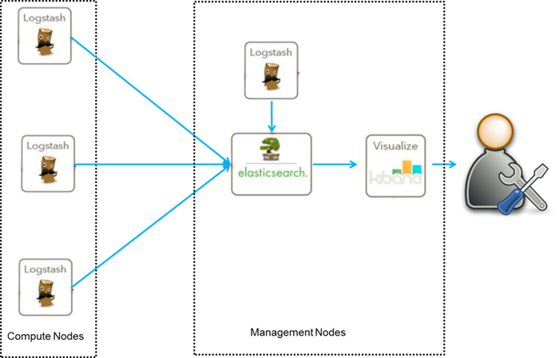
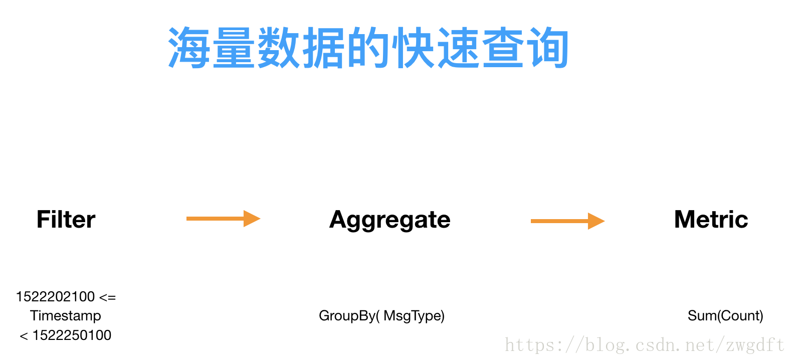

# Elasticsearch最佳实践

* Elasticsearch的核心特征是数据搜索与分析。与这两个特征相关的需求都可以考虑使用Elasticsearch，其本身是单纯的，复杂的是具体业务。在不同的业务中，Elasticsearch扮演着不同的角色，也有着不同的实践和优化方法。归纳起来，目前主要有三类常见的业务场景：
  1. ELK日志系统
  2. 数据聚合分析
  3. 搜索引擎

## 一、ELK日志系统

* 接触Elasticsearch都是从ELK开始的，用来解决Log的集中式管理问题。

* 这样的需求来自于互联网的快速发展，出现越来越多的集群部署与分布式系统，导致服务产生的Log信息分散在不同的机器上，无法有效的检索与统计。

* 以下面的应用服务集群为例，为了做集中式Log管理，需要有一个Agent负责从每台机器收集信息，送到一个存储系统集中存储（该系统需要具备快速的文本搜索功能)，然后通过一个可视化UI来查看和分析信息。

  

  1. Logstash负责收集、解析数据。
  2. Elasticsearch负责存储、检索数据。
  3. Kibana提供可视化功能。

* 相比较Logstash，Beats都也有日志收集功能，Beats更轻量，占用资源更少。但logstash 具有filter功能，能过滤分析日志。一般结构都是Beats采集日志，然后发送到消息队列，redis，kafaka。然后logstash去获取，利用filter功能过滤分析，然后存储到elasticsearch中。

  

## 二、数据聚合分析

* 数据的维度统计查询，是当前数据业务的一个主要需求。其配合相应的可视化UI可以帮助用户直观的获取信息、做出决策等。比如，针对网络流量数据，查看上班时间段，员工访问视频类网站的流量占比。

* 统计查询基本可以归纳为：按照某些条件过滤 --> 针对某个维度分组 --> 统计数据（Sum/Count）

  

* MySQL这类关系型数据基本是无法胜任的，其无法突破单机的存储和处理能力限制，而引入分片又会带来应用层面的复杂度。针对这样的统计查询，一般有两种思路：

  1. 数据的预计算查询
     * 通过数据的ETL、清洗之后，进行维度的预计算，在这个方面。Kylin就是一个很好的示例，但是Kylin固定了维度。
  2. 数据的直接查询
     * 直接对元数据进行过滤、查询。这类似思路就有很多的解决方案了，MR、Presto、Spark SQL等都可以进行处理，当然，ElasticSearch也是其中之一的解决方案。

## 三、搜索引擎

* 在各大互联网产品中，搜索可以帮助用户快速定位，提供体验。使用baidu就是一个很好的例子。
* 基于Elasticsearch，可以快速构建这样的搜索功能。通常是采用DB与Elasticsearch配合的方案，DB负责数据存储，Elasticsearch负责关键词检索。Elasticsearch可以在多维度上检索与关键词相关的数据，并为每个匹配结果生成一个相关度分数。当服务收到搜索请求时，首先根据关键词到Elasticsearch中进行检索，然后根据检索结果去DB中查询信息，并在应用层进行数据整理和排序。