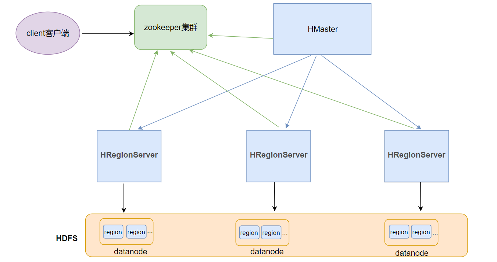
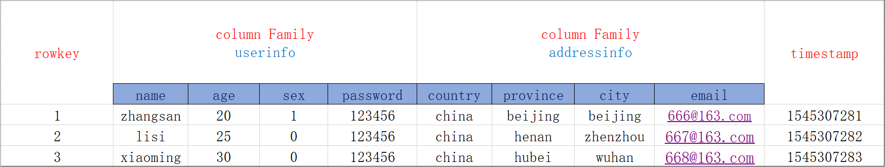

## 一、HBase是什么

## 1. hbase是什么

```
漫画学习hbase----最易懂的Hbase架构原理解析
http://developer.51cto.com/art/201904/595698.htm
```

### 1. hbase的概念

hbase基于Google的BigTable论文，是建立的==hdfs==之上，提供**高可靠性**、**高性能**、**列存储**、**可伸缩**、**实时读写**的分布式数据库系统。在需要==实时读写随机==访问超大规模数据集时，可以使用hbase。

### 2. hbase的特点

- ==**海量存储**==
  - 可以存储大批量的数据
- ==**列式存储**==
  - hbase表的数据是基于列族进行存储的，列族是在列的方向上的划分。
- ==**极易扩展**==
  - 底层依赖HDFS，当磁盘空间不足的时候，只需要动态增加datanode节点服务(机器)就可以了
  - 可以通过增加服务器来提高集群的存储能力
- ==**高并发**==
  - 支持高并发的读写请求
- ==**稀疏**==
  - 稀疏主要是针对Hbase列的灵活性，在列族中，你可以指定任意多的列，在列数据为空的情况下，是不会占用存储空间的。
- ==**数据的多版本**==
  - hbase表中的数据可以有多个版本值，默认情况下是根据版本号去区分，版本号就是插入数据的时间戳
- ==**数据类型单一**==
  - 所有的数据在hbase中是以字节数组进行存储

## 2. Hbase架构



* Client客户端
  * Client包含了访问Hbase的接口
  * 另外Client还维护了对应的cache来加速Hbase的访问，比如cache的.META.元数据的信息
* Zookeeper集群
  * 实现了HMaster的高可用
  * 保存了hbase的元数据信息，是所有hbase表的寻址入口
  * 对HMaster和HRegionServer实现了监控
* HMaster集群管理
  * 为HRegionServer分配Region
  * 维护整个集群的负载均衡
  * 维护集群的元数据信息
  * 发现失效的Region，并将失效的Region分配到正常的HRegionServer上
* HRegionServer
  * 负责管理Region
  * 接受客户端的读写数据请求
  * 切分在运行过程中变大的region
* Region
  * hbase集群中分布式存储的最小单元

## 3. hbase表的数据模型



* rowkey行键
  * table的主键，table中的记录按照rowkey 的字典序进行排序
* Column Family列族
  * hbase表中的每个列，都归属与某个列族。列族是表的schema的一部分(而列不是)，必须在使用表之前定义。
* Timestamp时间戳
  * 每次数据操作对应的时间戳，可以看作是数据的version number版本号
* Column列
  * 列族下面的具体列
  * 属于某一个ColumnFamily,类似于我们mysql当中创建的具体的列
* cell
  * 由{row key, column( =<family> + <label>), version} 唯一确定的单元
  * cell中的数据是没有类型的，全部是以字节数组进行存储

## 4. hbase集群的安装部署

- 1、下载安装包

  - http://archive.apache.org/dist/hbase/1.2.1/hbase-1.2.1-bin.tar.gz
  - hbase-1.2.1-bin.tar.gz

- 2、规划安装目录

  - /opt/bigdata

- 3、上传安装包到服务器

- 4、解压安装包到指定的规划目录

  - tar -zxvf hbase-1.2.1-bin.tar.gz -C /opt/bigdata

- 5、重命名解压目录

  - mv hbase-1.2.1 hbase

- 6、修改配置文件

  - 1、需要把hadoop中的配置core-site.xml 、hdfs-site.xml拷贝到hbase安装目录下的conf文件夹中

  - 2、修改conf目录下配置文件

    - 修改 hbase-env.sh

    ```
    #添加java环境变量
    export JAVA_HOME=/opt/bigdata/jdk
    #指定使用外部的zk集群
    export HBASE_MANAGES_ZK=FALSE
    ```

    - 修改 hbase-site.xml

    ```
    <configuration>
              <!-- 指定hbase在HDFS上存储的路径 -->
            <property>
                    <name>hbase.rootdir</name>
                    <value>hdfs://node1:9000/hbase</value>
            </property>
                    <!-- 指定hbase是分布式的 -->
            <property>
                    <name>hbase.cluster.distributed</name>
                    <value>true</value>
            </property>
                    <!-- 指定zk的地址，多个用“,”分割 -->
            <property>
                    <name>hbase.zookeeper.quorum</name>
                    <value>node1:2181,node2:2181,node3:2181</value>
            </property>
    </configuration>       
    ```

    - 修改regionservers

    ```
    #指定regionserver节点
    node2
    node3
    ```

    - 修改backup-masters

    ```
    node2
    ```

- 7、配置hbase的环境变量

  ```
  export HBASE_HOME=/opt/bigdata/hbase
  export PATH=$PATH:$HBASE_HOME/bin
  ```

- 8、分发hbase目录和环境变量到其他节点

  ```
  scp -r hbase /opt/hbase-1.3.5 node2:/opt
  scp -r hbase /opt/hbase-1.3.5 node3:/opt
  scp /etc/profile node2:/etc
  scp /etc/profile node3:/etc
  ```

- 9、让所有节点的hbase环境变量生效

  - 在所有节点执行
    - source /etc/profile

## 5. hbase集群的启动和停止

```bash
# 先启动hadoop和zk集群
start-hbase.sh
stop-hbase.sh
# 访问ip:16010
```

## 6. Hbase Shell命令

[HBase常用shell操作.md](HBase shell.md)