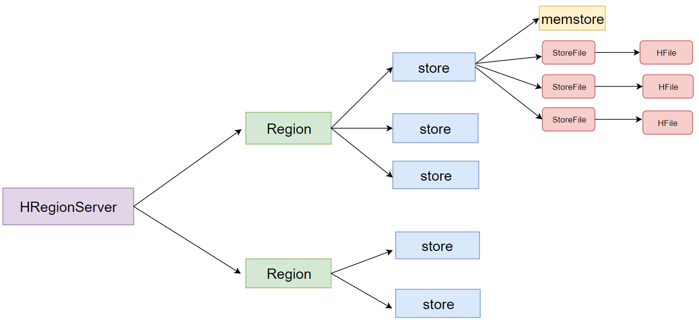
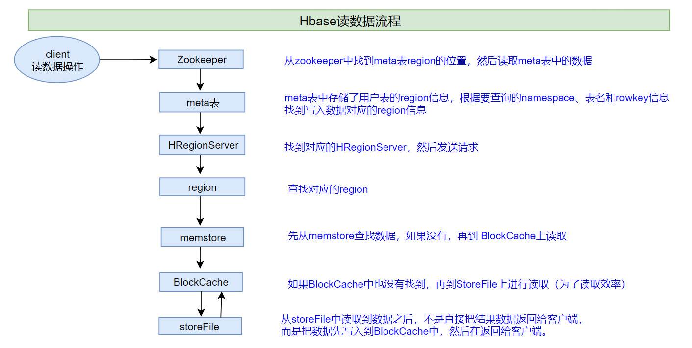

# HBase进阶

## 一、Hbase数据存储原理


 ex:


* 一个HRegionServer会负责管理很多个region

* 一个**==region==**包含很多个==store==

  * 划分规则
    * 一个**==列族==**就划分成一个**==store==**，如果一个表中只有1个列族，那么每一个region中只有一个store

* ==一个store==里面只有==一个memstore==

  - memstore是一块**内存区域**，数据会先写入到memstore进行缓冲，然后再把数据刷到磁盘

* 一个store里面有很多个**==StoreFile==**, 最后数据是以很多个**==HFile==**这种数据结构的文件保存在hdfs上

  - StoreFile是HFile的抽象对象，如果说到StoreFile就等于HFile。
  - ==每次memstore刷写数据到磁盘 就生成对应的一个新的HFile文件出来==

  

## 二、HBase 读数据流程



1. 首先从zk找到meta表的region位置，然后读取meta表中的数据，meta表中存储了用户表的region信息

2. 根据要查询的namespace、表名和rowkey信息。找到写入数据对应的region信息

3. 找到这个region对应的regionServer，然后发送请求

4. 查找对应的region

5. 先从memstore查找数据，如果没有，再从BlockCache上读取
   * HBase上Regionserver的内存分为两个部分
     * 一部分作为Memstore，主要用来写；
     * 另外一部分作为BlockCache，主要用于读数据；

6. 如果BlockCache中也没有找到，再到StoreFile上进行读取
   * 从storeFile中读取到数据之后，不是直接把结果数据返回给客户端，
     而是把数据先写入到BlockCache中，目的是为了加快后续的查询；然后在返回结果给客户端。

## 三、HBase 写数据流程


1. 首先从zk找到meta表的region位置，然后读取meta表中的数据，meta表中存储了用户表的region信息

2. 根据namespace、表名和rowkey信息。找到写入数据对应的region信息

3. 找到这个region对应的regionServer，然后发送请求

4. 把数据分别写到HLog（write ahead log预写日志）和memstore各一份
5. memstore达到阈值后把数据刷到磁盘，生成storeFile文件
6. 删除HLog中的历史数据

* HLog（write ahead log）：
  	也称为WAL意为Write ahead log，类似mysql中的binlog,用来做灾难恢复时用，HLog记录数据的所有变更,一旦数据修改，就可以从log中进行恢复。

## 四、hbase的flush、compact机制

### 1. Flush机制

- （1）当memstore的大小超过这个值的时候，会flush到磁盘,默认为128M

  ```xml
  <property>
  	<name>hbase.hregion.memstore.flush.size</name>
  	<value>134217728</value>
  </property>
  ```

- （2）当memstore中的数据时间超过1小时，会flush到磁盘

  ```xml
  <property>
  	<name>hbase.regionserver.optionalcacheflushinterval</name>
  	<value>3600000</value>
  </property>
  ```

- （3）HregionServer的全局memstore的大小，超过该大小会触发flush到磁盘的操作,默认是堆大小的40%

  ```xml
  <property>
  	<name>hbase.regionserver.global.memstore.size</name>
  	<value>0.4</value>
  </property>
  ```

- （4）手动flush

  ```ruby
  flush tableName
  ```

### 2. Compact合并机制

* hbase为了==防止小文件过多==，以保证查询效率，hbase需要在必要的时候将这些小的store file合并成相对较大的store file，这个过程就称之为compaction

* 在hbase中主要存在两种类型的compaction合并

  1. **==minor compaction 小合并==**

     * 在将Store中多个HFile合并为一个HFile

     ```
     这个过程中，达到TTL（记录保留时间）会被移除，删除和更新的数据仅仅只是做了标记，并没有物理移除，这种合并的触发频率很高。
     ```

     * minor compaction触发条件由一下几个参数共同决定：

     ```xml
     <!--表示至少需要三个满足条件的store file时，minor compaction才会启动-->
     <property>
     	<name>hbase.hstore.compaction.min</name>
     	<value>3</value>
     </property>
     
     <!--表示一次minor compaction中最多选取10个store file-->
     <property>
     	<name>hbase.hstore.compaction.max</name>
     	<value>10</value>
     </property>
     
     <!--默认值为128m,
     表示文件大小小于该值的store file 一定会加入到minor compaction的store file中
     -->
     <property>
     	<name>hbase.hstore.compaction.min.size</name>
     	<value>134217728</value>
     </property>
     
     
     <!--默认值为LONG.MAX_VALUE，
     表示文件大小大于该值的store file 一定会被minor compaction排除-->
     <property>
     	<name>hbase.hstore.compaction.max.size</name>
     	<value>9223372036854775807</value>
     </property>
     ```

  2. **==major compaction 大合并==**

     - 合并Store中所有的HFile为一个HFile

     ```
     这个过程有删除标记的数据会被真正移除，同时超过单元格maxVersion的版本记录也会被删除。合并频率比较低，默认7天执行一次，并且性能消耗非常大，建议生产关闭(设置为0)，在应用空闲时间手动触发。一般可以是手动控制进行合并，防止出现在业务高峰期。
     ```

     - major compaction触发时间条件

     ```
     <!--默认值为7天进行一次大合并，-->
     <property>
     	<name>hbase.hregion.majorcompaction</name>
     	<value>604800000</value>
     </property>
     ```

     * 手动触发

     ```bash
     ##使用major_compact命令
     major_compact tableName
     ```

## 五、region 拆分机制

region中存储的是大量的rowkey数据 ,当region中的数据条数过多的时候,直接影响查询效率.当region过大的时候.hbase会拆分region , 这也是Hbase的一个优点 .

HBase的region split策略一共有以下几种：

- 1、**ConstantSizeRegionSplitPolicy**

  - 0.94版本前默认切分策略

  ```
  当region大小大于某个阈值(hbase.hregion.max.filesize=10G)之后就会触发切分，一个region等分为2个region。
  
  但是在生产线上这种切分策略却有相当大的弊端：切分策略对于大表和小表没有明显的区分。阈值(hbase.hregion.max.filesize)设置较大对大表比较友好，但是小表就有可能不会触发分裂，极端情况下可能就1个，这对业务来说并不是什么好事。如果设置较小则对小表友好，但一个大表就会在整个集群产生大量的region，这对于集群的管理、资源使用、failover来说都不是一件好事。
  ```

- 2、**IncreasingToUpperBoundRegionSplitPolicy**

  - 0.94版本~2.0版本默认切分策略

  ```
  切分策略稍微有点复杂，总体看和ConstantSizeRegionSplitPolicy思路相同，一个region大小大于设置阈值就会触发切分。但是这个阈值并不像ConstantSizeRegionSplitPolicy是一个固定的值，而是会在一定条件下不断调整，调整规则和region所属表在当前regionserver上的region个数有关系.
  
  region split的计算公式是：
  regioncount^3 * 128M * 2，当region达到该size的时候进行split
  例如：
  第一次split：1^3 * 256 = 256MB 
  第二次split：2^3 * 256 = 2048MB 
  第三次split：3^3 * 256 = 6912MB 
  第四次split：4^3 * 256 = 16384MB > 10GB，因此取较小的值10GB 
  后面每次split的size都是10GB了
  ```

- 3、**SteppingSplitPolicy**

  - 2.0版本默认切分策略

  ```
  这种切分策略的切分阈值又发生了变化，相比 IncreasingToUpperBoundRegionSplitPolicy 简单了一些，依然和待分裂region所属表在当前regionserver上的region个数有关系，如果region个数等于1，
  切分阈值为flush size * 2，否则为MaxRegionFileSize。这种切分策略对于大集群中的大表、小表会比 IncreasingToUpperBoundRegionSplitPolicy 更加友好，小表不会再产生大量的小region，而是适可而止。
  
  ```

- 4、**KeyPrefixRegionSplitPolicy**

  ```
  根据rowKey的前缀对数据进行分组，这里是指定rowKey的前多少位作为前缀，比如rowKey都是16位的，指定前5位是前缀，那么前5位相同的rowKey在进行region split的时候会分到相同的region中。
  ```

- 5、**DelimitedKeyPrefixRegionSplitPolicy**

  ```
  保证相同前缀的数据在同一个region中，例如rowKey的格式为：userid_eventtype_eventid，指定的delimiter为 _ ，则split的的时候会确保userid相同的数据在同一个region中。
  ```

- 6、**DisabledRegionSplitPolicy**
  
  - 不启用自动拆分, 需要指定手动拆分

## 六、hbase表的预分区

```
当一个table刚被创建的时候，Hbase默认的分配一个region给table。也就是说这个时候，所有的读写请求都会访问到同一个regionServer的同一个region中，这个时候就达不到负载均衡的效果了，集群中的其他regionServer就可能会处于比较空闲的状态。解决这个问题可以用pre-splitting,在创建table的时候就配置好，生成多个region。
```

### 1. 为何要预分区？

- 增加数据读写效率
- 负载均衡，防止数据倾斜
- 方便集群容灾调度region
- 优化Map数量

### 2.  如何预分区？

```
每一个region维护着startRow与endRowKey，如果加入的数据符合某个region维护的rowKey范围，则该数据交给这个region维护。
```

#### 2.1手动指定预分区

* 创建表的时候指定

```ruby
create 'person','info1','info2',SPLITS => ['1000','2000','3000','4000']
```

* 分区规则写于文件

```ruby
create 'student','info',SPLITS_FILE => '/opt/bigdata/split.txt'

## 文件内容
# 1000
# 2000
# 3000
```

#### 2.2 HexStringSplit 算法

```ruby
#HexStringSplit会将数据从“00000000”到“FFFFFFFF”之间的数据长度按照n等分之后算出每一段的其实rowkey和结束rowkey，以此作为拆分点。

create 'mytable','base_info','extra_info',{NUMREGIONS => 15, SPLITALGO => 'HexStringSplit'}
```

## 七、region 合并

### 1. 合并说明

​	Region的合并不是为了性能,  而是出于维护的目的比如删除了大量的数据 ,这个时候每个Region都变得很小 ,存储多个Region就浪费了 ,这个时候可以把Region合并起来,然后可以减少一些Region服务器节点

### 2. 如何合并

#### 2.1 通过Merge类冷合并Region

```ruby
# 创建一张hbase表：create 'test','info1',SPLITS => ['1000','2000','3000']

# 1.关闭集群

# 需求：需要把test表中的2个region数据进行合并：
# test,,1565940912661.62d28d7d20f18debd2e7dac093bc09d8.
# test,1000,1565940912661.5b6f9e8dad3880bcc825826d12e81436.

# 这里通过org.apache.hadoop.hbase.util.Merge类来实现，不需要进入hbase shell，直接执行（需要先关闭hbase集群）：
hbase org.apache.hadoop.hbase.util.Merge test test,,1565940912661.62d28d7d20f18debd2e7dac093bc09d8. test,1000,1565940912661.5b6f9e8dad3880bcc825826d12e81436.
```

#### 2.2 通过online_merge热合并Region

```ruby
# 与冷合并不同的是，online_merge的传参是Region的hash值，而Region的hash值就是Region名称的最后那段在两个.之间的字符串部分。

#需求：需要把test表中的2个region数据进行合并：
#test,2000,1565940912661.c2212a3956b814a6f0d57a90983a8515.
#test,3000,1565940912661.553dd4db667814cf2f050561167ca030.

# 需要进入hbase shell：
merge_region 'c2212a3956b814a6f0d57a90983a8515','553dd4db667814cf2f050561167ca030'

```

## 八、rowkey设计原则

### 1. 长度原则

* rowkey是一个二进制码流，可以是任意字符串，最大长度64kb，实际应用中一般为10-100bytes，以byte[]形式保存，一般设计成定长。
* 建议越短越好，不要超过16个字节：设计过长会降低memstore内存的利用率和HFile存储数据的效率。

### 2.rowkey散列原则

*	建议将rowkey的高位作为散列字段，这样将提高数据均衡分布在每个RegionServer，以实现负载均衡的几率。如果没有散列字段，首字段直接是时间信息。
*	所有的数据都会集中在一个RegionServer上，这样在数据检索的时候负载会集中在个别的RegionServer上，造成热点问题，会降低查询效率。

### 3.rowkey唯一原则

* 必须在设计上保证其唯一性，rowkey是按照字典顺序排序存储的，
* 因此，设计rowkey的时候，要充分利用这个排序的特点，可以将经常读取的数据存储到一块，将最近可能会被访问的数据放到一块。

## 九、表的热点

* 检索habse的记录首先要通过row key来定位数据行。当大量的client访问hbase集群的一个或少数几个节点，造成少数region server的读/写请求过多、负载过大，而其他region server负载却很小，就造成了“热点”现象。
* 解决方案：虽然解决有热点问题，但是一定程度上也影响了有序性。两者会有冲突。

### 1. 预分区

​		预分区的目的让表的数据可以均衡的分散在集群中，而不是默认只有一个region分布在集群的一个节点上。

### 2. 加盐

​		这里所说的加盐不是密码学中的加盐，而是在rowkey的前面增加随机数，具体就是给rowkey分配一个随机前缀以使得它和之前的rowkey的开头不同。

### 3. 哈希

​		哈希会使同一行永远用一个前缀加盐。哈希也可以使负载分散到整个集群，但是读却是可以预测的。使用确定的哈希可以让客户端重构完整的rowkey，可以使用get操作准确获取某一个行数据。

### 4. 反转

​		反转固定长度或者数字格式的rowkey。这样可以使得rowkey中经常改变的部分（最没有意义的部分）放在前面。这样可以有效的随机rowkey，但是牺牲了rowkey的有序性。


