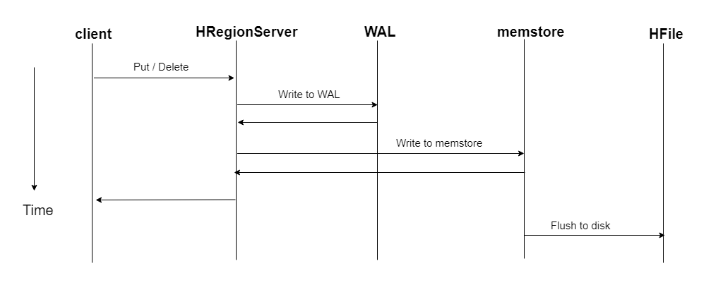
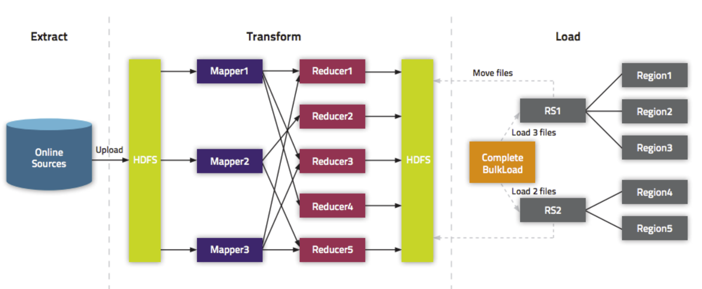
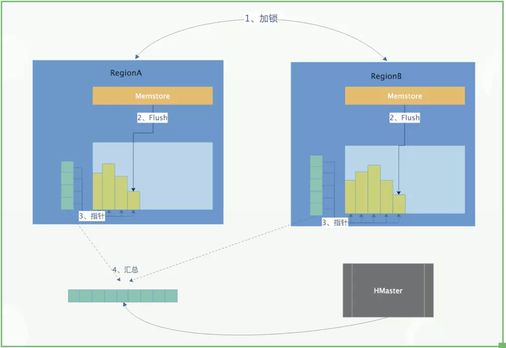
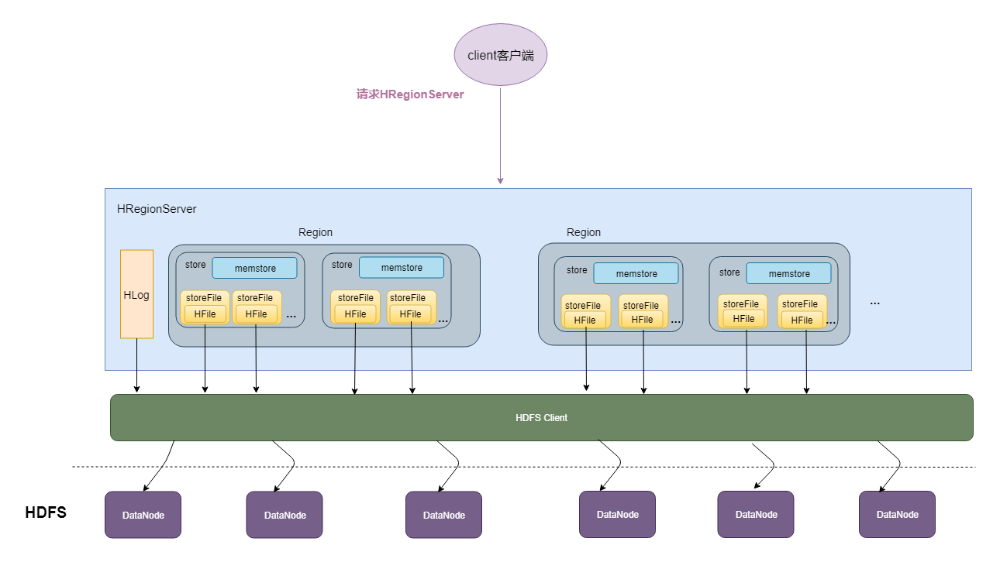
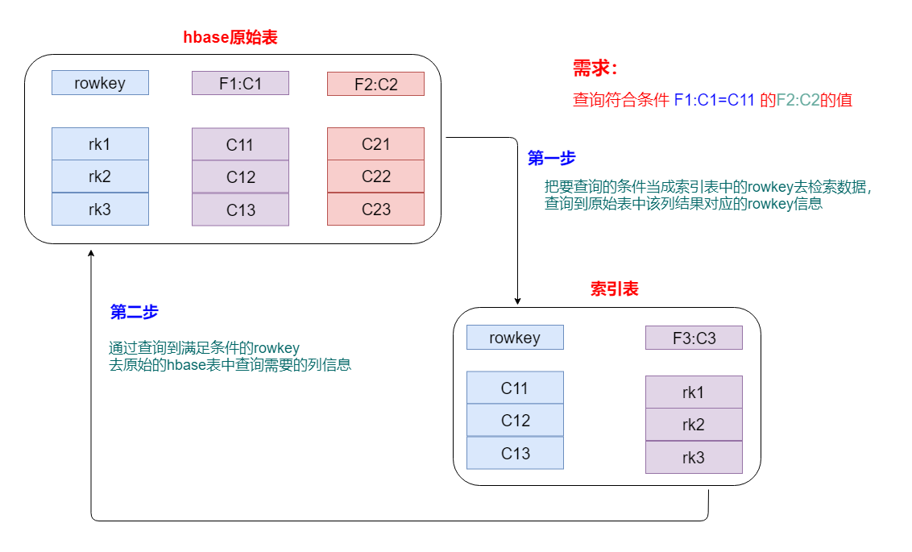

# HBase 集成

## 一、Shell 操作命令

[HBase常用shell操作.md](HBase shell.md)

## 二、HBase API集成基本操作

[API集成操作代码](https://github.com/JackKuang/bigdata/blob/master/hbase/src/main/java/com/hurenjieee/bigdata/operate/HBaseOperate.java)

## 三、hbase集成MapReduce

HBase表中的数据最终都是存储在HDFS上，HBase天生的支持MR的操作，我们可以通过MR直接处理HBase表中的数据，并且MR可以将处理后的结果直接存储到HBase表中。

- 参考地址：<http://hbase.apache.org/book.html#mapreduce>

### 3.1、hbase表==>另外一张hbase表

[代码](https://github.com/JackKuang/bigdata/blob/master/hbase/src/main/java/com/hurenjieee/bigdata/load/HBaseMR.java)

```
hadoop jar hbase-1.0-SNAPSHOT.jar com.hurenjieee.bigdata.load.HBaseMR t1 t2
```

### 3.2、HDFS文件==>hbase表

* user.txt内容

```
0001 xiaoming 20
0002 xiaowang 30
0003 xiaowu 40
```

[代码](https://github.com/JackKuang/bigdata/blob/master/hbase/src/main/java/com/hurenjieee/bigdata/load/Hdfs2Hbase.java)

```
hadoop jar hbase-1.0-SNAPSHOT.jar com.hurenjieee.bigdata.load.Hdfs2Hbase /data/user.txt t3
```

### 3.3、HDFS文件==>hbase表（bulkload）

* 把hdfs上面的这个路径/input/user.txt的数据文件，转换成HFile格式，然后load到user这张表里面中

  ```
  加载数据到HBase当中去的方式多种多样，我们可以使用HBase的javaAPI或者使用sqoop将我们的数据写入或者导入到HBase当中去，但是这些方式不是慢就是在导入的过程的占用Region资源导致效率低下，我们也可以通过MR的程序，将我们的数据直接转换成HBase的最终存储格式HFile，然后直接load数据到HBase当中去即可
  ```

* HBase数据正常写流程回顾

  

* bulkload处理加载

  

* 优点

  1. 导入过程不占用Region资源
  2. 能快速导入海量的数据
  3. 节省内存

* HDFS生成HFile

  [代码](https://github.com/JackKuang/bigdata/blob/master/hbase/src/main/java/com/hurenjieee/bigdata/load/HBaseLoad.java)

  ```
  hadoop jar hbase-1.0-SNAPSHOT.jar com.hurenjieee.bigdata.load.HBaseLoad
  ```

* 加载HFile文件到hbase表中

  [代码](https://github.com/JackKuang/bigdata/blob/master/hbase/src/main/java/com/hurenjieee/bigdata/load/LoadData.java)

  ```
  hadoop jar hbase-1.0-SNAPSHOT.jar com.hurenjieee.bigdata.load.LoadData
  ```

## 四、HBase集成Hive

Hive提供了与HBase的集成，使得能够在HBase表上使用hive sql 语句进行查询 插入操作以及进行Join和Union等复杂查询、同时也可以将hive表中的数据映射到Hbase中。

* 配置。hive-site.xml文件

  ```xml
   <property>      
   	<name>hbase.zookeeper.quorum</name>
   	<value>node1:2181,node2:2181,node3:2181</value>
   </property>
  ```

* 修改Hive-env.sh环境配置

  ```
  export HIVE_CLASSPATH=$HIVE_CLASSPATH:/opt/hbase-1.3.5/lib/*
  ```

* 使用编译好的 hive-hbase-handler-1.X.X.jar替换hive之前的lib目录下的该jar包

  

* 创建hive表关联Hbase

  ```sql
  -- hbase操作:
  create 'hbase_test','f1','f2','f3'
  put 'hbase_test','r1','f1:name','zhangsan'
  put 'hbase_test','r1','f2:age','20'
  put 'hbase_test','r1','f3:sex','male'
  put 'hbase_test','r2','f1:name','lisi'
  put 'hbase_test','r2','f2:age','30'
  put 'hbase_test','r2','f3:sex','female'
  put 'hbase_test','r3','f1:name','wangwu'
  put 'hbase_test','r3','f2:age','40'
  put 'hbase_test','r3','f3:sex','male'
  
  -- hive操作
  create external table hiveFromHbase(
  rowkey string,
  f1 map<STRING,STRING>,
  f2 map<STRING,STRING>,
  f3 map<STRING,STRING>
  ) STORED BY 'org.apache.hadoop.hive.hbase.HBaseStorageHandler'
  WITH SERDEPROPERTIES ("hbase.columns.mapping" = ":key,f1:,f2:,f3:")
  TBLPROPERTIES ("hbase.table.name" = "hbase_test");
  
  -- 这里使用外部表映射到HBase中的表，这样，在Hive中删除表，并不会删除HBase中的表，否则，就会删除。另外，除了rowkey，其他三个字段使用Map结构来保存HBase中的每一个列族。
  
  --hbase.columns.mapping
  Hive表和HBase表的字段映射关系，分别为：Hive表中第一个字段映射:key(rowkey)，第二个字段映射列族f1，第三个字段映射列族f2,第四个字段映射列族f3
  
  --hbase.table.name
  HBase中表的名字
  
  -- hive查询
  select * from hivefromhbase;
  ```

* 将hive表映射到hbase表中

  ```sql
  -- 创建一张表
  create  table hive_test(
  id string,
  name string,
  age int,
  address string
  )STORED BY 'org.apache.hadoop.hive.hbase.HBaseStorageHandler'
  WITH SERDEPROPERTIES ("hbase.columns.mapping" = ":key,f1:name,f2:age,f3:address")
  TBLPROPERTIES ("hbase.table.name" = "hbaseFromhive");
  -- DDLTask. org.apache.hadoop.hbase.HTableDescriptor.addFamily(Lorg/apache/hadoop/hbase/HColumnDescript
  -- 需要执行第三个步骤
  
  -- 这里由于hive表是刚刚构建，目前是没有数据，同样这张hbase表也没有数据
  insert into table hive_test select * from hive_source;
  -- 同步就算完成
  
  ```


## 五、数据备份

### 1. 基于hbase提供的类对hbase中某张表进行备份

* 使用hbase提供的类把hbase中某张表的数据导出hdfs，之后再导出到测试hbase表中。

  ```bash
  # 导出------------------------------------
  # HBase数据导出到HDFS
  hbase org.apache.hadoop.hbase.mapreduce.Export test /hbase_data/test_bak
  
  # HBase数据导出到本地文件
  hbase org.apache.hadoop.hbase.mapreduce.Export test file:///home/hadoop/test_bak
  
  # 导入------------------------------------
  # 将hdfs上的数据导入到备份目标表中
  hbase org.apache.hadoop.hbase.mapreduce.Driver import test_bak /hbase_data/test_bak/*
  
  # 将本地文件上的数据导入到备份目标表中
  hbase org.apache.hadoop.hbase.mapreduce.Driver import test_bak file:///home/hadoop/test_bak/*
  
  
  # 以上都是对数据进行了全量备份，后期也可以实现表的增量数据备份，增量备份跟全量备份操作差不多，只不过要在后面加上时间戳。
  
  # HBase数据导出到HDFS
  hbase org.apache.hadoop.hbase.mapreduce.Export test /hbase_data/test_bak_increment 开始时间戳  结束时间戳
  ```

### 2. 基于snapshot快照对hbase中某张表进行备份

* 通过snapshot快照的方式实现HBase数据的迁移和拷贝。这种方式比较常用，效率高，也是最为推荐的数据迁移方式。

* HBase的snapshot其实就是一组==metadata==信息的集合（文件列表），通过这些metadata信息的集合，就能将表的数据回滚到snapshot那个时刻的数据。

  ```
  首先我们要了解一下所谓的HBase的LSM类型的系统结构，我们知道在HBase中，数据是先写入到Memstore中，当Memstore中的数据达到一定条件，就会flush到HDFS中，形成HFile，后面就不允许原地修改或者删除了。
  
  如果要更新或者删除的话，只能追加写入新文件。既然数据写入以后就不会在发生原地修改或者删除，这就是snapshot做文章的地方。做snapshot的时候，只需要给快照表对应的所有文件创建好指针（元数据集合），恢复的时候只需要根据这些指针找到对应的文件进行恢复就Ok。这是原理的最简单的描述，下图是描述快照时候的简单流程：
  ```

  

* 操作：

  ```bash
  # 创建snapshot
  snapshot 'tableName', 'snapshotName'
  
  # 查看
  list_snapshots
  # 查找以test开头的snapshot
  list_snapshots ‘test.*’
  
  # 恢复snapshot
  # 这里需要对表进行disable操作，先把表置为不可用状态，然后在进行进行restore_snapshot的操作
  disable 'tableName'
  restore_snapshot 'snapshotName'
  enable 'tableName'
  
  # 删除snapshot
  delete_snapshot 'snapshotName'
  
  # 迁移 snapshot
  hbase org.apache.hadoop.hbase.snapshot.ExportSnapshot \
  -snapshot snapshotName  \
  -copy-from hdfs://src-hbase-root-dir/hbase \
  -copy-to hdfs://dst-hbase-root-dir/hbase \
  -mappers 1 \
  -bandwidth 1024
    
    
  # 例如：
  hbase org.apache.hadoop.hbase.snapshot.ExportSnapshot \
  -snapshot test  \
  -copy-from hdfs://node1:9000/hbase \
  -copy-to hdfs://node1:9000/hbase1 \
  -mappers 1 \
  -bandwidth 1024
    
  # 这种方式用于将快照表迁移到另外一个集群的时候使用，使用MR进行数据的拷贝，速度很快，使用的时候记得设置好bandwidth参数，以免由于网络打满导致的线上业务故障。
  
  # 将snapshot使用bulkload的方式导入
  hbase org.apache.hadoop.hbase.mapreduce.LoadIncrementalHFiles \
    hdfs://dst-hbase-root-dir/hbase/archive/datapath/tablename/filename \
    tablename
  ```

## 六、Hbase二级索引

* hbase表后期按照rowkey查询性能是最高的。rowkey就相当于hbase表的一级索引，
  但是在实际的工作中，我们做的查询基本上都是按照一定的条件进行查找，无法事先知道满足这些条件的rowkey是什么，正常是可以通过hbase过滤器去实现。但是效率非常低，这是由于查询的过程中需要在底层进行大量的文件扫描。



* hbase的二级索引

  为了HBase的数据查询更高效、适应更多的场景，诸如使用非rowkey字段检索也能做到秒级响应，或者支持各个字段进行模糊查询和多字段组合查询等， 因此需要在HBase上面构建二级索引， 以满足现实中更复杂多样的业务需求。
  hbase的二级索引其本质就是建立hbase表中列与行键之间的映射关系。

  

- 构建hbase二级索引方案
  - MapReduce方案 
  - Hbase Coprocessor(协处理器)方案 
  - Solr+hbase方案
  - ES+hbase方案
  - Phoenix+hbase方案