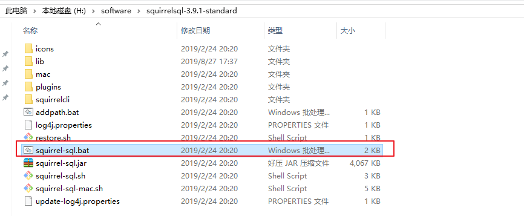
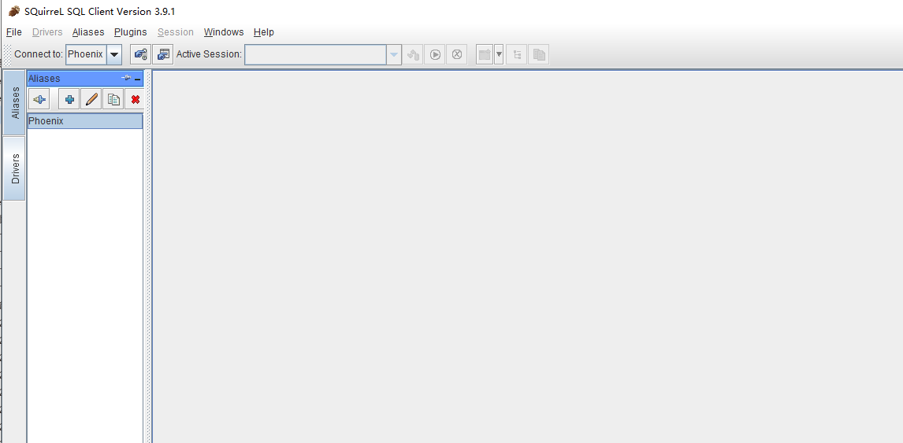
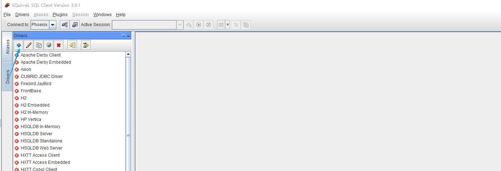
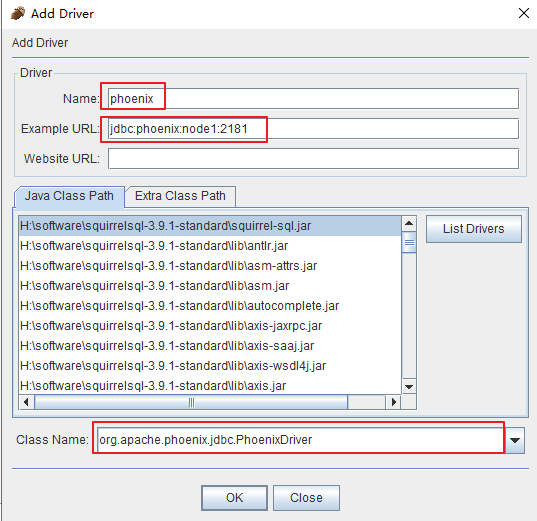
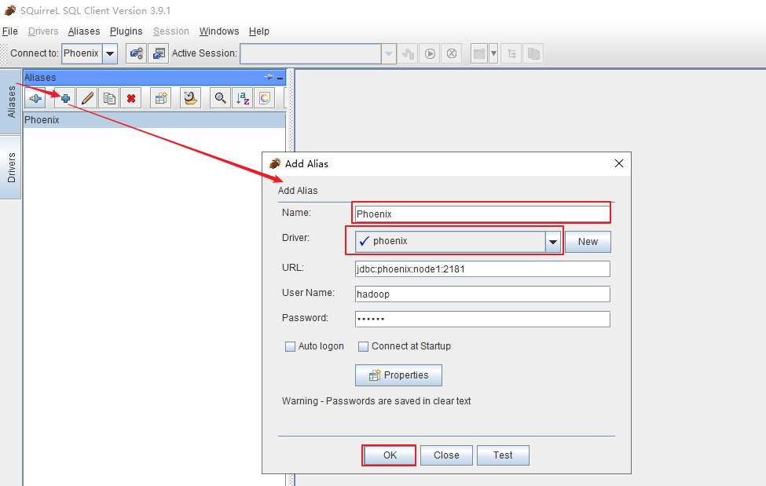
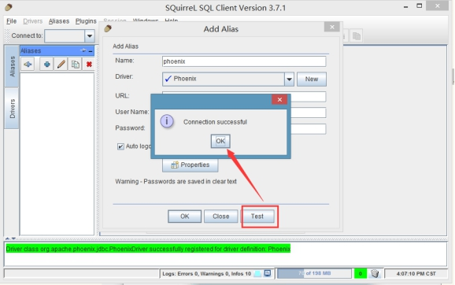
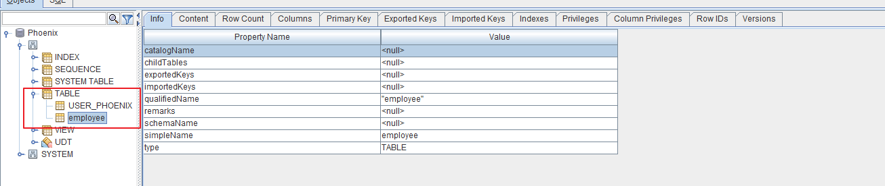
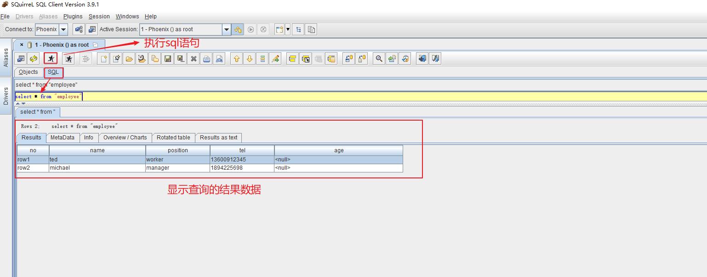

# phoenix安装部署

## 准备

需要先安装好hbase集群，phoenix只是一个工具，只需要在一台机器上安装就可以了

### 1、下载安装包

* 从对应的地址下载：http://archive.apache.org/dist/phoenix/
* 这里我们使用的是
  * phoenix-4.8.2-HBase-1.2-bin.tar.gz

### 2、上传解压

* tar  -zxvf phoenix-4.8.2-HBase-1.2-bin.tar.gz  -C /opt/bigdata


### 3、重命名解压目录

* mv phoenix-4.8.2-HBase-1.2-bin phoenix


### 4、修改配置

* 1、将phoenix目录下的==phoenix-4.8.2-HBase-1.2-server.jar==、

  ==phoenix-core-4.8.2-HBase-1.2.jar==拷贝到==各个 hbase的lib目录==下。

* 2、 将hbase的配置文件==hbase-site.xml==、 hadoop下的配置文件==core-site.xml== 、==hdfs-site.xml==放到phoenix/bin/下，替换phoenix原来的配置文件。

* 3、重启hbase集群，使Phoenix的jar包生效。


### 5、验证是否成功

* 1、在phoenix/bin下输入命令, 进入到命令行，接下来就可以操作了

  ~~~
  ./sqlline.py node1:2181
  ~~~

### 6、Phoenix使用

#### 6.1 批处理方式

* 1、创建user_phoenix.sql文件
  * 内容如下

~~~
create table if not exists user_phoenix (state varchar(10) NOT NULL,  city varchar(20) NOT NULL,  population BIGINT  CONSTRAINT my_pk PRIMARY KEY (state, city));
~~~

* 2、创建user_phoenix.csv数据文件

~~~
NY,New York,8143197
CA,Los Angeles,3844829
IL,Chicago,2842518
TX,Houston,2016582
PA,Philadelphia,1463281
AZ,Phoenix,1461575
TX,San Antonio,1256509
CA,San Diego,1255540
TX,Dallas,1213825
CA,San Jose,912332
~~~

* 3、创建user_phoenix_query.sql文件

~~~
select state as "userState",count(city) as "City Count",sum(population) as "Population Sum" FROM user_phoenix GROUP BY state; 
~~~


* 4、执行sql语句

~~~
/opt/bigdata/phoenix/bin/psql.py node1:2181 user_phoenix.sql user_phoenix.csv  user_phoenix_query.sql
~~~


#### 6.2 命令行方式

* 执行命令

~~~
/opt/bigdata/phoenix/bin/sqlline.py node1:2181
~~~

* 退出命令行方式
  * phoenix的命令都需要一个感叹号

~~~
!quit
~~~

* 1、建立employee的映射表

  ~~~
  create 'employee','company','family'
  ~~~

* 2、数据准备

  ~~~
  put 'employee','row1','company:name','ted'
  put 'employee','row1','company:position','worker'
  put 'employee','row1','family:tel','13600912345'
  put 'employee','row2','company:name','michael'
  put 'employee','row2','company:position','manager'
  put 'employee','row2','family:tel','1894225698'
  ~~~

* 3、建立hbase到phoenix的映射表

  ~~~
  CREATE TABLE IF NOT EXISTS "employee" ("no" VARCHAR(10) NOT NULL PRIMARY KEY, "company"."name" VARCHAR(30),"company"."position" VARCHAR(20), "family"."tel" VARCHAR(20), "family"."age" INTEGER);
  ~~~

  * 说明

  ~~~
  	在建立映射表之前要说明的是，Phoenix是大小写敏感的，并且所有命令都是大写，如果你建的表名没有用双引号括起来，那么无论你输入的是大写还是小写，建立出来的表名都是大写的，如果你需要建立出同时包含大写和小写的表名和字段名，请把表名或者字段名用双引号括起来。 
  ~~~

* 4、查询映射表数据

~~~
0: jdbc:phoenix:node1:2181> select * from "employee";
+-------+----------+-----------+--------------+-------+
|  no   |   name   | position  |     tel      |  age  |
+-------+----------+-----------+--------------+-------+
| row1  | ted      | worker    | 13600912345  | null  |
| row2  | michael  | manager   | 1894225698   | null  |
+-------+----------+-----------+--------------+-------+
~~~

#### 6.3 GUI方式

* 从网址<http://www.squirrelsql.org/>下载相应版本的squirrel的安装jar包，比如下载squirrelsql-3.9.1-standard.zip  window版本。


* 1、解压squirrelsql安装包

* 2、squirrel配置连接Phoenix

  - 配置squirrel

    ```
    解压的phoenix的主目录下将如下几个jar包拷贝到squirrel安装目录的lib下
    
    phoenix-4.8.2-HBase-1.2-client.jar
    phoenix-core-4.8.2-HBase-1.2.jar
    ```

* 3、点击安装目录下的 squirrel-sql.sh脚本

  * 
    * 看到如下界面

  


* 4、点击左侧的Driver，添加新的Driver

  



~~~
配置说明：
　在出现的窗口中填写如下项
　Name：就是个名字任意取就可以，这里使用phoenix
　Example URL ：jdbc:phoenix:node1:2181(这里是你的phonenix的jdbc地址，注意端口也可以不写，多个用逗号隔开)
　Class Name：org.apache.phoenix.jdbc.PhoenixDriver
~~~

* 5、连接Phoenix

  * 点击左侧Aiiasses，点击右边的添加图标

  

  * 配置说明

~~~

　这里还是名字随意写（这里使用phoenix），driver要选择刚才配置的可用的driver，我们刚才配置的是phoenix
　　url这里就是连接phonex的url选择了phoenix的driver以后自动出现也可以改，user name就是phoenix连接的主机的用户名，密码就是该机器的密码，点击自动登录
~~~

* 然后点击test，显示连接成功即可（在这里最好不要直接点OK,先点Test，连接成功了再OK）

  

* 6、查看phoenix中的表



* 7、查询表中的数据

  


#### 6.4 JDBC调用方式

* 构建maven工程添加依赖

~~~xml
  <dependencies>
    <dependency>
      <groupId>junit</groupId>
      <artifactId>junit</artifactId>
      <version>4.12</version>
    </dependency>
	<dependency>
	    <groupId>org.apache.phoenix</groupId>
	    <artifactId>phoenix-core</artifactId>
	    <version>4.8.1-HBase-1.2</version>
	</dependency>
   </dependencies>
~~~

* 代码开发

~~~java
package com.kaikeba.phoenix;

import org.junit.Before;
import org.junit.Test;

import java.sql.*;

public class TestPhoenix {

    private Connection connection;
    private Statement statement;
    private ResultSet rs;

    @Before
    public void init() throws SQLException {
         //定义phoenix的连接url地址
        String url="jdbc:phoenix:node1:2181";
        connection = DriverManager.getConnection(url);
        //构建Statement对象
        statement = connection.createStatement();

    }


    @Test
    public void queryTable() throws SQLException {
        //定义查询的sql语句，注意大小写
        String sql="select * from \"employee\"";

        //执行sql语句
        try {
            rs=statement.executeQuery(sql);
            while(rs.next()){
                System.out.println("no:"+rs.getString("no"));
                System.out.println("name:"+rs.getString("name"));
                System.out.println("position:"+rs.getString("position"));
                System.out.println("age:"+rs.getInt("age"));
                System.out.println("-------------------------");
            }
        } catch (SQLException e) {
            e.printStackTrace();
        }finally {
            if(connection!=null){
                connection.close();
            }
        }

    }
}


~~~


~~~
create table user (
"session_id" varchar(50) not null primary key, 
"f"."cookie_id" varchar(50), 
"f"."visit_time" varchar(50), 
"f"."user_id" varchar(50), 
"f"."age" Integer, 
"f"."sex" varchar(10), 
"f"."visit_url" varchar(50), 
"f"."visit_os" varchar(50), 
"f"."browser_name" varchar(50),
"f"."visit_ip" varchar(50), 
"f"."province" varchar(50),
"f"."city" varchar(50),
"f"."page_id" varchar(50), 
"f"."goods_id" varchar(50),
"f"."shop_id" varchar(50))column_encoded_bytes=0;

create table user1(
sessison_id string,
cookie_id string,
visit_time string,
user_id string,
age string,
sex string,
visit_url string,
visit_os string,
browser_name string,
visit_ip string,
province string,
city string,
page_id string,
goods_id string,
shop_id string
)row format delimited fields terminated by ',';


create  table hive_user(
sessison_id string,
cookie_id string,
visit_time string,
user_id string,
age string,
sex string,
visit_url string,
visit_os string,
browser_name string,
visit_ip string,
province string,
city string,
page_id string,
goods_id string,
shop_id string
)STORED BY 'org.apache.hadoop.hive.hbase.HBaseStorageHandler'
WITH SERDEPROPERTIES ("hbase.columns.mapping" = ":key,f:cookie_id,f:visit_time,f:user_id,f:age,f:sex,f:visit_url,f:visit_os,f:browser_name,f:visit_ip,f:province,f:city,f:page_id,f:goods_id,f:shop_id")
TBLPROPERTIES ("hbase.table.name" = "hbase_user");


create table "user" (
"session_id" varchar(50) not null primary key, 
"f"."cookie_id" varchar(50), 
"f"."visit_time" varchar(50), 
"f"."user_id" varchar(50), 
"f"."age" Integer, 
"f"."sex" varchar(10), 
"f"."visit_url" varchar(50), 
"f"."visit_os" varchar(50), 
"f"."browser_name" varchar(50),
"f"."visit_ip" varchar(50), 
"f"."province" varchar(50),
"f"."city" varchar(50),
"f"."page_id" varchar(50), 
"f"."goods_id" varchar(50),
"f"."shop_id" varchar(50));
~~~

