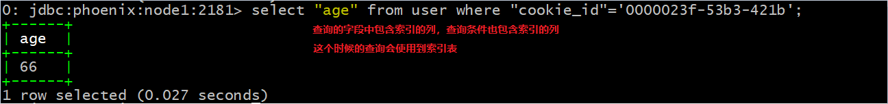

## phoenix构建二级索引

### 1、为什么需要用二级索引？

~~~
	对于HBase而言，如果想精确地定位到某行记录，唯一的办法是通过rowkey来查询。如果不通过rowkey来查找数据，就必须逐行地比较每一列的值，即全表扫瞄。
	对于较大的表，全表扫描的代价是不可接受的。但是，很多情况下，需要从多个角度查询数据。例如，在定位某个人的时候，可以通过姓名、身份证号、学籍号等不同的角度来查询，要想把这么多角度的数据都放到rowkey中几乎不可能（业务的灵活性不允许，对rowkey长度的要求也不允许）。所以需要secondary index（二级索引）来完成这件事。secondary index的原理很简单，但是如果自己维护的话则会麻烦一些。现在，Phoenix已经提供了对HBase secondary index的支持。
~~~

### 2、Phoenix Global Indexing And Local Indexing

#### 2.1 Global Indexing

~~~
	Global indexing，全局索引，适用于读多写少的业务场景。
	使用Global indexing在写数据的时候开销很大，因为所有对数据表的更新操作（DELETE, UPSERT VALUES and UPSERT SELECT），都会引起索引表的更新，而索引表是分布在不同的数据节点上的，跨节点的数据传输带来了较大的性能消耗。
	在读数据的时候Phoenix会选择索引表来降低查询消耗的时间。在默认情况下如果想查询的字段不是索引字段的话索引表不会被使用，也就是说不会带来查询速度的提升。
~~~

#### 2.2 Local Indexing

~~~
	Local indexing，本地索引，适用于写操作频繁以及空间受限制的场景。
	与Global indexing一样，Phoenix会自动判定在进行查询的时候是否使用索引。使用Local indexing时，索引数据和数据表的数据存放在相同的服务器中，这样避免了在写操作的时候往不同服务器的索引表中写索引带来的额外开销。使用Local indexing的时候即使查询的字段不是索引字段索引表也会被使用，这会带来查询速度的提升，这点跟Global indexing不同。对于Local Indexing，一个数据表的所有索引数据都存储在一个单一的独立的可共享的表中。
~~~

### 3 Immutable index And Mutable index

#### 3.1 immutable index

~~~
	immutable index，不可变索引，适用于数据只增加不更新并且按照时间先后顺序存储（time-series data）的场景，如保存日志数据或者事件数据等。
	不可变索引的存储方式是write one，append only。当在Phoenix使用create table语句时指定IMMUTABLE_ROWS = true表示该表上创建的索引将被设置为不可变索引。Phoenix默认情况下如果在create table时不指定IMMUTABLE_ROW = true时，表示该表为mutable。不可变索引分为Global immutable index和Local immutable index两种。
~~~

#### 3.2 mutable index

~~~
	mutable index，可变索引，适用于数据有增删改的场景。
	Phoenix默认情况创建的索引都是可变索引，除非在create table的时候显式地指定IMMUTABLE_ROWS = true。可变索引同样分为Global immutable index和Local immutable index两种。
~~~

### 4、配置HBase支持Phoenix二级索引

#### 4.1 修改配置文件

* 如果要启用phoenix的二级索引功能，需要修改配置文件hbase-site.xml

* vim hbase-site.xml

  ~~~
  #添加配置
  <property> 
            <name>hbase.regionserver.wal.codec</name> 
            <value>org.apache.hadoop.hbase.regionserver.wal.IndexedWALEditCodec</value> 
  </property>
   
  <property> 
             <name>hbase.region.server.rpc.scheduler.factory.class</name>
             <value>org.apache.hadoop.hbase.ipc.PhoenixRpcSchedulerFactory</value> 
  </property>
   <property>
           <name>hbase.rpc.controllerfactory.class</name>
                  		  			   <value>org.apache.hadoop.hbase.ipc.controller.ServerRpcControllerFactory</value>    
   </property> 
  ~~~

#### 4.2 重启hbase

* 完成上述修改后重启hbase集群使配置生效。

### 5、实战

#### 5.1 在phoenix中创建表

​	首先，在phoenix中创建一个user table

~~~~
create table user (
"session_id" varchar(100) not null primary key, 
"f"."cookie_id" varchar(100), 
"f"."visit_time" varchar(100), 
"f"."user_id" varchar(100), 
"f"."age" Integer, 
"f"."sex" varchar(100), 
"f"."visit_url" varchar(100), 
"f"."visit_os" varchar(100), 
"f"."browser_name" varchar(100),
"f"."visit_ip" varchar(100), 
"f"."province" varchar(100),
"f"."city" varchar(100),
"f"."page_id" varchar(100), 
"f"."goods_id" varchar(100),
"f"."shop_id" varchar(100)) column_encoded_bytes=0;
	
~~~~

#### 5.2 导入测试数据

~~~
然后，再将一个CSV文件中的数据导入到该表中。 
该CSV文件中有250万条记录，存储的路径/root/user.csv，则导入的命令为:
/opt/bigdata/phoenix/bin/psql.py -t USER node1:2181 /home/hadoop/user.csv
~~~

#### 5.3 Global Indexing的二级索引测试

##### 5.3.1 正常查询一条数据所需的时间

~~~
在为表USER创建secondary index之前，先看看查询一条数据所需的时间
select * from user where "cookie_id"='0000023f-53b3-421b';
可以看到，对名为cookie_id的列进行按值查询需要10秒左右。
~~~

~~~
EXPLAIN(语句的执行逻辑及计划):
explain select * from user where "cookie_id"='0000023f-53b3-421b';
~~~

~~~
由图看知先进行了全表扫描再通过过滤器来筛选出目标数据，显示这种查询方式效率是很低的。
~~~

##### 5.3.2 给表USER创建基于Global Indexing的二级索引

~~~
在cookie_id列上面创建二级索引：
		create index USER_COOKIE_ID_INDEX on USER ("f"."cookie_id");
		查看当前所有表会发现多一张USER_COOKIE_ID_INDEX索引表，查询该表数据。
~~~

* 再次执行查询"cookie_id"='0000023f-53b3-421b'的数据记录

  

  此时：查询速度由10秒左右减少到了毫秒级别。

  注意：select所带的字段必须包含在覆盖索引内

  ~~~
  EXPLAIN(语句的执行逻辑及计划):
  explain select "cookie_id" from user where "cookie_id"='0000023f-53b3-421b';
  可以看到使用到了创建的索引USER_COOKIE_ID_INDEX。
  ~~~

  	

##### 5.3.3 以下查询不会用到索引表

  ~~~~
  （1）select "cookie_id","age" from user where "cookie_id"='0000023f-53b3-421b';
  (虽然cookie_id是索引字段，但age不是索引字段，所以不会使用到索引)
  也可以通过EXPLAIN查询语句的执行逻辑及计划
  EXPLAIN	select "cookie_id","age" from user where "cookie_id"='0000023f-53b3-421b';
  ~~~~

  

  

  ~~~
  （2） select "sex" from user where "cookie_id"='0000023f-53b3-421b';
  同理要查询的字段不是索引字段，也不会使用到索引表。
  ~~~

  

  

#### 5.4  Local Indexing的二级索引测试

##### 5.4.1 正常查询一条数据所需的时间

~~~
在为表USER创建secondary index之前，先看看查询一条数据所需的时间
select * from user where "user_id"='56f8de48-f-826026';
可以看到，对名为user_id的列进行按值查询需要11秒左右。
~~~

~~~
EXPLAIN(语句的执行逻辑及计划):
explain select * from user where "user_id"='56f8de48-f-826026';
~~~

~~~
由图看知先进行了全表扫描再通过过滤器来筛选出目标数据，显示这种查询方式效率是很低的。
~~~

##### 5.4.2 给表USER创建基于Local Indexing的二级索引

~~~
在user_id列上面创建二级索引：
		create local index USER_USER_ID_INDEX on USER ("f"."user_id");
		查看当前所有表会发现多一张USER_USER_ID_INDEX索引表，查询该表数据。
~~~

* 再次执行查询"user_id"='56f8de48-f-826026'的数据记录

  

  

  此时：查询速度由11秒左右减少到了毫秒级别。

  ~~~
  EXPLAIN(语句的执行逻辑及计划):
  explain select "user_id","age","sex" from user where "user_id"='0000023f-53b3-421b';
  可以看到使用到了创建的索引USER_USER_ID_INDEX.
  ~~~

#### 5.5 如何确保query查询使用Index

​	要想让一个查询使用index，有三种方式实现。

##### 5.5.1  创建 convered index

~~~
	如果在某次查询中，查询项或者查询条件中包含除被索引列之外的列（主键MY_PK除外）。默认情况下，该查询会触发full table scan（全表扫描），但是使用covered index则可以避免全表扫描。 
	创建包含某个字段的覆盖索引,创建方式如下：
	 create index USER_COOKIE_ID_AGE_INDEX on USER ("f"."cookie_id") include("f"."age");
	 
	 查看当前所有表会发现多一张USER_COOKIE_ID_AGE_INDEX索引表，查询该表数据。
~~~

~~~
查询数据
	select "age" from user where  "cookie_id"='0000023f-53b3-421b';
	select "age","sex" from user where  "cookie_id"='0000023f-53b3-421b';
~~~

##### 5.5.2 在查询中提示其使用index

~~~
在select和column_name之间加上/*+ Index(<表名> <index名>)*/，通过这种方式强制使用索引。
例如：
select /*+ index(user,USER_COOKIE_ID_AGE_INDEX) */ "age" from user where "cookie_id"='0000023f-53b3-421b';

如果sex是索引字段，那么就会直接从索引表中查询
如果sex不是索引字段，那么将会进行全表扫描，所以当用户明确知道表中数据较少且符合检索条件时才适用，此时的性能才是最佳的。
~~~

##### 5.5.3 使用本地索引 (创建Local Indexing 索引)

* 详细见上面

#### 5.6 索引重建

~~~
Phoenix的索引重建是把索引表清空后重新装配数据。
alter index USER_COOKIE_ID_INDEX on user rebuild;
~~~

#### 5.7 删除索引

~~~
删除某个表的某张索引：
	语法	drop index 索引名称 on 表名
	例如  drop index USER_COOKIE_ID_INDEX on user;
	
	如果表中的一个索引列被删除，则索引也将被自动删除，如果删除的是
覆盖索引上的列，则此列将从覆盖索引中被自动删除。
~~~

### 6、索引性能调优

​	一般来说，索引已经很快了，不需要特别的优化。这里也提供了一些方法，让你在面对特定的环境和负载的时候可以进行一些调优。下面的这些需要在hbase-site.xml文件中设置，针对所有的服务器。

~~~
1. index.builder.threads.max 
创建索引时，使用的最大线程数。 
默认值: 10。

2. index.builder.threads.keepalivetime 
创建索引的创建线程池中线程的存活时间，单位：秒。 
默认值: 60

3. index.writer.threads.max 
写索引表数据的写线程池的最大线程数。 
更新索引表可以用的最大线程数，也就是同时可以更新多少张索引表，数量最好和索引表的数量一致。 
默认值: 10

4. index.writer.threads.keepalivetime 
索引写线程池中，线程的存活时间，单位：秒。
默认值：60
 

5. hbase.htable.threads.max 
每一张索引表可用于写的线程数。 
默认值: 2,147,483,647

6. hbase.htable.threads.keepalivetime 
索引表线程池中线程的存活时间，单位：秒。 
默认值: 60

7. index.tablefactory.cache.size 
允许缓存的索引表的数量。 
增加此值，可以在写索引表时不用每次都去重复的创建htable，这个值越大，内存消耗越多。 
默认值: 10

8. org.apache.phoenix.regionserver.index.handler.count 
处理全局索引写请求时，可以使用的线程数。 
默认值: 30
~~~

