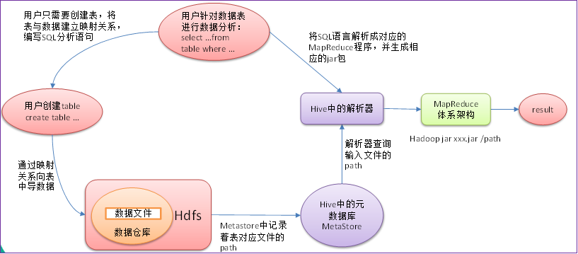

# 大数据分析Hive

## 1. Hive是什么

### 1.1 概念

Hive：由Facebook开源，用于解决海量`结构化日志`的数据统计；

Hive是基于Hadoop的一个`数据仓库`，可以将`结构化的数据文件映射为一张表`，并提供sql查询功能。

本质：`将Hive SQL转化为MapReduce`程序


### 1.2 Hive与数据库的区别


* hive具有sql数据库的外表，但应用场景完全不同。
* Hive只适合用来做海量离线数据统计分析，也就是数据仓库。

### 1.3Hive的优缺点

* 优点
  * 类Sql语法，容易上手使用开发。
  * 避免了MapReduce的开发。
  * 支持自定义函数
* 缺点
  * 不支持记录级别的增删改操作
  * 查询延时很严重
  * 不支持事务

### 1.4 Hive 架构原理


1. 用户接口（client）

   * Cli: Hive Shell命令行访问
   * JDBC/ODBC访问
   * WebUI访问

2. 元数据（MetaStore）

   * 表名

   * 表所属数据库

   * 表的拥有者

   * 列/分区字段信息

   * 表的类型（外部表）

   * 表数据所在目录

     默认的存储实在derby中的，可需修改为Mysql存储，（详见安装配置）

3. Hadoop 集群

   * 使用HDFS进行存储，使用MapReduce进行计算。

4. Driver：驱动器

   * 解析器（SQL Parser）
     * 将SQL字符串转化成先抽象语法树AST
     * 对AST进行语法分析，比如表、字段是否存在，SQL语法是否正确。
   * 编译器（Physical Plan）：将AST编译生成逻辑执行计划
   * 优化器（Query Opetimize）：对逻辑执行计划进行优化
   * 执行计划（Execution）：把逻辑执行计划转换成可以运行的物理加护。（转化成MapReduce任务）

   

## 2. Hive的安装

* 创建文件hive-site.xml

  ```xml
  <?xml version="1.0"?>
  <?xml-stylesheet type="text/xsl" href="configuration.xsl"?>
  <configuration>
          <property>
            <name>javax.jdo.option.ConnectionURL</name>
            <value>jdbc:mysql://node1:3306/hive?createDatabaseIfNotExist=true&amp;useSSL=false&amp;useUnicode=true&amp;characterEncoding=UTF-8</value>
          </property>
  
          <property>
            <name>javax.jdo.option.ConnectionDriverName</name>
            <value>com.mysql.jdbc.Driver</value>
          </property>
  
          <property>
            <name>javax.jdo.option.ConnectionUserName</name>
            <value>root</value>
          </property>
  
          <property>
            <name>javax.jdo.option.ConnectionPassword</name>
            <value>123456</value>
          </property>
  </configuration>
  ```

* mysql驱动包上传到hive的lib下

## 3. Hive 的交互方式

### 3.1 Hive的交互Shell

```bash
bin/hive
```

以命令行模式的启动

### 3.2 Hive JDBC服务

```bash
# 启动
bin/hiveserver2
bin/hive --service hiveserver2
nohup  bin/hive --service hiveserver2 &
```

```bash
bin/beeline
# 连接服务
beeline> !connect jdbc:hive2://node1:10000
```

### 3.3 Hive的命令模式

```bash
# 执行sql
bin/hive -e "show database;"
# 执行后台sql
bin/hive -e sql.sql
```

## 4. Hiven的数据类型

#### 4.1 基本数据类型

|  类型名称  |              描述               |    举例    |
| :--------: | :-----------------------------: | :--------: |
|  boolean   |           true/false            |    true    |
|  tinyint   |        1字节的有符号整数        |     1      |
|  smallint  |        2字节的有符号整数        |     1      |
|  **int**   |        4字节的有符号整数        |     1      |
| **bigint** |        8字节的有符号整数        |     1      |
|   float    |        4字节单精度浮点数        |    1.0     |
| **double** |        8字节单精度浮点数        |    1.0     |
| **string** |        字符串(不设长度)         |   “abc”    |
|  varchar   | 字符串（1-65355长度，超长截断） |   “abc”    |
| timestamp  |             时间戳              | 1563157873 |
|    date    |              日期               |  20190715  |

#### 4.2 复合数据类型

| 类型名称 |                         描述                          |       举例        | 使用      |
| :------: | :---------------------------------------------------: | :---------------: | --------- |
|  array   | 一组有序的字段，字段类型必须相同 array(元素1，元素2)  |   Array(1,2,3)    | 字段[0]   |
|   map    |           一组无序的键值对 map(k1,v1,k2,v2)           | Map(‘a’,1,'b',2)  | 字段['a'] |
|  struct  | 一组命名的字段，字段类型可以不同 struct(元素1，元素2) | Struct('a',1,2,0) | 字段.a    |

```sql
create table complex(
    col1 array<int>,
    col2 map<string,int>,
    col3 struct<a:string,b:int,c:double>
)
```

### 5. Hive数据转换

### 5.1 隐式类型转换

* 自动类型转换
  * tinyint可以转换成int，int可以转换成bigint。
  * 所有整数类型、float 和 string类型都可以隐式地转换成double
  * tinyint、smallint、int都可以转换为float
  * boolean类型不可以转换为任何其它的类型。
* 手动类型转换
  * 可以使用`case`进行强制类型转换，比如cast ('1' as int)将把字符串'1' 转换成整数1；
  * 强制类型转换失败，如执行cast('x' as int)，表达式返回空值 NULL。

## 6. Hive的DDL操作

### 6.1 Hive的数据库DDL操作

```bash
# 显示数据库
show databases;
# 查看数据库详情
desc databases db_name;
# 查看数据库详细信息
desc databases extended db_name;
# 切换当前数据库
use db_name;
# 创建数据库
create database db_name;
# 删除数据库
drop database db_name;
# 如果删除的数据库不存在，最好采用if exitets。
drop database db_name if exists db_name;
# 如果删除的数据库不存在，最好采用if exitets，强制删除
drop database db_name if exists db_name cascade;
```

### 6.2 Hive的表DDL操作

```sql
# 创建表
CREATE [EXTERNAL(外部表)] TABLE [IF NOT EXISTS] table_name 
[(col_name data_type [COMMENT col_comment(行注释)], ...)] 
[COMMENT table_comment(表注释)] 
[PARTITIONED BY (col_name data_type [COMMENT col_comment], ...)] 分区
[CLUSTERED BY (col_name, col_name, ...) 分桶
[SORTED BY (col_name [ASC|DESC], ...)] INTO num_buckets BUCKETS] 排序
[ROW FORMAT row_format]   row format delimited fields terminated by “分隔符”
[STORED AS file_format] 
[LOCATION hdfs_path]


// 列内部分割符
COLLECTION ITEMS TERMINATED BY ':'

# 查看表描述
desc formatted student;
```

#### 6.2.1 hive创建内部表

1. 标准建表语句

   ```sql
   create table if not exists student(
   id int, 
   name string
   )
   row format delimited fields terminated by '\t'
   stored as textfile;
   ```

2. 查询建表

   ```sql
   create table if not exists student1 as select id, name from student;
   ```

3. 根据已经存在的表结构创建表

   ```sql
   create table if not exists student2 like student;
   ```

#### 6.2.2 hive创建外部表

```sql
create external table if not exists db_name.emp(
id int,
name string,
age int
)
row format delimited fields terminated by '\t';
location '/hive/bigdata'
```

#### 6.2.3 hive 内部表与外部表

```sql
#把student内部表改为外部表
alter table student set tblproperties('EXTERNAL'='TRUE');
#把student内部表改为外部表
alter table student set tblproperties('EXTERNAL'='FALSE');
```

* 外部表在创建的时候需要加上`external`关键字
* 内部表删除后，表的元数据和真实数据都被删除了；外部表删除后，仅仅只是把该表的元数据删除了，真实数据还在，后期还是可以恢复出来
* 内部表数据由Hive自身管理，外部表数据由HDFS管理； 
* 内部表数据存储的位置是hive.metastore.warehouse.dir（默认：/user/hive/warehouse），外部表数据的存储位置由自己制定； 
* 删除内部表会直接删除元数据（metadata）及存储数据；删除外部表仅仅会删除元数据，HDFS上的文件并不会被删除； 
* 对内部表的修改会将修改直接同步给元数据，而对外部表的表结构和分区进行修改，则需要修复（MSCK REPAIR TABLE table_name;）

## 7. Hive扩展点

* hive cli命令查看本地文件系统
  * !ls /;
* hive cli命令查看HDFS文件系统
  * dfs -ls /;
* 底层执行引擎3种
  - mapreduce(默认)
  - tez（支持DAG作业的计算框架）
  - spark（基于内存的分布式计算框架）

