# Kylin

## 一、Kylin概述

**大数据 OLAP 的两个事实**

1. 大数据查询要的一般是统计结果，是多条记录经过聚合函数计算后的统计值。原始的记录则不是必需的，或者访问频率和概率都极低。
2. 聚合是按维度进行的，由于业务范围和分析需求是有限的，有意义的维度聚合组合也是相对有限的，一般不会随着数据的膨胀而增长。

Kylin 基于以上两点，得到一个新的思路——**预计算**。应尽量多地预先计算聚合结果，在查询时刻应尽量使用预算的结果得出查询结果，从而避免直接扫描可能无限增长的原始记录。

### 1.1  Kylin 特点

Kylin 的主要特点包括支持 SQL 接口、支持超大规模数据集、亚秒级响应、可伸缩性、高吞吐率、BI 工具集成等

- 可扩展超快 OLAP 引擎 Kylin是为减少在 Hadoop/Spark 上百亿规模数据查询延迟而设计

  > On-Line Analytical Processing，简称OLAP

- Hadoop ANSI SQL 接口 Kylin为Hadoop提供标准SQL支持大部分查询功能

- 交互式查询能力 通过 Kylin，用户可以与 Hadoop 数据进行亚秒级交互，在同样的数据集上提供比Hive 更好的性能

  - 多维立方体（MOLAP Cube) 用户能够在 Kylin 里为百亿以上数据集定义数据模型并构建立方体

- 与 BI 工具无缝整合 Kylin 提供与 BI 工具的整合能力，如 Tableau，PowerBI/Excel，MSTR，QlikSense，Hue 和 SuperSet

  > BI: Business intelligence 商业智能

### 1.2 Kylin 工作原理

Apache Kylin 的工作原理本质上是 MOLAP（Multidimensional Online Analytical Processing）Cube，也就是**多维立方体分析**。

这是数据分析中相当经典的理论，在关系数据库年代就已经有了广泛的应用.

在说明 MOLAP Cube 之前需要先介绍一下维度`（Dimension）`和度量`(Measure）`这两个概念。

#### 1.2.1 维度(Dimension)和度量(Measure)简介

**维度**

简单来讲，维度就是观察数据的角度。它通常是数据记录的一个属性，例如时间、地点等。

比如电商的销售数据，可以从时间的维度来观察, 也可以进一步细化，从时间和地区的维度来观察.

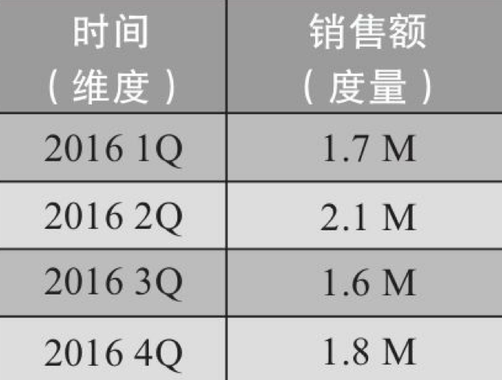

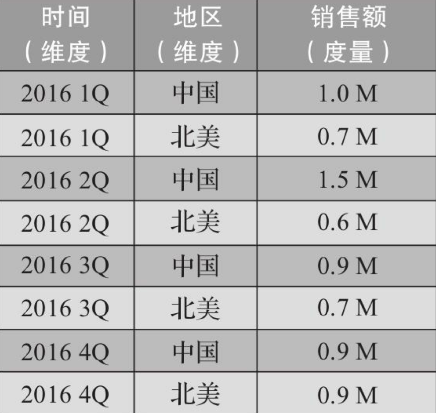

维度一般是一组离散的值，比如时间维度上的每一个独立的日期，或者商品维度上的每一件独立的商品。

因此统计时可以把维度值相同的记录聚合在一起，然后应用聚合函数做累加、平均、去重复计数等聚合计算。

**度量**

度量就是被聚合后的统计值，也是聚合运算的结果，如图中的销售额，抑或是销售商品的总件数。

度量是基于数据所计算出来的考量值；它通常是一个数值，如总销售额、不同的用户数等。

通过比较和测算度量，分析师可以对数据进行评估，比如今年的销售额相比去年有多大的 增长，增长的速度是否达到预期，不同商品类别的增长比例是否合理等。

在一个 SQL 查询中，Group By 的属性通常就是维度，而所计算的值则是度量

#### 1.2.2 Cube和Cuboid

有了维度和度量，一个数据表或数据模型上的所有字段就可以分类了，它们要么是维度，要么是度量（可以被聚合）。于是就有了根据维度和度量做预计算的Cube理论。

给定一个数据模型，我们可以对其上的所有维度进行组合。对于`N`个维度来说，组合的所有可能性共有 `2^n` 种。

给定一个数据模型，我们可以对其上的所有维度进行组合。对于`N`个维度来说，组合的所有可能性共有 `2^n` 种。

对于每一种维度的组合，将度量做聚合运算，然后将运算的结果保存为一个物化视图，称为`Cuboid`。

所有维度组合的`Cuboid`作为一个整体，被称为`Cube`。

所以简单来说，一个 `Cube` 就是许多按维度聚合的物化视图的集合。

> 下面来列举一个具体的例子。

假定有一个电商的销售数据集，其中维度包括:

- 时间(Time)
- 商品(Item)
- 地点(Location)
- 供应商(Supplier)

度量:

- 销售额(GMV)。

那么所有维度的组合就有`2^4=16`种


1. 一维度（1D）的组合有[Time]、[Item]、[Location]、[Supplier]4种；
2. 二维度（2D）的组合有[Time，Item]、[Time，Location]、[Time、Supplier]、 [Item，Location]、[Item，Supplier]、[Location，Supplier]6种；
3. 三维度（3D）的组合也有4种；
4. 最后零维度（0D）和四维度（4D）的组合各有1种

总共 16 种。

计算 Cuboid，即按维度来聚合销售额。如果用SQL语句来表达计算 `Cuboid[Time，Loca-tion]`，那么SQL语句如下：

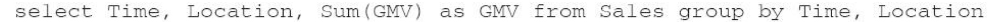

将计算的结果保存为物化视图，所有`Cuboid`物化视图的总称就是`Cube`。

#### 1.2.3 工作原理

Apache Kylin 的工作原理就是对数据模型做`Cube`预计算，并利用计算的结果加速查询，具体工作过程如下。

1. 指定数据模型, 定义维度和度量。
2. 预计算`Cube`, 计算所有`Cuboid`并保存为物化视图。
3. 执行查询时, 读取`Cuboid`运算, 产生查询结果。

由于 Kylin 的查询过程不会扫描原始记录，而是通过预计算预先完成表的关联、聚合等复杂运算，并利用预计算的结果来执行查询，因此相比非预计算的查询技术，其速度一般要快一到两个数量级，并且这点在超大的数据集上优势更明显。

当数据集达到千亿乃至万亿级别时，Kylin的速度甚至可以超越其他非预计算技术 1000 倍以上。

### 1.3 Kylin 技术架构

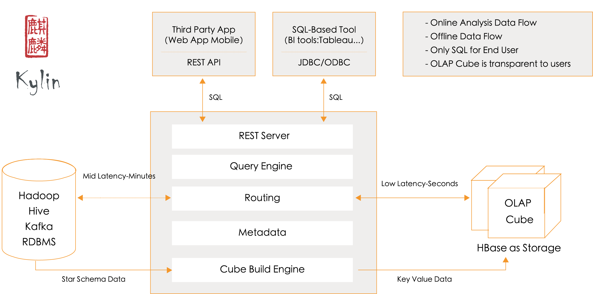

#### 1.3.1 数据源

我们首先来看看离线构建的部分.

从上图可以看出, 数据源在左侧, 保存着待分析的用户数据.

数据源可以是: Hadoop, Hive, Kafka, RDBMS.

但是 Hive 是用的最多的一中数据源

#### 1.3.2  Cube 构建引擎

Cube 构建引擎根据元数据的定义, 从数据源抽取数据, 并构建 Cube.

这套引擎的设计目的在于处理所有离线任务，其中包括 shell 脚本、Java API 以及 Map Reduce 任务等等。

任务引擎对 Kylin 当中的全部任务加以管理与协调，从而确保每一项任务都能得到切实执行并解决其间出现的故障。

#### 1.3.3  元数据管理工具

Kylin 是一款元数据驱动型应用程序。

元数据管理工具是一大关键性组件，用于对保存在 Kylin 当中的所有元数据进行管理，其中包括最为重要的 Cube 元数据。

其它全部组件的正常运作都需以元数据管理工具为基础。 Kylin 的元数据存储在 Hbase中。

#### 1.3.4 REST Server

是一套面向应用程序开发的入口点，旨在实现针对 Kylin 平台的应用开发工作。

此类应用程序可以提供查询、获取结果、触发cube构建任务、获取元数据以及获取用户权限等等。另外可以通过 Restful 接口实现 SQL 查询。

#### 1.3.5 查询引擎

当 Cube 准备就绪后，查询引擎就能够获取并解析用户查询。它随后会与系统中的其它组件进行交互，从而向用户返回对应的结果。

#### 1.3.6 Routing(路由选择)

负责将解析的 SQL 生成的执行计划转换成 Cube 缓存的查询.

Cube 是通过预计算缓存在 Hbase 中，这部分查询可以在秒级甚至毫秒级完成

而且还有一些操作查询原始数据（存储在 Hadoop 的 hdfs 中通过 hive 查询）。这部分查询延迟较高。

### 1.4 核心算法

简单介绍下 Cube 构建引擎在构建 Cube 时用到的算法.

预计算过程是 Kylin 从 Hive 中读取原始数据，按照我们选定的维度进行计算，并将结果集保存到 Hbase 中，默认的计算引擎为 MapReduce，可以选择 Spark 作为计算引擎。

一次 build 的结果，我们称为一个 Segment。构建过程中会涉及多个 Cuboid 的创建，具体创建过程算法由`kylin.cube.algorithm`参数决定，参数值可选 `auto`，`layer` 和 `inmem`， 默认值为 `auto`，即 Kylin 会通过采集数据动态地选择一个算法 (`layer or inmem`)，如果用户很了解 Kylin 和自身的数据、集群，可以直接设置喜欢的算法。

####  1.4.1 逐层构建算法（layer）

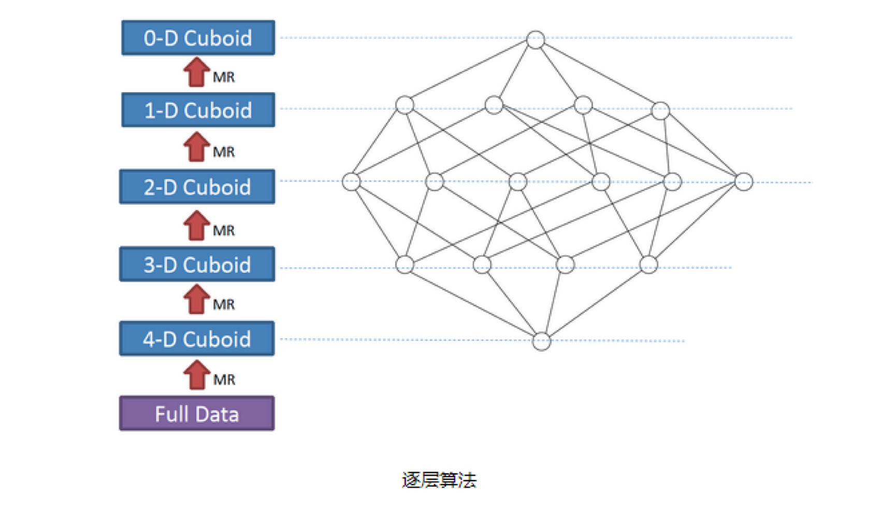

我们知道，一个 N 维的 Cube，是由 1 个 N 维子立方体、N 个 (N-1) 维子立方体、N*(N-1)/2个(N-2)维子立方体、......、N个1维子立方体和1个0维子立方体构成，总共有2^N个子立方体组成，

在逐层算法中，按维度数逐层减少来计算，每个层级的计算（除了第一层，它是从原始数据聚合而来），是基于它上一层级的结果来计算的。比如，[Group by A, B]的结果，可以基于[Group by A, B, C]的结果，通过去掉C后聚合得来的；这样可以减少重复计算；当 0 维度Cuboid计算出来的时候，整个Cube的计算也就完成了。

每一轮的计算都是一个MapReduce任务，且串行执行；一个 N 维的 Cube，至少需要 N 次 MapReduce Job。

**算法优点：**

- 此算法充分利用了 MapReduce 的能力，处理了中间复杂的排序和洗牌工作，故而算法代码清晰简单，易于维护；
- 受益于 Hadoop 的日趋成熟，此算法对集群要求低，运行稳定；在内部维护 Kylin 的过程中，很少遇到在这几步出错的情况；即便是在Hadoop集群比较繁忙的时候，任务也能完成。

**算法缺点：**

- 当 Cube 有比较多维度的时候，所需要的 MapReduce 任务也相应增加；由于Hadoop的任务调度需要耗费额外资源，特别是集群较庞大的时候，反复递交任务造成的额外开销会相当可观；
- 由于 Mapper 不做预聚合，此算法会对 Hadoop MapReduce 输出较多数据; 虽然已经使用了Combiner 来减少从 Mapper 端到 Reducer 端的数据传输，所有数据依然需要通过 Hadoop MapReduce 来排序和组合才能被聚合，无形之中增加了集群的压力;
- 对 HDFS 的读写操作较多：由于每一层计算的输出会用做下一层计算的输入，这些`Key-Value`需要写到 HDFS 上；当所有计算都完成后，Kylin 还需要额外的一轮任务将这些文件转成 HBase 的 HFile 格式，以导入到 HBase 中去；

总体而言，该算法的效率较低，尤其是当 Cube 维度数较大的时候。

#### 1.4.2 快速构建算法（inmem）

也被称作“逐段”(`By Segment`) 或“逐块”(`By Split`) 算法，从1.5.x开始引入该算法

利用`Mapper`端计算先完成大部分聚合，再将聚合后的结果交给`Reducer`，从而降低对网络瓶颈的压力。

该算法的主要思想是，对`Mapper`所分配的数据块，将它计算成一个完整的小`Cube` 段（包含所有 Cuboid ）；每个 Mapper将 计算完的 Cube 段输出给 Reducer 做合并，生成大 Cube，也就是最终结果；如图所示解释了此流程。

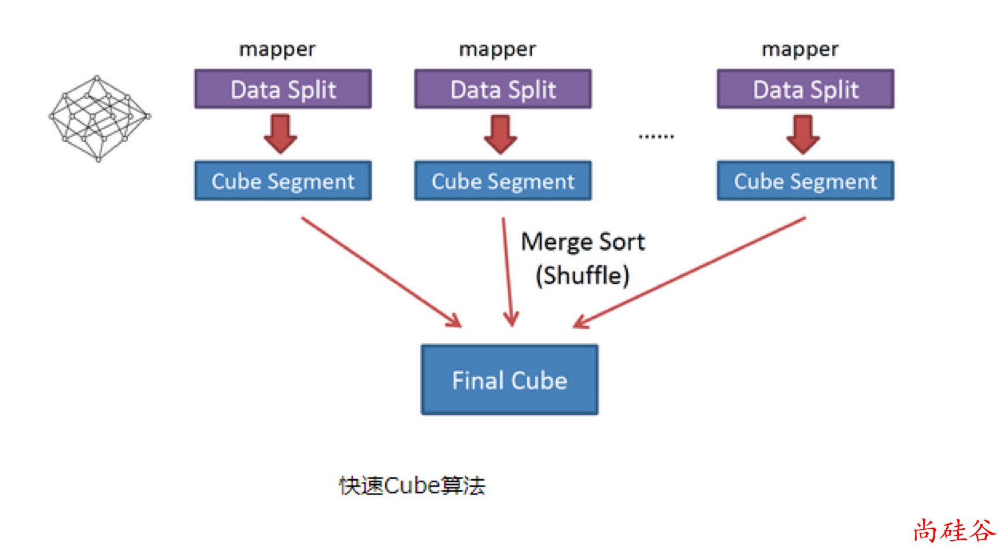

**与旧算法相比，快速算法主要有两点不同：**

- Mapper 会利用内存做预聚合，算出所有组合；Mapper 输出的每个 Key 都是不同的，这样会减少输出到 Hadoop MapReduce 的数据量，Combiner 也不再需要；
- 一轮 MapReduce 便会完成所有层次的计算，减少 Hadoop 任务的调配。

### 1.5 Kylin 中的几个核心概念

#### 1.5.1 维度和度量

参考 1.2.1

#### 1.5.2  事实表和维度表

**事实表（Fact Table）**

事实表（Fact Table）是指存储有事实记录的表，如系统日志、销售记录等；

事实表的记录在不断地动态增长，所以它的体积通常远大于其他表。

**维度表（Dimension Table）**

维度表（Dimension Table）或维表，有时也称查找表（Lookup Table)。

是与事实表相对应的一种表: 它保存了维度的属性值，可以跟事实表做关联；相当于将事实表上经常重复出现的属性抽取、规范出来用一张表进行管理。

常见的维度表有：日期表（存储与日期对应的周、月、季度等的属 性）、地点表（包含国家、省／州、城市等属性）等。

使用维度表有诸多好处，具体如下:

- 缩小了事实表的大小
- 便于维度的管理和维护，增加、删除和修改维度的属性，不必对事实表的大量记录进行改动
- 维度表可以为多个事实表重用，以减少重复工作。

#### 1.5.3 Cube、Cuboid 和 Cube Segment

Cube（或 Data Cube），即数据立方体，是一种常用于数据分析与索引的技术；它可以对原始数据建立多维度索引。通过 Cube 对数据进行分析， 可以大大加快数据的查询效率。

Cuboid 在 Kylin 中特指在某一种维度组合下所计算的数据。

Cube Segment 是指针对源数据中的某一个片段，计算出来的 Cube 数据。通常数据仓库中的数据数量会随着时间的增长而增长，而 Cube Segment 也是按时间顺序来构建的。

#### 1.5.4 数据模型

 数据挖掘有几种常见的多维数据模型，如星形模型（Star Schema）、雪花模型（Snowflake Schema) 等。

**星型模型**

星形模型中有一张事实表，以及零个或多个维度表；

事实表与维度表通过主键外键相关联，维度表与维度表之间没有关联，就像很多星星围绕在一个恒星周围，故取名为星形模型。

**雪花模型**

如果将星形模型中某些维度的表再做规范，抽取成更细的维度表，然后让维度表之间也进行关联，那么这种模型称为雪花模型。

> 不过，Kylin只支持星形模型的数据集，这是基于以下考虑:

- 星形模型是最简单，也是最常用的模型。
- 由于星形模型只有一张大表，因此它相比于其他模型更适合于大数据处理。
- 其他模型可以通过一定的转换，变为星形模型。

#### 1.5.5 维度的基数

维度的基数（Cardinality）指的是该维度在数据集中出现的不同值的个数；

例如“国家”是一个维度，如果有 200 个不同的值，那么此维度的基数就是 200。

通常一个维度的基数会从几十到几万个不等，个别维度如“用户ID”的基数会超过百万甚至千万。基数超过一百万的维度通常被称为超高基数维度（Ultra High Cardinality，UHC），需要引起设计者的注意。

## 二、Kylin安装

参考：https://www.codercto.com/a/79143.html

下载基于CDH的Kylin安装包

解压之后配置环境变量

```
export KYLIN_HOME=/data/kylin/kylin
export CDH_HOME=/opt/cloudera/parcels/CDH
export SPARK_HOME=$CDH_HOME/lib/spark
export HBASE_HOME=$CDH_HOME/lib/hbase
export HBASE_CLASSPATH=$HBASE_HOME/lib/hbase-common-2.1.0-cdh6.2.0.jar
```

如果不加 `$HBASE_HOME` 会报 `hbase-common lib not found，同样的还有SPARK_HOME。

修改`conf/keylin.properties`中的时区配置

```java
# 改成东八区, 否则会出现时间显示不准的问题
kylin.web.timezone=GMT+8
```

如果启动报错

```
org.springframework.beans.factory.BeanCreationException: Error creating bean with name 'org.springframework.web.servlet.mvc.method.annotation.RequestMappingHandlerMapping': Invocation of init method failed; nested exception is java.lang.NoClassDefFoundError: org/apache/commons/configuration/ConfigurationException
```

需要下载jar包到lib文件夹内

https://repo1.maven.org/maven2/commons-configuration/commons-configuration/1.10/commons-configuration-1.10.jar

```
bin/kylin.sh start
bin/kylin.sh stop
```

## 三、 Kylin快速入门

## 3.1 登录系统

下载完成之后登录http://ip:7070/kylin就可以访问了，默认账号密码为ADMIN/KYLIN。注意都是大写的。

## 3.2 创建 Project

1. 点击`+`号 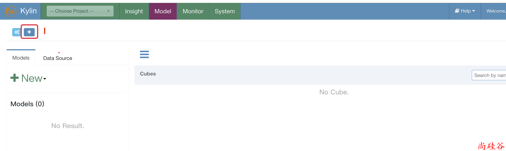
2. 输入项目名和项目描述, 然后点击`submit` 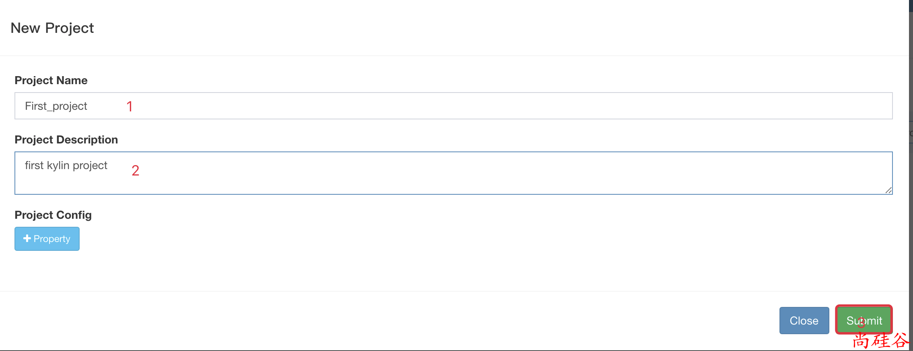

#### 3.3.1 选择数据源

1. 点击`Data Source`图标, 然后点击`Load Table`图标

   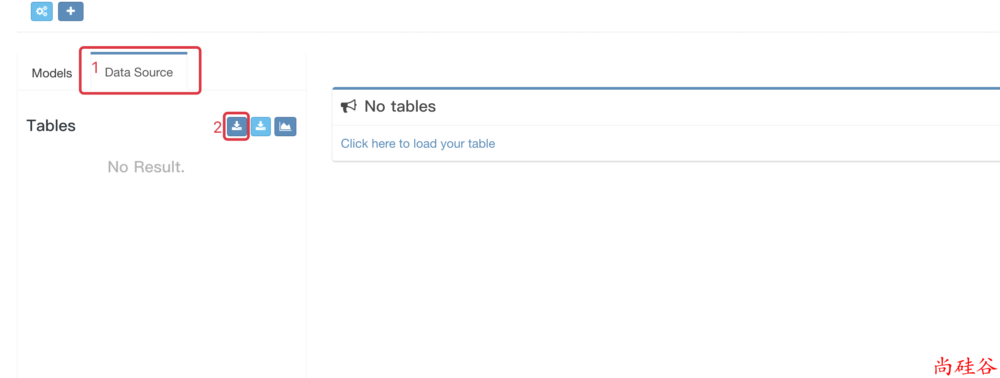

2. 输入要加载的 Hive 中的表

   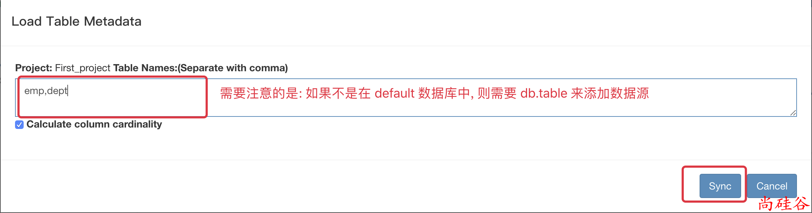

3. 查看数据源 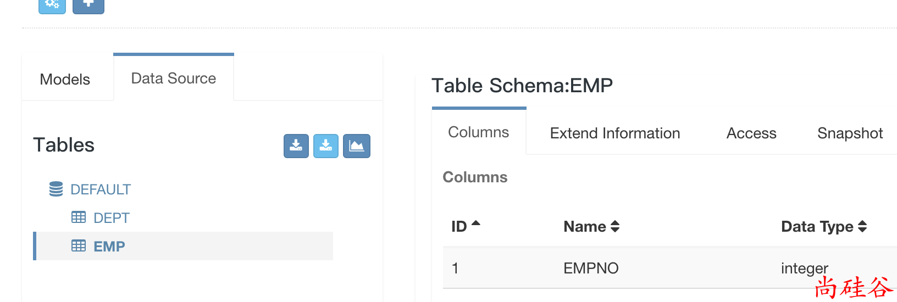

## 3.3 创建数据模型(Model)

创建过了 Project 并且选择 Data Source 之后, 就可以创建数据模型了.

### 3.3.1 回到 Models 界面

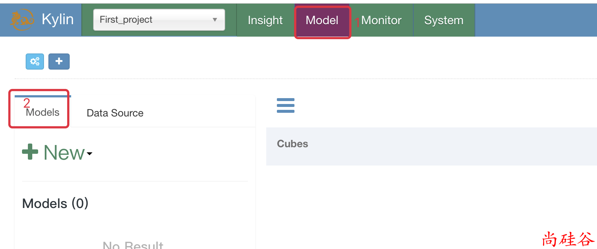

### 3.3.2 点击 `New`

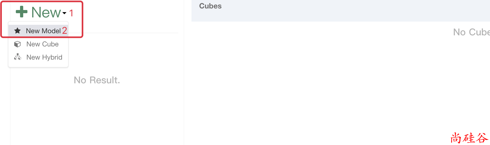

### 3.3.3 填写 Model Name

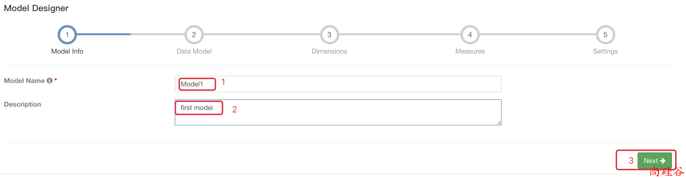

### 3.3.4 选择事实表

必须要有.

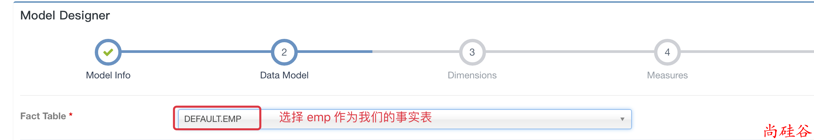

### 3.3.5 添加维度表

可选的, 可以没有维度表, 表示将来不需要任何的 `join`

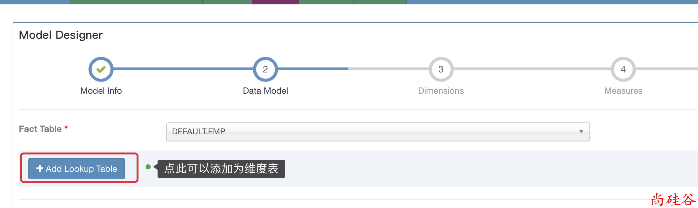

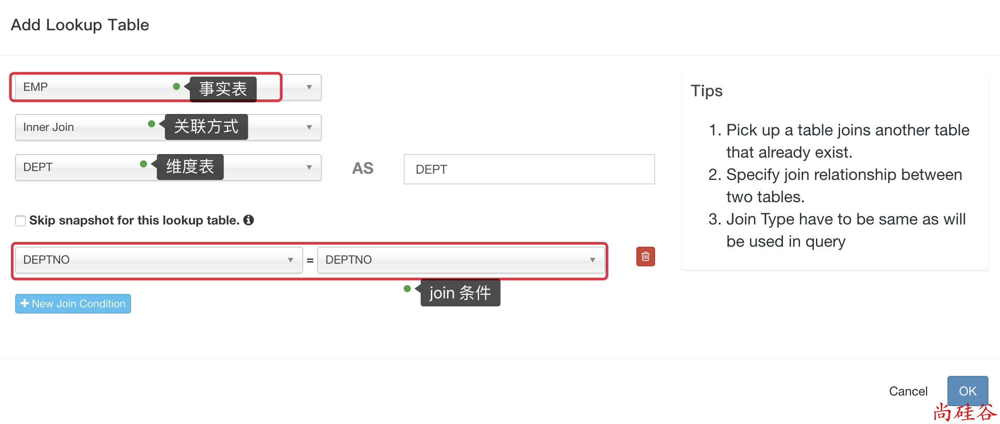

### 3.3.6 选择维度信息

选择将来可能需要度量的列. 度量只能来自事实表.

这里的维度信息是将来可能用到的维度信息, 将来创建 Cube 的时候只能从这里维度中选择.

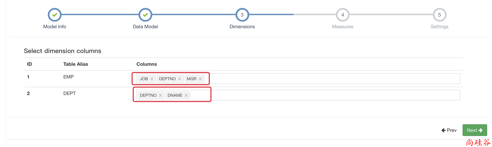

### 3.3.7 选择度量信息

度量信息只能来自事实表

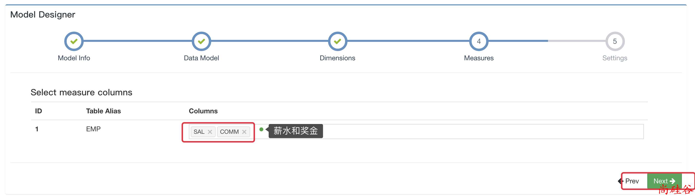

### 3.3.8 选择分区信息和过滤条件

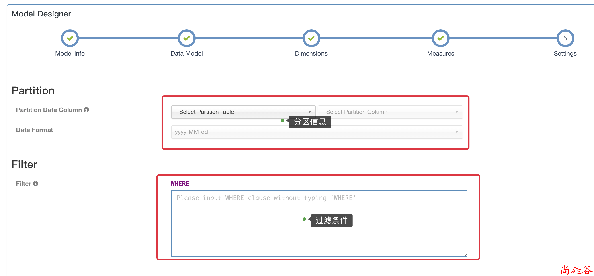

### 3.3.9保存数据模型

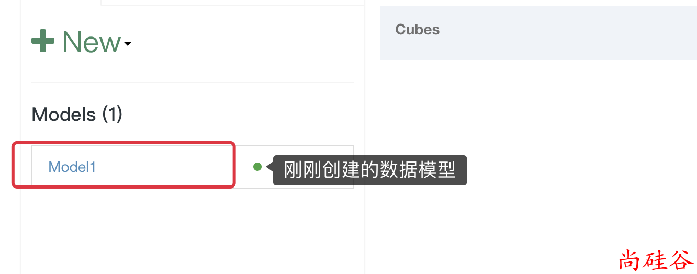

## 3.4 创建 Cube

### 3.4.1 点击 `New`, 选择`New Cube`

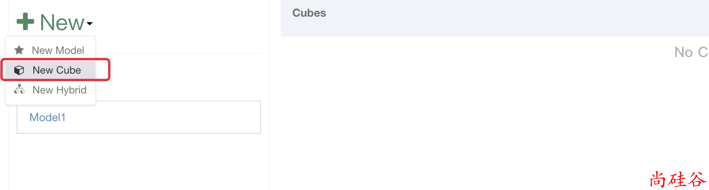

### 3.4.2 选择使用的数据模型

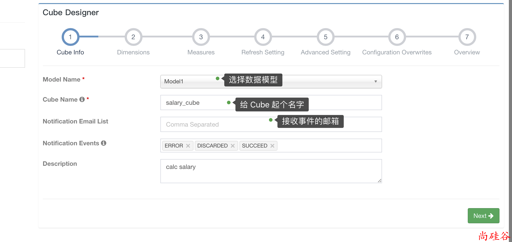

### 3.4.3 添加维度

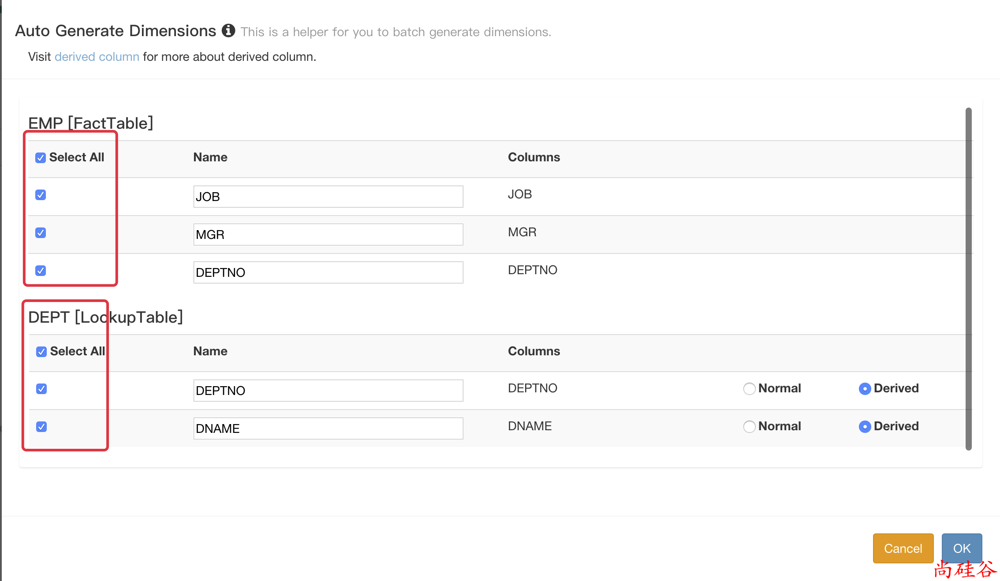

### 3.4.4 选择度量

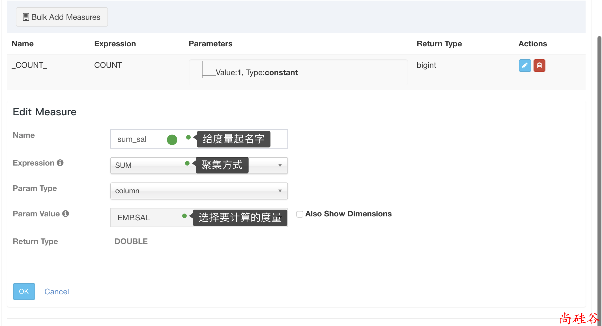

> 度量列表: 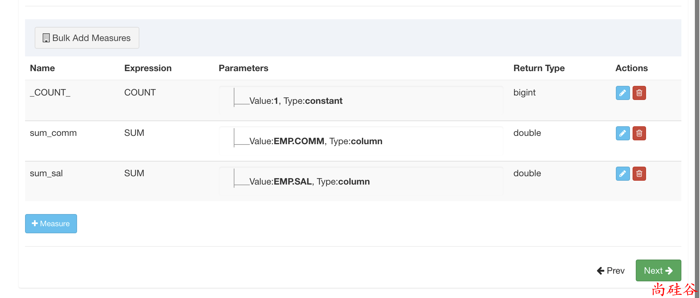

### 3.4.5 关于 Cube 刷新的设置

是关于 Cube 数据刷新的设置。 在这里可以设置自动合并的阈值、数据保留的最短时间，以及第一个 Segment 的起点时间（如果Cube有分割时间列的话)

在这里我们保持默认即可.

### 3.4.6 高级设置

使用默认, 直接跳过.

### 3.4.7 覆盖配置信息

直接跳过

### 3.4.8 Cube 信息展示

点击 Save 完成 Cube 的创建.

### 3.4.9 触发计算

Cube 创建完成之后, 并不会自动的去进行构建.

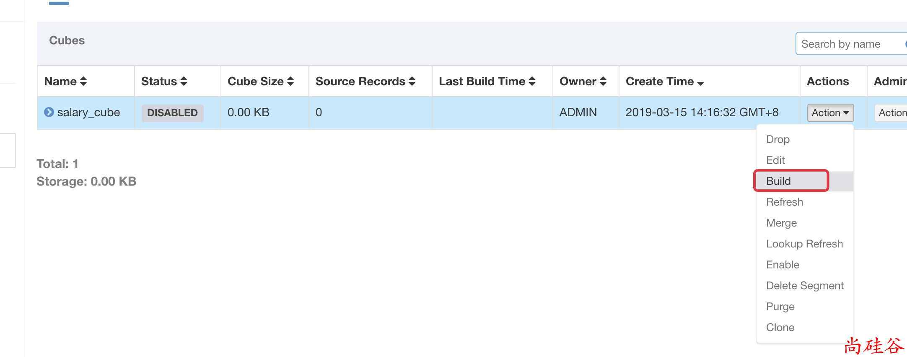

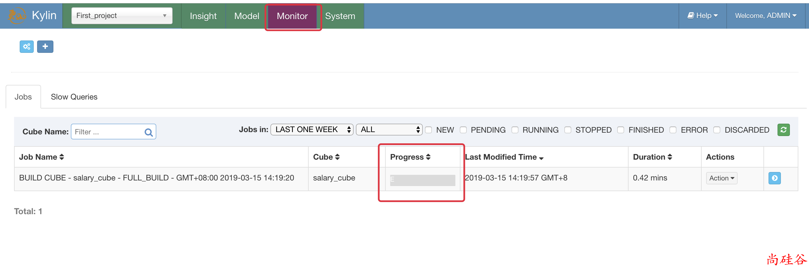

### 3.4.10 查看 build 进度

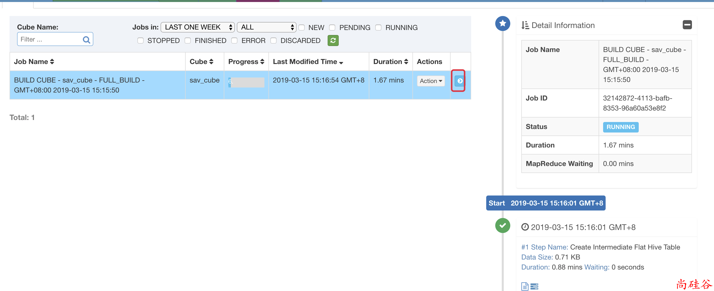

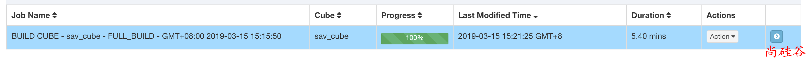

## 3.5 查询


1. 可以导出数据
2. 可以查看图表

