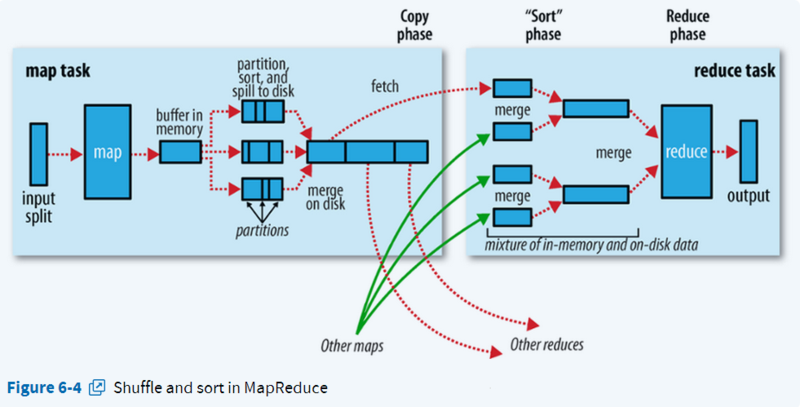
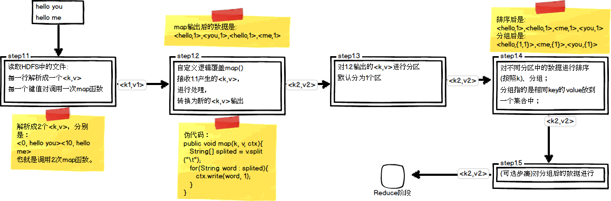
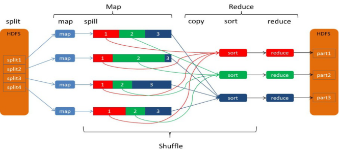
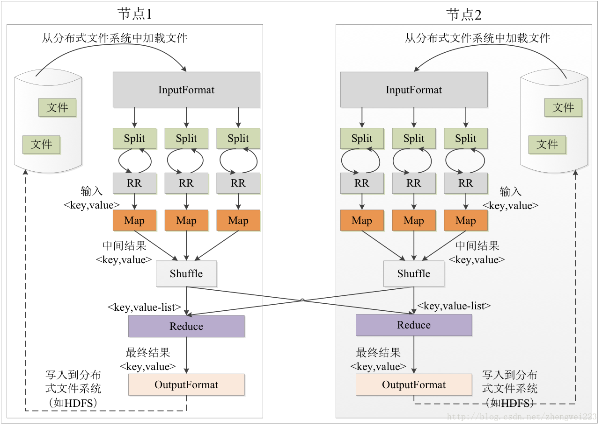
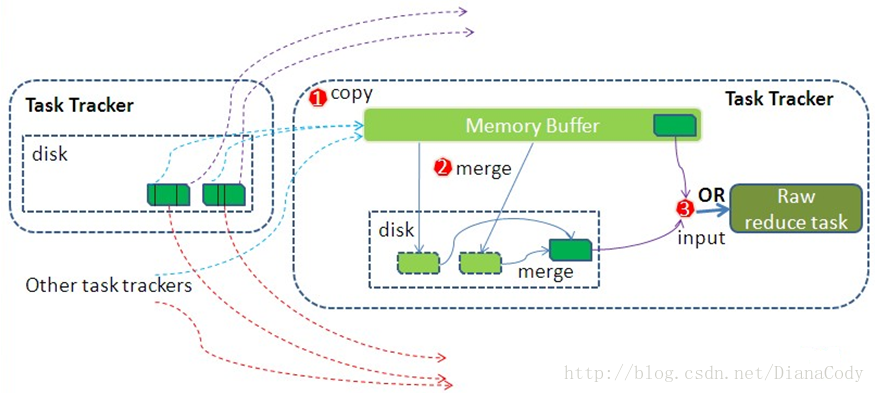

# MapReduce

0. 介绍
    * MapReduce 是采用`分而治之`的思想设计出来的分布式计算框架
    * 单一复杂的任务，单台服务器无法计算，可以将大任务分别拆一个个小任务，小任务分别在不同的服务器上并行执行，最后在汇总每个小任务的结果
    * MapReduce分为两个阶段：Map（切分成一个个小的任务）、Reduce（汇总任务的结果）

1. Map阶段
    * map()函数以kv对作为输入，产生一系列kv对作为中间输出写入本地磁盘

2. Reduce阶段
    * reduce()函数通过网络将mapd的输出(kv对)组为输入，产生另外一个kv作为最终结果写入HDFS

## Combiner
* Map端本地聚合，相当也执行一边Reduce操作。执行时间在Map之后。
* 相当于在Map之后就执行一次Combine操作。

## Suffle

### Suffle--->Map端

1. 分区Partition
    * 自定义Partitioner进行分区操作
    * 默认为HashPartitioner
2. 写入环形内存缓冲区
    * 每个Map任务都会分配一个100M的环形内存缓存区，用于存储map任务输出的键值对以及对应的partition。
3. 执行溢出写
    * 环形内存缓冲区到达阈值之后（80%），会锁定这部分内存，并在每个分区中对其中的键值进行排序，根据partition和key两个关键字排序。
    * 排序结果为缓冲区内的数据按照partition为单位聚集在一起，同一个partition内的数据按照key有序。
    * 排序完成后会创建一个溢出写文件。，然后开启一个后台线程把这部分数据以一个临时文件的方式溢出写（spill）到本地磁盘中
    * 合并，Combiner
        * 当为作业设置Combiner类后，缓存溢出线程将缓存存放到磁盘时，就会调用
        * 缓存溢出的数量超过mapreduce.map.combine.minspills（默认3）时，在缓存溢出文件合并的时候会调用
    * 合并（Combine）和归并（Merge）的区别：

        两个键值对<“a”,1>和<“a”,1>，如果合并，会得到<“a”,2>，如果归并，会得到<“a”,<1,1>>
4. 归并Merge
    * 当一个map task处理的数据很大，以至于超过缓冲区内存时，就会生成多个spill文件。此时就需要对同一个map任务产生的多个spill文件进行归并生成最终的一个`已分区且已排序`的大文件。
    * 溢出写文件归并完毕后，Map将删除所有的临时溢出写文件，并告知NodeManager任务已完成，只要其中一个MapTask完成，ReduceTask就开始复制它的输出
    * 压缩：写磁盘时压缩map端的输出，因为这样会让写磁盘的速度更快，节约磁盘空间，并减少传给reducer的数据量。

### Suffle--->Reduce端

1. 复制Copy
    * Reduce进程启动一些数据copy线程，通过HTTP方式请求MapTask所在的NodeManager以获取输出文件。 
    * 在Map端Partition的时候，相当于指定了Reducer要处理的数据。
    * 任务调度之间，有一个ApplictionMaster，负责联系Map和Reduce的对应关系。
2. 归并Merge
    * Copy的数据先放内存缓冲区，内存不够用写入到磁盘。
    * 拷贝全部完成，会在reduce上生成多个文件，这个时候执行归并，也就是`磁盘到磁盘merge`，因为Map那边过来的时候幽静有序，这里排序只是一次归并排序。
3. Reduce阶段
    * 经过复制和排序后，就会针对已根据键排好序的Key构造对应的Value迭代器。

## 自定义Partition

* 实现Partitioner接口。

## 二次排序

* MapReduce中，会更具Key进行分区、排序、分组
* 需要实现WriteableComparable接口，该接口实现了Writeable、Comparable两个接口，前者是传输二进制流的读写方式，后者是比较大小。key就可以使用这个类了。

## MapReduce分区倾斜

* 数据倾斜式数据中的常见情况。
    1. 数据概率倾斜————某一个区域的数据远远大于其他区域。
    2. 数据大小倾斜————部分记录的大小大于平均值。
* 在Map和Reduce阶段都可能发生数据倾斜。
    1. Map端数据倾斜————让多样话的数据集处理效率更低。
    2. Reduce端的数据倾斜来源常常来源于MapReduce的默认分区器

* 如何判断发生数据倾斜
    1. 在reduce阶段，关注数据，设定一个阈值（判断迭代器大小），一旦超过这个阈值，就可以观察到该数据。只能判断，需要跑代码多次尝试。

* **解决方案**
    1. 抽样与范围分区
        * TotalOrderPatitioner
    2. 自定义分区
        * 待完善
    3. Combine
        * Combine 可以大量的减小数据概率倾斜和数据大小倾斜。在可能的情况下，combine的目的就是聚合并精简数据
    4. Map端的连接和半连接
        * 待完善
    5. 数据大小倾斜的自定义策略
        * 待完善