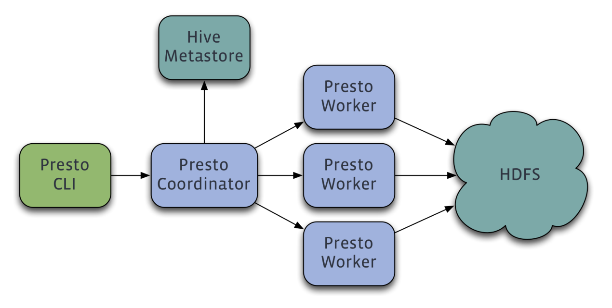
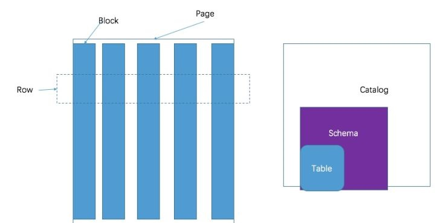

# Presto

## 一、介绍

* Facebook的数据仓库存储在少量大型Hadoop/HDFS集群。Hive是Facebook在几年前专为Hadoop打造的一款数据仓库工具。
* 在以前，Facebook的科学家和分析师一直依靠Hive来做数据分析。但Hive使用MapReduce作为底层计算框架，是专为批处理设计的。但随着数据越来越多，使用Hive进行一个简单的数据查询可能要花费几分到几小时，显然不能满足交互式查询的需求。Facebook也调研了其他比Hive更快的工具，但它们要么在功能有所限制要么就太简单，以至于无法操作Facebook庞大的数据仓库。
* 2012年开始试用的一些外部项目都不合适，他们决定自己开发，这就是Presto。2012年秋季开始开发，目前该项目已经在超过 1000名Facebook雇员中使用，运行超过30000个查询，每日数据在1PB级别。Facebook称Presto的性能比Hive要好上10倍多。2013年Facebook正式宣布开源Presto。

## 二、架构



* Presto查询引擎是一个Master-Slave的架构，由一个Coordinator节点，一个Discovery Server节点，多个Worker节点组成，Discovery Server通常内嵌于Coordinator节点中。
* Coordinator负责解析SQL语句，生成执行计划，分发执行任务给Worker节点执行。
* Worker节点负责实际执行查询任务。Worker节点启动后向Discovery Server服务注册，Coordinator从Discovery Server获得可以正常工作的Worker节点。
* 如果配置了Hive Connector，需要配置一个Hive MetaStore服务为Presto提供Hive元信息，Worker节点与HDFS交互读取数据。

## 三、数据模型

**presto采取三层表结构：**

1. catalog 对应某一类数据源，例如hive的数据，或mysql的数据
2. schema 对应mysql中的数据库
3. table 对应mysql中的表



## 四、特点

* **1.多数据源、混合计算支持**

支持众多常见的数据源，并且可以进行混合计算分析；

* **2.大数据**

完全的内存计算，支持的数据量完全取决于集群内存大小。他不像SparkSQL可以配置把溢出的数据持久化到磁盘，Presto是完完全全的内存计算；

* **3.高性能：**

低延迟高并发的内存计算引擎，相比Hive（无论MR、Tez、Spark执行引擎）、Impala 执行效率要高很多。根据Facebook和京东的测试报告，至少提升10倍以上；

* **4.支持ANSI SQL**

这点不像Hive、SparkSQL都是以HQL为基础（方言），Presto是标准的SQL。用户可以使用标准SQL进行数据查询和分析计算；

* **5.扩展性**

有众多 SPI 扩展点支持，开发人员可编写UDF、UDTF。甚至可以实现自定义的Connector，实现索引下推，借助外置的索引能力，实现特殊场景下的 MPP；

* **6.流水线**

Presto 是基于PipeLine进行设计，在大量数据计算过程中，终端用户(Driver)无需等到所有数据计算完成才能看到结果。一旦开始计算就可立即产生一部分结果返回，后续的计算结果会以多个Page返回给终端用户（Driver）。

## 五、集群安装

* **下载**

  * https://prestodb.io/download.html
  * 选择Server Deploy下载（wget命令下载太慢了，建议下载后上传到服务器）

* **解压**

  ```sh
  mkdir -p /data/presto
  # 复制文件到presto
  cd /data/presto
  tar -zxvf presto-server-0.237.2.tar.gz
  mkdir -p /data/presto/data
  ```

* **创建配置文件目录**

  ```sh
  mkdir etc
  cd etc
  ```

  * 这个目录下为各个系统的配置文件
    * **node.properties**: 各节点的环境配置
    * **jvm.config**：JVM配置
    * **config.properties**：Presto Server配置
    * **catalog.properties**：数据源配置

* **创建node.properties**

  ```properties
  # 集群环境名称
  node.environment=production
  # 节点id，所有节点id不可重复
  node.id=node01
  # 存储目录，包含日志，数据存储目录
  node.data-dir=/data/presto/data
  ```

* **创建jvm.config**

  ```config
  -server
  -Xmx16G
  -XX:+UseG1GC
  -XX:G1HeapRegionSize=32M
  -XX:+UseGCOverheadLimit
  -XX:+ExplicitGCInvokesConcurrent
  -XX:+HeapDumpOnOutOfMemoryError
  -XX:+ExitOnOutOfMemoryError
  ```

* **创建config.properties**

  ```properties
  # coordinator节点
  # 是否是coordinator角色
  coordinator=true
  # coordinator角色是否包含调度工作，因为调度工作影响查询性能
  node-scheduler.include-coordinator=false
  # 对外显示端口
  http-server.http.port=8080
  # 单个查询使用分布式最大内存
  query.max-memory=50GB
  # 单个查询单节点最大内存
  query.max-memory-per-node=1GB
  # 一台查询节点最大内存
  query.max-total-memory-per-node=2GB
  # 服务发现
  discovery-server.enabled=true
  # 服务发现地址
  discovery.uri=http://example.net:8080
  ```

  ```properties
  # worker节点
  coordinator=false
  http-server.http.port=8080
  query.max-memory=50GB
  query.max-memory-per-node=1GB
  query.max-total-memory-per-node=2GB
  discovery.uri=http://example.net:8080
  ```

  ```properties
  # coordinator+work节点
  coordinator=true
  node-scheduler.include-coordinator=true
  http-server.http.port=8080
  query.max-memory=5GB
  query.max-memory-per-node=1GB
  query.max-total-memory-per-node=2GB
  discovery-server.enabled=true
  discovery.uri=http://example.net:8080
  ```

* **log.properties**

  ```properties
  # 日志
  com.facebook.presto=INFO
  ```

* **catalog**

  * 访问数据的==**connectors**==配置，connector提供所有一个catalog下的所有schama信息。例如，链接Hive，定义为*hive*的catalog，Hive中有一个*web*数据库，*clicks*表，那么这个表可以在Presto中，可以使用`hive.web.clicks`进行访问。
  * Catalogs需要在`etc/catalog`目录下创建catalogd的properties配置文件。

  ```properties
  # jmx链接配置
  connector.name=jmx
  ```

* **文件分发**

  * 使用scp，把数据分发到其他节点。
  * 修改每个节点的`node.properties`配置文件
  * 修改每个节点的`config.properties`配置文件

* **启动**

  ```sh
  # 启动
  bin/launcher start
  # 停止
  bin/launcher stop
  ```


## 六、连接数据库

### 6.1 MySql

```properties
# vim catalog/mysql.properties
connector.name=mysql
connection-url=jdbc:mysql://190.1.1.124:3307
connection-user=root
connection-password=LbAZ3FGlMjUBhN08
```

### 6.2 Hive

```properties
# vim catalog/hive.properties
connector.name=hive-hadoop2
hive.metastore.uri=thrift://ip:9083
hive.config.resources=/etc/hadoop/conf/core-site.xml,/etc/hadoop/conf/hdfs-site.xml
```

