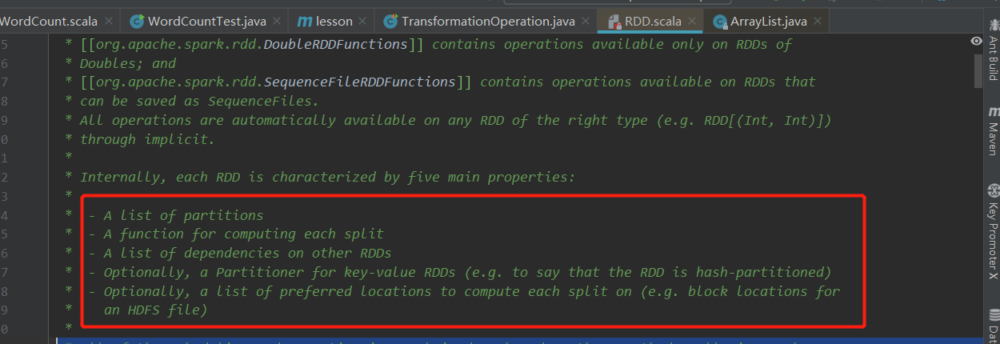
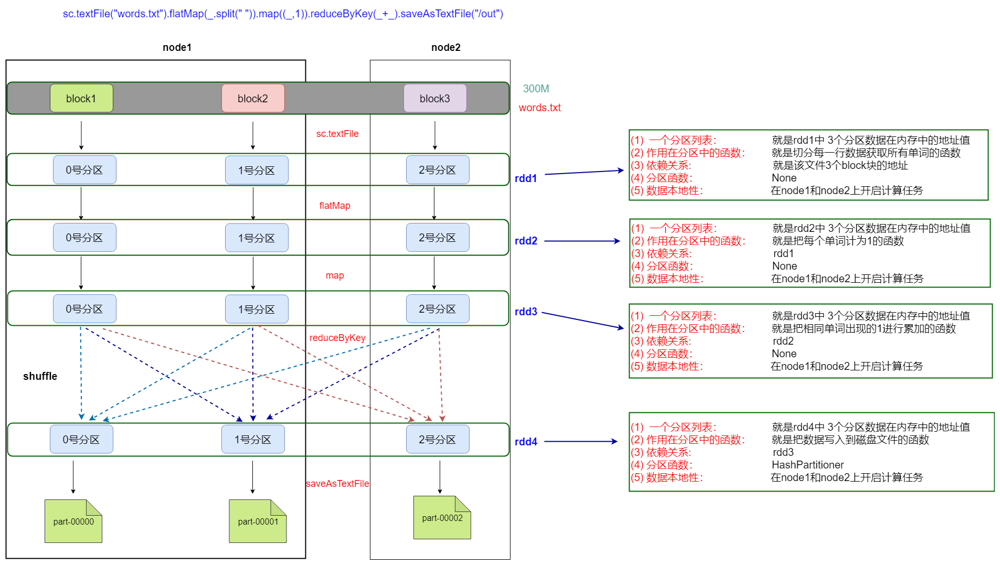

# RDD

## 一、RDD是什么

* RDD（Resilient Distributed Dataset）叫做==弹性分布式数据集==，是Spark中最基本的数据抽象，它代表一个不可变、可分区、里面的元素可并行计算的集合.
  * **Dataset**：就是一个集合，存储很多数据.
  * **Distributed**：它内部的元素进行了分布式存储，方便于后期进行分布式计算.
  * **Resilient**： 表示弹性，rdd的数据是可以保存在内存或者是磁盘中.

## 二、RDD五大属性



- ==A list of partitions==

  一个分区（Partition）列表，数据集的基本组成单位。

  ```
  这里表示一个rdd有很多分区，每一个分区内部是包含了该rdd的部分数据，
  spark中任务是以task线程的方式运行， 一个分区就对应一个task线程。
  用户可以在创建RDD时指定RDD的分区个数，如果没有指定，那么就会采用默认值。
  （比如：读取HDFS上数据文件产生的RDD分区数跟block的个数相等）
  ```

- ==A function for computing each split==

  一个计算每个分区的函数

  ```
  Spark中RDD的计算是以分区为单位的，每个RDD都会实现compute计算函数以达到这个目的.
  ```

- ==A list of dependencies on other RDDs==

  一个rdd会依赖于其他多个rdd

  ```
  这里就涉及到rdd与rdd之间的依赖关系，spark任务的容错机制就是根据这个特性而来。
  ```

- ==Optionally, a Partitioner for key-value RDDs (e.g. to say that the RDD is hash-partitioned)==

  一个Partitioner，即RDD的分区函数（可选项）

  ```
  当前Spark中实现了两种类型的分区函数，
  一个是基于哈希的HashPartitioner，另外一个是基于范围的RangePartitioner。
  只有对于key-value的RDD,并且产生shuffle，才会有Partitioner，非key-value的RDD的Parititioner的值是None。
  ```

- ==Optionally, a list of preferred locations to compute each split on (e.g. block locations for*    an HDFS file)==

  一个列表，存储每个Partition的优先位置(可选项)

  ```
  这里涉及到数据的本地性，数据块位置最优。
  spark任务在调度的时候会优先考虑存有数据的节点开启计算任务，减少数据的网络传输，提升计算效率。
  ```

## 三、基于spark的单词统计程序剖析rdd的五大属性

* HDFS上有一个大小为`300M`的文件，通过spark实现文件单词统计，最后把结果数据保存到HDFS上

* ```scala
  sc.textFile("/words.txt").flatMap(_.split(" ")).map((_,1)).reduceByKey(_+_).saveAsTextFile("/out")
  ```

* 

## 四、RDD的创建方式

1. 通过已经存在的scala集合去构建

   ```scala
   val rdd1=sc.parallelize(List(1,2,3,4,5))
   val rdd2=sc.parallelize(Array("hadoop","hive","spark"))
   val rdd3=sc.makeRDD(List(1,2,3,4))
   ```

2. 加载外部的数据源去构建

   ```scala
   val rdd1=sc.textFile("/words.txt")
   ```

3. 从已经存在的rdd进行转换生成一个新的rdd

   ```scala
   val rdd2=rdd1.flatMap(_.split(" "))
   val rdd3=rdd2.map((_,1))
   ```

## 五、RDD的算子分类

- ==transformation（转换）==
  - 根据已经存在的rdd转换生成一个新的rdd,  它是延迟加载，它不会立即执行
  - 例如
    - map / flatMap / reduceByKey 等
- ==action (动作)==
  - 它会真正触发任务的运行
    - 将rdd的计算的结果数据返回给Driver端，或者是保存结果数据到外部存储介质中
  - 例如
    - collect / saveAsTextFile 等

## 六、RDD常见的算子操作说明

### 6.1 transformation算子

| **转换**                                            | **含义**                                                     |
| --------------------------------------------------- | ------------------------------------------------------------ |
| **map(func)**                                       | 返回一个新的RDD，该RDD由每一个输入元素经过func函数转换后组成 |
| **filter(func)**                                    | 返回一个新的RDD，该RDD由经过func函数计算后返回值为true的输入元素组成 |
| **flatMap(func)**                                   | 类似于map，但是每一个输入元素可以被映射为0或多个输出元素（所以func应该返回一个序列，而不是单一元素） |
| **mapPartitions(func)**                             | 类似于map，但独立地在RDD的每一个分片上运行，因此在类型为T的RDD上运行时，func的函数类型必须是Iterator[T] => Iterator[U] |
| **mapPartitionsWithIndex(func)**                    | 类似于mapPartitions，但func带有一个整数参数表示分片的索引值，因此在类型为T的RDD上运行时，func的函数类型必须是(Int, Interator[T]) => Iterator[U] |
| **union(otherDataset)**                             | 对源RDD和参数RDD求并集后返回一个新的RDD                      |
| **intersection(otherDataset)**                      | 对源RDD和参数RDD求交集后返回一个新的RDD                      |
| **distinct([numTasks]))**                           | 对源RDD进行去重后返回一个新的RDD                             |
| **groupByKey([numTasks])**                          | 在一个(K,V)的RDD上调用，返回一个(K, Iterator[V])的RDD        |
| **reduceByKey(func, [numTasks])**                   | 在一个(K,V)的RDD上调用，返回一个(K,V)的RDD，使用指定的reduce函数，将相同key的值聚合到一起，与groupByKey类似，reduce任务的个数可以通过第二个可选的参数来设置 |
| **sortByKey([ascending], [numTasks])**              | 在一个(K,V)的RDD上调用，K必须实现Ordered接口，返回一个按照key进行排序的(K,V)的RDD |
| **sortBy(func,[ascending], [numTasks])**            | 与sortByKey类似，但是更灵活                                  |
| **join(otherDataset, [numTasks])**                  | 在类型为(K,V)和(K,W)的RDD上调用，返回一个相同key对应的所有元素对在一起的(K,(V,W))的RDD |
| **cogroup(otherDataset, [numTasks])**               | 在类型为(K,V)和(K,W)的RDD上调用，返回一个(K,(Iterable<V>,Iterable<W>))类型的RDD |
| **coalesce(numPartitions)**                         | 减少 RDD 的分区数到指定值。                                  |
| **repartition(numPartitions)**                      | 重新给 RDD 分区                                              |
| **repartitionAndSortWithinPartitions(partitioner)** | 重新给 RDD 分区，并且每个分区内以记录的 key 排序             |

### 6.2 action算子

| **动作**                       | **含义**                                                     |
| ------------------------------ | ------------------------------------------------------------ |
| **reduce(func)**               | reduce将RDD中元素前两个传给输入函数，产生一个新的return值，新产生的return值与RDD中下一个元素（第三个元素）组成两个元素，再被传给输入函数，直到最后只有一个值为止。 |
| **collect()**                  | 在驱动程序中，以数组的形式返回数据集的所有元素               |
| **count()**                    | 返回RDD的元素个数                                            |
| **first()**                    | 返回RDD的第一个元素（类似于take(1)）                         |
| **take(n)**                    | 返回一个由数据集的前n个元素组成的数组                        |
| **takeOrdered(n, [ordering])** | 返回自然顺序或者自定义顺序的前 n 个元素                      |
| **saveAsTextFile(path)**       | 将数据集的元素以textfile的形式保存到HDFS文件系统或者其他支持的文件系统，对于每个元素，Spark将会调用toString方法，将它装换为文件中的文本 |
| **saveAsSequenceFile(path)**   | 将数据集中的元素以Hadoop sequencefile的格式保存到指定的目录下，可以使HDFS或者其他Hadoop支持的文件系统。 |
| **saveAsObjectFile(path)**     | 将数据集的元素，以 Java 序列化的方式保存到指定的目录下       |
| **countByKey()**               | 针对(K,V)类型的RDD，返回一个(K,Int)的map，表示每一个key对应的元素个数。 |
| **foreach(func)**              | 在数据集的每一个元素上，运行函数func                         |
| **foreachPartition(func)**     | 在数据集的每一个分区上，运行函数func                         |

## 七、RDD常用的算子操作演示

- 为了方便前期的测试和学习，可以使用spark-shell进行演示

  ```shell
  spark-shell --master local[2]
  ```

### 7.1 map

```scala
val rdd1 = sc.parallelize(List(5, 6, 4, 7, 3, 8, 2, 9, 1, 10))

//把rdd1中每一个元素乘以10
rdd1.map(_*10).collect
```

### 7.2 filter

```scala
val rdd1 = sc.parallelize(List(5, 6, 4, 7, 3, 8, 2, 9, 1, 10))

//把rdd1中大于5的元素进行过滤
rdd1.filter(x => x >5).collect
```

### 7.3 flatMap

```scala
val rdd1 = sc.parallelize(Array("a b c", "d e f", "h i j"))
//获取rdd1中元素的每一个字母
rdd1.flatMap(_.split(" ")).collect
```

### 7.4 intersection、union

```scala
val rdd1 = sc.parallelize(List(5, 6, 4, 3))
val rdd2 = sc.parallelize(List(1, 2, 3, 4))
//求交集
rdd1.intersection(rdd2).collect

//求并集
rdd1.union(rdd2).collect
```

### 7.5 distinct

```scala
val rdd1 = sc.parallelize(List(1,1,2,3,3,4,5,6,7))
//去重
rdd1.distinct
```

### 7.6 join、groupByKey

```scala
val rdd1 = sc.parallelize(List(("tom", 1), ("jerry", 3), ("kitty", 2)))
val rdd2 = sc.parallelize(List(("jerry", 2), ("tom", 1), ("shuke", 2)))
//求join
val rdd3 = rdd1.join(rdd2)
rdd3.collect
//求并集
val rdd4 = rdd1 union rdd2
rdd4.groupByKey.collect
```

### 7.7 cogroup

```scala
val rdd1 = sc.parallelize(List(("tom", 1), ("tom", 2), ("jerry", 3), ("kitty", 2)))
val rdd2 = sc.parallelize(List(("jerry", 2), ("tom", 1), ("jim", 2)))
//分组
val rdd3 = rdd1.cogroup(rdd2)
rdd3.collect
```

### 7.8 reduce

```scala
val rdd1 = sc.parallelize(List(1, 2, 3, 4, 5))

//reduce聚合
val rdd2 = rdd1.reduce(_ + _)
rdd2.collect

val rdd3 = sc.parallelize(List("1","2","3","4","5"))
rdd3.reduce(_+_)

这里可能会出现多个不同的结果，由于元素在不同的分区中，每一个分区都是一个独立的task线程去运行。这些task运行有先后关系
```

### 7.9 reduceByKey、sortByKey

```scala
val rdd1 = sc.parallelize(List(("tom", 1), ("jerry", 3), ("kitty", 2),  ("shuke", 1)))
val rdd2 = sc.parallelize(List(("jerry", 2), ("tom", 3), ("shuke", 2), ("kitty", 5)))
val rdd3 = rdd1.union(rdd2)

//按key进行聚合
val rdd4 = rdd3.reduceByKey(_ + _)
rdd4.collect

//按value的降序排序
val rdd5 = rdd4.map(t => (t._2, t._1)).sortByKey(false).map(t => (t._2, t._1))
rdd5.collect
```


### 7.10 repartition、coalesce

```scala
val rdd1 = sc.parallelize(1 to 10,3)
//打印rdd1的分区数
rdd1.partitions.size

//利用repartition改变rdd1分区数
//减少分区
rdd1.repartition(2).partitions.size

//增加分区
rdd1.repartition(4).partitions.size

//利用coalesce改变rdd1分区数
//减少分区
rdd1.coalesce(2).partitions.size


//repartition:  重新分区， 有shuffle
//coalesce:     合并分区 / 减少分区 	默认不shuffle   
//默认 coalesce 不能扩大分区数量。除非添加true的参数，或者使用repartition。

//适用场景：
    //1、如果要shuffle，都用 repartition
    //2、不需要shuffle，仅仅是做分区的合并，coalesce
    //3、repartition常用于扩大分区。

```

### 7.11 map、mapPartitions   、mapPartitionsWithIndex

```scala
val rdd1=sc.parallelize(1 to 10,5)
rdd1.map(x => x*10)).collect
rdd1.mapPartitions(iter => iter.map(x=>x*10)).collect

//index表示分区号  可以获取得到每一个元素属于哪一个分区
rdd1.mapPartitionsWithIndex((index,iter)=>iter.map(x=>(index,x)))

map：用于遍历RDD,将函数f应用于每一个元素，返回新的RDD(transformation算子)。
mapPartitions:用于遍历操作RDD中的每一个分区，返回生成一个新的RDD（transformation算子）。

总结：
如果在映射的过程中需要频繁创建额外的对象，使用mapPartitions要比map高效
比如，将RDD中的所有数据通过JDBC连接写入数据库，如果使用map函数，可能要为每一个元素都创建一个connection，这样开销很大，如果使用mapPartitions，那么只需要针对每一个分区建立一个connection。
```

### 7.12 foreach、foreachPartition

```scala
val rdd1 = sc.parallelize(List(5, 6, 4, 7, 3, 8, 2, 9, 1, 10))

//foreach实现对rdd1里的每一个元素乘10然后打印输出
rdd1.foreach(println(_ * 10))

//foreachPartition实现对rdd1里的每一个元素乘10然后打印输出
rdd1.foreachPartition(iter => iter.foreach(println(_ * 10)))

foreach:用于遍历RDD,将函数f应用于每一个元素，无返回值(action算子)。
foreachPartition: 用于遍历操作RDD中的每一个分区。无返回值(action算子)。


总结：
一般使用mapPartitions或者foreachPartition算子比map和foreach更加高效，推荐使用。
```

## 八、通过spark实现点击流日志分析案例

### 8.1 统计PV

```scala

import org.apache.spark.rdd.RDD
import org.apache.spark.{SparkConf, SparkContext}

//TODO:利用spark实现点击流日志分析---------> PV
object PV {
  def main(args: Array[String]): Unit = {
    //1、构建SparkConf
    val sparkConf: SparkConf = new SparkConf().setAppName("PV").setMaster("local[2]")

    //2、构建SparkContext
    val sc = new SparkContext(sparkConf)
    sc.setLogLevel("warn")

    //3、读取数据文件
    val data: RDD[String] = sc.textFile("E:\\data\\access.log")

    //4、统计pv
    val pv: Long = data.count()
    println("PV:"+pv)

    sc.stop()

  }
}
```

### 8.2 统计UV

```scala


import org.apache.spark.{SparkConf, SparkContext}
import org.apache.spark.rdd.RDD

//TODO:利用spark实现点击流日志分析-----------UV
object UV {

  def main(args: Array[String]): Unit = {
    //1、构建SparkConf
    val sparkConf: SparkConf = new SparkConf().setAppName("UV").setMaster("local[2]")

    //2、构建SparkContext
    val sc = new SparkContext(sparkConf)
    sc.setLogLevel("warn")

    //3、读取数据文件
    val data: RDD[String] = sc.textFile("E:\\data\\access.log")


    //4、切分每一行，获取第一个元素 也就是ip
    val ips: RDD[String] = data.map( x =>x.split(" ")(0))

    //5、按照ip去重
    val distinctRDD: RDD[String] = ips.distinct()

    //6、统计uv
    val uv: Long = distinctRDD.count()
    println("UV:"+uv)

    sc.stop()

  }
}
```

### 8.3 统计TopN

```scala
import org.apache.spark.{SparkConf, SparkContext}
import org.apache.spark.rdd.RDD

//todo:利用spark实现点击流日志分析-----------TopN(求页面访问次数最多的前N位)
object TopN {
  def main(args: Array[String]): Unit = {
    //1、构建SparkConf
    val sparkConf: SparkConf = new SparkConf().setAppName("TopN").setMaster("local[2]")

    //2、构建SparkContext
    val sc = new SparkContext(sparkConf)
    sc.setLogLevel("warn")

    //3、读取数据文件
    val data: RDD[String] = sc.textFile("E:\\data\\access.log")

    //4、切分每一行，过滤出丢失的字段数据，获取页面地址
    val filterRDD: RDD[String] = data.filter(x=>x.split(" ").length>10)
    val urlAndOne: RDD[(String, Int)] = filterRDD.map(x=>x.split(" ")(10)).map((_,1))

    //5、相同url出现的1累加
    val result: RDD[(String, Int)] = urlAndOne.reduceByKey(_+_)

    //6、按照次数降序
    val sortedRDD: RDD[(String, Int)] = result.sortBy(_._2,false)

    //7、取出url出现次数最多的前5位
    val top5: Array[(String, Int)] = sortedRDD.take(5)
    top5.foreach(println)

    sc.stop()
  }
}
```

## 九、通过spark读取文件数据写入mysql表中

* 添加mysql依赖

  ```xml
  <dependency>
      <groupId>mysql</groupId>
      <artifactId>mysql-connector-java</artifactId>
      <version>5.1.38</version>
  </dependency>
  ```

### 9.1 foreach算子实现

```scala
import java.sql.{Connection, DriverManager, PreparedStatement}

import org.apache.spark.rdd.RDD
import org.apache.spark.{SparkConf, SparkContext}

object Data2MysqlForeach {
  def main(args: Array[String]): Unit = {
    //1、构建SparkConf
    val sparkConf: SparkConf = new SparkConf().setAppName("Data2MysqlForeach").setMaster("local[2]")

    //2、构建SparkContext
    val sc = new SparkContext(sparkConf)
    sc.setLogLevel("warn")

    //3、读取数据文件
    val data: RDD[String] = sc.textFile("E:\\data\\person.txt")

    //4、切分每一行    // id  name  age
    val personRDD: RDD[(String, String, Int)] = data.map(x => x.split(",")).map(x => (x(0), x(1), x(2).toInt))

    //5、把数据保存到mysql表中
        personRDD.foreach(line =>{
          	//每条数据与mysql建立连接
          	//把数据插入到mysql表操作
            //1、获取连接
              val connection: Connection = DriverManager.getConnection("jdbc:mysql://node1:3306/spark","root","123456")

            //2、定义插入数据的sql语句
              val sql="insert into person(id,name,age) values(?,?,?)"

            //3、获取PreParedStatement

             try {
               val ps: PreparedStatement = connection.prepareStatement(sql)

               //4、获取数据,给？号 赋值
               ps.setString(1, line._1)
               ps.setString(2, line._2)
               ps.setInt(3, line._3)

               ps.execute()
             } catch {
               case e:Exception => e.printStackTrace()
             } finally {
               if(connection !=null){
                 connection.close()
               }

             }
        })

    }
 }
```


### 9.2 foreachPartition 算子实现

```scala
import java.sql.{Connection, DriverManager, PreparedStatement}

import org.apache.spark.rdd.RDD
import org.apache.spark.{SparkConf, SparkContext}

object Data2MysqlForeachPartitions {
  def main(args: Array[String]): Unit = {
    //1、构建SparkConf
    val sparkConf: SparkConf = new SparkConf().setAppName("Data2MysqlForeachPartitions").setMaster("local[2]")

    //2、构建SparkContext
    val sc = new SparkContext(sparkConf)
    sc.setLogLevel("warn")

    //3、读取数据文件
    val data: RDD[String] = sc.textFile("E:\\data\\person.txt")

    //4、切分每一行    // id  name  age
    val personRDD: RDD[(String, String, Int)] = data.map(x => x.split(",")).map(x => (x(0), x(1), x(2).toInt))

    //5、把数据保存到mysql表中
    //使用foreachPartition每个分区建立一次链接，减少与mysql链接次数
    personRDD.foreachPartition( iter =>{
      //把数据插入到mysql表操作
      //1、获取连接
      val connection: Connection = DriverManager.getConnection("jdbc:mysql://node1:3306/spark","root","123456")

      //2、定义插入数据的sql语句
      val sql="insert into person(id,name,age) values(?,?,?)"

      //3、获取PreParedStatement

      try {
        val ps: PreparedStatement = connection.prepareStatement(sql)

        //4、获取数据,给？号 赋值
        iter.foreach(line =>{

          ps.setString(1, line._1)
          ps.setString(2, line._2)
          ps.setInt(3, line._3)
          ps.execute()
        })

      } catch {
        case e:Exception => e.printStackTrace()
      } finally {
        if(connection !=null){
          connection.close()
        }

      }
    }

  }
}

```

## 十、通过spark读取文件数据写入hbase表中

* 添加HBase依赖

  ```xml
  <dependency>
      <groupId>org.apache.hbase</groupId>
      <artifactId>hbase-client</artifactId>
      <version>1.2.1</version>
  </dependency>
  ```

* 代码

  ```scala
  
  import java.util
  
  import org.apache.hadoop.conf.Configuration
  import org.apache.hadoop.hbase.{HBaseConfiguration, TableName}
  import org.apache.hadoop.hbase.client.{Connection, ConnectionFactory, Put, Table}
  import org.apache.spark.rdd.RDD
  import org.apache.spark.{SparkConf, SparkContext}
  
  //todo:通过spark读取数据文件，把结果数据保存到hbase表中
  object Data2Hbase {
  
    def main(args: Array[String]): Unit = {
      //1、创建SparkConf
      val sparkConf: SparkConf = new SparkConf().setAppName("Data2Hbase").setMaster("local[2]")
  
      //2、构建SparkContext
      val sc = new SparkContext(sparkConf)
      sc.setLogLevel("warn")
  
      //3、读取文件数据
      val usersRDD: RDD[Array[String]] = sc.textFile("E:\\data\\users.dat").map(x=>x.split("::"))
  
      //4、保存结果数据到hbase表中
      usersRDD.foreachPartition(iter =>{
  
        //4.1 获取hbase的数据库连接
        val configuration: Configuration = HBaseConfiguration.create()
        //指定zk集群的地址
        configuration.set("hbase.zookeeper.quorum","node1:2181,node2:2181,node3:2181")
        val connection: Connection = ConnectionFactory.createConnection(configuration)
  
        //4.2 对于hbase表进行操作这里需要一个Table对象
        val table: Table = connection.getTable(TableName.valueOf("person"))
  
        //4.3 把数据保存在表中
        try {
          iter.foreach(x => {
            val put = new Put(x(0).getBytes)
            val puts = new util.ArrayList[Put]()
            //构建数据
            val put1: Put = put.addColumn("f1".getBytes, "gender".getBytes, x(1).getBytes)
            val put2: Put = put.addColumn("f1".getBytes, "age".getBytes, x(2).getBytes)
            val put3: Put = put.addColumn("f2".getBytes, "position".getBytes, x(3).getBytes)
            val put4: Put = put.addColumn("f2".getBytes, "code".getBytes, x(4).getBytes)
  
            puts.add(put1)
            puts.add(put2)
            puts.add(put3)
            puts.add(put4)
  
            //提交数据
            table.put(puts)
          })
        } catch {
          case e:Exception =>e.printStackTrace()
        } finally {
          if(connection !=null){
            connection.close()
          }
        }
  
      })
  
      sc.stop()
    }
  }
  
  ```

  