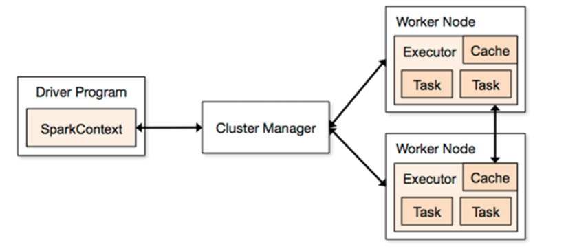
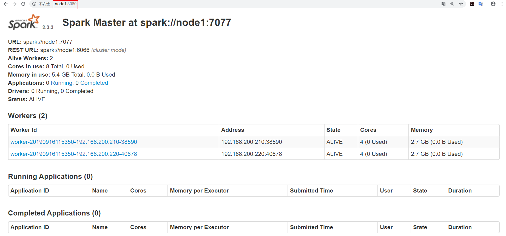

# Spark

## 一、Spark简介

* **Apache Spark™** is a unified analytics engine for large-scale data processing.

* spark是针对于大规模数据处理的统一分析引擎

  ```
  	spark是在Hadoop基础上的改进，是UC Berkeley AMP lab所开源的类Hadoop MapReduce的通用的并行计算框架，Spark基于map reduce算法实现的分布式计算，拥有Hadoop MapReduce所具有的优点；但不同于MapReduce的是Job中间输出和结果可以保存在内存中，从而不再需要读写HDFS，因此Spark能更好地适用于数据挖掘与机器学习等需要迭代的map reduce的算法。
  	
  	spark是基于内存计算框架，计算速度非常之快，但是它仅仅只是涉及到计算，并没有涉及到数据的存储，后期需要使用spark对接外部的数据源，比如hdfs。
  ```

## 二、Spark的四大特性

### 2.1 速度快

* 运行速度提高100倍

  Apache Spark使用最先进的DAG调度程序，查询优化程序和物理执行引擎，实现批量和流式数据的高性能。

* spark比mapreduce快的2个主要原因

  - ==基于内存==

    ```
    mapreduce任务后期再计算的时候，每一个job的输出结果会落地到磁盘，后续有其他的job需要依赖于前面job的输出结果，这个时候就需要进行大量的磁盘io操作。性能就比较低。
    
    spark任务后期再计算的时候，job的输出结果可以保存在内存中，后续有其他的job需要依赖于前面job的输出结果，这个时候就直接从内存中获取得到，避免了磁盘io操作，性能比较高
    ```

  - ==进程与线程==

    ```
    （1）mapreduce任务以进程的方式运行在yarn集群中，比如程序中有100个MapTask，一个task就需要一个进程，这些task要运行就需要开启100个进程。
    
    （2）spark任务以线程的方式运行在进程中，比如程序中有100个MapTask，后期一个task就对应一个线程，这里就不在是进程，这些task需要运行，这里可以极端一点：
    只需要开启1个进程，在这个进程中启动100个线程就可以了。
    进程中可以启动很多个线程，而开启一个进程与开启一个线程需要的时间和调度代价是不一样。 开启一个进程需要的时间远远大于开启一个线程。
    ```

### 2.2 易用性

* 可以快速去编写spark程序通过 java/scala/python/R/SQL等不同语言

### 2.3 通用性

* spark框架不在是一个简单的框架，可以把spark理解成一个**生态系统**，它内部是包含了很多模块，基于不同的应用场景可以选择对应的模块去使用
  - **sparksql**
    - 通过sql去开发spark程序做一些离线分析
  - **sparkStreaming**
    - 主要是用来解决公司有实时计算的这种场景
  - **Mlib**
    - 它封装了一些机器学习的算法库
  - **Graphx**
    - 图计算

### 2.4 兼容性

* spark程序就是一个计算逻辑程序，这个任务要运行就需要计算资源（内存、cpu、磁盘），哪里可以给当前这个任务提供计算资源，就可以把spark程序提交到哪里去运行
  - **standAlone**
    - 它是spark自带的集群模式，整个任务的资源分配由spark集群的老大Master负责
  - **yarn**
    - 可以把spark程序提交到yarn中运行，整个任务的资源分配由yarn中的老大ResourceManager负责
  - **mesos**
    - 它也是apache开源的一个类似于yarn的资源调度平台。

## 三、Spark集群架构



* **==Driver==**
  - 它会执行客户端写好的main方法，它会构建一个名叫SparkContext对象
  - 该对象是所有spark程序的执行入口

- **==Application==**
  - 就是一个spark的应用程序，它是包含了客户端的代码和任务运行的资源信息

- **==ClusterManager==**
  - 它是给程序提供计算资源的外部服务
    - **standAlone**
      - 它是spark自带的集群模式，整个任务的资源分配由spark集群的老大Master负责
    - **yarn**
      - 可以把spark程序提交到yarn中运行，整个任务的资源分配由yarn中的老大ResourceManager负责
    - **mesos**
      - 它也是apache开源的一个类似于yarn的资源调度平台。

- **==Master==**
  - 它是整个spark集群的老大，负责任务资源的分配

- **==Worker==**
  - 它是整个spark集群的小弟，负责任务计算的节点

- **==Executor==**
  - 它是一个进程，它会在worker节点启动该进程（计算资源）

- **==Task==**
  - spark任务是以task线程的方式运行在worker节点对应的executor进程中

## 四、Spark集群安装部署

1. 下载、解压

2. 修改配置文件`spark-env.sh`

   ```shell
   # mv spark-env.sh.template spark-env.sh
   # 配置java的环境变量
   export JAVA_HOME=/opt/bigdata/jdk
   # 配置zk相关信息
   # 集群配置
   export SPARK_DAEMON_JAVA_OPTS="-Dspark.deploy.recoveryMode=ZOOKEEPER  -Dspark.deploy.zookeeper.url=node1:2181,node2:2181,node3:2181  -Dspark.deploy.zookeeper.dir=/spark"
   ```

3. 修改配置文件`salves`

   ```
   # mv slaves.template salves
   # 指定spark集群的worker节点
   node2
   node3
   ```

## 五、集群的启动和停止

1. 启动Zookeeper

2. 启动集群

   - 可以在任意一台服务器来执行（条件：需要任意2台机器之间实现ssh免密登录）
     - ==$SPARK_HOME/sbin/start-all.sh==
     - 在哪里启动这个脚本，就在当前该机器启动一个Master进程
     - 整个集群的worker进程的启动由slaves文件
   - 后期可以在其他机器单独在启动master
     - ==$SPARK_HOME/sbin/start-master.sh==

   ```
   (1) 如何恢复到上一次活着master挂掉之前的状态?
   	在高可用模式下，整个spark集群就有很多个master，其中只有一个master被zk选举成活着的master，其他的多个master都处于standby，同时把整个spark集群的元数据信息通过zk中节点进行保存。
   
   	后期如果活着的master挂掉。首先zk会感知到活着的master挂掉，下面开始在多个处于standby中的master进行选举，再次产生一个活着的master，这个活着的master会读取保存在zk节点中的spark集群元数据信息，恢复到上一次master的状态。整个过程在恢复的时候经历过了很多个不同的阶段，每个阶段都需要一定时间，最终恢复到上个活着的master的转态，整个恢复过程一般需要1-2分钟。
   
   (2) 在master的恢复阶段对任务的影响?
   
      a）对已经运行的任务是没有任何影响
      	  由于该任务正在运行，说明它已经拿到了计算资源，这个时候就不需要master。
      	  
      b) 对即将要提交的任务是有影响
      	  由于该任务需要有计算资源，这个时候会找活着的master去申请计算资源，由于没有一个活着的master,该任务是获取不到计算资源，也就是任务无法运行。
   ```

3. 停止集群

   - 在处于active Master主节点执行
     - ==$SPARK_HOME/sbin/stop-all.sh==

   - 在处于standBy Master主节点执行
     - ==$SPARK_HOME/sbin/stop-master.sh==

## 六、Sprark集群Web管理页面

当启动好spark集群之后，可以访问这样一个地址

- http://ip:8080

- 可以通过这个web界面观察到很多信息

  - 整个spark集群的详细信息
  - 整个spark集群总的资源信息
  - 整个spark集群已经使用的资源信息
  - 整个spark集群还剩的资源信息
  - 整个spark集群正在运行的任务信息
  - 整个spark集群已经完成的任务信息

  

## 七、Spark任务提交

### 7.1 普通模式提交 (指定活着的master地址)

```bash
bin/spark-submit \
--class org.apache.spark.examples.SparkPi \
--master spark://node1:7077 \
--executor-memory 1G \
--total-executor-cores 2 \
examples/jars/spark-examples_2.11-2.3.3.jar \
10


####参数说明
--class：指定包含main方法的主类
--master：指定spark集群master地址
--executor-memory：指定任务在运行的时候需要的每一个executor内存大小
--total-executor-cores： 指定任务在运行的时候需要总的cpu核数

```

### 7.2 高可用模式提交 (集群有很多个master）

```shell
bin/spark-submit \
--class org.apache.spark.examples.SparkPi \
--master spark://node1:7077,node2:7077,node3:7077 \
--executor-memory 1G \
--total-executor-cores 2 \
examples/jars/spark-examples_2.11-2.3.3.jar \
10

spark集群中有很多个master，并不知道哪一个master是活着的master，即使你知道哪一个master是活着的master，它也有可能下一秒就挂掉，这里就可以把所有master都罗列出来
--master spark://node1:7077,node2:7077,node3:7077
# 由一个节点转化为多个Master节点

后期程序会轮训整个master列表，最终找到活着的master，然后向它申请计算资源，最后运行程序。
```

## 八、Spark Shell

### 8.1 运行spark-shell --master local[N] 读取本地文件进行单词统计

- --master local[N]

  - local 表示程序在本地进行计算，跟spark集群目前没有任何关系
  - N  它是一个正整数，表示使用N个线程参与任务计算
  - local[N] 表示本地采用N个线程计算任务
  - 默认会产生一个SparkSubmit进程

- spark-shell local[2]

  ```scala
  sc.textFile("file:///home/hadoop/words.txt").flatMap(x=>x.split(" ")).map(x=>(x,1)).reduceByKey((x,y)=>x+y).collect
  
  sc.textFile("file:///home/hadoop/words.txt").flatMap(_.split(" ")).map((_,1)).reduceByKey(_+_).collect
  ```

### 8.2 运行spark-shell --master local[N] 读取HDFS上文件进行单词统计

* spark-shell --master local[N] 

- spark整合HDFS

  - 在node1上修改配置文件
    - vim spark-env.sh

  ```shell
  export HADOOP_CONF_DIR=/opt/bigdata/hadoop/etc/hadoop
  ```

  - 分发到其他节点

  ```shell
  scp spark-env.sh node2:/opt/bigdata/spark/conf
  scp spark-env.sh node3:/opt/bigdata/spark/conf
  ```

- spark-shell --master local[2]

  ```scala
  // 指定本机hdfs
  sc.textFile("/words.txt").flatMap(_.split(" ")).map((_,1)).reduceByKey(_+_).collect
  
  // 指定某个HDFS
  sc.textFile("hdfs://node1:9000/words.txt").flatMap(_.split(" ")).map((_,1)).reduceByKey(_+_).collect
  ```

### 8.3 运行spark-shell 指定集群中活着master 读取HDFS上文件进行单词统计

- spark-shell --master spark://node1:7077 --executor-memory 1g  --total-executor-cores 4

  - --master spark://node1:7077
    - 指定活着的master地址
  - --executor-memory 1g
    - 指定每一个executor进程的内存大小
  - --total-executor-cores 4
    - 指定总的executor进程cpu核数

  ```scala
  sc.textFile("hdfs://node1:9000/words.txt").flatMap(_.split(" ")).map((_,1)).reduceByKey(_+_).collect
  
  #实现读取hdfs上文件之后，需要把计算的结果保存到hdfs上
  sc.textFile("/words.txt").flatMap(_.split(" ")).map((_,1)).reduceByKey(_+_).saveAsTextFile("/out")
  ```

## 九、编程开发

### 9.1 maven依赖

* 注意scala版本依赖

```xml
<dependencies>
    <dependency>
        <groupId>org.apache.spark</groupId>
        <artifactId>spark-core_2.11</artifactId>
        <version>2.3.3</version>
    </dependency>
</dependencies>


 <build>
        <sourceDirectory>src/main/scala</sourceDirectory>
        <testSourceDirectory>src/test/scala</testSourceDirectory>
        <plugins>
            <plugin>
                <groupId>net.alchim31.maven</groupId>
                <artifactId>scala-maven-plugin</artifactId>
                <version>3.2.2</version>
                <executions>
                    <execution>
                        <goals>
                            <goal>compile</goal>
                            <goal>testCompile</goal>
                        </goals>
                        <configuration>
                            <args>
                                <arg>-dependencyfile</arg>
                                <arg>${project.build.directory}/.scala_dependencies</arg>
                            </args>
                        </configuration>
                    </execution>
                </executions>
            </plugin>
            <plugin>
                <groupId>org.apache.maven.plugins</groupId>
                <artifactId>maven-shade-plugin</artifactId>
                <version>2.4.3</version>
                <executions>
                    <execution>
                        <phase>package</phase>
                        <goals>
                            <goal>shade</goal>
                        </goals>
                        <configuration>
                            <filters>
                                <filter>
                                    <artifact>*:*</artifact>
                                    <excludes>
                                        <exclude>META-INF/*.SF</exclude>
                                        <exclude>META-INF/*.DSA</exclude>
                                        <exclude>META-INF/*.RSA</exclude>
                                    </excludes>
                                </filter>
                            </filters>
                            <transformers>
                                <transformer implementation="org.apache.maven.plugins.shade.resource.ManifestResourceTransformer">
                                    <mainClass></mainClass>
                                </transformer>
                            </transformers>
                        </configuration>
                    </execution>
                </executions>
            </plugin>
        </plugins>
 </build>
```

### 9.2 Scala本地运行

```scala


import org.apache.spark.rdd.RDD
import org.apache.spark.{SparkConf, SparkContext}

//todo: 利用scala语言开发spark程序实现单词统计
object WordCount {
  def main(args: Array[String]): Unit = {
    //1、构建sparkConf对象 设置application名称和master地址
    val sparkConf: SparkConf = new SparkConf().setAppName("WordCount").setMaster("local[2]")

    //2、构建sparkContext对象,该对象非常重要，它是所有spark程序的执行入口
    // 它内部会构建  DAGScheduler和 TaskScheduler 对象
    val sc = new SparkContext(sparkConf)

    //设置日志输出级别
    sc.setLogLevel("warn")

    //3、读取数据文件
    val data: RDD[String] = sc.textFile("E:\\words.txt")

    //4、 切分每一行，获取所有单词
    val words: RDD[String] = data.flatMap(x=>x.split(" "))

    //5、每个单词计为1
    val wordAndOne: RDD[(String, Int)] = words.map(x => (x,1))

    //6、相同单词出现的1累加
    val result: RDD[(String, Int)] = wordAndOne.reduceByKey((x,y)=>x+y)

    //按照单词出现的次数降序排列  第二个参数默认是true表示升序，设置为false表示降序
    val sortedRDD: RDD[(String, Int)] = result.sortBy( x=> x._2,false)

    //7、收集数据打印
    val finalResult: Array[(String, Int)] = sortedRDD.collect()
    finalResult.foreach(println)


    //8、关闭sc
    sc.stop()

  }
}

```

### 9.3 Scala集群运行

```scala

import org.apache.spark.rdd.RDD
import org.apache.spark.{SparkConf, SparkContext}

//todo: 利用scala语言开发spark程序实现单词统计
object WordCountOnSpark {
  def main(args: Array[String]): Unit = {
    //1、构建sparkConf对象 设置application名称
      // 这里是区分本地和集群运行的区别
    val sparkConf: SparkConf = new SparkConf().setAppName("WordCountOnSpark")

    //2、构建sparkContext对象,该对象非常重要，它是所有spark程序的执行入口
    // 它内部会构建  DAGScheduler和 TaskScheduler 对象
    val sc = new SparkContext(sparkConf)

    //设置日志输出级别
    sc.setLogLevel("warn")

    //3、读取数据文件
    val data: RDD[String] = sc.textFile(args(0))

    //4、 切分每一行，获取所有单词
    val words: RDD[String] = data.flatMap(x=>x.split(" "))

    //5、每个单词计为1
    val wordAndOne: RDD[(String, Int)] = words.map(x => (x,1))

    //6、相同单词出现的1累加
    val result: RDD[(String, Int)] = wordAndOne.reduceByKey((x,y)=>x+y)

    //7、把计算结果保存在hdfs上
    result.saveAsTextFile(args(1))

    //8、关闭sc
    sc.stop()

  }
}
```

9.4 Java本地运行

```java


import org.apache.spark.SparkConf;
import org.apache.spark.api.java.JavaPairRDD;
import org.apache.spark.api.java.JavaRDD;
import org.apache.spark.api.java.JavaSparkContext;
import org.apache.spark.api.java.function.FlatMapFunction;
import org.apache.spark.api.java.function.Function2;
import org.apache.spark.api.java.function.PairFunction;
import scala.Tuple2;

import java.util.Arrays;
import java.util.Iterator;
import java.util.List;

//todo: 利用java语言开发spark的单词统计程序
public class JavaWordCount {
    public static void main(String[] args) {
        //1、创建SparkConf对象
        SparkConf sparkConf = new SparkConf().setAppName("JavaWordCount").setMaster("local[2]");

        //2、构建JavaSparkContext对象
        JavaSparkContext jsc = new JavaSparkContext(sparkConf);

        //3、读取数据文件
        JavaRDD<String> data = jsc.textFile("E:\\words.txt");

        //4、切分每一行获取所有的单词   scala:  data.flatMap(x=>x.split(" "))
        JavaRDD<String> wordsJavaRDD = data.flatMap(new FlatMapFunction<String, String>() {
            public Iterator<String> call(String line) throws Exception {
                String[] words = line.split(" ");
                return Arrays.asList(words).iterator();
            }
        });

        //5、每个单词计为1    scala:  wordsJavaRDD.map(x=>(x,1))
        JavaPairRDD<String, Integer> wordAndOne = wordsJavaRDD.mapToPair(new PairFunction<String, String, Integer>() {
            public Tuple2<String, Integer> call(String word) throws Exception {
                return new Tuple2<String, Integer>(word, 1);
            }
        });

        //6、相同单词出现的1累加    scala:  wordAndOne.reduceByKey((x,y)=>x+y)
        JavaPairRDD<String, Integer> result = wordAndOne.reduceByKey(new Function2<Integer, Integer, Integer>() {
            public Integer call(Integer v1, Integer v2) throws Exception {
                return v1 + v2;
            }
        });

        //按照单词出现的次数降序 (单词，次数)  -->(次数,单词).sortByKey----> (单词，次数)
        JavaPairRDD<Integer, String> reverseJavaRDD = result.mapToPair(new PairFunction<Tuple2<String, Integer>, Integer, String>() {
            public Tuple2<Integer, String> call(Tuple2<String, Integer> t) throws Exception {
                return new Tuple2<Integer, String>(t._2, t._1);
            }
        });

        JavaPairRDD<String, Integer> sortedRDD = reverseJavaRDD.sortByKey(false).mapToPair(new PairFunction<Tuple2<Integer, String>, String, Integer>() {
            public Tuple2<String, Integer> call(Tuple2<Integer, String> t) throws Exception {
                return new Tuple2<String, Integer>(t._2, t._1);
            }
        });

        //7、收集打印
        List<Tuple2<String, Integer>> finalResult = sortedRDD.collect();

        for (Tuple2<String, Integer> t : finalResult) {
            System.out.println("单词："+t._1 +"\t次数："+t._2);
        }

        jsc.stop();

    }
}
```

