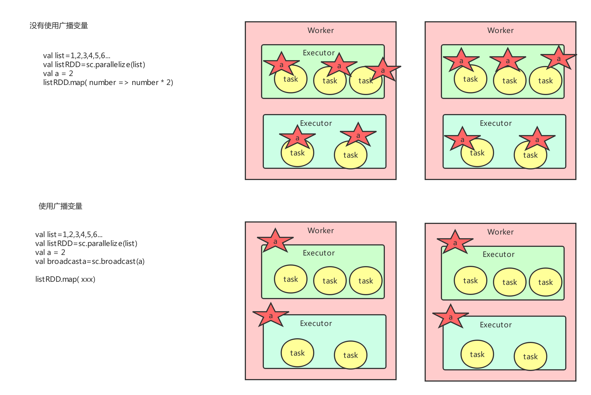
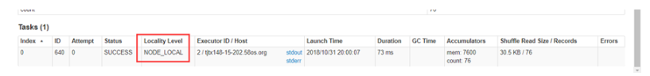

# Spark调优

## 一、十大开发原则

### 1.1 避免创建重复的RDD

通常来说，我们在开发一个Spark作业时，首先是基于某个数据源（比如Hive表或HDFS文件）创建一个初始的RDD；接着对这个RDD执行某个算子操作，然后得到下一个RDD；以此类推，循环往复，直到计算出最终我们需要的结果。在这个过程中，多个RDD会通过不同的算子操作（比如map、reduce等）串起来，这个“RDD串”，就是RDD lineage，也就是“RDD的血缘关系链”。

```java
// 需要对名为“hello.txt”的HDFS文件进行一次map操作，再进行一次reduce操作。也就是说，需要对一份数据执行两次算子操作。

// 错误的做法：对于同一份数据执行多次算子操作时，创建多个RDD。
// 这里执行了两次textFile方法，针对同一个HDFS文件，创建了两个RDD出来，然后分别对每个RDD都执行了一个算子操作。
// 这种情况下，Spark需要从HDFS上两次加载hello.txt文件的内容，并创建两个单独的RDD；第二次加载HDFS文件以及创建RDD的性能开销，很明显是白白浪费掉的。
val rdd1 = sc.textFile("hdfs://192.168.0.1:9000/hello.txt")
rdd1.map(...)
val rdd2 = sc.textFile("hdfs://192.168.0.1:9000/hello.txt")
rdd2.reduce(...)

// 正确的用法：对于一份数据执行多次算子操作时，只使用一个RDD。
// 这种写法很明显比上一种写法要好多了，因为我们对于同一份数据只创建了一个RDD，然后对这一个RDD执行了多次算子操作。
// 但是要注意到这里为止优化还没有结束，由于rdd1被执行了两次算子操作，第二次执行reduce操作的时候，还会再次从源头处重新计算一次rdd1的数据，因此还是会有重复计算的性能开销。
// 要彻底解决这个问题，必须结合“原则三：对多次使用的RDD进行持久化”，才能保证一个RDD被多次使用时只被计算一次。
val rdd1 = sc.textFile("hdfs://192.168.0.1:9000/hello.txt")
rdd1.map(...)
rdd1.reduce(...)
```

### 1.2 尽可能复用同一个RDD

除了要避免在开发过程中对一份完全相同的数据创建多个RDD之外，在对不同的数据执行算子操作时还要尽可能地复用一个RDD。比如说，有一个RDD的数据格式是key-value类型的，另一个是单value类型的，这两个RDD的value数据是完全一样的。那么此时我们可以只使用key-value类型的那个RDD，因为其中已经包含了另一个的数据。对于类似这种多个RDD的数据有重叠或者包含的情况，我们应该尽量复用一个RDD，这样可以尽可能地减少RDD的数量，从而尽可能减少算子执行的次数。

```java
// 错误的做法。

// 有一个<Long, String>格式的RDD，即rdd1。
// 接着由于业务需要，对rdd1执行了一个map操作，创建了一个rdd2，而rdd2中的数据仅仅是rdd1中的value值而已，也就是说，rdd2是rdd1的子集。
JavaPairRDD<Long, String> rdd1 = ...
JavaRDD<String> rdd2 = rdd1.map(...)

// 分别对rdd1和rdd2执行了不同的算子操作。
rdd1.reduceByKey(...)
rdd2.map(...)

// 正确的做法。

// 上面这个case中，其实rdd1和rdd2的区别无非就是数据格式不同而已，rdd2的数据完全就是rdd1的子集而已，却创建了两个rdd，并对两个rdd都执行了一次算子操作。
// 此时会因为对rdd1执行map算子来创建rdd2，而多执行一次算子操作，进而增加性能开销。

// 其实在这种情况下完全可以复用同一个RDD。
// 我们可以使用rdd1，既做reduceByKey操作，也做map操作。
// 在进行第二个map操作时，只使用每个数据的tuple._2，也就是rdd1中的value值，即可。
JavaPairRDD<Long, String> rdd1 = ...
rdd1.reduceByKey(...)
rdd1.map(tuple._2...)

// 第二种方式相较于第一种方式而言，很明显减少了一次rdd2的计算开销。
// 但是到这里为止，优化还没有结束，对rdd1我们还是执行了两次算子操作，rdd1实际上还是会被计算两次。
// 因此还需要配合“原则三：对多次使用的RDD进行持久化”进行使用，才能保证一个RDD被多次使用时只被计算一次。
```

### 1.3 对多次使用的RDD进行持久化

当你在Spark代码中多次对一个RDD做了算子操作后，恭喜，你已经实现Spark作业第一步的优化了，也就是尽可能复用RDD。此时就该在这个基础之上，进行第二步优化了，也就是要保证对一个RDD执行多次算子操作时，这个RDD本身仅仅被计算一次。

Spark中对于一个RDD执行多次算子的默认原理是这样的：每次你对一个RDD执行一个算子操作时，都会重新从源头处计算一遍，计算出那个RDD来，然后再对这个RDD执行你的算子操作。这种方式的性能是很差的。

因此对于这种情况，我们的建议是：对多次使用的RDD进行持久化。此时Spark就会根据你的持久化策略，将RDD中的数据保存到内存或者磁盘中。以后每次对这个RDD进行算子操作时，都会直接从内存或磁盘中提取持久化的RDD数据，然后执行算子，而不会从源头处重新计算一遍这个RDD，再执行算子操作。

```java
// 如果要对一个RDD进行持久化，只要对这个RDD调用cache()和persist()即可。

// 正确的做法。
// cache()方法表示：使用非序列化的方式将RDD中的数据全部尝试持久化到内存中。
// 此时再对rdd1执行两次算子操作时，只有在第一次执行map算子时，才会将这个rdd1从源头处计算一次。
// 第二次执行reduce算子时，就会直接从内存中提取数据进行计算，不会重复计算一个rdd。
val rdd1 = sc.textFile("hdfs://192.168.0.1:9000/hello.txt").cache()
rdd1.map(...)
rdd1.reduce(...)

// persist()方法表示：手动选择持久化级别，并使用指定的方式进行持久化。
// 比如说，StorageLevel.MEMORY_AND_DISK_SER表示，内存充足时优先持久化到内存中，内存不充足时持久化到磁盘文件中。
// 而且其中的_SER后缀表示，使用序列化的方式来保存RDD数据，此时RDD中的每个partition都会序列化成一个大的字节数组，然后再持久化到内存或磁盘中。
// 序列化的方式可以减少持久化的数据对内存/磁盘的占用量，进而避免内存被持久化数据占用过多，从而发生频繁GC。
val rdd1 = sc.textFile("hdfs://192.168.0.1:9000/hello.txt").persist(StorageLevel.MEMORY_AND_DISK_SER)
rdd1.map(...)
rdd1.reduce(...)
对于persist()方法而言，我们可以根据不同的业务场景选择不同的持久化级别。
```

**Spark的持久化级别**


| 持久化级别                              | 含义解释                                                     |
| --------------------------------------- | ------------------------------------------------------------ |
| MEMORY_ONLY                             | 使用未序列化的Java对象格式，将数据保存在内存中。如果内存不够存放所有的数据，则数据可能就不会进行持久化。那么下次对这个RDD执行算子操作时，那些没有被持久化的数据，需要从源头处重新计算一遍。这是默认的持久化策略，使用cache()方法时，实际就是使用的这种持久化策略。 |
| MEMORY_AND_DISK                         | 使用未序列化的Java对象格式，优先尝试将数据保存在内存中。如果内存不够存放所有的数据，会将数据写入磁盘文件中，下次对这个RDD执行算子时，持久化在磁盘文件中的数据会被读取出来使用。 |
| MEMORY_ONLY_SER                         | 基本含义同MEMORY_ONLY。唯一的区别是，会将RDD中的数据进行序列化，RDD的每个partition会被序列化成一个字节数组。这种方式更加节省内存，从而可以避免持久化的数据占用过多内存导致频繁GC。 |
| MEMORY_AND_DISK_SER                     | 基本含义同MEMORY_AND_DISK。唯一的区别是，会将RDD中的数据进行序列化，RDD的每个partition会被序列化成一个字节数组。这种方式更加节省内存，从而可以避免持久化的数据占用过多内存导致频繁GC。 |
| DISK_ONLY                               | 使用未序列化的Java对象格式，将数据全部写入磁盘文件中。       |
| MEMORY_ONLY_2, MEMORY_AND_DISK_2, 等等. | 对于上述任意一种持久化策略，如果加上后缀_2，代表的是将每个持久化的数据，都复制一份副本，并将副本保存到其他节点上。这种基于副本的持久化机制主要用于进行容错。假如某个节点挂掉，节点的内存或磁盘中的持久化数据丢失了，那么后续对RDD计算时还可以使用该数据在其他节点上的副本。如果没有副本的话，就只能将这些数据从源头处重新计算一遍了。 |

**如何选择一种最合适的持久化策略**

- 默认情况下，性能最高的当然是MEMORY_ONLY，但前提是你的内存必须足够足够大，可以绰绰有余地存放下整个RDD的所有数据。因为不进行序列化与反序列化操作，就避免了这部分的性能开销；对这个RDD的后续算子操作，都是基于纯内存中的数据的操作，不需要从磁盘文件中读取数据，性能也很高；而且不需要复制一份数据副本，并远程传送到其他节点上。但是这里必须要注意的是，在实际的生产环境中，恐怕能够直接用这种策略的场景还是有限的，如果RDD中数据比较多时（比如几十亿），直接用这种持久化级别，会导致JVM的OOM内存溢出异常。
- 如果使用MEMORY_ONLY级别时发生了内存溢出，那么建议尝试使用MEMORY_ONLY_SER级别。该级别会将RDD数据序列化后再保存在内存中，此时每个partition仅仅是一个字节数组而已，大大减少了对象数量，并降低了内存占用。这种级别比MEMORY_ONLY多出来的性能开销，主要就是序列化与反序列化的开销。但是后续算子可以基于纯内存进行操作，因此性能总体还是比较高的。此外，可能发生的问题同上，如果RDD中的数据量过多的话，还是可能会导致OOM内存溢出的异常。
- 如果纯内存的级别都无法使用，那么建议使用MEMORY_AND_DISK_SER策略，而不是MEMORY_AND_DISK策略。因为既然到了这一步，就说明RDD的数据量很大，内存无法完全放下。序列化后的数据比较少，可以节省内存和磁盘的空间开销。同时该策略会优先尽量尝试将数据缓存在内存中，内存缓存不下才会写入磁盘。
- <span style="color:red">通常不建议使用DISK_ONLY和后缀为_2的级别：因为完全基于磁盘文件进行数据的读写，会导致性能急剧降低，有时还不如重新计算一次所有RDD。后缀为_2的级别，必须将所有数据都复制一份副本，并发送到其他节点上，数据复制以及网络传输会导致较大的性能开销，除非是要求作业的高可用性，否则不建议使用</span>

### 1.4 尽量避免使用shuffle类算子

如果有可能的话，要尽量避免使用shuffle类算子。因为Spark作业运行过程中，最消耗性能的地方就是shuffle过程。shuffle过程，简单来说，就是将分布在集群中多个节点上的同一个key，拉取到同一个节点上，进行聚合或join等操作。比如reduceByKey、join等算子，都会触发shuffle操作。

shuffle过程中，各个节点上的相同key都会先写入本地磁盘文件中，然后其他节点需要通过网络传输拉取各个节点上的磁盘文件中的相同key。而且相同key都拉取到同一个节点进行聚合操作时，还有可能会因为一个节点上处理的key过多，导致内存不够存放，进而溢写到磁盘文件中。因此在shuffle过程中，可能会发生大量的磁盘文件读写的IO操作，以及数据的网络传输操作。磁盘IO和网络数据传输也是shuffle性能较差的主要原因。

<span style="color:red">因此在我们的开发过程中，能避免则尽可能避免使用reduceByKey、join、distinct、repartition等会进行shuffle的算子，尽量使用map类的非shuffle算子。这样的话，没有shuffle操作或者仅有较少shuffle操作的Spark作业，可以大大减少性能开销。</span>


```java 
//错误的做法：
// 传统的join操作会导致shuffle操作。
// 因为两个RDD中，相同的key都需要通过网络拉取到一个节点上，由一个task进行join操作。
val rdd3 = rdd1.join(rdd2)
    
//正确的做法：
// Broadcast+map的join操作，不会导致shuffle操作。
// 使用Broadcast将一个数据量较小的RDD作为广播变量。
val rdd2Data = rdd2.collect()
val rdd2DataBroadcast = sc.broadcast(rdd2Data)

// 在rdd1.map算子中，可以从rdd2DataBroadcast中，获取rdd2的所有数据。
// 然后进行遍历，如果发现rdd2中某条数据的key与rdd1的当前数据的key是相同的，那么就判定可以进行join。
// 此时就可以根据自己需要的方式，将rdd1当前数据与rdd2中可以连接的数据，拼接在一起（String或Tuple）。
val rdd3 = rdd1.map(rdd2DataBroadcast...)

// 注意，以上操作，建议仅仅在rdd2的数据量比较少（比如几百M，或者一两G）的情况下使用。
// 因为每个Executor的内存中，都会驻留一份rdd2的全量数据。
```

### 1.5 使用map-side预聚合的shuffle操作

如果因为业务需要，一定要使用shuffle操作，无法用map类的算子来替代，那么尽量使用可以map-side预聚合的算子。

所谓的map-side预聚合，说的是在每个节点本地对相同的key进行一次聚合操作，类似于MapReduce中的本地combiner。map-side预聚合之后，每个节点本地就只会有一条相同的key，因为多条相同的key都被聚合起来了。其他节点在拉取所有节点上的相同key时，就会大大减少需要拉取的数据数量，从而也就减少了磁盘IO以及网络传输开销。通常来说，在可能的情况下，建议使用reduceByKey或者aggregateByKey算子来替代掉groupByKey算子。因为reduceByKey和aggregateByKey算子都会使用用户自定义的函数对每个节点本地的相同key进行预聚合。而groupByKey算子是不会进行预聚合的，全量的数据会在集群的各个节点之间分发和传输，性能相对来说比较差。

比如如下两幅图，就是典型的例子，分别基于reduceByKey和groupByKey进行单词计数。其中第一张图是groupByKey的原理图，可以看到，没有进行任何本地聚合时，所有数据都会在集群节点之间传输；第二张图是reduceByKey的原理图，可以看到，每个节点本地的相同key数据，都进行了预聚合，然后才传输到其他节点上进行全局聚合。

**groupByKey原理：**


**reduceBykey原理：**

### 1.6 使用高性能的算子

除了shuffle相关的算子有优化原则之外，其他的算子也都有着相应的优化原则。

**使用reduceByKey/aggregateByKey替代groupByKey**

详情见“原则五：使用map-side预聚合的shuffle操作”。

**使用mapPartitions替代普通map**

mapPartitions类的算子，一次函数调用会处理一个partition所有的数据，而不是一次函数调用处理一条，性能相对来说会高一些。但是有的时候，使用mapPartitions会出现OOM（内存溢出）的问题。因为单次函数调用就要处理掉一个partition所有的数据，如果内存不够，垃圾回收时是无法回收掉太多对象的，很可能出现OOM异常。所以使用这类操作时要慎重！

**使用foreachPartitions替代foreach**

原理类似于“使用mapPartitions替代map”，也是一次函数调用处理一个partition的所有数据，而不是一次函数调用处理一条数据。在实践中发现，foreachPartitions类的算子，对性能的提升还是很有帮助的。比如在foreach函数中，将RDD中所有数据写MySQL，那么如果是普通的foreach算子，就会一条数据一条数据地写，每次函数调用可能就会创建一个数据库连接，此时就势必会频繁地创建和销毁数据库连接，性能是非常低下；但是如果用foreachPartitions算子一次性处理一个partition的数据，那么对于每个partition，只要创建一个数据库连接即可，然后执行批量插入操作，此时性能是比较高的。实践中发现，对于1万条左右的数据量写MySQL，性能可以提升30%以上。

**使用filter之后进行coalesce操作**

通常对一个RDD执行filter算子过滤掉RDD中较多数据后（比如30%以上的数据），<span style="color:red">建议使用coalesce算子，手动减少RDD的partition数量，</span>将RDD中的数据压缩到更少的partition中去。因为filter之后，RDD的每个partition中都会有很多数据被过滤掉，此时如果照常进行后续的计算，其实每个task处理的partition中的数据量并不是很多，有一点资源浪费，而且此时处理的task越多，可能速度反而越慢。因此用coalesce减少partition数量，将RDD中的数据压缩到更少的partition之后，只要使用更少的task即可处理完所有的partition。在某些场景下，对于性能的提升会有一定的帮助。

**使用repartitionAndSortWithinPartitions替代repartition与sort类操作**

repartitionAndSortWithinPartitions是Spark官网推荐的一个算子，官方建议，如果需要在repartition重分区之后，还要进行排序，建议直接使用repartitionAndSortWithinPartitions算子。因为该算子可以一边进行重分区的shuffle操作，一边进行排序。shuffle与sort两个操作同时进行，比先shuffle再sort来说，性能可能是要高的。


**注：coalesce：减少分区数，repartition:增加分区数**

### 1.7 广播大变量

有时在开发过程中，会遇到需要在算子函数中使用外部变量的场景（尤其是大变量，比如100M以上的大集合），那么此时就应该使用Spark的广播（Broadcast）功能来提升性能。

在算子函数中使用到外部变量时，默认情况下，Spark会将该变量复制多个副本，通过网络传输到task中，此时每个task都有一个变量副本。如果变量本身比较大的话（比如100M，甚至1G），那么大量的变量副本在网络中传输的性能开销，以及在各个节点的Executor中占用过多内存导致的频繁GC，都会极大地影响性能。

因此对于上述情况，如果使用的外部变量比较大，建议使用Spark的广播功能，对该变量进行广播。广播后的变量，会保证每个Executor的内存中，只驻留一份变量副本，而Executor中的task执行时共享该Executor中的那份变量副本。这样的话，可以大大减少变量副本的数量，从而减少网络传输的性能开销，并减少对Executor内存的占用开销，降低GC的频率。

```java
// 以下代码在算子函数中，使用了外部的变量。
// 此时没有做任何特殊操作，每个task都会有一份list1的副本。
val list1 = ...
rdd1.map(list1...)

// 以下代码将list1封装成了Broadcast类型的广播变量。
// 在算子函数中，使用广播变量时，首先会判断当前task所在Executor内存中，是否有变量副本。
// 如果有则直接使用；如果没有则从Driver或者其他Executor节点上远程拉取一份放到本地Executor内存中。
// 每个Executor内存中，就只会驻留一份广播变量副本。
val list1 = ...
val list1Broadcast = sc.broadcast(list1)
rdd1.map(list1Broadcast...) 
```



### 1.8 使用Kryo优化序列化性能

在Spark中，主要有三个地方涉及到了序列化：

- 在算子函数中使用到外部变量时，该变量会被序列化后进行网络传输（见“原则七：广播大变量”中的讲解）。
- 将自定义的类型作为RDD的泛型类型时（比如JavaRDD，Student是自定义类型），所有自定义类型对象，都会进行序列化。因此这种情况下，也要求自定义的类必须实现Serializable接口。
- 使用可序列化的持久化策略时（比如MEMORY_ONLY_SER），Spark会将RDD中的每个partition都序列化成一个大的字节数组。

对于这三种出现序列化的地方，我们都可以通过使用Kryo序列化类库，来优化序列化和反序列化的性能。Spark默认使用的是Java的序列化机制，也就是ObjectOutputStream/ObjectInputStream API来进行序列化和反序列化。但是Spark同时支持使用Kryo序列化库，Kryo序列化类库的性能比Java序列化类库的性能要高很多。官方介绍，Kryo序列化机制比Java序列化机制，性能高10倍左右。Spark之所以默认没有使用Kryo作为序列化类库，是因为Kryo要求最好要注册所有需要进行序列化的自定义类型，因此对于开发者来说，这种方式比较麻烦。

以下是使用Kryo的代码示例，我们只要设置序列化类，再注册要序列化的自定义类型即可（比如算子函数中使用到的外部变量类型、作为RDD泛型类型的自定义类型等）：

```java
// 创建SparkConf对象。
val conf = new SparkConf().setMaster(...).setAppName(...)
// 设置序列化器为KryoSerializer。
conf.set("spark.serializer", "org.apache.spark.serializer.KryoSerializer")
// 注册要序列化的自定义类型。
conf.registerKryoClasses(Array(classOf[MyClass1], classOf[MyClass2]))
```

### 1.9 优化数据结构

Java中，有三种类型比较耗费内存：

- 对象，每个Java对象都有对象头、引用等额外的信息，因此比较占用内存空间。
- 字符串，每个字符串内部都有一个字符数组以及长度等额外信息。
- 集合类型，比如HashMap、LinkedList等，因为集合类型内部通常会使用一些内部类来封装集合元素，比如Map.Entry。

因此Spark官方建议，在Spark编码实现中，特别是对于算子函数中的代码，尽量不要使用上述三种数据结构，尽量使用字符串替代对象，使用原始类型（比如Int、Long）替代字符串，使用数组替代集合类型，这样尽可能地减少内存占用，从而降低GC频率，提升性能。

但是在笔者的编码实践中发现，要做到该原则其实并不容易。因为我们同时要考虑到代码的可维护性，如果一个代码中，完全没有任何对象抽象，全部是字符串拼接的方式，那么对于后续的代码维护和修改，无疑是一场巨大的灾难。同理，如果所有操作都基于数组实现，而不使用HashMap、LinkedList等集合类型，那么对于我们的编码难度以及代码可维护性，也是一个极大的挑战。因此笔者建议，在可能以及合适的情况下，使用占用内存较少的数据结构，但是前提是要保证代码的可维护性。

**总的来说：**

（1）   能用json字符串的不要用对象表示，因为对象头额外占16个字节

（2）   能不用字符串就不用用字符串，因为字符串额外占40个字节，比如，能用1  就不要用”1”

（3）   尽量用数组代替集合类型

（4）   当然不要为了性能好而性能好，我们还是要兼顾代码的可读性和开发效率。

### 1.10 **尽可能数据本地化**

进程本地化级别：
1.PROCESS_LOCAL：进程本地化，
代码和数据在同一个进程中，也就是在同一个executor中；计算数据的task由executor执行，数据在executor的BlockManager中；性能最好.
2.NODE_LOCAL：
节点本地化代码和数据在同一个节点中；比如说，数据作为一个HDFS block块，就在节点上，而task在节点上某个executor中运行；或者是，数据和task在一个节点上的不同executor中；数据需要在进程间进行传输
3.NO_PREF
对于task来说，数据从哪里获取都一样，没有好坏之分
4.RACK_LOCAL：机架本地化
数据和task在一个机架的两个节点上；数据需要通过网络在节点之间进行传输
5.ANY
数据和task可能在集群中的任何地方，而且不在一个机架中，性能最差


我们提交任务后有Spark任务的监控界面，大家一定要利用好这个界面，Spark的界面是做得很好的。比如我们看到这个task的数据本地性是NODE_LOCAL说明是极好的，但是如果有你的task任务的数据本地性较差，可以尝试如下调优：



如何调优:
spark.locality.wait  默认值是3s 这个代表的意思是，task任务分配的时候，先是按照_PROCESS_LOCAL的这种方式去分配task的，但是如果PROCESS_LOCAL这个不满足，那么默认就等3秒，看能不能按照这级别去分配，但是如果等了3秒也实现不了。那么就按NODE_LOCAL 这个级别去分配，以此类推，每次都是等三秒。但是我们知道，如果想代码运行速度快，那么就尽可能的让task分配在PROCESS_LOCAL 和 NODE_LOCAL 级别，所以调优的时候，就让task 在这两种级别的时候多等一会儿，这样尽可能的把任务分配到这两个级别。所以默认3秒就有点少了。
spark.locality.wait.process  30s
spark.locality.wait.node 30s
在这两个级别的时候多等一会儿

## 二、基于Spark内存模型调优

我们使用spark-submit提交一个Spark作业之后，这个作业就会启动一个对应的Driver进程。根据你使用的部署模式（deploy-mode）不同，Driver进程可能在本地启动，也可能在集群中某个工作节点上启动。Driver进程本身会根据我们设置的参数，占有一定数量的内存和CPU core。而Driver进程要做的第一件事情，就是向集群管理器（可以是Spark Standalone集群，也可以是其他的资源管理集群，比如我们公司使用的是YARN作为资源管理集群）申请运行Spark作业需要使用的资源，这里的资源指的就是Executor进程。YARN集群管理器会根据我们为Spark作业设置的资源参数，在各个工作节点上，启动一定数量的Executor进程，每个Executor进程都占有一定数量的内存和CPU core。

在申请到了作业执行所需的资源之后，Driver进程就会开始调度和执行我们编写的作业代码了。Driver进程会将我们编写的Spark作业代码分拆为多个stage，每个stage执行一部分代码片段，并为每个stage创建一批task，然后将这些task分配到各个Executor进程中执行。task是最小的计算单元，负责执行一模一样的计算逻辑（也就是我们自己编写的某个代码片段），只是每个task处理的数据不同而已。一个stage的所有task都执行完毕之后，会在各个节点本地的磁盘文件中写入计算中间结果，然后Driver就会调度运行下一个stage。下一个stage的task的输入数据就是上一个stage输出的中间结果。如此循环往复，直到将我们自己编写的代码逻辑全部执行完，并且计算完所有的数据，得到我们想要的结果为止。

Spark是根据shuffle类算子来进行stage的划分。如果我们的代码中执行了某个shuffle类算子（比如reduceByKey、join等），那么就会在该算子处，划分出一个stage界限来。可以大致理解为，shuffle算子执行之前的代码会被划分为一个stage，shuffle算子执行以及之后的代码会被划分为下一个stage。因此一个stage刚开始执行的时候，它的每个task可能都会从上一个stage的task所在的节点，去通过网络传输拉取需要自己处理的所有key，然后对拉取到的所有相同的key使用我们自己编写的算子函数执行聚合操作（比如reduceByKey()算子接收的函数）。这个过程就是shuffle。

当我们在代码中执行了cache/persist等持久化操作时，根据我们选择的持久化级别的不同，每个task计算出来的数据也会保存到Executor进程的内存或者所在节点的磁盘文件中。

<span style="color:red">因此Executor的内存主要分为三块：第一块是让task执行我们自己编写的代码时使用；第二块是让task通过shuffle过程拉取了上一个stage的task的输出后，进行聚合等操作时使用（execution内存）；第三块是让RDD持久化时使用（storage内存）。</span>

task的执行速度是跟每个Executor进程的CPU core数量有直接关系的。一个CPU core同一时间只能执行一个线程。而每个Executor进程上分配到的多个task，都是以每个task一条线程的方式，多线程并发运行的。如果CPU core数量比较充足，而且分配到的task数量比较合理，那么通常来说，可以比较快速和高效地执行完这些task线程。