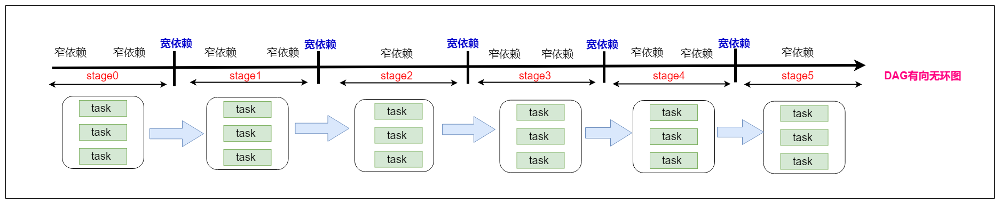

# Spark进阶

## 一、RDD的依赖关系


- RDD和它依赖的父RDD的关系有两种不同的类型

- 窄依赖（narrow dependency）和宽依赖（wide dependency）

  - ==窄依赖==

    - 窄依赖指的是每一个父RDD的Partition最多被子RDD的一个Partition使用

    - 总结：窄依赖我们形象的比喻为独生子女

      ```
      哪些算子操作是窄依赖：
      	map/flatMap/filter/union等等
      	
      	所有的窄依赖不会产生shuffle
      ```

  - ==宽依赖==

    - 宽依赖指的是多个子RDD的Partition会依赖同一个父RDD的Partition

    - 总结：宽依赖我们形象的比喻为超生 

      ```
      哪些算子操作是宽依赖：
      	reduceByKey/sortByKey/groupBy/groupByKey/join等等
      	
      	所有的宽依赖会产生shuffle
      ```

  - 补充说明

    ```
    由上图可知，join分为宽依赖和窄依赖，如果RDD有相同的partitioner，那么将不会引起shuffle，这种join是窄依赖，反之就是宽依赖
    ```

## 二、 lineage（血统）

- RDD只支持粗粒度转换
  - 即只记录单个块上执行的单个操作。
- 将创建RDD的一系列Lineage（即血统）记录下来，以便恢复丢失的分区
- ==RDD的Lineage会记录RDD的元数据信息和转换行为，lineage保存了RDD的依赖关系，当该RDD的部分分区数据丢失时，它可以根据这些信息来重新运算和恢复丢失的数据分区==。

## 三、RDD的缓存机制

### 3.1 什么是rdd的缓存

​	可以把一个rdd的数据缓存起来，后续有其他的job需要用到该rdd的结果数据，可以直接从缓存中获取得到，避免了重复计算。缓存是加快后续对该数据的访问操作。

### 3.2 设置RDD缓存

- RDD通过==persist方法==或==cache方法==可以将前面的计算结果缓存。
  - 但是并不是这两个方法被调用时立即缓存，而是==触发后面的action==时，该RDD将会被缓存在计算节点的内存中，并供后面重用。


- 通过查看源码发现==cache最终也是调用了persist方法==，默认的存储级别都是==仅在内存存储一份==，Spark的存储级别还有好多种，存储级别在==object StorageLevel==中定义的。


```scala
val rdd1=sc.textFile("/words.txt")
val rdd2=rdd1.flatMap(_.split(" "))
rdd2.cache
rdd2.collect

val rdd3=rdd2.map((_,1))
rdd3.persist(缓存级别)
rdd3.collect
```

### 3.3 cache 和persist的区别

* 对RDD设置缓存成可以调用rdd的2个方法： 一个是cache，一个是persist。

* 调用上面2个方法都可以对rdd的数据设置缓存，但不是立即就触发缓存执行，后面需要有action，才会触发缓存的执行。

* cache方法和persist方法区别：
      cache:   默认是把数据缓存在内存中，其本质就是调用persist方法；
      persist：可以把数据缓存在内存或者是磁盘，有丰富的缓存级别，这些缓存级别都被定义在StorageLevel这个object中。

### 3.4 缓存的使用场景

* **可以把多次使用到的rdd，也就是公共rdd进行持久化，避免后续需要，再次重新计算，提升效率。**


```
（1）当第一次使用rdd2做相应的算子操作得到rdd3的时候，就会从rdd1开始计算，先读取HDFS上的文件，然后对rdd1 做对应的算子操作得到rdd2,再由rdd2计算之后得到rdd3。同样为了计算得到rdd4，前面的逻辑会被重新计算。 
（2）默认情况下多次对一个rdd执行算子操作， rdd都会对这个rdd及之前的父rdd全部重新计算一次。 这种情况在实际开发代码的时候会经常遇到，但是我们一定要避免一个rdd重复计算多次，否则会导致性能急剧降低。   
```


* **保存一个经过大量算子操作或者是计算逻辑比较复杂的RDD**

  数据计算太久了，避免第二次执行花费太多的时间

3.5 清理缓存

1. ==自动清除==

```
一个application应用程序结束之后，对应的缓存数据也就自动清除
```

2. ==手动清除==

```
调用rdd的unpersist方法
```

## 四、RDD的checkpoint机制

### 4.1  checkpoint概念

- 我们可以对rdd的数据进行缓存，保存在内存或者是磁盘中。

  - 后续就可以直接从内存或者磁盘中获取得到，但是它们不是特别安全。

  - **cache**

    ```
    它是直接把数据保存在内存中，后续操作起来速度比较快，直接从内存中获取得到。但这种方式很不安全，由于服务器挂掉或者是进程终止，会导致数据的丢失。
    ```

  - **persist**

    ```
    它可以把数据保存在本地磁盘中，后续可以从磁盘中获取得到该数据，但它也不是特别安全，由于系统管理员一些误操作删除了，或者是磁盘损坏，也有可能导致数据的丢失。
    ```

- ==**checkpoint**（检查点）==

  ```
  它是提供了一种相对而言更加可靠的数据持久化方式。它是把数据保存在分布式文件系统，
  比如HDFS上。这里就是利用了HDFS高可用性，高容错性（多副本）来最大程度保证数据的安全性。
  ```

### 4.2 checkpoint设置

- 在hdfs上设置一个checkpoint目录

  ```scala
  sc.setCheckpointDir("hdfs://node1:9000/checkpoint") 
  ```

- 对需要做checkpoint操作的rdd调用checkpoint方法

  ```scala
  val rdd1=sc.textFile("/words.txt")
  rdd1.checkpoint
  val rdd2=rdd1.flatMap(_.split(" ")) 
  ```

- 最后需要有一个action操作去触发任务的运行

  ```scala
  rdd2.collect
  ```

### 4.3 cache、persist、checkpoint三者区别

- ==cache和persist==
  - cache默认数据缓存在内存中
  - persist可以把数据保存在内存或者磁盘中
  - 后续要触发 cache 和 persist 持久化操作，需要有一个action操作
  - 它不会开启其他新的任务，一个action操作就对应一个job 
  - 它不会改变rdd的依赖关系，程序运行完成后对应的缓存数据就自动消失
- ==checkpoint==
  - 可以把数据持久化写入到hdfs上
  - 后续要触发checkpoint持久化操作，需要有一个action操作，后续会==开启新的job执行checkpoint操作==
  - 它会改变rdd的依赖关系，后续数据丢失了不能够在通过血统进行数据的恢复。
  - 程序运行完成后对应的checkpoint数据就不会消失

```scala
wu   sc.setCheckpointDir("/checkpoint")
   val rdd1=sc.textFile("/words.txt")
   rdd1.cache
   rdd1.checkpoint
   val rdd2=rdd1.flatMap(_.split(" "))
   rdd2.collect
   
   checkpoint操作要执行需要有一个action操作，一个action操作对应后续的一个job。该job执行完成之后，它会再次单独开启另外一个job来执行 rdd1.checkpoint操作。
   
   对checkpoint在使用的时候进行优化，在调用checkpoint操作之前，可以先来做一个cache操作，缓存对应rdd的结果数据，后续就可以直接从cache中获取到rdd的数据写入到指定checkpoint目录中
```

## 五、 DAG有向无环图生成

### 5.1 DAG概念

- ==DAG(Directed Acyclic Graph)== 叫做有向无环图（有方向,无闭环,代表着数据的流向），原始的RDD通过一系列的转换就形成了DAG。
- 下图是基于单词统计逻辑得到的DAG有向无环图，可以在Spark调度中看到
- /spark_day03课程设计.assets/1569047954944.png)

## 六、DAG划分stage

### 6.1 stage是什么

- ==一个Job会被拆分为多组Task，每组任务被称为一个stage==
- stage表示不同的调度阶段，一个spark job会对应产生很多个stage
  - stage类型一共有2种
    - ==ShuffleMapStage==
      - 最后一个shuffle之前的所有变换叫ShuffleMapStage
        - 它对应的task是shuffleMapTask
    - ==ResultStage==
      - 最后一个shuffle之后的操作叫ResultStage，它是最后一个Stage。
        - 它对应的task是ResultTask

### 6.2 为什么要划分stage

根据RDD之间依赖关系的不同将DAG划分成不同的Stage(调度阶段)
对于窄依赖，partition的转换处理在一个Stage中完成计算
对于宽依赖，由于有Shuffle的存在，只能在parent RDD处理完成后，才能开始接下来的计算，

由于划分完stage之后，在同一个stage中只有窄依赖，没有宽依赖，可以实现流水线计算，
stage中的每一个分区对应一个task，在同一个stage中就有很多可以并行运行的task。

### 6.3 如何划分stage

* ==**划分stage的依据就是宽依赖**==

  1. 首先根据rdd的算子操作顺序生成DAG有向无环图，接下里从最后一个rdd往前推，创建一个新的stage，把该rdd加入到该stage中，它是最后一个stage。
  2. 在往前推的过程中运行遇到了窄依赖就把该rdd加入到本stage中，如果遇到了宽依赖，就从宽依赖切开，那么最后一个stage也就结束了。
  3. 重新创建一个新的stage，按照第二个步骤继续往前推，一直到最开始的rdd，整个划分stage也就结束了

  

### 6.4 stage与stage之间的关系

* 划分完stage之后，每一个stage中有很多可以并行运行的task，后期把每一个stage中的task封装在一个taskSet集合中，最后把一个一个的taskSet集合提交到worker节点上的executor进程中运行。
* rdd与rdd之间存在依赖关系，stage与stage之前也存在依赖关系，前面stage中的task先运行，运行完成了再运行后面stage中的task，也就是说后面stage中的task输入数据是前面stage中task的输出结果数据。



## 七、	spark的任务调度


1. Driver端运行客户端的main方法，构建SparkContext对象，在SparkContext对象内部依次构==**DAGScheduler**==和==**TaskScheduler**==
2. 按照rdd的一系列操作顺序，来生成DAG有向无环图
3. ==**DAGScheduler**==拿到DAG有向无环图之后，按照宽依赖进行stage的划分。每一个stage内部有很多可以并行运行的task，最后封装在一个一个的taskSet集合中，然后把taskSet发送给TaskScheduler
4. ==**TaskScheduler**==得到taskSet集合之后，依次遍历取出每一个task提交到worker节点上的executor进程中运行。
5. 所有task运行完成，整个任务也就结束了

## 八、 spark的运行架构


1. Driver端向资源管理器Master发送注册和申请计算资源的请求
2. Master通知对应的worker节点启动executor进程(计算资源)
3. executor进程向Driver端发送注册并且申请task请求
4. Driver端运行客户端的main方法，构建SparkContext对象，在SparkContext对象内部依次构建DAGScheduler和TaskScheduler
5. 按照客户端代码洪rdd的一系列操作顺序，生成DAG有向无环图
6. DAGScheduler拿到DAG有向无环图之后，按照宽依赖进行stage的划分。每一个stage内部有很多可以并行运行的task，最后封装在一个一个的taskSet集合中，然后把taskSet发送给TaskScheduler
7. TaskScheduler得到taskSet集合之后，依次遍历取出每一个task提交到worker节点上的executor进程中运行
8. 所有task运行完成，Driver端向Master发送注销请求，Master通知Worker关闭executor进程，Worker上的计算资源得到释放，最后整个任务也就结束了。

## 九、基于wordcount程序剖析spark任务的提交、划分、调度流程

