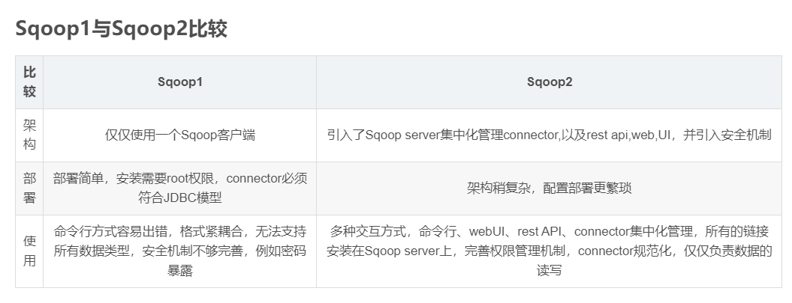

# Sqoop数据迁移工具

## 一、Sqoop是什么

​	Sqoop是apache旗下的一款 ”==Hadoop和关系数据库之间传输数据==”的工具

* ==导入数据==

​		将MySQL，Oracle导入数据到Hadoop的HDFS、HIVE、HBASE等数据存储系统

- ==导出数据==

  从Hadoop的文件系统中导出数据到关系数据库


## 二、Sqoop的工作机制

- 将导入和导出的命令翻译成mapreduce程序实现
  - 在翻译出的mapreduce中主要是对inputformat和outputformat进行定制

## 三、Sqoop基本架构

- sqoop在发展中的过程中演进出来了两种不同的架构.[架构演变史](<https://blogs.apache.org/sqoop/entry/apache_sqoop_highlights_of_sqoop#comment-1561314193000>)

- ==sqoop1的架构图==

  

  ```
  版本号为1.4.x为sqoop1 
  在架构上：sqoop1使用sqoop客户端直接提交的方式 
  访问方式：CLI控制台方式进行访问 
  安全性：命令或脚本中指定用户数据库名及密码
  ```

- ==sqoop2的架构图==

  

  

```
版本号为1.99x为sqoop2 
在架构上：sqoop2引入了sqoop server，对connector实现了集中的管理 
访问方式：REST API、 JAVA API、 WEB UI以及CLI控制台方式进行访问 
```



## 四、Sqoop安装部署

1. 下载、解压

2. 修改配置文件

   ```bash
   # 重命名配置文件
   mv sqoop-env-template.sh  sqoop-env.sh
   
   #Set path to where bin/hadoop is available
   export HADOOP_COMMON_HOME=/opt/hadoop
   
   #Set path to where hadoop-*-core.jar is available
   export HADOOP_MAPRED_HOME=/opt/hadoop
   
   #set the path to where bin/hbase is available
   export HBASE_HOME=/opt/hbase
   
   #Set the path to where bin/hive is available
   export HIVE_HOME=/opt/hive
   ```

3. 添加mysql jar包到sqoop的lib目录下。

4. 修改环境变量

   ```
   export SQOOP_HOME=/opt/sqoop-1.4.7
   export PATH=$PATH:$SQOOP_HOME/bin
   ```

## 五、Sqooq数据的导入

### 5.1 列举出所有的数据库

* 查看帮助文档

  ```
  sqoop list-databases --help
  ```

* 列出node1上mysql数据库中所有的数据库名称

  ```
  sqoop list-databases --connect jdbc:mysql://node1:3306/ --username root --password 123456
  ```

* 查看某一个数据库下面的所有数据表

  ```
  sqoop list-tables --connect jdbc:mysql://node1:3306/ --username root --password 123456
  ```

### 5.2 导入数据库表数据到HDFS

```
sqoop import \
--connect jdbc:mysql://node1:3306/userdb \
--username root \
--password 123456 \
# 同步表
--table emp \
# 文件导出位置，空的话默认在用户目录下,ex:/user/hadoop
--target-dir /sqoop/emp
# 来判断导出目录是否存在，如果存在就删掉
--delete-target-dir
# 指定分隔符
--fields-terminated-by '#' 
# task个数
--m 1
```

### 5.3 条件导入数据到HDFS

```bash
sqoop import \
--connect jdbc:mysql://node1:3306/userdb \
--username root --password 123456 --table emp \
--target-dir /sqoop/emp_where -m 1  --delete-target-dir \
--where "dept = 'TP'"
```

### 5.4 sql语句查找导入hdfs

```
sqoop import \
--connect jdbc:mysql://node1:3306/userdb \
--username root --password 123456 \
--target-dir /sqoop/emp_sql -m 1  --delete-target-dir \
--query 'select * from emp where salary >30000 and $CONDITIONS' 
```

### 5.5 增量导入到HDFS

* 只需要导入增量数据即可

  ```
  --incremental <mode>
  --check-column <column name>
  --last value <last check column value>
  ```

* 基于递增列的增量数据导入（Append方式）

  ```bash
  # 导入emp表当中id大于1202的所有数据
  # 这里不能加上 --delete-target-dir  参数，添加就报错
  sqoop import \
  --connect jdbc:mysql://node1:3306/userdb \
  --username root \
  --password 123456 \
  --table emp \
  --target-dir /sqoop/increment1 
  --incremental append \
  --check-column id \
  --last-value 1202  \
  -m 1 \
  ```

* 基于时间列的增量数据导入（LastModified方式）

  ```bash
  # 此方式要求原有表中有time字段，它能指定一个时间戳
  sqoop import \
  --connect jdbc:mysql://node1:3306/userdb \
  --username root \
  --password 123456  \
  --table user \
  --target-dir /sqoop/incement2 \
  --incremental lastmodified  \
  --check-column createTime  \
  --last-value '2019-09-01 10:16:00'  \
  --m 1
  ```

  

### 5.6 导入关系表到Hive中

```bash
# 复制连接
cp /opt/==/hive/lib/hive-exec-1.2.2.jar /opt/sqoop/lib/

# hive 连接，创建数据库和表
create database sqooptohive;

create external table sqooptohive.emp_hive(id int,name string,deg string,salary double ,dept string) row format delimited fields terminated by '\001';

# sqoop导入
sqoop import \
--connect jdbc:mysql://node1:3306/userdb \
--username root \
--password 123456 \
--table emp \
--fields-terminated-by '\001' \
--hive-import \
--hive-table sqooptohive.emp_hive \
--hive-overwrite \
--m 1
```

### 5.7 导入数据库表数据到hive中(并自动创建hive表)

```
sqoop import \
--connect jdbc:mysql://node1:3306/userdb \
--username root \
--password 123456 \
--hive-database sqooptohive \
--hive-table emp1 \
--table emp \
--hive-import \
-m 1
```