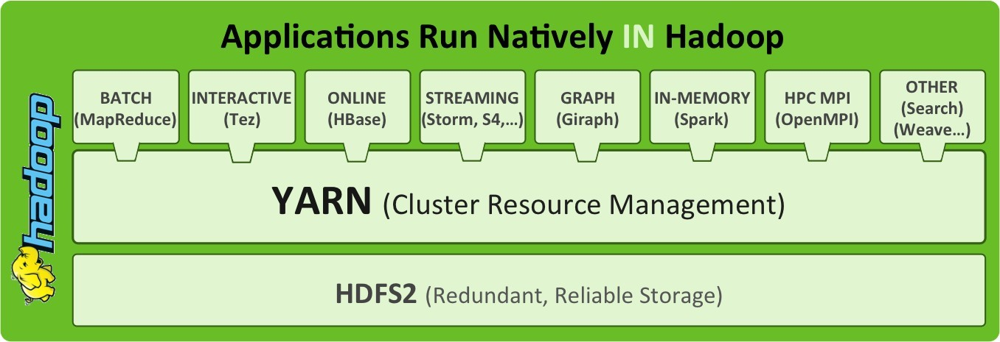
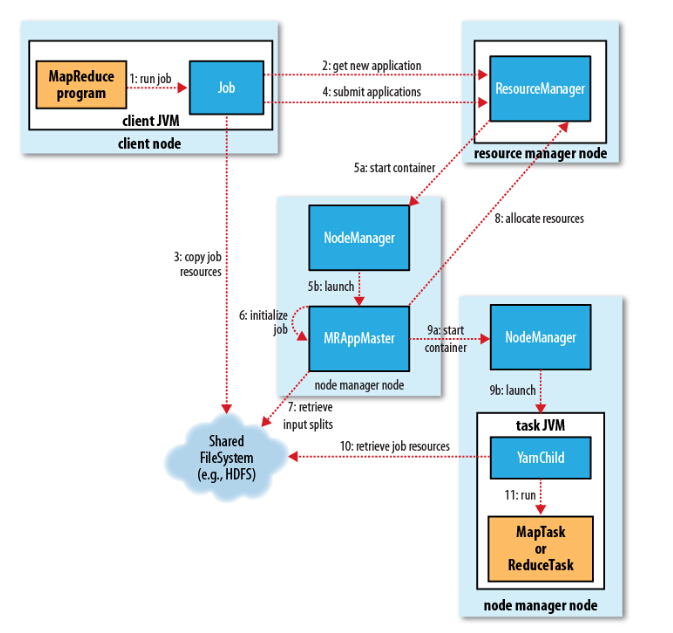

# Yarn



1. **可扩展性**：数据中心的数据处理能力继续快速增长，因为Yarn的ResourceManager仅专注于任务调度，能将集群的管理变得更加简单。
2. **兼容MapReduce**：MapReduce应用程序无需改动就可以在Yarn上运行
3. **提高集群使用率**：ResourceManager是以个纯粹调度系统，更具Capacity、FIFA或者SIAS等原则对集群进行优化利用，有利于提高集群资源的额利用
4. **更多支持**：Yarn处理提供了`数据处理`、`图形处理`、`迭代处理`以及`实时模型`，更全的功能页面
5. **灵活**：随着MapReduce成为了用户端库，它发展独立与地城的资源管理层，从而有着多种灵活的方式。

## Yarn 架构

* Yarn的架构还是经典的主从架构（Master/Slave）。
* 一个ResourceManager(RM)和多个NodeManager(NM)构成。


* 在Yarn体系结构中，全局ResorceManager作为主守护程序运行，作为架构中的全局的Master角色，通常在专用计算机上运行，它在各种竞应用程序之间仲裁可用的集群资源。ResourceManager跟踪集群上可用的活动节点和资源的数量，并协调用户体提交的应用程序获取哪些资源和时间。ResourceManger是具有此信息的单进程，因此它可以以共享，安全和多租户的方式进行调度决策（例如，根据应用程序优先级，队列容量，ACL，数据位置等）。

* 当用户提交应用时，将启动名为ApplicationMaster的轻量级进程实例，以协调应用程序种所有的任务执行。这包括监视任务，重新启动失败的任务，推测性地运行慢速任务以及计算应用程序计数器地总值，这些指责先前已经分配给所有工作的单个JobTracker。ApplicationMaster和属于其应用程序的任务在NodeManager控制的资源容器中运行。

* NodeManager时TaskTracker的更通用和高效的版本。NodeManager没有固定的map和reduce插槽，而是有许多动态创建的容器。容器的大小取决于它包含的资源量，例如内存、CPU、磁盘和网络IO。（目前，仅支持内存和CPU，csgroup未来可能用于控制磁盘和网络IO）。节点上的容器数量时配置参数和专用于从属守护程序和OS的资源之外的节点资源总量（例如总CPU和总内存）的乘积。

* ApplicationMaster可以在容器内运行任何类型的任务。例如，MapReduce ApplicaitonMaster请求内容启动map或reduce任务，而且Giraph ApplicationMaster请求执行Giragp任务。还可以实现运行特定任务的自定义 ApplicationMaster。

* 在Yarn中，MapReduce简单地降级为分布式应用程序的角色，现称之为MRv2。

* `一个可以运行任何分布式应用程序的集群`ResourceManager，NodeManager和容器不管相信应用程序或任务的类型。所有特定与应用程序框架的代码都被简单地移动到其ApplicationMaster，以便Yarn可以支持任何分布式框架——只要有人为它上线了ApplicationMaster。

* 正是这种通用方法，运行许多不同工作负载的Hadoop Yarn集群可以实现。数据中心的单个Hadoop集群剋运行MapReduce，Graph，Storm，Spark，Tez/Impala，MPI等

* 单集群有着许多的优点：
    1. `更高的集群利用率`，一个框架未使用的资源可以被另外一个框架使用。
    2. `降低运行成本`，因为只需要管理和调整一个“全能”集群
    3. `减少数据移动`，因为不需要在Hadoop Yarn和运行再不同机器集群上的系统之间移动数据。
    4. 管理单个集群还可以为数据处理提供更环保的解决方案


## Yarn 核心组件

| 组件名称 | 作用 |
|:------|:------|
|ResourceManager|是Master上一个独立运行的进程，负责集群统一的资源管理、调度、分配等|
|ApplicationManager|相当于Application的监护人和管理者，负责监控、管理这个Application的所有Attempt在cluster中个节点上的具体运行，同时向Yarn ResourceManager申请资源、返还资源。|
|NodeManager|是Slave上独立运行的一个进程，负责上报节点的状态(磁盘、内存、CPU等使用信息)|
|Container|是Yarn中分配资源的一个单位，包含内存、CPU等资源，Yarn以Container为单位分配资源|

ResourceManager 负责对NodeManager上资源进行统一管理和调度，当用户提交一个应用程序时，需要提供一个用以跟踪和管理这个程序的ApplictionMaster，它负责向ResourceManager是申请资源，并要求NodeManager启动可以占用一定资源的任务。由于不通的Application被分布到不同的节点上，因此相互之间不会影响。

Client向ResourceManger提交的每一个应用程序都必须有一个ApplicationMaster，它经过ResouceManger分配资源后，运行于某一个Slave节点的Container中，具体做事情的Task，同样也运行与某一个Slave节点的Container中。


### 1.ResourceManager

RM是一个全局的资源管理器，集群只有一个，负责整个系统的资源管理和分配，包括处理客户端请求、启动/监控 ApplicationMaster、监控 NodeManager、资源的分配与调度。它主要由两个组件构成：调度器（Scheduler）和应用程序管理器（Applications Manager，ASM）。

1. 调度器

    调度器根据容量、队列等限制条件（如每个队列分配一定的资源，最多执行一定数量的作业等），将系统中的资源分配给各个正在运行的应用程序。需要注意的是，该调度器是一个“纯调度器”，它从事任何与具体应用程序相关的工作，比如不负责监控或者跟踪应用的执行状态等，也不负责重新启动因应用执行失败或者硬件故障而产生的失败任务，这些均交由应用程序相关的ApplicationMaster完成。

    调度器仅根据各个应用程序的资源需求进行资源分配，而资源分配单位用一个抽象概念“资源容器”（Resource Container，简称Container）表示，Container是一个动态资源分配单位，它将内存、CPU、磁盘、网络等资源封装在一起，从而限定每个任务使用的资源量。

2. 应用程序管理器

    应用程序管理器主要负责管理整个系统中所有应用程序，接收job的提交请求，为应用分配第一个 Container 来运行 ApplicationMaster，包括应用程序提交、与调度器协商资源以启动 ApplicationMaster、监控 ApplicationMaster 运行状态并在失败时重新启动它等。

### 2.ApplicationMaster

管理 YARN 内运行的一个应用程序的每个实例。关于 job 或应用的管理都是由 ApplicationMaster 进程负责的，Yarn 允许我们以为自己的应用开发 ApplicationMaster。

功能：

* 数据切分；
* 为应用程序申请资源并进一步分配给内部任务（TASK）；
* 任务监控与容错；
* 负责协调来自ResourceManager的资源，并通过* NodeManager监视容易的执行和资源使用情况。

ApplicationMaster 与 ResourceManager 之间的通信是整个 Yarn 应用从提交到运行的最核心部分，是 Yarn 对整个集群进行动态资源管理的根本步骤，Yarn 的动态性，就是来源于多个Application 的 ApplicationMaster 动态地和 ResourceManager 进行沟通，不断地申请、释放、再申请、再释放资源的过程。

### 3.NodeManager

NodeManager 整个集群有多个，负责每个节点上的资源和使用。

NodeManager 是一个 slave 服务：它负责接收 ResourceManager 的资源分配请求，分配具体的 Container 给应用。同时，它还负责监控并报告 Container 使用信息给 ResourceManager。通过和ResourceManager 配合，NodeManager 负责整个 Hadoop 集群中的资源分配工作。

功能：NodeManager 本节点上的资源使用情况和各个 Container 的运行状态（cpu和内存等资源）

* 接收及处理来自 ResourceManager 的命令请求，分配 Container 给应用的某个任务；
* 定时地向RM汇报以确保整个集群平稳运行，RM 通过收集每个 NodeManager 的报告信息来追踪整个集群健康状态的，而 NodeManager 负责监控自身的健康状态；
* 处理来自 ApplicationMaster 的请求；
* 管理着所在节点每个 Container 的生命周期；
管理每个节点上的日志；
* 执行 Yarn 上面应用的一些额外的服务，比如 MapReduce 的 shuffle 过程；

当一个节点启动时，它会向 ResourceManager 进行注册并告知 ResourceManager 自己有多少资源可用。在运行期，通过 NodeManager 和 ResourceManager 协同工作，这些信息会不断被更新并保障整个集群发挥出最佳状态。

NodeManager 只负责管理自身的 Container，它并不知道运行在它上面应用的信息。负责管理应用信息的组件是 ApplicationMaster

### 4.Container

Container 是 YARN 中的资源抽象，它封装了某个节点上的多维度资源，如内存、CPU、磁盘、网络等，当 AM 向 RM 申请资源时，RM 为 AM 返回的资源便是用 Container 表示的。YARN 会为每个任务分配一个 Container，且该任务只能使用该 Container 中描述的资源。

Container 和集群节点的关系是：一个节点会运行多个 Container，但一个 Container 不会跨节点。任何一个 job 或 application 必须运行在一个或多个 Container 中，在 Yarn 框架中，ResourceManager 只负责告诉 ApplicationMaster 哪些 Containers 可以用，ApplicationMaster 还需要去找 NodeManager 请求分配具体的 Container。

需要注意的是，Container 是一个动态资源划分单位，是根据应用程序的需求动态生成的。目前为止，YARN 仅支持 CPU 和内存两种资源，且使用了轻量级资源隔离机制 Cgroups 进行资源隔离。

功能：

* 对task环境的抽象；
* 描述一系列信息；
* 任务运行资源的集合（cpu、内存、io等）；
* 任务运行环境

### 5. Resource Request 及 Container

- Yarn的设计目标就是允许我们的各种应用以共享、安全、多租户的形式使用整个集群。并且，为了保证集群资源调度和数据访问的高效性，Yarn还必须能够感知整个集群拓扑结构。

- 为了实现这些目标，ResourceManager的调度器Scheduler为应用程序的资源请求定义了一些灵活的协议，通过它就可以对运行在集群中的各个应用做更好的调度，因此，这就诞生了Resource Request和Container。

- 一个应用先向ApplicationMaster发送一个满足自己需求的资源请求，然后ApplicationMaster把这个资源请求以resource-request的形式发送给ResourceManager的Scheduler，Scheduler再在这个原始的resource-request中返回分配到的资源描述Container。

- 每个ResourceRequest可看做一个可序列化Java对象，包含的字段信息如下：

  ```xml
  - resource-name：资源名称，现阶段指的是资源所在的host和rack，后期可能还会支持虚拟机或者更复杂的网络结构
  - priority：资源的优先级
  - resource-requirement：资源的具体需求，现阶段指内存和cpu需求的数量
  - number-of-containers：满足需求的Container的集合
  <resource-name, priority, resource-requirement, number-of-containers>
  ```

### 6. JobHistoryServer

### 7. TimelineServer

## Yarn运行原理

### Yarn应用提交过程

Applcation在Yarn中的执行过程，整个过程可以总结为三步：

1. 应用程序提交
2. 启动应用的ApplicationMaster实例
3. ApplicationMaster实例管理应用程序的执行

------

1. 用户将应用程序提交到ResourceManager上
2. ResourceManager为有应用程序ApplicationMaster申请资源，并与某个NodeManager通信启动i的一个Container，以启动ApplicationMaster。
3. ApplicationMaster与ResourceManager注册进行通信，为内部要执行的任务申请资源，一旦得到资源后，将与NodeManager进行通信，已启动对应的Task
4. 所有的任务运行完成之后，ApplicationMaster向ResourceManager注销，整个应用程序运行结束。

------

1. 客户端程序向 ResourceManager 提交应用并请求一个 ApplicationMaster 实例；
2. ResourceManager 找到一个可以运行一个 Container 的 NodeManager，并在这个 Container 中启动 ApplicationMaster 实例；
3. ApplicationMaster 向 ResourceManager 进行注册，注册之后客户端就可以查询 ResourceManager 获得自己 ApplicationMaster 的详细信息，以后就可以和自己的 ApplicationMaster 直接交互了（这个时候，客户端主动和 ApplicationMaster 交流，应用先向 ApplicationMaster 发送一个满足自己需求的资源请求）；
4. 在平常的操作过程中，ApplicationMaster 根据 resource-request协议 向 ResourceManager 发送 resource-request请求；
5. 当 Container 被成功分配后，ApplicationMaster 通过向 NodeManager 发送 container-launch-specification信息 来启动Container，container-launch-specification信息包含了能够让Container 和 ApplicationMaster 交流所需要的资料；
6. 应用程序的代码以 task 形式在启动的 Container 中运行，并把运行的进度、状态等信息通过 application-specific协议 发送给ApplicationMaster；
7. 在应用程序运行期间，提交应用的客户端主动和 ApplicationMaster 交流获得应用的运行状态、进度更新等信息，交流协议也是 application-specific协议；
8. 一旦应用程序执行完成并且所有相关工作也已经完成，ApplicationMaster 向 ResourceManager 取消注册然后关闭，用到所有的 Container 也归还给系统。


### MapReduce On Yarn




1. 向Client端提交MapReduce job。
2. 随后yarn的ResourceManager进行资源的分配。
3. 由NodeManager进行加载和监控containers。
4. 通过applicationMaster与ResourceManger进行资源的申请以及状态的交互，由NodeManager进行MapReduce运行时job的管理。
5. 通过hdfs进行job配置文件、jar包的各节点分发。

### Yarn应用生命周期

1. Client向RM提交应用，包括AM程序和启动AM的命令。

2. RM为AM分配第一个容器，并与对应的NM通信，令其在容器上启动应用的AM。

3. AM启动时向RM注册，允许Client向RM获取AM信息然后直接和AM通信。

4. AM通过资源请求协议，为应用协商容器资源。

5. 如果容器分配成功，AM要求NM在容器中启动应用，应用启动后可以和AM独立通信。

6. 应用程序在容器中执行，并向AM汇报。

7. 在应用执行期间，Client和AM通信获取应用状态。

8. 应用执行完成，AM向RM注销并关闭，释放资源。

   申请资源-->启动AM->申请运行任务的Container-->分发Task-->运行Task-->Task结束-->回收Container

   


## Yarn 配置

### 配置文件

`etc/hadoop/mapred-site.xml`

```
<configuration>
	<property>
		<name>mapreduce.framework.name</name>
		<value>yarn</value>
	</property>
</configuration>
```

`etc/hadoop/yarn-site.xml`

```
<configuration>
    <property>
        <name>yarn.nodemanager.aux-services</name>
        <value>mapreduce_shuffle</value>
    </property>
</configuration>
```

### 启动停止

```sh
# 主节点运行
$HADOOP_HOME/sbin/start-yarn.sh
$HADOOP_HOME/sbin/stop-yarn.sh

# 单独在主节点启动RM
$HADOOP_HOME/sbin/yarn-daemon.sh start resourcemanager
$HADOOP_HOME/sbin/start-yarn.sh stop resourcemanager

# 单独在子节点启动RM
$HADOOP_HOME/sbin/yarn-daemon.sh start nodemanager
$HADOOP_HOME/sbin/start-yarn.sh stop nodemanager
```

### 常用命令

```sh
# 查看正在运行的任务
yarn application -list
# 杀掉正在运行的任务
yarn application -kill 任务id
# 查看节点列表
yarn node -list
# 查看节点状态
yarn node -status node-id
# 查看yarn依赖的jar的环境变量
yarn classpath
```


## 调度器

### FIFO Scheduler

### Capacity Scheduler

### Fair Schedler


## Yarn调优

