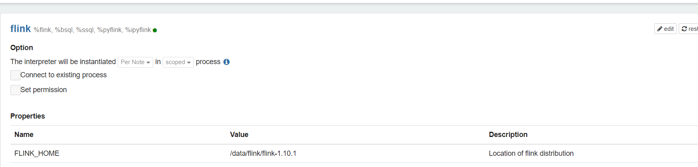

# Flink On Zeeplin

## 一、环境搭建

如果安装Zepplin，请参考[Zeppelin](./Zeppelin.md)

## 二、三个运行模式

Flink on Zeeplin配置过程

1. 下载Flink 1.10 Scala 2.11 版本。

2. 解压Flink 安装包

3. 配置Flink Interpreter的`FLINK_HOME`

   

### 2.1 Local模式

* | Properties           | Value |
  | -------------------- | ----- |
  | flink.execution.mode | local |

### 2.2 Remote模式

* | Properties                  | Value     |
  | --------------------------- | --------- |
  | flink.execution.mode        | remote    |
  | flink.execution.remote.host | 127.0.0.1 |
  | flink.execution.remote.port | 8081      |

### 2.3 Yarn模式

* | Properties           | Value            |
  | -------------------- | ---------------- |
  | flink.execution.mode | yarn             |
  | HADOOP_CONF_DIR      | /etc/hadoop/conf |
  | flink.yarn.queue     | root.users.root  |