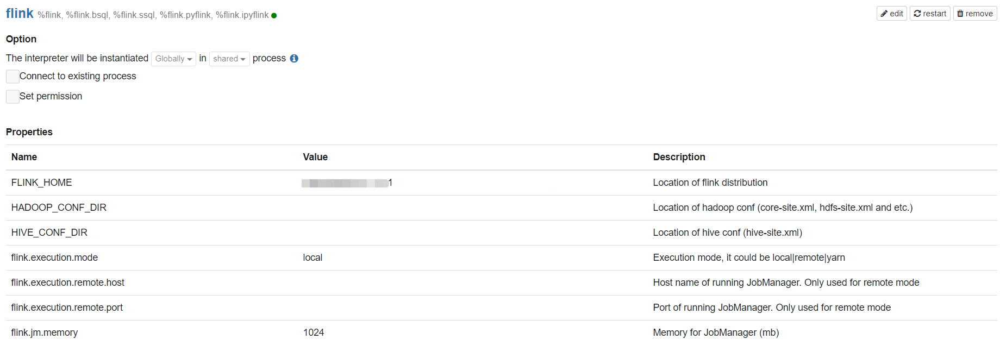
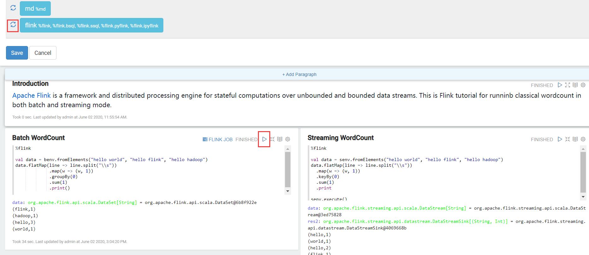
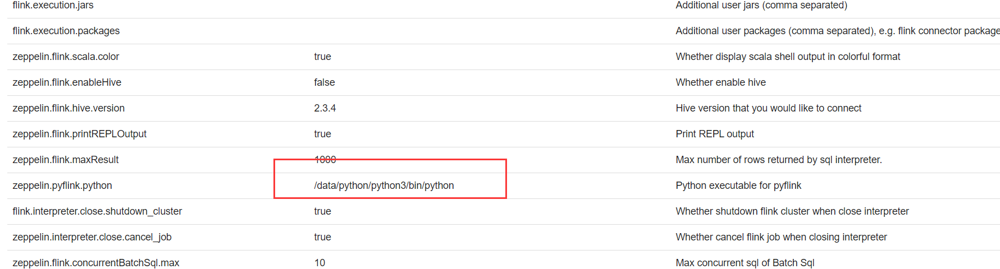
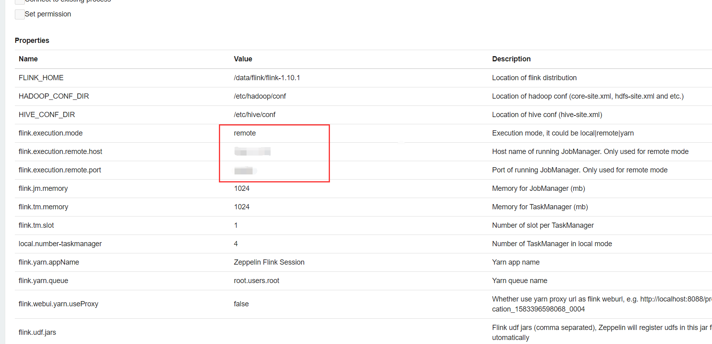
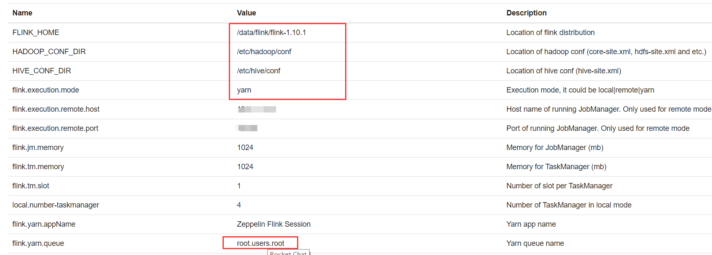

# Zeppelin

## 一、介绍

## 二、安装

```sh
# 下载
wget https://mirrors.tuna.tsinghua.edu.cn/apache/zeppelin/zeppelin-0.9.0-preview1/zeppelin-0.9.0-preview1-bin-all.tgz
# 解压
tar -zxvf zeppelin-0.9.0-preview1-bin-all.tgz
# 启动
cd zeppelin-0.9.0-preview1-bin-all
bin/zeppelin-daemon.sh start
```

* 修改配置文件，现在可以在页面上访问http://ip:8080/ Zeppelin了

  ```sh
  # 修改配置
  cp zeppelin-site.xml.template zeppelin-site.xml
  vim zeppelin-site.xml
  
  <property>
    <name>zeppelin.server.addr</name>
    <value>0.0.0.0</value>
    <description>Server binding address</description>
  </property>
  ```

* 但是现在是匿名登陆，修改配置

  ```sh
  # 修改配置
  cp shiro.ini.template shiro.ini
  vim shiro.ini
  
  # 根据Shiro配置修改文件
  # 重启
  bin/zeppelin-daemon.sh start
  ```

* 用户授权登陆

  * 由于功能授权是通过shiro进行授权登陆的，这意味着管理用户需要配置文件进行处理，也意味着需要重启服务。

## 三、基本概念

### 3.1 Paragraph

* 一个显示单元

### 3.2 Note

* 一个计算表

### 3.3 NoteBook

* 一个计算目录

### 3.4 Interpreter

* 解释程序

## 四、Interpreter

### 4.1 Flink

下载Flink，一定要使用Flink的Scala2.11版本，2.12版本暂不支持。

```sh
# 下载
wget https://mirrors.tuna.tsinghua.edu.cn/apache/flink/flink-1.10.1/flink-1.10.1-bin-scala_2.11.tgz
# 解压
tar -zxvf flink-1.10.1-bin-scala_2.11.tgz
```

在页面上配置Flink的Interpreter，配置FLINK_HOME。



同时，需要下载一个 `flink-shaded-hadoop-2-uber-2.7.5-7.0.jar`到flink的lib目录下。

重启Zeppelin里面的Flink Interpreter。并运行Note中的Flink Basic



如果提示8081端口错误，可修改Flink的配置文件

```sh
# vim flink-conf.yaml 
rest.port: 50100-50200
```

再次运行，就可以local方式执行flink任务了。

以上时以scala语言进行调度，同样，也可以使用Python、SQL方式处理。

* Python

  * 由于linux默认Python版本为Python2，需要安装3之后更改配置

    

* SQL

  * 略

同时，Flink on Zeppelin（Scala）三种模式：

* Local

  * 本地运行模式前面已经模拟过了，这里就不加以测试了。

    

* Remote

  * 提交任务到Flink StandAlone或者时Flink Session on yarn

    

* yarn

  * 由Yarn调度运行，per-job

    