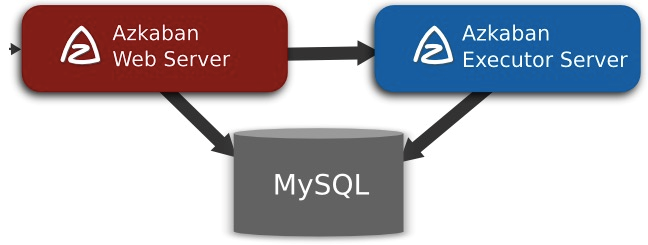
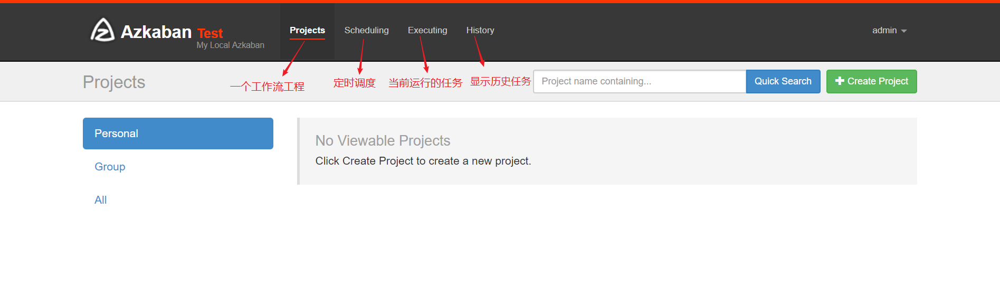

# Azkaban 工作流调度器

## 一、工作流调度系统

- 一个完整的数据分析系统通常都是由大量任务单元组成；
  - shell脚本程序、java程序、mapreduce程序、hive脚本等
- 各任务单元之间存在时间先后及前后依赖关系
- 为了==很好地组织起这样的复杂执行计划，需要一个工作流调度系统来调度执行==

## 二、Azkaban是什么

* https://azkaban.github.io/

- Azkaban是由Linkedin开源的一个==批量工作流任务调度器==。用于在一个工作流内以一个特定的顺序运行一组工作和流程。
- Azkaban定义了一种==KV文件(properties)格式==来建立任务之间的依赖关系，并提供一个易于使用的web用户界面维护和跟踪你的工作流。
- 功能特点

* * 提供功能清晰、简单易用的web UI界面
  * 提供job配置文件快速建立任务和任务之间的关系
  * 提供模块化的可插拔机制，原生支持command、java、hive、hadoop
  * 基于java开发，代码结构清晰，易于二次开发

## 三、Azkaban架构



* ==Azkaban Web Server==

  提供了Web UI，是azkaban的主要管理者，包括 project 的管理，认证，调度，对工作流执行过程的监控等。

* ==Azkaban Executor Server==

  负责具体的工作流和任务的调度提交

* ==MYSQL==

  用于保存项目、日志或者执行计划之类的信息

## 四、三种运行模式

1. solo server mode(单机模式）

   ```
   H2数据库
   web server 和 executor server运行在一个进程里
   
   最简单的模式，数据库内置的H2数据库，管理服务器和执行服务器都在一个进程中运行，任务量不大项目可以采用此模式。
   ```

2. two server mode

   ```
   MySQL（主从结构）
   web server 和 executor server运行在不同的进程
   数据库为mysql，管理服务器和执行服务器在不同进程，这种模式下，管理服务器和执行服务器互不影响。
   ```

3. multiple executor mode

   ```
   MySQL（主从结构）
   
   web server 和 executor server运行在不同的进程，executor server有多个
   该模式下，执行服务器和管理服务器在不同主机上，且执行服务器可以有多个。
   ```

## 五、Azkaban安装部署

* 采用第二种模式，管理服务器、执行服务器分进程，但在同一台主机上。

* 下载三个安装包

  ```
  azkaban-web-server-2.5.0.tar.gz
  azkaban-executor-server-2.5.0.tar.gz
  azkaban-sql-script-2.5.0.tar.gz
  ```

* 解压到指定目录

### 5.1 web-server安装

* 配置SSL安全访问协议

  ```
  命令: keytool -keystore keystore -alias jetty -genkey -keyalg RSA
  
  运行此命令后,会提示输入当前生成 keystore的密码及相应信息,输入的密码请劳记,信息如下:
   
  输入keystore密码： 
  再次输入新密码:
  您的名字与姓氏是什么？
    [Unknown]： 
  您的组织单位名称是什么？
    [Unknown]： 
  您的组织名称是什么？
    [Unknown]： 
  您所在的城市或区域名称是什么？
    [Unknown]： 
  您所在的州或省份名称是什么？
    [Unknown]： 
  该单位的两字母国家代码是什么
    [Unknown]：  CN
  CN=Unknown, OU=Unknown, O=Unknown, L=Unknown, ST=Unknown, C=CN 正确吗？
    [否]：  y
   
  输入<jetty>的主密码
          （如果和 keystore 密码相同，按回车）： 
  再次输入新密码:
  
  完成上述工作后,将在当前目录生成 keystore 证书文件,将
  
  keystore 拷贝到 azkaban webserver 服务器根目录中.
  
  执行拷贝命令：
  cp keystore /opt/azkaban/server/
  ```

* 配置时区

  ```
  1、先生成时区配置文件Asia/Shanghai，用交互式命令 tzselect 即可
    选5 --->选9---->选1----->选1
  
  2、拷贝该时区文件，覆盖系统本地时区配置
  cp /usr/share/zoneinfo/Asia/Shanghai /etc/localtime 
  ```

* 修改Server的配置文件

  ```properties
  # vim /conf/azkaban.properties
  
  #内容说明如下:
  #Azkaban Personalization Settings
  azkaban.name=Test                   #服务器UI名称,用于服务器上方显示的名字
  azkaban.label=My Local Azkaban      #描述
  azkaban.color=#FF3601               #UI颜色
  azkaban.default.servlet.path=/index    
  web.resource.dir=web/                 #默认根web目录
  default.timezone.id=Asia/Shanghai     #默认时区,已改为亚洲/上海 默认为美国
   
  #Azkaban UserManager class
  user.manager.class=azkaban.user.XmlUserManager   #用户权限管理默认类
  user.manager.xml.file=conf/azkaban-users.xml     #用户配置,具体配置参加下文
   
  #Loader for projects
  executor.global.properties=conf/global.properties    #global配置文件所在位置
  azkaban.project.dir=projects                                             
   
  database.type=mysql               #数据库类型
  mysql.port=3306                   #端口号
  mysql.host=node1                  #数据库连接IP
  mysql.database=azkaban            #数据库实例名
  mysql.user=root                   #数据库用户名
  mysql.password=123456             #数据库密码
   
  # Velocity dev mode
  velocity.dev.mode=false          #Jetty服务器属性.
  jetty.maxThreads=25              #最大线程数
  jetty.ssl.port=8443              #Jetty SSL端口
  jetty.port=8081                  #Jetty端口
  jetty.keystore=keystore          #SSL文件名
  jetty.password=123456            #SSL文   件密码
  jetty.keypassword=123456         #Jetty主密码 与 keystore文件相同
  jetty.truststore=keystore        #SSL文件名
  jetty.trustpassword=123456       #SSL文件密码
   
  # 执行服务器属性
  executor.port=12321               #执行服务器端口
   
  # 邮件设置
  mail.sender=xxxxxxxx@163.com      #发送邮箱
  mail.host=smtp.163.com            #发送邮箱smtp地址
  mail.user=xxxxxxxx                #发送邮件时显示的名称
  mail.password=**********          #邮箱密码
  job.failure.email=xxxxxxxx@163.com   #任务失败时发送邮件的地址
  job.success.email=xxxxxxxx@163.com   #任务成功时发送邮件的地址
  lockdown.create.projects=false       
  cache.directory=cache                #缓存目录
  ```

* 修改用户配置文件

  ```xml
  # vim conf/azkaban-users.xml
  <azkaban-users>
  <user username="azkaban" password="azkaban" roles="admin"groups="azkaban"/>
  <user username="metrics" password="metrics" roles="metrics"/>
   <!--新增admin用户--> 
  <user username="admin" password="admin" roles="admin,metrics" />
      
  <role name="admin" permissions="ADMIN" />
  <role name="metrics" permissions="METRICS"/>
  </azkaban-users>
  ```

## 5.2 executor-server安装 

* 修改配置文件

  ```properties
  # vim conf.azkaban.properties
  
  #Azkaban   #时区
  default.timezone.id=Asia/Shanghai          
   
  #数据库设置----->需要修改的信息
  mysql.host=node1          #数据库IP地址
  mysql.database=azkaban    #数据库实例名
  mysql.user=root           #数据库用户名
  mysql.password=123456     #数据库密码
  ```

### 5.3 Mysql脚本导入

* 解压azkaban-sql-script-2.5.0.tar.gz后创建数据库执行包里的脚本

## 六、Azkaban启动

```
# web-server
bin/azkaban-web-start.sh

# executor-server
bin/azkaban-executor-start.sh

# 需在服务根目录执行
# 启动成功后访问“https://ip:8443”，珠海一是httpps
```

登录界面



```
（1）、projects：azkaban最重要的一部分，创建一个工程，将所有的工作流放在工程中执行
（2）、scheduling：定时调度任务用的
（3）、executing:  显示当前运行的任务
（4）、History : 显示历史运行任务

一个project由3个按钮：
（1）、Flows：一个工作流，由多个job组成
（2）、Permissions:权限管理
（3）、Project Logs：工程日志信息
```

## 七、配置文件

* 创建.job文件

  ```
  #command.job
  type=command
  command=echo 'hello azkaban......'
  ```

* 打包成zip包

* 创建project并上传到azkaban

* 执行或者任务调度


### 复杂用法

* 工作流实现

  ```
  #start1.job
  type=command
  command= echo 'start1...start1...'
  
  #start2.job
  type=command
  dependencies=start1
  command= echo 'start2...start2...'
  # 两个job。start2会依赖于start1 等start1执行完成之后start2才会启动，多个依赖的话用逗号隔开
  ```

* 调用其他实现

  ```
  #fs.job
  type=command
  command=echo "start execute"
  # hdfs
  command.1=/opt/bigdata/hadoop/bin/hdfs dfs -mkdir /azkaban
  command.2=/opt/bigdata/hadoop/bin/hdfs dfs -put /home/hadoop/source.txt /azkaban
  
  #mapreduce
  command.3=/opt/bigdata/hadoop/bin/hadoop  jar hadoop-mapreduce-examples-2.7.3.jar wordcount /wordcount/in /wordcount/out
  
  # 打包时把test.sql也打包进去
  command.4=/opt/bigdata/hive/bin/hive -f 'test.sql'
  ```

  