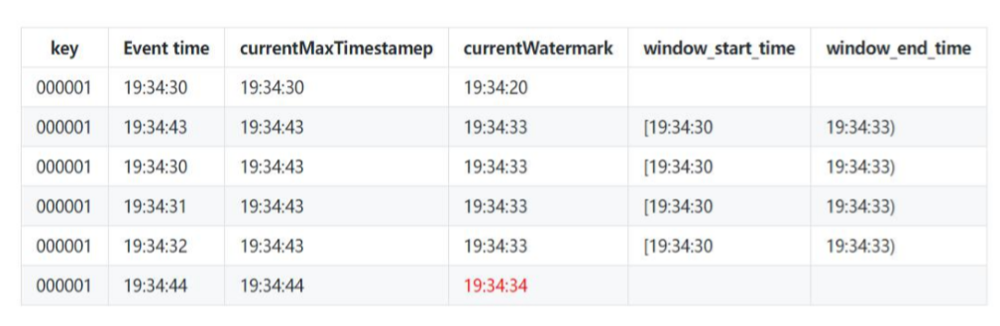

# Flink’s Window/WaterMark

## 一、TimeWindow

### 1.1 TimeWindow实现

```java
/**
 * 每隔5秒计算最近10秒单词出现的次数
 */
public class TimeWindowWordCount {
    public static void main(String[] args) throws Exception{
        StreamExecutionEnvironment env = StreamExecutionEnvironment.getExecutionEnvironment();
        DataStreamSource<String> dataStream = env.socketTextStream("localhost", 8888);
        SingleOutputStreamOperator<Tuple2<String, Integer>> result = dataStream.flatMap(new FlatMapFunction<String, Tuple2<String, Integer>>() {
            @Override
            public void flatMap(String line, Collector<Tuple2<String, Integer>> out) throws Exception {
                String[] fields = line.split(",");
                for (String word : fields) {
                    out.collect(new Tuple2<>(word, 1));
                }
            }
        }).keyBy(0)
                .timeWindow(Time.seconds(10), Time.seconds(5))
                .sum(1);

        result.print().setParallelism(1);

        env.execute("TimeWindowWordCount");

    }
}

```

### 1.2 ProcessWindowFunction实现

```java
/**
 * 每隔5秒计算最近10秒单词出现的次数
 */
public class TimeWindowWordCount {
    public static void main(String[] args) throws Exception{
        StreamExecutionEnvironment env = StreamExecutionEnvironment.getExecutionEnvironment();
        DataStreamSource<String> dataStream = env.socketTextStream("10.148.15.10", 8888);
        SingleOutputStreamOperator<Tuple2<String, Integer>> result = dataStream.flatMap(new FlatMapFunction<String, Tuple2<String, Integer>>() {
            @Override
            public void flatMap(String line, Collector<Tuple2<String, Integer>> out) throws Exception {
                String[] fields = line.split(",");
                for (String word : fields) {
                    out.collect(new Tuple2<>(word, 1));
                }
            }
        }).keyBy(0)
                .timeWindow(Time.seconds(10), Time.seconds(5))
                .process(new SumProcessWindowFunction());

        result.print().setParallelism(1);

        env.execute("TimeWindowWordCount");

    }

    /**
     * IN, OUT, KEY, W
     * IN：输入的数据类型
     * OUT：输出的数据类型
     * Key：key的数据类型（在Flink里面，String用Tuple表示）
     * W：Window的数据类型
     */
    public static class SumProcessWindowFunction extends
            ProcessWindowFunction<Tuple2<String,Integer>,Tuple2<String,Integer>,Tuple,TimeWindow> {
        FastDateFormat dataFormat = FastDateFormat.getInstance("HH:mm:ss");
        /**
         * 当一个window触发计算的时候会调用这个方法
         * @param tuple key
         * @param context operator的上下文
         * @param elements 指定window的所有元素
         * @param out 用户输出
         */
        @Override
        public void process(Tuple tuple, Context context, Iterable<Tuple2<String, Integer>> elements,
                            Collector<Tuple2<String, Integer>> out) {

            System.out.println("当天系统的时间："+dataFormat.format(System.currentTimeMillis()));

            System.out.println("Window的处理时间："+dataFormat.format(context.currentProcessingTime()));
            System.out.println("Window的开始时间："+dataFormat.format(context.window().getStart()));
            System.out.println("Window的结束时间："+dataFormat.format(context.window().getEnd()));

            int sum = 0;
            for (Tuple2<String, Integer> ele : elements) {
                sum += 1;
            }
            // 输出单词出现的次数
            out.collect(Tuple2.of(tuple.getField(0), sum));

        }
    }
}

```

### 1.3 Time的种类

* Event Time：事件产生的时间，它通常由事件中的时间戳描述。
* Ingestion time：事件进入Flink的时间
* Processing Time：事件被处理时当前系统的时间


```
开发上使用的数据，使用哪个时间才有意义？
```

## 二、Process Time Window

第 13 秒的时候连续发送 2 个事件，第 16 秒的时候再发送 1 个事件

```java
/**
 * 每隔5秒计算最近10秒单词出现的次数
 */
public class TimeWindowWordCount {
    public static void main(String[] args) throws Exception{
        StreamExecutionEnvironment env = StreamExecutionEnvironment.getExecutionEnvironment();
        env.setParallelism(1);
        DataStreamSource<String> dataStream = env.addSource(new TestSouce());
        SingleOutputStreamOperator<Tuple2<String, Integer>> result = dataStream.flatMap(new FlatMapFunction<String, Tuple2<String, Integer>>() {
            @Override
            public void flatMap(String line, Collector<Tuple2<String, Integer>> out) throws Exception {
                String[] fields = line.split(",");
                for (String word : fields) {
                    out.collect(new Tuple2<>(word, 1));
                }
            }
        }).keyBy(0)
                .timeWindow(Time.seconds(10), Time.seconds(5))
                .process(new SumProcessWindowFunction());

        result.print().setParallelism(1);

        env.execute("TimeWindowWordCount");

    }


    public static class TestSouce implements SourceFunction<String>{
        FastDateFormat dateFormat = FastDateFormat.getInstance("HH:mm:ss");
        @Override
        public void run(SourceContext<String> ctx) throws Exception {
             // 控制大约在 10 秒的倍数的时间点发送事件
            String currTime = String.valueOf(System.currentTimeMillis());
            while (Integer.valueOf(currTime.substring(currTime.length() - 4)) > 100) {
                currTime = String.valueOf(System.currentTimeMillis());
                continue;
            }
            System.out.println("开始发送事件的时间：" + dateFormat.format(System.currentTimeMillis()));
            // 第 13 秒发送两个事件
            TimeUnit.SECONDS.sleep(13);
            ctx.collect("hadoop," + System.currentTimeMillis());
            // 产生了一个事件，但是由于网络原因，事件没有发送
            ctx.collect("hadoop," + System.currentTimeMillis());
            // 第 16 秒发送一个事件
            TimeUnit.SECONDS.sleep(3);
            ctx.collect("hadoop," + System.currentTimeMillis());
            TimeUnit.SECONDS.sleep(300);

        }

        @Override
        public void cancel() {

        }
    }

    /**
     * IN, OUT, KEY, W
     * IN：输入的数据类型
     * OUT：输出的数据类型
     * Key：key的数据类型（在Flink里面，String用Tuple表示）
     * W：Window的数据类型
     */
    public static class SumProcessWindowFunction extends
            ProcessWindowFunction<Tuple2<String,Integer>,Tuple2<String,Integer>,Tuple,TimeWindow> {
        FastDateFormat dateFormat = FastDateFormat.getInstance("HH:mm:ss");
        /**
         * 当一个window触发计算的时候会调用这个方法
         * @param tuple key
         * @param context operator的上下文
         * @param elements 指定window的所有元素
         * @param out 用户输出
         */
        @Override
        public void process(Tuple tuple, Context context, Iterable<Tuple2<String, Integer>> elements,
                            Collector<Tuple2<String, Integer>> out) {

//            System.out.println("当天系统的时间："+dateFormat.format(System.currentTimeMillis()));
//
//            System.out.println("Window的处理时间："+dateFormat.format(context.currentProcessingTime()));
//            System.out.println("Window的开始时间："+dateFormat.format(context.window().getStart()));
//            System.out.println("Window的结束时间："+dateFormat.format(context.window().getEnd()));

            int sum = 0;
            for (Tuple2<String, Integer> ele : elements) {
                sum += 1;
            }
            // 输出单词出现的次数
            out.collect(Tuple2.of(tuple.getField(0), sum));

        }
    }
}
```

## 三、Process Time Window（无序）

自定义source，模拟：第 13 秒的时候连续发送 2 个事件，但是有一个事件确实在第13秒的发送出去了，另外一个事件因为某种原因在19秒的时候才发送出去，第 16 秒的时候再发送 1 个事件

```
/**
 * 每隔5秒计算最近10秒单词出现的次数
 */
public class TimeWindowWordCount {
    public static void main(String[] args) throws Exception{
        StreamExecutionEnvironment env = StreamExecutionEnvironment.getExecutionEnvironment();
        env.setParallelism(1);
        DataStreamSource<String> dataStream = env.addSource(new TestSouce());
        SingleOutputStreamOperator<Tuple2<String, Integer>> result = dataStream.flatMap(new FlatMapFunction<String, Tuple2<String, Integer>>() {
            @Override
            public void flatMap(String line, Collector<Tuple2<String, Integer>> out) throws Exception {
                String[] fields = line.split(",");
                for (String word : fields) {
                    out.collect(new Tuple2<>(word, 1));
                }
            }
        }).keyBy(0)
                .timeWindow(Time.seconds(10), Time.seconds(5))
                .process(new SumProcessWindowFunction());

        result.print().setParallelism(1);

        env.execute("TimeWindowWordCount");

    }

    /**
     * 模拟：第 13 秒的时候连续发送 2 个事件，第 16 秒的时候再发送 1 个事件
     */
    public static class TestSouce implements SourceFunction<String>{
        FastDateFormat dateFormat = FastDateFormat.getInstance("HH:mm:ss");
        @Override
        public void run(SourceContext<String> ctx) throws Exception {
            // 控制大约在 10 秒的倍数的时间点发送事件
            String currTime = String.valueOf(System.currentTimeMillis());
            while (Integer.valueOf(currTime.substring(currTime.length() - 4)) > 100) {
                currTime = String.valueOf(System.currentTimeMillis());
                continue;
            }
            System.out.println("开始发送事件的时间：" + dateFormat.format(System.currentTimeMillis()));
            // 第 13 秒发送两个事件
            TimeUnit.SECONDS.sleep(13);
            ctx.collect("hadoop," + System.currentTimeMillis());
            // 产生了一个事件，但是由于网络原因，事件没有发送
            String event = "hadoop," + System.currentTimeMillis();
            // 第 16 秒发送一个事件
            TimeUnit.SECONDS.sleep(3);
            ctx.collect("hadoop," + System.currentTimeMillis());
            // 第 19 秒的时候发送
            TimeUnit.SECONDS.sleep(3);
            ctx.collect(event);

            TimeUnit.SECONDS.sleep(300);

        }

        @Override
        public void cancel() {

        }
    }

    /**
     * IN, OUT, KEY, W
     * IN：输入的数据类型
     * OUT：输出的数据类型
     * Key：key的数据类型（在Flink里面，String用Tuple表示）
     * W：Window的数据类型
     */
    public static class SumProcessWindowFunction extends
            ProcessWindowFunction<Tuple2<String,Integer>,Tuple2<String,Integer>,Tuple,TimeWindow> {
        FastDateFormat dateFormat = FastDateFormat.getInstance("HH:mm:ss");
        /**
         * 当一个window触发计算的时候会调用这个方法
         * @param tuple key
         * @param context operator的上下文
         * @param elements 指定window的所有元素
         * @param out 用户输出
         */
        @Override
        public void process(Tuple tuple, Context context, Iterable<Tuple2<String, Integer>> elements,
                            Collector<Tuple2<String, Integer>> out) {

//            System.out.println("当天系统的时间："+dateFormat.format(System.currentTimeMillis()));
//
//            System.out.println("Window的处理时间："+dateFormat.format(context.currentProcessingTime()));
//            System.out.println("Window的开始时间："+dateFormat.format(context.window().getStart()));
//            System.out.println("Window的结束时间："+dateFormat.format(context.window().getEnd()));

            int sum = 0;
            for (Tuple2<String, Integer> ele : elements) {
                sum += 1;
            }
            // 输出单词出现的次数
            out.collect(Tuple2.of(tuple.getField(0), sum));

        }
    }
}
```


## 四、使用Event Time处理无序

使用Event Time处理

```java
/**
 * 每隔5秒计算最近10秒单词出现的次数
 */
public class TimeWindowWordCount {
    public static void main(String[] args) throws Exception{
        StreamExecutionEnvironment env = StreamExecutionEnvironment.getExecutionEnvironment();
        env.setParallelism(1);
        //步骤一：设置时间类型
        env.setStreamTimeCharacteristic(TimeCharacteristic.EventTime);
        DataStreamSource<String> dataStream = env.addSource(new TestSouce());
       dataStream.map(new MapFunction<String, Tuple2<String,Long>>() {
            @Override
            public Tuple2<String, Long> map(String line) throws Exception {
                String[] fields = line.split(",");
                return new Tuple2<>(fields[0],Long.valueOf(fields[1]));
            }
            //步骤二：获取数据里面的event Time
        }).assignTimestampsAndWatermarks(new EventTimeExtractor() )
               .keyBy(0)
                .timeWindow(Time.seconds(10), Time.seconds(5))
                .process(new SumProcessWindowFunction())
                .print().setParallelism(1);

        env.execute("TimeWindowWordCount");

    }


    public static class TestSouce implements SourceFunction<String>{
        FastDateFormat dateFormat = FastDateFormat.getInstance("HH:mm:ss");
        @Override
        public void run(SourceContext<String> ctx) throws Exception {
            // 控制大约在 10 秒的倍数的时间点发送事件
            String currTime = String.valueOf(System.currentTimeMillis());
            while (Integer.valueOf(currTime.substring(currTime.length() - 4)) > 100) {
                currTime = String.valueOf(System.currentTimeMillis());
                continue;
            }
            System.out.println("开始发送事件的时间：" + dateFormat.format(System.currentTimeMillis()));
            // 第 13 秒发送两个事件
            TimeUnit.SECONDS.sleep(13);
            ctx.collect("hadoop," + System.currentTimeMillis());
            // 产生了一个事件，但是由于网络原因，事件没有发送
            String event = "hadoop," + System.currentTimeMillis();
            // 第 16 秒发送一个事件
            TimeUnit.SECONDS.sleep(3);
            ctx.collect("hadoop," + System.currentTimeMillis());
            // 第 19 秒的时候发送
            TimeUnit.SECONDS.sleep(3);
            ctx.collect(event);

            TimeUnit.SECONDS.sleep(300);

        }

        @Override
        public void cancel() {

        }
    }

    /**
     * IN, OUT, KEY, W
     * IN：输入的数据类型
     * OUT：输出的数据类型
     * Key：key的数据类型（在Flink里面，String用Tuple表示）
     * W：Window的数据类型
     */
    public static class SumProcessWindowFunction extends
            ProcessWindowFunction<Tuple2<String,Long>,Tuple2<String,Integer>,Tuple,TimeWindow> {
        FastDateFormat dateFormat = FastDateFormat.getInstance("HH:mm:ss");
        /**
         * 当一个window触发计算的时候会调用这个方法
         * @param tuple key
         * @param context operator的上下文
         * @param elements 指定window的所有元素
         * @param out 用户输出
         */
        @Override
        public void process(Tuple tuple, Context context, Iterable<Tuple2<String, Long>> elements,
                            Collector<Tuple2<String, Integer>> out) {

//            System.out.println("当天系统的时间："+dateFormat.format(System.currentTimeMillis()));
//
//            System.out.println("Window的处理时间："+dateFormat.format(context.currentProcessingTime()));
//            System.out.println("Window的开始时间："+dateFormat.format(context.window().getStart()));
//            System.out.println("Window的结束时间："+dateFormat.format(context.window().getEnd()));

            int sum = 0;
            for (Tuple2<String, Long> ele : elements) {
                sum += 1;
            }
            // 输出单词出现的次数
            out.collect(Tuple2.of(tuple.getField(0), sum));

        }
    }


    private static class EventTimeExtractor
            implements AssignerWithPeriodicWatermarks<Tuple2<String, Long>> {
        FastDateFormat dateFormat = FastDateFormat.getInstance("HH:mm:ss");

        // 拿到每一个事件的 Event Time
        @Override
        public long extractTimestamp(Tuple2<String, Long> element,
                                     long previousElementTimestamp) {
            return element.f1;
        }

        @Nullable
        @Override
        public Watermark getCurrentWatermark() {

            return new Watermark(System.currentTimeMillis());
        }
    }
}
```

## 五、使用WaterMark机制解决无序


```java
/**
 * 每隔5秒计算最近10秒单词出现的次数
 */
public class TimeWindowWordCount {
    public static void main(String[] args) throws Exception{
        StreamExecutionEnvironment env = StreamExecutionEnvironment.getExecutionEnvironment();
        env.setParallelism(1);
        //步骤一：设置时间类型
        env.setStreamTimeCharacteristic(TimeCharacteristic.EventTime);
        DataStreamSource<String> dataStream = env.addSource(new TestSouce());
       dataStream.map(new MapFunction<String, Tuple2<String,Long>>() {
            @Override
            public Tuple2<String, Long> map(String line) throws Exception {
                String[] fields = line.split(",");
                return new Tuple2<>(fields[0],Long.valueOf(fields[1]));
            }
            //步骤二：获取数据里面的event Time
        }).assignTimestampsAndWatermarks(new EventTimeExtractor() )
               .keyBy(0)
                .timeWindow(Time.seconds(10), Time.seconds(5))
                .process(new SumProcessWindowFunction())
                .print().setParallelism(1);

        env.execute("TimeWindowWordCount");

    }


    public static class TestSouce implements SourceFunction<String>{
        FastDateFormat dateFormat = FastDateFormat.getInstance("HH:mm:ss");
        @Override
        public void run(SourceContext<String> ctx) throws Exception {
            // 控制大约在 10 秒的倍数的时间点发送事件
            String currTime = String.valueOf(System.currentTimeMillis());
            while (Integer.valueOf(currTime.substring(currTime.length() - 4)) > 100) {
                currTime = String.valueOf(System.currentTimeMillis());
                continue;
            }
            System.out.println("开始发送事件的时间：" + dateFormat.format(System.currentTimeMillis()));
            // 第 13 秒发送两个事件
            TimeUnit.SECONDS.sleep(13);
            ctx.collect("hadoop," + System.currentTimeMillis());
            // 产生了一个事件，但是由于网络原因，事件没有发送
            String event = "hadoop," + System.currentTimeMillis();
            // 第 16 秒发送一个事件
            TimeUnit.SECONDS.sleep(3);
            ctx.collect("hadoop," + System.currentTimeMillis());
            // 第 19 秒的时候发送
            TimeUnit.SECONDS.sleep(3);
            ctx.collect(event);

            TimeUnit.SECONDS.sleep(300);

        }

        @Override
        public void cancel() {

        }
    }

    /**
     * IN, OUT, KEY, W
     * IN：输入的数据类型
     * OUT：输出的数据类型
     * Key：key的数据类型（在Flink里面，String用Tuple表示）
     * W：Window的数据类型
     */
    public static class SumProcessWindowFunction extends
            ProcessWindowFunction<Tuple2<String,Long>,Tuple2<String,Integer>,Tuple,TimeWindow> {
        FastDateFormat dateFormat = FastDateFormat.getInstance("HH:mm:ss");
        /**
         * 当一个window触发计算的时候会调用这个方法
         * @param tuple key
         * @param context operator的上下文
         * @param elements 指定window的所有元素
         * @param out 用户输出
         */
        @Override
        public void process(Tuple tuple, Context context, Iterable<Tuple2<String, Long>> elements,
                            Collector<Tuple2<String, Integer>> out) {

//            System.out.println("当天系统的时间："+dateFormat.format(System.currentTimeMillis()));
//
//            System.out.println("Window的处理时间："+dateFormat.format(context.currentProcessingTime()));
//            System.out.println("Window的开始时间："+dateFormat.format(context.window().getStart()));
//            System.out.println("Window的结束时间："+dateFormat.format(context.window().getEnd()));

            int sum = 0;
            for (Tuple2<String, Long> ele : elements) {
                sum += 1;
            }
            // 输出单词出现的次数
            out.collect(Tuple2.of(tuple.getField(0), sum));

        }
    }


    private static class EventTimeExtractor
            implements AssignerWithPeriodicWatermarks<Tuple2<String, Long>> {
        FastDateFormat dateFormat = FastDateFormat.getInstance("HH:mm:ss");

        // 拿到每一个事件的 Event Time
        @Override
        public long extractTimestamp(Tuple2<String, Long> element,
                                     long previousElementTimestamp) {
            return element.f1;
        }

        @Nullable
        @Override
        public Watermark getCurrentWatermark() {
            //window延迟5秒触发
            return new Watermark(System.currentTimeMillis() - 5000);
        }
    }
}

```

## 六、WaterMark机制

### 6.1 WaterMark的周期

```java
/**
 * 每隔5秒计算最近10秒单词出现的次数
 */
public class TimeWindowWordCount {
    public static void main(String[] args) throws Exception{
        StreamExecutionEnvironment env = StreamExecutionEnvironment.getExecutionEnvironment();
        env.setParallelism(1);
        //步骤一：设置时间类型
        env.setStreamTimeCharacteristic(TimeCharacteristic.EventTime);
        //设置waterMark产生的周期为10s
        env.getConfig().setAutoWatermarkInterval(10000);

        DataStreamSource<String> dataStream = env.addSource(new TestSouce());
       dataStream.map(new MapFunction<String, Tuple2<String,Long>>() {
            @Override
            public Tuple2<String, Long> map(String line) throws Exception {
                String[] fields = line.split(",");
                return new Tuple2<>(fields[0],Long.valueOf(fields[1]));
            }
            //步骤二：获取数据里面的event Time
        }).assignTimestampsAndWatermarks(new EventTimeExtractor() )
               .keyBy(0)
                .timeWindow(Time.seconds(10), Time.seconds(5))
                .process(new SumProcessWindowFunction())
                .print().setParallelism(1);

        env.execute("TimeWindowWordCount");

    }


    public static class TestSouce implements SourceFunction<String>{
        FastDateFormat dateFormat = FastDateFormat.getInstance("HH:mm:ss");
        @Override
        public void run(SourceContext<String> ctx) throws Exception {
            // 控制大约在 10 秒的倍数的时间点发送事件
            String currTime = String.valueOf(System.currentTimeMillis());
            while (Integer.valueOf(currTime.substring(currTime.length() - 4)) > 100) {
                currTime = String.valueOf(System.currentTimeMillis());
                continue;
            }
            System.out.println("开始发送事件的时间：" + dateFormat.format(System.currentTimeMillis()));
            // 第 13 秒发送两个事件
            TimeUnit.SECONDS.sleep(13);
            ctx.collect("hadoop," + System.currentTimeMillis());
            // 产生了一个事件，但是由于网络原因，事件没有发送
            String event = "hadoop," + System.currentTimeMillis();
            // 第 16 秒发送一个事件
            TimeUnit.SECONDS.sleep(3);
            ctx.collect("hadoop," + System.currentTimeMillis());
            // 第 19 秒的时候发送
            TimeUnit.SECONDS.sleep(3);
            ctx.collect(event);

            TimeUnit.SECONDS.sleep(300);

        }

        @Override
        public void cancel() {

        }
    }

    /**
     * IN, OUT, KEY, W
     * IN：输入的数据类型
     * OUT：输出的数据类型
     * Key：key的数据类型（在Flink里面，String用Tuple表示）
     * W：Window的数据类型
     */
    public static class SumProcessWindowFunction extends
            ProcessWindowFunction<Tuple2<String,Long>,Tuple2<String,Integer>,Tuple,TimeWindow> {
        FastDateFormat dateFormat = FastDateFormat.getInstance("HH:mm:ss");
        /**
         * 当一个window触发计算的时候会调用这个方法
         * @param tuple key
         * @param context operator的上下文
         * @param elements 指定window的所有元素
         * @param out 用户输出
         */
        @Override
        public void process(Tuple tuple, Context context, Iterable<Tuple2<String, Long>> elements,
                            Collector<Tuple2<String, Integer>> out) {
            int sum = 0;
            for (Tuple2<String, Long> ele : elements) {
                sum += 1;
            }
            // 输出单词出现的次数
            out.collect(Tuple2.of(tuple.getField(0), sum));

        }
    }


    private static class EventTimeExtractor
            implements AssignerWithPeriodicWatermarks<Tuple2<String, Long>> {
        FastDateFormat dateFormat = FastDateFormat.getInstance("HH:mm:ss");

        // 拿到每一个事件的 Event Time
        @Override
        public long extractTimestamp(Tuple2<String, Long> element,
                                     long previousElementTimestamp) {
            //这个方法是每获取到一个数据就会被调用一次。
            return element.f1;
        }

        @Nullable
        @Override
        public Watermark getCurrentWatermark() {
            /**
             * WasterMark会周期性的产生，默认就是每隔200毫秒产生一个
             *
             *         设置 watermark 产生的周期为 1000ms
             *         env.getConfig().setAutoWatermarkInterval(1000);
             */
            //window延迟5秒触发
            System.out.println("water mark...");
            return new Watermark(System.currentTimeMillis() - 5000);
        }
    }
}

```

### 6.2 WaterMark的定义

使用eventTime的时候如何处理乱序数据？
我们知道，流处理从事件产生，到流经source，再到operator，中间是有一个过程和时间的。虽然大部分情况下，流到operator的数据都是按照事件产生的时间顺序来的，但是也不排除由于网络延迟等原因，导致乱序的产生，特别是使用kafka的话，多个分区的数据无法保证有序。所以在进行window计算的时候，我们又不能无限期的等下去，必须要有个机制来保证一个特定的时间后，必须触发window去进行计算了。这个特别的机制，就是watermark，watermark是用于处理乱序事件的。watermark可以翻译为水位线

有序的流的watermarks


无序的流的watermarks


多并行度流的watermarks


### 6.3 练习与查看数据

得到并打印每隔 3 秒钟统计前 3 秒内的相同的 key 的所有的事件


代码开发

```java
/**
 * 得到并打印每隔 3 秒钟统计前 3 秒内的相同的 key 的所有的事件
 */
public class WaterMarkWindowWordCount {
    public static void main(String[] args) throws Exception{
        StreamExecutionEnvironment env = StreamExecutionEnvironment.getExecutionEnvironment();
        env.setParallelism(1);
        //步骤一：设置时间类型
        env.setStreamTimeCharacteristic(TimeCharacteristic.EventTime);
        //设置waterMark产生的周期为1s
        env.getConfig().setAutoWatermarkInterval(1000);

        DataStreamSource<String> dataStream = env.socketTextStream("10.148.15.10", 8888);
        dataStream.map(new MapFunction<String, Tuple2<String,Long>>() {
            @Override
            public Tuple2<String, Long> map(String line) throws Exception {
                String[] fields = line.split(",");
                return new Tuple2<>(fields[0],Long.valueOf(fields[1]));
            }
            //步骤二：获取数据里面的event Time
        }).assignTimestampsAndWatermarks(new EventTimeExtractor() )
               .keyBy(0)
                .timeWindow(Time.seconds(3))
                .process(new SumProcessWindowFunction())
                .print().setParallelism(1);

        env.execute("TimeWindowWordCount");

    }


    /**
     * IN, OUT, KEY, W
     * IN：输入的数据类型
     * OUT：输出的数据类型
     * Key：key的数据类型（在Flink里面，String用Tuple表示）
     * W：Window的数据类型
     */
    public static class SumProcessWindowFunction extends
            ProcessWindowFunction<Tuple2<String,Long>,String,Tuple,TimeWindow> {
        FastDateFormat dateFormat = FastDateFormat.getInstance("HH:mm:ss");
        /**
         * 当一个window触发计算的时候会调用这个方法
         * @param tuple key
         * @param context operator的上下文
         * @param elements 指定window的所有元素
         * @param out 用户输出
         */
        @Override
        public void process(Tuple tuple, Context context, Iterable<Tuple2<String, Long>> elements,
                            Collector<String> out) {
            System.out.println("处理时间：" + dateFormat.format(context.currentProcessingTime()));
            System.out.println("window start time : " + dateFormat.format(context.window().getStart()));

            List<String> list = new ArrayList<>();
            for (Tuple2<String, Long> ele : elements) {
                list.add(ele.toString() + "|" + dateFormat.format(ele.f1));
            }
            out.collect(list.toString());
            System.out.println("window end time  : " + dateFormat.format(context.window().getEnd()));

        }
    }


    private static class EventTimeExtractor
            implements AssignerWithPeriodicWatermarks<Tuple2<String, Long>> {
        FastDateFormat dateFormat = FastDateFormat.getInstance("HH:mm:ss");

        private long currentMaxEventTime = 0L;
        private long maxOutOfOrderness = 10000; // 最大允许的乱序时间 10 秒


        // 拿到每一个事件的 Event Time
        @Override
        public long extractTimestamp(Tuple2<String, Long> element,
                                     long previousElementTimestamp) {
            long currentElementEventTime = element.f1;
            currentMaxEventTime = Math.max(currentMaxEventTime, currentElementEventTime);
            System.out.println("event = " + element
                    + "|" + dateFormat.format(element.f1) // Event Time
                    + "|" + dateFormat.format(currentMaxEventTime)  // Max Event Time
                    + "|" + dateFormat.format(getCurrentWatermark().getTimestamp())); // Current Watermark
            return currentElementEventTime;
        }

        @Nullable
        @Override
        public Watermark getCurrentWatermark() {
            /**
             * WasterMark会周期性的产生，默认就是每隔200毫秒产生一个
             *
             *         设置 watermark 产生的周期为 1000ms
             *         env.getConfig().setAutoWatermarkInterval(1000);
             */
            //window延迟5秒触发
            System.out.println("water mark...");
            return new Watermark(currentMaxEventTime - maxOutOfOrderness);
        }
    }
}
```

演示数据：

```java
-- window 计算触发的条件
000001,1461756862000
000001,1461756866000
000001,1461756872000
000001,1461756873000
000001,1461756874000
000001,1461756876000
000001,1461756877000
```

一条一条的数据输入。

### 6.4  计算window的触发时间


总结：window触发的时间

1. 新的watermark 时间 >= window_end_time

    [window_start_time, window_end_time) 就会结算windows。

2. 在 [window_start_time, window_end_time) 区间中有数据存在，注意是左闭右开的区间，而且是以 event time 来计算的

4.6.5 WaterMark+Window 处理乱序时间

输入数据：

```java
000001,1461756879000
000001,1461756871000

000001,1461756883000

```


### 6.5  迟到太久的数据

##### 丢弃

重启程序，做测试。

输入数据：

```java
000001,1461756870000
000001,1461756883000

000001,1461756870000
000001,1461756871000
000001,1461756872000
```


发现迟到太多数据就会被丢弃

##### 指定允许再次迟到的时间

```java
).assignTimestampsAndWatermarks(new EventTimeExtractor() )
               .keyBy(0)
                .timeWindow(Time.seconds(3))
                .allowedLateness(Time.seconds(2)) // 允许事件迟到 2 秒
                .process(new SumProcessWindowFunction())
                .print().setParallelism(1);
```


输入数据

```java
000001,1461756870000
000001,1461756883000

000001,1461756870000
000001,1461756871000
000001,1461756872000

000001,1461756884000

000001,1461756870000
000001,1461756871000
000001,1461756872000

000001,1461756885000

000001,1461756870000
000001,1461756871000
000001,1461756872000
```





1. 当我们设置允许迟到 2 秒的事件，第一次 window 触发的条件是 watermark >= window_end_time
2. 第二次(或者多次)触发的条件是 watermark < window_end_time + allowedLateness

##### 收集迟到的数据

```java
/**
 * 得到并打印每隔 3 秒钟统计前 3 秒内的相同的 key 的所有的事件
 * 收集迟到太多的数据
 */
public class WaterMarkWindowWordCount {
    public static void main(String[] args) throws Exception{
        StreamExecutionEnvironment env = StreamExecutionEnvironment.getExecutionEnvironment();
        env.setParallelism(1);
        //步骤一：设置时间类型
        env.setStreamTimeCharacteristic(TimeCharacteristic.EventTime);
        //设置waterMark产生的周期为1s
        env.getConfig().setAutoWatermarkInterval(1000);

        // 保存迟到的，会被丢弃的数据
        OutputTag<Tuple2<String, Long>> outputTag =
                new OutputTag<Tuple2<String, Long>>("late-date"){};

        DataStreamSource<String> dataStream = env.socketTextStream("10.148.15.10", 8888);
        SingleOutputStreamOperator<String> result = dataStream.map(new MapFunction<String, Tuple2<String, Long>>() {
            @Override
            public Tuple2<String, Long> map(String line) throws Exception {
                String[] fields = line.split(",");
                return new Tuple2<>(fields[0], Long.valueOf(fields[1]));
            }
            //步骤二：获取数据里面的event Time
        }).assignTimestampsAndWatermarks(new EventTimeExtractor())
                .keyBy(0)
                .timeWindow(Time.seconds(3))
                // .allowedLateness(Time.seconds(2)) // 允许事件迟到 2 秒
                .sideOutputLateData(outputTag) // 保存迟到太多的数据
                .process(new SumProcessWindowFunction());
        //打印正常的数据
        result.print();
        //获取迟到太多的数据

        DataStream<String> lateDataStream
                = result.getSideOutput(outputTag).map(new MapFunction<Tuple2<String, Long>, String>() {
            @Override
            public String map(Tuple2<String, Long> stringLongTuple2) throws Exception {
                return "迟到的数据：" + stringLongTuple2.toString();
            }
        });

        lateDataStream.print();

        env.execute("TimeWindowWordCount");

    }


    /**
     * IN, OUT, KEY, W
     * IN：输入的数据类型
     * OUT：输出的数据类型
     * Key：key的数据类型（在Flink里面，String用Tuple表示）
     * W：Window的数据类型
     */
    public static class SumProcessWindowFunction extends
            ProcessWindowFunction<Tuple2<String,Long>,String,Tuple,TimeWindow> {
        FastDateFormat dateFormat = FastDateFormat.getInstance("HH:mm:ss");
        /**
         * 当一个window触发计算的时候会调用这个方法
         * @param tuple key
         * @param context operator的上下文
         * @param elements 指定window的所有元素
         * @param out 用户输出
         */
        @Override
        public void process(Tuple tuple, Context context, Iterable<Tuple2<String, Long>> elements,
                            Collector<String> out) {
            System.out.println("处理时间：" + dateFormat.format(context.currentProcessingTime()));
            System.out.println("window start time : " + dateFormat.format(context.window().getStart()));

            List<String> list = new ArrayList<>();
            for (Tuple2<String, Long> ele : elements) {
                list.add(ele.toString() + "|" + dateFormat.format(ele.f1));
            }
            out.collect(list.toString());
            System.out.println("window end time  : " + dateFormat.format(context.window().getEnd()));

        }
    }


    private static class EventTimeExtractor
            implements AssignerWithPeriodicWatermarks<Tuple2<String, Long>> {
        FastDateFormat dateFormat = FastDateFormat.getInstance("HH:mm:ss");

        private long currentMaxEventTime = 0L;
        private long maxOutOfOrderness = 10000; // 最大允许的乱序时间 10 秒


        // 拿到每一个事件的 Event Time
        @Override
        public long extractTimestamp(Tuple2<String, Long> element,
                                     long previousElementTimestamp) {
            long currentElementEventTime = element.f1;
            currentMaxEventTime = Math.max(currentMaxEventTime, currentElementEventTime);
            System.out.println("event = " + element
                    + "|" + dateFormat.format(element.f1) // Event Time
                    + "|" + dateFormat.format(currentMaxEventTime)  // Max Event Time
                    + "|" + dateFormat.format(getCurrentWatermark().getTimestamp())); // Current Watermark
            return currentElementEventTime;
        }

        @Nullable
        @Override
        public Watermark getCurrentWatermark() {
            /**
             * WasterMark会周期性的产生，默认就是每隔200毫秒产生一个
             *
             *         设置 watermark 产生的周期为 1000ms
             *         env.getConfig().setAutoWatermarkInterval(1000);
             */
            System.out.println("water mark...");
            return new Watermark(currentMaxEventTime - maxOutOfOrderness);
        }
    }
}
```

输入：

```java
000001,1461756870000
000001,1461756883000
迟到的数据
000001,1461756870000
000001,1461756871000
000001,1461756872000
```

## 七、多并行度下的WaterMark


一个window可能会接受到多个waterMark，我们以最小的为准。

```java
/**
 * 得到并打印每隔 3 秒钟统计前 3 秒内的相同的 key 的所有的事件
 * 测试多并行度
 */
public class WaterMarkWindowWordCount {
    public static void main(String[] args) throws Exception{
        StreamExecutionEnvironment env = StreamExecutionEnvironment.getExecutionEnvironment();
        //把并行度设置为2
        env.setParallelism(2);
        //步骤一：设置时间类型
        env.setStreamTimeCharacteristic(TimeCharacteristic.EventTime);
        //设置waterMark产生的周期为1s
        env.getConfig().setAutoWatermarkInterval(1000);

        // 保存迟到的，会被丢弃的数据
        OutputTag<Tuple2<String, Long>> outputTag =
                new OutputTag<Tuple2<String, Long>>("late-date"){};

        DataStreamSource<String> dataStream = env.socketTextStream("10.148.15.10", 8888);
        SingleOutputStreamOperator<String> result = dataStream.map(new MapFunction<String, Tuple2<String, Long>>() {
            @Override
            public Tuple2<String, Long> map(String line) throws Exception {
                String[] fields = line.split(",");
                return new Tuple2<>(fields[0], Long.valueOf(fields[1]));
            }
            //步骤二：获取数据里面的event Time
        }).assignTimestampsAndWatermarks(new EventTimeExtractor())
                .keyBy(0)
                .timeWindow(Time.seconds(3))
                // .allowedLateness(Time.seconds(2)) // 允许事件迟到 2 秒
                .sideOutputLateData(outputTag) // 保存迟到太多的数据
                .process(new SumProcessWindowFunction());
        //打印正常的数据
        result.print();
        //获取迟到太多的数据

        DataStream<String> lateDataStream
                = result.getSideOutput(outputTag).map(new MapFunction<Tuple2<String, Long>, String>() {
            @Override
            public String map(Tuple2<String, Long> stringLongTuple2) throws Exception {
                return "迟到的数据：" + stringLongTuple2.toString();
            }
        });

        lateDataStream.print();

        env.execute("TimeWindowWordCount");

    }


    /**
     * IN, OUT, KEY, W
     * IN：输入的数据类型
     * OUT：输出的数据类型
     * Key：key的数据类型（在Flink里面，String用Tuple表示）
     * W：Window的数据类型
     */
    public static class SumProcessWindowFunction extends
            ProcessWindowFunction<Tuple2<String,Long>,String,Tuple,TimeWindow> {
        FastDateFormat dateFormat = FastDateFormat.getInstance("HH:mm:ss");
        /**
         * 当一个window触发计算的时候会调用这个方法
         * @param tuple key
         * @param context operator的上下文
         * @param elements 指定window的所有元素
         * @param out 用户输出
         */
        @Override
        public void process(Tuple tuple, Context context, Iterable<Tuple2<String, Long>> elements,
                            Collector<String> out) {
            System.out.println("处理时间：" + dateFormat.format(context.currentProcessingTime()));
            System.out.println("window start time : " + dateFormat.format(context.window().getStart()));

            List<String> list = new ArrayList<>();
            for (Tuple2<String, Long> ele : elements) {
                list.add(ele.toString() + "|" + dateFormat.format(ele.f1));
            }
            out.collect(list.toString());
            System.out.println("window end time  : " + dateFormat.format(context.window().getEnd()));

        }
    }


    private static class EventTimeExtractor
            implements AssignerWithPeriodicWatermarks<Tuple2<String, Long>> {
        FastDateFormat dateFormat = FastDateFormat.getInstance("HH:mm:ss");

        private long currentMaxEventTime = 0L;
        private long maxOutOfOrderness = 10000; // 最大允许的乱序时间 10 秒


        // 拿到每一个事件的 Event Time
        @Override
        public long extractTimestamp(Tuple2<String, Long> element,
                                     long previousElementTimestamp) {
            long currentElementEventTime = element.f1;
            currentMaxEventTime = Math.max(currentMaxEventTime, currentElementEventTime);
            //打印线程
            long id = Thread.currentThread().getId();
            System.out.println("当前线程ID："+id+"event = " + element
                    + "|" + dateFormat.format(element.f1) // Event Time
                    + "|" + dateFormat.format(currentMaxEventTime)  // Max Event Time
                    + "|" + dateFormat.format(getCurrentWatermark().getTimestamp())); // Current Watermark
            return currentElementEventTime;
        }

        @Nullable
        @Override
        public Watermark getCurrentWatermark() {
            /**
             * WasterMark会周期性的产生，默认就是每隔200毫秒产生一个
             *
             *         设置 watermark 产生的周期为 1000ms
             *         env.getConfig().setAutoWatermarkInterval(1000);
             */
            System.out.println("water mark...");
            return new Watermark(currentMaxEventTime - maxOutOfOrderness);
        }
    }
}
```

输入数据：

```java
000001,1461756870000
000001,1461756883000
000001,1461756888000
```

输出结果：

```java
当前线程ID：55event = (000001,1461756883000)|19:34:43|19:34:43|19:34:33
water mark...
当前线程ID：56event = (000001,1461756870000)|19:34:30|19:34:30|19:34:20
water mark...
water mark...
water mark...
当前线程ID：56event = (000001,1461756888000)|19:34:48|19:34:48|19:34:38
water mark...
water mark...
处理时间：19:31:25
window start time : 19:34:30
2> [(000001,1461756870000)|19:34:30]
window end time  : 19:34:33

```

ID为56的线程有两个WaterMark：20,38

那么38这个会替代20，所以ID为56的线程的WaterMark是38

然后ID为55的线程的WaterMark是33，而ID为56是WaterMark是38，会在里面求一个小的值作为waterMark，就是33，这个时候会触发Window为30-33的窗口，那这个窗口里面就有 (000001,1461756870000)这条数据。

## 八、WaterMark生成机制	

```java
/**
 * 得到并打印每隔 3 秒钟统计前 3 秒内的相同的 key 的所有的事件
 * 有条件的产生watermark
 */
public class WaterMarkWindowWordCount {
    public static void main(String[] args) throws Exception{
        StreamExecutionEnvironment env = StreamExecutionEnvironment.getExecutionEnvironment();
        //把并行度设置为2
        env.setParallelism(2);
        //步骤一：设置时间类型
        env.setStreamTimeCharacteristic(TimeCharacteristic.EventTime);
        //设置waterMark产生的周期为1s
        env.getConfig().setAutoWatermarkInterval(1000);

        // 保存迟到的，会被丢弃的数据
        OutputTag<Tuple2<String, Long>> outputTag =
                new OutputTag<Tuple2<String, Long>>("late-date"){};

        DataStreamSource<String> dataStream = env.socketTextStream("10.148.15.10", 8888);
        SingleOutputStreamOperator<String> result = dataStream.map(new MapFunction<String, Tuple2<String, Long>>() {
            @Override
            public Tuple2<String, Long> map(String line) throws Exception {
                String[] fields = line.split(",");
                return new Tuple2<>(fields[0], Long.valueOf(fields[1]));
            }
            //步骤二：获取数据里面的event Time
        }).assignTimestampsAndWatermarks(new EventTimeExtractor())
                .keyBy(0)
                .timeWindow(Time.seconds(3))
                // .allowedLateness(Time.seconds(2)) // 允许事件迟到 2 秒
                .sideOutputLateData(outputTag) // 保存迟到太多的数据
                .process(new SumProcessWindowFunction());
        //打印正常的数据
        result.print();
        //获取迟到太多的数据

        DataStream<String> lateDataStream
                = result.getSideOutput(outputTag).map(new MapFunction<Tuple2<String, Long>, String>() {
            @Override
            public String map(Tuple2<String, Long> stringLongTuple2) throws Exception {
                return "迟到的数据：" + stringLongTuple2.toString();
            }
        });

        lateDataStream.print();

        env.execute("TimeWindowWordCount");

    }


    /**
     * IN, OUT, KEY, W
     * IN：输入的数据类型
     * OUT：输出的数据类型
     * Key：key的数据类型（在Flink里面，String用Tuple表示）
     * W：Window的数据类型
     */
    public static class SumProcessWindowFunction extends
            ProcessWindowFunction<Tuple2<String,Long>,String,Tuple,TimeWindow> {
        FastDateFormat dateFormat = FastDateFormat.getInstance("HH:mm:ss");
        /**
         * 当一个window触发计算的时候会调用这个方法
         * @param tuple key
         * @param context operator的上下文
         * @param elements 指定window的所有元素
         * @param out 用户输出
         */
        @Override
        public void process(Tuple tuple, Context context, Iterable<Tuple2<String, Long>> elements,
                            Collector<String> out) {
            System.out.println("处理时间：" + dateFormat.format(context.currentProcessingTime()));
            System.out.println("window start time : " + dateFormat.format(context.window().getStart()));

            List<String> list = new ArrayList<>();
            for (Tuple2<String, Long> ele : elements) {
                list.add(ele.toString() + "|" + dateFormat.format(ele.f1));
            }
            out.collect(list.toString());
            System.out.println("window end time  : " + dateFormat.format(context.window().getEnd()));

        }
    }

    /**
     * 按条件产生waterMark
     */
    private static class EventTimeExtractor2
            implements AssignerWithPunctuatedWatermarks<Tuple2<String, Long>> {

        @Nullable
        @Override
        public Watermark checkAndGetNextWatermark(Tuple2<String, Long> lastElement,
                                                  long extractedTimestamp) {
            // 这个方法是每接收到一个事件就会调用
            // 根据条件产生 watermark ，并不是周期性的产生 watermark
            if (lastElement.f0 == "000002") {
                // 才发送 watermark
                return new Watermark(lastElement.f1 - 10000);
            }
            // 则表示不产生 watermark
            return null;
        }

        @Override
        public long extractTimestamp(Tuple2<String, Long> element,
                                     long previousElementTimestamp) {
            return element.f1;
        }
    }


    private static class EventTimeExtractor
            implements AssignerWithPeriodicWatermarks<Tuple2<String, Long>> {
        FastDateFormat dateFormat = FastDateFormat.getInstance("HH:mm:ss");

        private long currentMaxEventTime = 0L;
        private long maxOutOfOrderness = 10000; // 最大允许的乱序时间 10 秒


        // 拿到每一个事件的 Event Time
        @Override
        public long extractTimestamp(Tuple2<String, Long> element,
                                     long previousElementTimestamp) {
            long currentElementEventTime = element.f1;
            currentMaxEventTime = Math.max(currentMaxEventTime, currentElementEventTime);
            long id = Thread.currentThread().getId();
            System.out.println("当前线程ID："+id+"event = " + element
                    + "|" + dateFormat.format(element.f1) // Event Time
                    + "|" + dateFormat.format(currentMaxEventTime)  // Max Event Time
                    + "|" + dateFormat.format(getCurrentWatermark().getTimestamp())); // Current Watermark
            return currentElementEventTime;
        }

        @Nullable
        @Override
        public Watermark getCurrentWatermark() {
            /**
             * WasterMark会周期性的产生，默认就是每隔200毫秒产生一个
             *
             *         设置 watermark 产生的周期为 1000ms
             *         env.getConfig().setAutoWatermarkInterval(1000);
             *
             *
             * 和事件关系不大
             *    1. watermark 值依赖处理时间的场景
             *    2. 当有一段时间没有接收到事件，但是仍然需要产生 watermark 的场景
             */
            System.out.println("water mark...");
            return new Watermark(currentMaxEventTime - maxOutOfOrderness);
        }
    }
}
```

