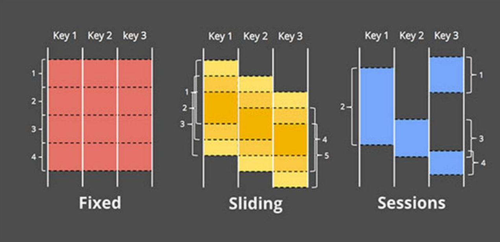

# Flink’s Window/WaterMark

## 一、Window

### 1.1 Window的作用

- 一种切割无限数据为有限快进行处理的手段

### 1.2 Windows类型

#### 1.2.1 CountWindow

#### 1.2.2 TimeWindow

### 

##### 1.2.2.1 Tumbing Window

- 时间对齐

- 窗口长度固定

- 没有重叠

- 代码示例：

  ```java
  public class TumbingWindowTest {
      public static void main(String[] args) throws Exception {
  
          /**
           * 每隔5秒计算最近5秒单词出现的次数
           */
          StreamExecutionEnvironment env = StreamExecutionEnvironment.getExecutionEnvironment();
  
          DataStream<Tuple2<String, Integer>> dataStream =
                  env.socketTextStream("localhost", 9999)
                          .flatMap(new SlidingWindowTest.Splitter())
                          .keyBy(0)
                          .timeWindow(Time.seconds(5))
                          .sum(1);
  
          dataStream.print();
          env.execute("Window WordCount");
      }
  
      public static class Splitter implements FlatMapFunction<String, Tuple2<String, Integer>> {
          @Override
          public void flatMap(String sentence, Collector<Tuple2<String, Integer>> out) throws Exception {
              for (String word : sentence.split(" ")) {
                  out.collect(new Tuple2<String, Integer>(word, 1));
              }
          }
      }
  }
  ```

  ```java
  /**
   * 每隔5秒计算最近10秒单词出现的次数
   */
  public class TimeWindowWordCount {
      public static void main(String[] args) throws Exception{
          StreamExecutionEnvironment env = StreamExecutionEnvironment.getExecutionEnvironment();
          DataStreamSource<String> dataStream = env.socketTextStream("127.0.0.1", 8888);
          SingleOutputStreamOperator<Tuple2<String, Integer>> result = dataStream.flatMap(new FlatMapFunction<String, Tuple2<String, Integer>>() {
              @Override
              public void flatMap(String line, Collector<Tuple2<String, Integer>> out) throws Exception {
                  String[] fields = line.split(",");
                  for (String word : fields) {
                      out.collect(new Tuple2<>(word, 1));
                  }
              }
          }).keyBy(0)
                  .timeWindow(Time.seconds(10), Time.seconds(5))
                  .process(new SumProcessWindowFunction());
  
          result.print().setParallelism(1);
  
          env.execute("TimeWindowWordCount");
  
      }
  
      /**
       * IN, OUT, KEY, W
       * IN：输入的数据类型
       * OUT：输出的数据类型
       * Key：key的数据类型（在Flink里面，String用Tuple表示）
       * W：Window的数据类型
       */
      public static class SumProcessWindowFunction extends
              ProcessWindowFunction<Tuple2<String,Integer>,Tuple2<String,Integer>,Tuple,TimeWindow> {
          FastDateFormat dataFormat = FastDateFormat.getInstance("HH:mm:ss");
          /**
           * 当一个window触发计算的时候会调用这个方法
           * @param tuple key
           * @param context operator的上下文
           * @param elements 指定window的所有元素
           * @param out 用户输出
           */
          @Override
          public void process(Tuple tuple, Context context, Iterable<Tuple2<String, Integer>> elements,
                              Collector<Tuple2<String, Integer>> out) {
  
              System.out.println("当天系统的时间："+dataFormat.format(System.currentTimeMillis()));
  
              System.out.println("Window的处理时间："+dataFormat.format(context.currentProcessingTime()));
              System.out.println("Window的开始时间："+dataFormat.format(context.window().getStart()));
              System.out.println("Window的结束时间："+dataFormat.format(context.window().getEnd()));
  
              int sum = 0;
              for (Tuple2<String, Integer> ele : elements) {
                  sum += 1;
              }
              // 输出单词出现的次数
              out.collect(Tuple2.of(tuple.getField(0), sum));
  
          }
      }
  }
  
  ```

##### 1.2.2.2 Sliding Window

- 时间对齐

- 窗口长度固定

- 有重叠

- 代码示例：

  ```java
  public class SlidingWindowTest {
      /**
       * 每隔5秒计算最近10秒单词出现的次数
       */
      public static void main(String[] args) throws Exception {
  
          StreamExecutionEnvironment env = StreamExecutionEnvironment.getExecutionEnvironment();
  
          DataStream<Tuple2<String, Integer>> dataStream =
                  env.socketTextStream("localhost", 9999)
                          .flatMap(new Splitter())
                          .keyBy(0)
                          .timeWindow(Time.seconds(10), Time.seconds(5))
                          .sum(1);
  
          dataStream.print();
          env.execute("Window WordCount");
      }
  
      public static class Splitter implements FlatMapFunction<String, Tuple2<String, Integer>> {
          @Override
          public void flatMap(String sentence, Collector<Tuple2<String, Integer>> out) throws Exception {
              for (String word : sentence.split(" ")) {
                  out.collect(new Tuple2<String, Integer>(word, 1));
              }
          }
      }
  }
  ```

##### 1.2.2.3 Session Window

- 时间无对齐

### 1.3 Time的种类

* Event Time：事件产生的时间，它通常由事件中的时间戳描述。
* Ingestion time：事件进入Flink的时间
* Processing Time：事件被处理时当前系统的时间


```
开发上使用的数据，使用哪个时间才有意义？
```

## 二、Process Time Window

第 13 秒的时候连续发送 2 个事件，第 16 秒的时候再发送 1 个事件

```java
/**
 * 每隔5秒计算最近10秒单词出现的次数
 */
public class TimeWindowWordCount {
    public static void main(String[] args) throws Exception{
        StreamExecutionEnvironment env = StreamExecutionEnvironment.getExecutionEnvironment();
        env.setParallelism(1);
        DataStreamSource<String> dataStream = env.addSource(new TestSouce());
        SingleOutputStreamOperator<Tuple2<String, Integer>> result = dataStream.flatMap(new FlatMapFunction<String, Tuple2<String, Integer>>() {
            @Override
            public void flatMap(String line, Collector<Tuple2<String, Integer>> out) throws Exception {
                String[] fields = line.split(",");
                for (String word : fields) {
                    out.collect(new Tuple2<>(word, 1));
                }
            }
        }).keyBy(0)
                .timeWindow(Time.seconds(10), Time.seconds(5))
                .process(new SumProcessWindowFunction());

        result.print().setParallelism(1);

        env.execute("TimeWindowWordCount");

    }


    public static class TestSouce implements SourceFunction<String>{
        FastDateFormat dateFormat = FastDateFormat.getInstance("HH:mm:ss");
        @Override
        public void run(SourceContext<String> ctx) throws Exception {
             // 控制大约在 10 秒的倍数的时间点发送事件
            String currTime = String.valueOf(System.currentTimeMillis());
            while (Integer.valueOf(currTime.substring(currTime.length() - 4)) > 100) {
                currTime = String.valueOf(System.currentTimeMillis());
                continue;
            }
            System.out.println("开始发送事件的时间：" + dateFormat.format(System.currentTimeMillis()));
            // 第 13 秒发送两个事件
            TimeUnit.SECONDS.sleep(13);
            ctx.collect("hadoop," + System.currentTimeMillis());
            // 产生了一个事件，但是由于网络原因，事件没有发送
            ctx.collect("hadoop," + System.currentTimeMillis());
            // 第 16 秒发送一个事件
            TimeUnit.SECONDS.sleep(3);
            ctx.collect("hadoop," + System.currentTimeMillis());
            TimeUnit.SECONDS.sleep(300);

        }

        @Override
        public void cancel() {

        }
    }

    /**
     * IN, OUT, KEY, W
     * IN：输入的数据类型
     * OUT：输出的数据类型
     * Key：key的数据类型（在Flink里面，String用Tuple表示）
     * W：Window的数据类型
     */
    public static class SumProcessWindowFunction extends
            ProcessWindowFunction<Tuple2<String,Integer>,Tuple2<String,Integer>,Tuple,TimeWindow> {
        FastDateFormat dateFormat = FastDateFormat.getInstance("HH:mm:ss");
        /**
         * 当一个window触发计算的时候会调用这个方法
         * @param tuple key
         * @param context operator的上下文
         * @param elements 指定window的所有元素
         * @param out 用户输出
         */
        @Override
        public void process(Tuple tuple, Context context, Iterable<Tuple2<String, Integer>> elements,
                            Collector<Tuple2<String, Integer>> out) {

//            System.out.println("当天系统的时间："+dateFormat.format(System.currentTimeMillis()));
//
//            System.out.println("Window的处理时间："+dateFormat.format(context.currentProcessingTime()));
//            System.out.println("Window的开始时间："+dateFormat.format(context.window().getStart()));
//            System.out.println("Window的结束时间："+dateFormat.format(context.window().getEnd()));

            int sum = 0;
            for (Tuple2<String, Integer> ele : elements) {
                sum += 1;
            }
            // 输出单词出现的次数
            out.collect(Tuple2.of(tuple.getField(0), sum));

        }
    }
}
```

## 三、Process Time Window（无序）

自定义source，模拟：第 13 秒的时候连续发送 2 个事件，但是有一个事件确实在第13秒的发送出去了，另外一个事件因为某种原因在19秒的时候才发送出去，第 16 秒的时候再发送 1 个事件

```
/**
 * 每隔5秒计算最近10秒单词出现的次数
 */
public class TimeWindowWordCount {
    public static void main(String[] args) throws Exception{
        StreamExecutionEnvironment env = StreamExecutionEnvironment.getExecutionEnvironment();
        env.setParallelism(1);
        DataStreamSource<String> dataStream = env.addSource(new TestSouce());
        SingleOutputStreamOperator<Tuple2<String, Integer>> result = dataStream.flatMap(new FlatMapFunction<String, Tuple2<String, Integer>>() {
            @Override
            public void flatMap(String line, Collector<Tuple2<String, Integer>> out) throws Exception {
                String[] fields = line.split(",");
                for (String word : fields) {
                    out.collect(new Tuple2<>(word, 1));
                }
            }
        }).keyBy(0)
                .timeWindow(Time.seconds(10), Time.seconds(5))
                .process(new SumProcessWindowFunction());

        result.print().setParallelism(1);

        env.execute("TimeWindowWordCount");

    }

    /**
     * 模拟：第 13 秒的时候连续发送 2 个事件，第 16 秒的时候再发送 1 个事件
     */
    public static class TestSouce implements SourceFunction<String>{
        FastDateFormat dateFormat = FastDateFormat.getInstance("HH:mm:ss");
        @Override
        public void run(SourceContext<String> ctx) throws Exception {
            // 控制大约在 10 秒的倍数的时间点发送事件
            String currTime = String.valueOf(System.currentTimeMillis());
            while (Integer.valueOf(currTime.substring(currTime.length() - 4)) > 100) {
                currTime = String.valueOf(System.currentTimeMillis());
                continue;
            }
            System.out.println("开始发送事件的时间：" + dateFormat.format(System.currentTimeMillis()));
            // 第 13 秒发送两个事件
            TimeUnit.SECONDS.sleep(13);
            ctx.collect("hadoop," + System.currentTimeMillis());
            // 产生了一个事件，但是由于网络原因，事件没有发送
            String event = "hadoop," + System.currentTimeMillis();
            // 第 16 秒发送一个事件
            TimeUnit.SECONDS.sleep(3);
            ctx.collect("hadoop," + System.currentTimeMillis());
            // 第 19 秒的时候发送
            TimeUnit.SECONDS.sleep(3);
            ctx.collect(event);

            TimeUnit.SECONDS.sleep(300);

        }

        @Override
        public void cancel() {

        }
    }

    /**
     * IN, OUT, KEY, W
     * IN：输入的数据类型
     * OUT：输出的数据类型
     * Key：key的数据类型（在Flink里面，String用Tuple表示）
     * W：Window的数据类型
     */
    public static class SumProcessWindowFunction extends
            ProcessWindowFunction<Tuple2<String,Integer>,Tuple2<String,Integer>,Tuple,TimeWindow> {
        FastDateFormat dateFormat = FastDateFormat.getInstance("HH:mm:ss");
        /**
         * 当一个window触发计算的时候会调用这个方法
         * @param tuple key
         * @param context operator的上下文
         * @param elements 指定window的所有元素
         * @param out 用户输出
         */
        @Override
        public void process(Tuple tuple, Context context, Iterable<Tuple2<String, Integer>> elements,
                            Collector<Tuple2<String, Integer>> out) {

//            System.out.println("当天系统的时间："+dateFormat.format(System.currentTimeMillis()));
//
//            System.out.println("Window的处理时间："+dateFormat.format(context.currentProcessingTime()));
//            System.out.println("Window的开始时间："+dateFormat.format(context.window().getStart()));
//            System.out.println("Window的结束时间："+dateFormat.format(context.window().getEnd()));

            int sum = 0;
            for (Tuple2<String, Integer> ele : elements) {
                sum += 1;
            }
            // 输出单词出现的次数
            out.collect(Tuple2.of(tuple.getField(0), sum));

        }
    }
}
```


## 四、使用Event Time处理无序