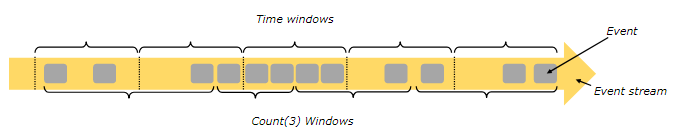
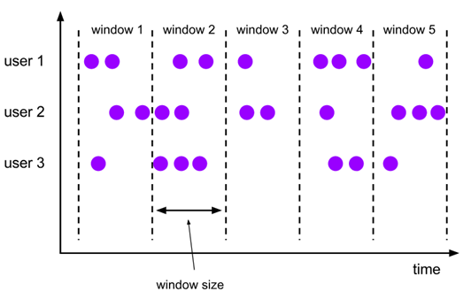
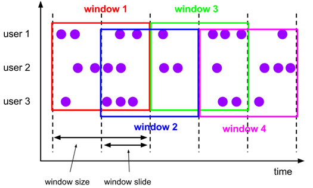
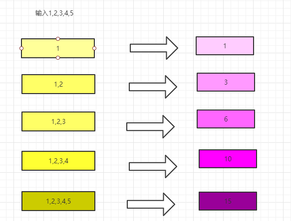
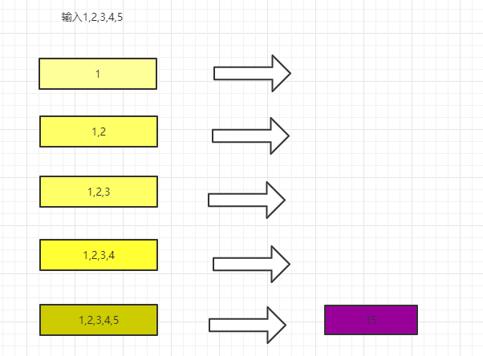
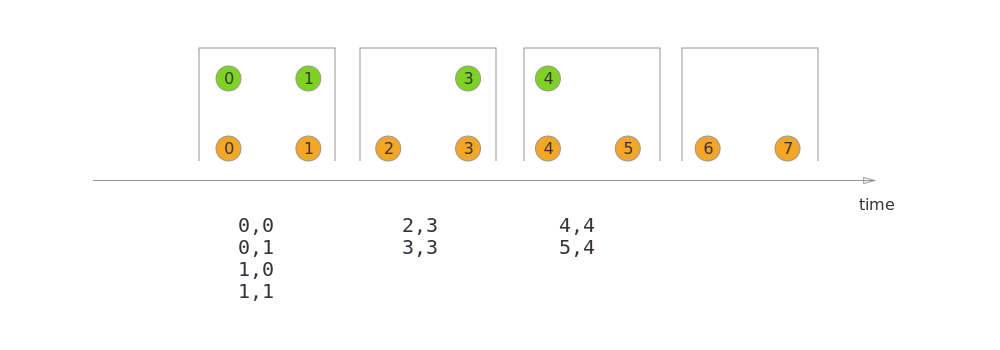
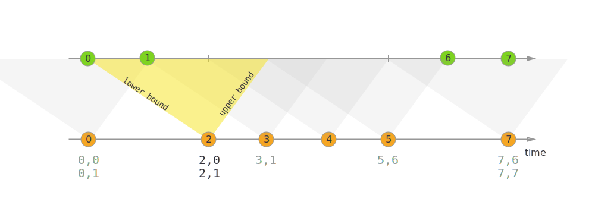

# Windows

## 一、 Window 概述

聚合事件（比如计数、求和）在流上的工作方式与批处理不同。比如，对流中的所有元素进行计数是不可能的，因为通常流是无限的（无界的）。所以，流上的聚合需要由 window 来划定范围，比如 “计算过去的5分钟” ，或者 “最后100个元素的和” 。window是一种可以把无限数据切割为有限数据块的手段。

窗口可以是 时间驱动的 【Time Window】（比如：每30秒）或者 数据驱动的【Count Window】 （比如：每100个元素）。



## 二、  Window类型

窗口通常被区分为不同的类型:
tumbling windows：滚动窗口 【没有重叠】 
sliding windows：滑动窗口 【有重叠】
session windows：会话窗口 
global windows: 没有窗口

### 2.1 tumblingwindows：滚动窗口【没有重叠】



### 2.2 slidingwindows：滑动窗口 【有重叠】 



### 2.3 session windows

需求：实时计算每个单词出现的次数，如果一个单词过了5秒就没出现过了，那么就输出这个单词。

案例演示：见下方


### 2.4 global windows

案例见下方


## 三、 Windows类型总结

### 3.1 Keyed Window 和 Non Keyed Window

```java
/**
 * Non Keyed Window 和 Keyed Window
 */
public class WindowType {
    public static void main(String[] args) throws Exception {
        StreamExecutionEnvironment env = StreamExecutionEnvironment.getExecutionEnvironment();
        DataStreamSource<String> dataStream = env.socketTextStream("10.148.15.10", 8888);

        SingleOutputStreamOperator<Tuple2<String, Integer>> stream = dataStream.flatMap(new FlatMapFunction<String, Tuple2<String, Integer>>() {
            @Override
            public void flatMap(String line, Collector<Tuple2<String, Integer>> collector) throws Exception {
                String[] fields = line.split(",");
                for (String word : fields) {
                    collector.collect(Tuple2.of(word, 1));
                }
            }
        });

        //Non keyed Stream
//        AllWindowedStream<Tuple2<String, Integer>, TimeWindow> nonkeyedStream = stream.timeWindowAll(Time.seconds(3));
//        nonkeyedStream.sum(1)
//                .print();

        //Keyed Stream
        stream.keyBy(0)
                .timeWindow(Time.seconds(3))
                .sum(1)
                .print();

        env.execute("word count");


    }
}

```

## 四、window操作

### 4.1 Keyed Window 和 Non Keyed Window

**Keyed Windows**

```java
stream
       .keyBy(...)               <-  keyed versus non-keyed windows
       .window(...)              <-  required: "assigner"
      [.trigger(...)]            <-  optional: "trigger" (else default trigger)
      [.evictor(...)]            <-  optional: "evictor" (else no evictor)
      [.allowedLateness(...)]    <-  optional: "lateness" (else zero)
      [.sideOutputLateData(...)] <-  optional: "output tag" (else no side output for late data)
       .reduce/aggregate/fold/apply()      <-  required: "function"
      [.getSideOutput(...)]      <-  optional: "output tag"
```

**Non-Keyed Windows**

```java
stream
       .windowAll(...)           <-  required: "assigner"
      [.trigger(...)]            <-  optional: "trigger" (else default trigger)
      [.evictor(...)]            <-  optional: "evictor" (else no evictor)
      [.allowedLateness(...)]    <-  optional: "lateness" (else zero)
      [.sideOutputLateData(...)] <-  optional: "output tag" (else no side output for late data)
       .reduce/aggregate/fold/apply()      <-  required: "function"
      [.getSideOutput(...)]      <-  optional: "output tag"
```

### 4.2 Windows Function

#### Tumbling window和slide window

```java
        //滚动窗口
        stream.keyBy(0)
               .window(TumblingEventTimeWindows.of(Time.seconds(2)))
                .sum(1)
                .print();
        //滑动窗口
        stream.keyBy(0)
                .window(SlidingProcessingTimeWindows.of(Time.seconds(6),Time.seconds(4)))
                .sum(1)
                .print();

```

#### session window

```java
/**
 * 5秒过去以后，该单词不出现就打印出来该单词
 */
public class SessionWindowTest {
    public static void main(String[] args) throws  Exception {
        StreamExecutionEnvironment env = StreamExecutionEnvironment.getExecutionEnvironment();
        DataStreamSource<String> dataStream = env.socketTextStream("10.148.15.10", 8888);

        SingleOutputStreamOperator<Tuple2<String, Integer>> stream = dataStream.flatMap(new FlatMapFunction<String, Tuple2<String, Integer>>() {
            @Override
            public void flatMap(String line, Collector<Tuple2<String, Integer>> collector) throws Exception {
                String[] fields = line.split(",");
                for (String word : fields) {
                    collector.collect(Tuple2.of(word, 1));
                }
            }
        });

        stream.keyBy(0)
                .window(ProcessingTimeSessionWindows.withGap(Time.seconds(5)))
                .sum(1)
                .print();

        env.execute("SessionWindowTest");
    }
}
```

#### global window

* **global window + trigger 一起配合才能使用**
* trigger来触发该事件。

```
/**
 * 单词每出现三次统计一次
 */
public class GlobalWindowTest {
    public static void main(String[] args) throws Exception {
        StreamExecutionEnvironment env = StreamExecutionEnvironment.getExecutionEnvironment();
        DataStreamSource<String> dataStream = env.socketTextStream("10.148.15.10", 8888);

        SingleOutputStreamOperator<Tuple2<String, Integer>> stream = dataStream.flatMap(new FlatMapFunction<String, Tuple2<String, Integer>>() {
            @Override
            public void flatMap(String line, Collector<Tuple2<String, Integer>> collector) throws Exception {
                String[] fields = line.split(",");
                for (String word : fields) {
                    collector.collect(Tuple2.of(word, 1));
                }
            }
        });

        stream.keyBy(0)
                .window(GlobalWindows.create())
                 //如果不加这个程序是启动不起来的
                .trigger(CountTrigger.of(3))
                .sum(1)
                .print();

        env.execute("SessionWindowTest");
    }
}
```

### 4.3 Trigger

```java
/**
 * 使用Trigger 自己实现一个类似CountWindow的效果
 */
public class CountWindowWordCount {
    public static void main(String[] args) throws Exception {
        StreamExecutionEnvironment env = StreamExecutionEnvironment.getExecutionEnvironment();
        DataStreamSource<String> dataStream = env.socketTextStream("10.148.15.10", 8888);

        SingleOutputStreamOperator<Tuple2<String, Integer>> stream = dataStream.flatMap(new FlatMapFunction<String, Tuple2<String, Integer>>() {
            @Override
            public void flatMap(String line, Collector<Tuple2<String, Integer>> collector) throws Exception {
                String[] fields = line.split(",");
                for (String word : fields) {
                    collector.collect(Tuple2.of(word, 1));
                }
            }
        });

        WindowedStream<Tuple2<String, Integer>, Tuple, GlobalWindow> keyedWindow = stream.keyBy(0)
                .window(GlobalWindows.create())
                .trigger(new MyCountTrigger(3));


            //可以看看里面的源码，跟我们写的很像
//        WindowedStream<Tuple2<String, Integer>, Tuple, GlobalWindow> keyedWindow = stream.keyBy(0)
//                .window(GlobalWindows.create())
//                .trigger(CountTrigger.of(3));


        DataStream<Tuple2<String, Integer>> wordCounts = keyedWindow.sum(1);

        wordCounts.print().setParallelism(1);

        env.execute("Streaming WordCount");
    }


    private static class MyCountTrigger
            extends Trigger<Tuple2<String, Integer>, GlobalWindow> {
        // 表示指定的元素的最大的数量
        private long maxCount;

        // 用于存储每个 key 对应的 count 值
        private ReducingStateDescriptor<Long> stateDescriptor
                = new ReducingStateDescriptor<Long>("count", new ReduceFunction<Long>() {
            @Override
            public Long reduce(Long aLong, Long t1) throws Exception {
                return aLong + t1;
            }
        }, Long.class);

        public MyCountTrigger(long maxCount) {
            this.maxCount = maxCount;
        }

        /**
         *  当一个元素进入到一个 window 中的时候就会调用这个方法
         * @param element   元素
         * @param timestamp 进来的时间
         * @param window    元素所属的窗口
         * @param ctx 上下文
         * @return TriggerResult
         *      1. TriggerResult.CONTINUE ：表示对 window 不做任何处理
         *      2. TriggerResult.FIRE ：表示触发 window 的计算
         *      3. TriggerResult.PURGE ：表示清除 window 中的所有数据
         *      4. TriggerResult.FIRE_AND_PURGE ：表示先触发 window 计算，然后删除 window 中的数据
         * @throws Exception
         */
        @Override
        public TriggerResult onElement(Tuple2<String, Integer> element,
                                       long timestamp,
                                       GlobalWindow window,
                                       TriggerContext ctx) throws Exception {
            // 拿到当前 key 对应的 count 状态值
            ReducingState<Long> count = ctx.getPartitionedState(stateDescriptor);
            // count 累加 1
            count.add(1L);
            // 如果当前 key 的 count 值等于 maxCount
            if (count.get() == maxCount) {
                count.clear();
                // 触发 window 计算，删除数据
                return TriggerResult.FIRE_AND_PURGE;
            }
            // 否则，对 window 不做任何的处理
            return TriggerResult.CONTINUE;
        }

        @Override
        public TriggerResult onProcessingTime(long time,
                                              GlobalWindow window,
                                              TriggerContext ctx) throws Exception {
            // 写基于 Processing Time 的定时器任务逻辑
            return TriggerResult.CONTINUE;
        }

        @Override
        public TriggerResult onEventTime(long time,
                                         GlobalWindow window,
                                         TriggerContext ctx) throws Exception {
            // 写基于 Event Time 的定时器任务逻辑
            return TriggerResult.CONTINUE;
        }

        @Override
        public void clear(GlobalWindow window, TriggerContext ctx) throws Exception {
            // 清除状态值
            ctx.getPartitionedState(stateDescriptor).clear();
        }
    }

}
```

### 4.4 Evictor

```java
/**
 * 使用Evictor 自己实现一个类似CountWindow(3,2)的效果
 * 每隔2个单词计算最近3个单词
 */
public class CountWindowWordCountByEvictor {
    public static void main(String[] args) throws Exception {
        StreamExecutionEnvironment env = StreamExecutionEnvironment.getExecutionEnvironment();
        DataStreamSource<String> dataStream = env.socketTextStream("10.148.15.10", 8888);

        SingleOutputStreamOperator<Tuple2<String, Integer>> stream = dataStream.flatMap(new FlatMapFunction<String, Tuple2<String, Integer>>() {
            @Override
            public void flatMap(String line, Collector<Tuple2<String, Integer>> collector) throws Exception {
                String[] fields = line.split(",");
                for (String word : fields) {
                    collector.collect(Tuple2.of(word, 1));
                }
            }
        });

        WindowedStream<Tuple2<String, Integer>, Tuple, GlobalWindow> keyedWindow = stream.keyBy(0)
                .window(GlobalWindows.create())
                .trigger(new MyCountTrigger(2))
                .evictor(new MyCountEvictor(3));


        DataStream<Tuple2<String, Integer>> wordCounts = keyedWindow.sum(1);

        wordCounts.print().setParallelism(1);

        env.execute("Streaming WordCount");
    }


    private static class MyCountTrigger
            extends Trigger<Tuple2<String, Integer>, GlobalWindow> {
        // 表示指定的元素的最大的数量
        private long maxCount;

        // 用于存储每个 key 对应的 count 值
        private ReducingStateDescriptor<Long> stateDescriptor
                = new ReducingStateDescriptor<Long>("count", new ReduceFunction<Long>() {
            @Override
            public Long reduce(Long aLong, Long t1) throws Exception {
                return aLong + t1;
            }
        }, Long.class);

        public MyCountTrigger(long maxCount) {
            this.maxCount = maxCount;
        }

        /**
         *  当一个元素进入到一个 window 中的时候就会调用这个方法
         * @param element   元素
         * @param timestamp 进来的时间
         * @param window    元素所属的窗口
         * @param ctx 上下文
         * @return TriggerResult
         *      1. TriggerResult.CONTINUE ：表示对 window 不做任何处理
         *      2. TriggerResult.FIRE ：表示触发 window 的计算
         *      3. TriggerResult.PURGE ：表示清除 window 中的所有数据
         *      4. TriggerResult.FIRE_AND_PURGE ：表示先触发 window 计算，然后删除 window 中的数据
         * @throws Exception
         */
        @Override
        public TriggerResult onElement(Tuple2<String, Integer> element,
                                       long timestamp,
                                       GlobalWindow window,
                                       TriggerContext ctx) throws Exception {
            // 拿到当前 key 对应的 count 状态值
            ReducingState<Long> count = ctx.getPartitionedState(stateDescriptor);
            // count 累加 1
            count.add(1L);
            // 如果当前 key 的 count 值等于 maxCount
            if (count.get() == maxCount) {
                count.clear();
                // 触发 window 计算，删除数据
                return TriggerResult.FIRE;
            }
            // 否则，对 window 不做任何的处理
            return TriggerResult.CONTINUE;
        }

        @Override
        public TriggerResult onProcessingTime(long time,
                                              GlobalWindow window,
                                              TriggerContext ctx) throws Exception {
            // 写基于 Processing Time 的定时器任务逻辑
            return TriggerResult.CONTINUE;
        }

        @Override
        public TriggerResult onEventTime(long time,
                                         GlobalWindow window,
                                         TriggerContext ctx) throws Exception {
            // 写基于 Event Time 的定时器任务逻辑
            return TriggerResult.CONTINUE;
        }

        @Override
        public void clear(GlobalWindow window, TriggerContext ctx) throws Exception {
            // 清除状态值
            ctx.getPartitionedState(stateDescriptor).clear();
        }
    }


    private static class MyCountEvictor
            implements Evictor<Tuple2<String, Integer>, GlobalWindow> {
        // window 的大小
        private long windowCount;

        public MyCountEvictor(long windowCount) {
            this.windowCount = windowCount;
        }

        /**
         *  在 window 计算之前删除特定的数据
         * @param elements  window 中所有的元素
         * @param size  window 中所有元素的大小
         * @param window    window
         * @param evictorContext    上下文
         */
        @Override
        public void evictBefore(Iterable<TimestampedValue<Tuple2<String, Integer>>> elements,
                                int size, GlobalWindow window, EvictorContext evictorContext) {
            if (size <= windowCount) {
                return;
            } else {
                int evictorCount = 0;
                Iterator<TimestampedValue<Tuple2<String, Integer>>> iterator = elements.iterator();
                while (iterator.hasNext()) {
                    iterator.next();
                    evictorCount++;
                    // 如果删除的数量小于当前的 window 大小减去规定的 window 的大小，就需要删除当前的元素
                    if (evictorCount > size - windowCount) {
                        break;
                    } else {
                        iterator.remove();
                    }
                }
            }
        }

        /**
         *  在 window 计算之后删除特定的数据
         * @param elements  window 中所有的元素
         * @param size  window 中所有元素的大小
         * @param window    window
         * @param evictorContext    上下文
         */
        @Override
        public void evictAfter(Iterable<TimestampedValue<Tuple2<String, Integer>>> elements,
                               int size, GlobalWindow window, EvictorContext evictorContext) {

        }
    }
}
```

### 4.4 window增量聚合

窗口中每进入一条数据，就进行一次计算，等时间到了展示最后的结果

常用的聚合算子

```java
reduce(reduceFunction)
aggregate(aggregateFunction)
sum(),min(),max()
```



```java
/**
 * 演示增量聚合
 */
public class SocketDemoIncrAgg {
    public static void main(String[] args) throws  Exception{
        StreamExecutionEnvironment env = StreamExecutionEnvironment.getExecutionEnvironment();
        DataStreamSource<String> dataStream = env.socketTextStream("localhost", 8888);
        SingleOutputStreamOperator<Integer> intDStream = dataStream.map(number -> Integer.valueOf(number));
        AllWindowedStream<Integer, TimeWindow> windowResult = intDStream.timeWindowAll(Time.seconds(10));
       windowResult.reduce(new ReduceFunction<Integer>() {
           @Override
           public Integer reduce(Integer last, Integer current) throws Exception {
               System.out.println("执行逻辑"+last + "  "+current);
               return last+current;
           }
       }).print();
       

        env.execute(SocketDemoIncrAgg.class.getSimpleName());
    }
}
```

aggregate算子

需求：求每隔窗口里面的数据的平均值

```java
/**
 * 求每隔窗口中的数据的平均值
 */
public class aggregateWindowTest {
    public static void main(String[] args)  throws Exception{
        StreamExecutionEnvironment env = StreamExecutionEnvironment.getExecutionEnvironment();
        DataStreamSource<String> dataStream = env.socketTextStream("10.148.15.10", 8888);

        SingleOutputStreamOperator<Integer> numberStream = dataStream.map(line -> Integer.valueOf(line));
        AllWindowedStream<Integer, TimeWindow> windowStream = numberStream.timeWindowAll(Time.seconds(5));
        windowStream.aggregate(new MyAggregate())
                .print();

        env.execute("aggregateWindowTest");
    }

    /**
     * IN, 输入的数据类型
     * ACC,自定义的中间状态
     *      Tuple2<Integer,Integer>:
     *          key: 计算数据的个数
     *          value:计算总值
     * OUT，输出的数据类型
     */
    private static class MyAggregate
            implements AggregateFunction<Integer,Tuple2<Integer,Integer>,Double>{
        /**
         * 初始化 累加器
         * @return
         */
        @Override
        public Tuple2<Integer, Integer> createAccumulator() {
            return new Tuple2<>(0,0);
        }

        /**
         * 针对每个数据的操作
         * @return
         */
        @Override
        public Tuple2<Integer, Integer> add(Integer element,
                                            Tuple2<Integer, Integer> accumulator) {
            //个数+1
            //总的值累计
            return new Tuple2<>(accumulator.f0+1,accumulator.f1+element);
        }

        @Override
        public Double getResult(Tuple2<Integer, Integer> accumulator) {
            return (double)accumulator.f1/accumulator.f0;
        }

        @Override
        public Tuple2<Integer, Integer> merge(Tuple2<Integer, Integer> a1,
                                              Tuple2<Integer, Integer> b1) {
            return Tuple2.of(a1.f0+b1.f0,a1.f1+b1.f1);
        }
    }
}

```

### 4.5 window全量聚合

等属于窗口的数据到齐，才开始进行聚合计算【可以实现对窗口内的数据进行排序等需求】

```java
apply(windowFunction)
process(processWindowFunction)
processWindowFunction比windowFunction提供了更多的上下文信息。类似于map和RichMap的关系
```

效果图



```java
/**
 * 全量计算
 */
public class SocketDemoFullAgg {
    public static void main(String[] args) throws  Exception {
        StreamExecutionEnvironment env = StreamExecutionEnvironment.getExecutionEnvironment();
        DataStreamSource<String> dataStream = env.socketTextStream("localhost", 8888);
        SingleOutputStreamOperator<Integer> intDStream = dataStream.map(number -> Integer.valueOf(number));
        AllWindowedStream<Integer, TimeWindow> windowResult = intDStream.timeWindowAll(Time.seconds(10));
        windowResult.process(new ProcessAllWindowFunction<Integer, Integer, TimeWindow>() {
            @Override
            public void process(Context context, Iterable<Integer> iterable, Collector<Integer> collector) throws Exception {
                System.out.println("执行计算逻辑");
                int count=0;
                Iterator<Integer> numberiterator = iterable.iterator();
                while (numberiterator.hasNext()){
                    Integer number = numberiterator.next();
                    count+=number;
                }
                collector.collect(count);
            }
        }).print();

        env.execute("socketDemoFullAgg");
    }
}
```

### 4.6 window join

两个window之间可以进行join，join操作只支持三种类型的window：滚动窗口，滑动窗口，会话窗口

使用方式：

```java
stream.join(otherStream) //两个流进行关联
    .where(<KeySelector>) //选择第一个流的key作为关联字段
    .equalTo(<KeySelector>)//选择第二个流的key作为关联字段
    .window(<WindowAssigner>)//设置窗口的类型
    .apply(<JoinFunction>) //对结果做操作
```

#### 4.6.1 Tumbling Window Join

```java
import org.apache.flink.api.java.functions.KeySelector;
import org.apache.flink.streaming.api.windowing.assigners.TumblingEventTimeWindows;
import org.apache.flink.streaming.api.windowing.time.Time;
 
...

DataStream<Integer> orangeStream = ...
DataStream<Integer> greenStream = ...

orangeStream.join(greenStream)
    .where(<KeySelector>)
    .equalTo(<KeySelector>)
    .window(TumblingEventTimeWindows.of(Time.milliseconds(2)))
    .apply (new JoinFunction<Integer, Integer, String> (){
        @Override
        public String join(Integer first, Integer second) {
            return first + "," + second;
        }
    });
```



#### 4.6.2 Sliding Window Join

```java
import org.apache.flink.api.java.functions.KeySelector;
import org.apache.flink.streaming.api.windowing.assigners.SlidingEventTimeWindows;
import org.apache.flink.streaming.api.windowing.time.Time;

...

DataStream<Integer> orangeStream = ...
DataStream<Integer> greenStream = ...

orangeStream.join(greenStream)
    .where(<KeySelector>)
    .equalTo(<KeySelector>)
    .window(SlidingEventTimeWindows.of(Time.milliseconds(2) /* size */, Time.milliseconds(1) /* slide */))
    .apply (new JoinFunction<Integer, Integer, String> (){
        @Override
        public String join(Integer first, Integer second) {
            return first + "," + second;
        }
    });
```


#### 4.6.3 Session Window Join

```java
import org.apache.flink.api.java.functions.KeySelector;
import org.apache.flink.streaming.api.windowing.assigners.EventTimeSessionWindows;
import org.apache.flink.streaming.api.windowing.time.Time;
 
...

DataStream<Integer> orangeStream = ...
DataStream<Integer> greenStream = ...

orangeStream.join(greenStream)
    .where(<KeySelector>)
    .equalTo(<KeySelector>)
    .window(EventTimeSessionWindows.withGap(Time.milliseconds(1)))
    .apply (new JoinFunction<Integer, Integer, String> (){
        @Override
        public String join(Integer first, Integer second) {
            return first + "," + second;
        }
    });
```


#### 4.6.4 Interval Join

```java
import org.apache.flink.api.java.functions.KeySelector;
import org.apache.flink.streaming.api.functions.co.ProcessJoinFunction;
import org.apache.flink.streaming.api.windowing.time.Time;

...

DataStream<Integer> orangeStream = ...
DataStream<Integer> greenStream = ...

orangeStream
    .keyBy(<KeySelector>)
    .intervalJoin(greenStream.keyBy(<KeySelector>))
    .between(Time.milliseconds(-2), Time.milliseconds(1))
    .process (new ProcessJoinFunction<Integer, Integer, String(){

        @Override
        public void processElement(Integer left, Integer right, Context ctx, Collector<String> out) {
            out.collect(first + "," + second);
        }
    });
```


