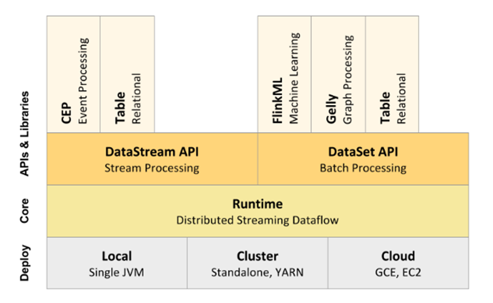

# Flink

## 一、Flink简介

**Apache Flink® — Stateful Computations over Data Streams**

Apache Flink 是一个框架和分布式处理引擎，用于在*无边界和有边界*数据流上进行有状态的计算。Flink 能在所有常见集群环境中运行，并能以内存速度和任意规模进行计算。

## 1.1 处理无解数据和有界数据

任何类型的数据都可以形成一种事件流。信用卡交易、传感器测量、机器日志、网站或移动应用程序上的用户交互记录，所有这些数据都形成一种流。

数据可以被作为 *无界* 或者 *有界* 流来处理。

1. **无界流** 有定义流的开始，但没有定义流的结束。它们会无休止地产生数据。无界流的数据必须持续处理，即数据被摄取后需要立刻处理。我们不能等到所有数据都到达再处理，因为输入是无限的，在任何时候输入都不会完成。处理无界数据通常要求以特定顺序摄取事件，例如事件发生的顺序，以便能够推断结果的完整性。

2. **有界流** 有定义流的开始，也有定义流的结束。有界流可以在摄取所有数据后再进行计算。有界流所有数据可以被排序，所以并不需要有序摄取。有界流处理通常被称为批处理

   

**Apache Flink 擅长处理无界和有界数据集** 精确的时间控制和状态化使得 Flink 的运行时(runtime)能够运行任何处理无界流的应用。有界流则由一些专为固定大小数据集特殊设计的算法和数据结构进行内部处理，产生了出色的性能。

## 1.2 部署应用到任意地方

Apache Flink 是一个分布式系统，它需要计算资源来执行应用程序。Flink 集成了所有常见的集群资源管理器，例如 [Hadoop YARN](https://hadoop.apache.org/docs/stable/hadoop-yarn/hadoop-yarn-site/YARN.html)、 [Apache Mesos](https://mesos.apache.org/) 和 [Kubernetes](https://kubernetes.io/)，但同时也可以作为独立集群运行。
Flink 被设计为能够很好地工作在上述每个资源管理器中，这是通过资源管理器特定(resource-manager-specific)的部署模式实现的。Flink 可以采用与当前资源管理器相适应的方式进行交互。
部署 Flink 应用程序时，Flink 会根据应用程序配置的并行性自动标识所需的资源，并从资源管理器请求这些资源。在发生故障的情况下，Flink 通过请求新资源来替换发生故障的容器。提交或控制应用程序的所有通信都是通过 REST 调用进行的，这可以简化 Flink 与各种环境中的集成

## 1.3 运行任意规模应用

Flink 旨在任意规模上运行有状态流式应用。因此，应用程序被并行化为可能数千个任务，这些任务分布在集群中并发执行。所以应用程序能够充分利用无尽的 CPU、内存、磁盘和网络 IO。而且 Flink 很容易维护非常大的应用程序状态。其异步和增量的检查点算法对处理延迟产生最小的影响，同时保证精确一次状态的一致性。
Flink 用户报告了其生产环境中一些令人印象深刻的扩展性数字：

* 每天处理数万亿的事件
* 可以维护几TB大小的状态
* 可以部署上千个节点的集群（可伸缩）

## 1.4 利用内存性能

有状态的 Flink 程序针对本地状态访问进行了优化。任务的状态始终保留在内存中，如果状态大小超过可用内存，则会保存在能高效访问的磁盘数据结构中。任务通过访问本地（通常在内存中）状态来进行所有的计算，从而产生非常低的处理延迟。Flink 通过定期和异步地对本地状态进行持久化存储来保证故障场景下精确一次的状态一致性。

# 二、Flink架构图

# 三、Local模式安装

# 四、Standalone模式安装

# 五、Flink on Yarn模式安装

# 六、Flink Shell使用

针对初学者，开发的时候容易出错，如果每次都打包进行调试，比较麻烦，并且也不好定位问题，可以在scala shell命令行下进行调试

scala shell方式支持流处理和批处理。当启动shell命令行之后，两个不同的ExecutionEnvironments会被自动创建。使用senv(Stream)和benv(Batch)分别去处理流处理和批处理程序。(类似于spark-shell中sc变量)

bin/start-scala-shell.sh [local|remote|yarn] [options] <args>

# 七、Flink之数据源

source是程序的数据源输入，你可以通过StreamExecutionEnvironment.addSource(sourceFunction)来为你的程序添加一个source。

flink提供了大量的已经实现好的source方法，你也可以自定义source：

（1）通过实现sourceFunction接口来自定义无并行度的source

（2）通过实现ParallelSourceFunction 接口 or 继承RichParallelSourceFunction 来自定义有并行度的source

不过大多数情况下，我们使用自带的source即可。

**获取source的方式**

（1）基于文件

​          readTextFile(path)

​         读取文本文件，文件遵循TextInputFormat 读取规则，逐行读取并返回。

（2）基于socket

​         socketTextStream
​         从socker中读取数据，元素可以通过一个分隔符切开。

（3）基于集合

​          fromCollection(Collection)

​         通过java 的collection集合创建一个数据流，集合中的所有元素必须是相同类型的。

（4）自定义输入

​         addSource 可以实现读取第三方数据源的数据

​        系统内置提供了一批connectors，连接器会提供对应的source支持【kafka】

**自带的connectors**

- [Apache Kafka](https://ci.apache.org/projects/flink/flink-docs-release-1.8/dev/connectors/kafka.html) (source/sink)  **后面重点分析**
- [Apache Cassandra](https://ci.apache.org/projects/flink/flink-docs-release-1.8/dev/connectors/cassandra.html) (sink)
- [Amazon Kinesis Streams](https://ci.apache.org/projects/flink/flink-docs-release-1.8/dev/connectors/kinesis.html) (source/sink)
- [Elasticsearch](https://ci.apache.org/projects/flink/flink-docs-release-1.8/dev/connectors/elasticsearch.html) (sink)
- [Hadoop FileSystem](https://ci.apache.org/projects/flink/flink-docs-release-1.8/dev/connectors/filesystem_sink.html) (sink)
- [RabbitMQ](https://ci.apache.org/projects/flink/flink-docs-release-1.8/dev/connectors/rabbitmq.html) (source/sink)
- [Apache NiFi](https://ci.apache.org/projects/flink/flink-docs-release-1.8/dev/connectors/nifi.html) (source/sink)
- [Twitter Streaming API](https://ci.apache.org/projects/flink/flink-docs-release-1.8/dev/connectors/twitter.html) (source)