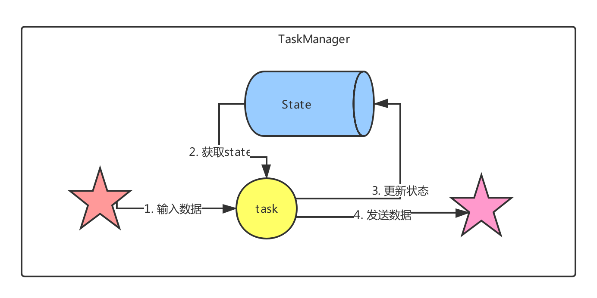
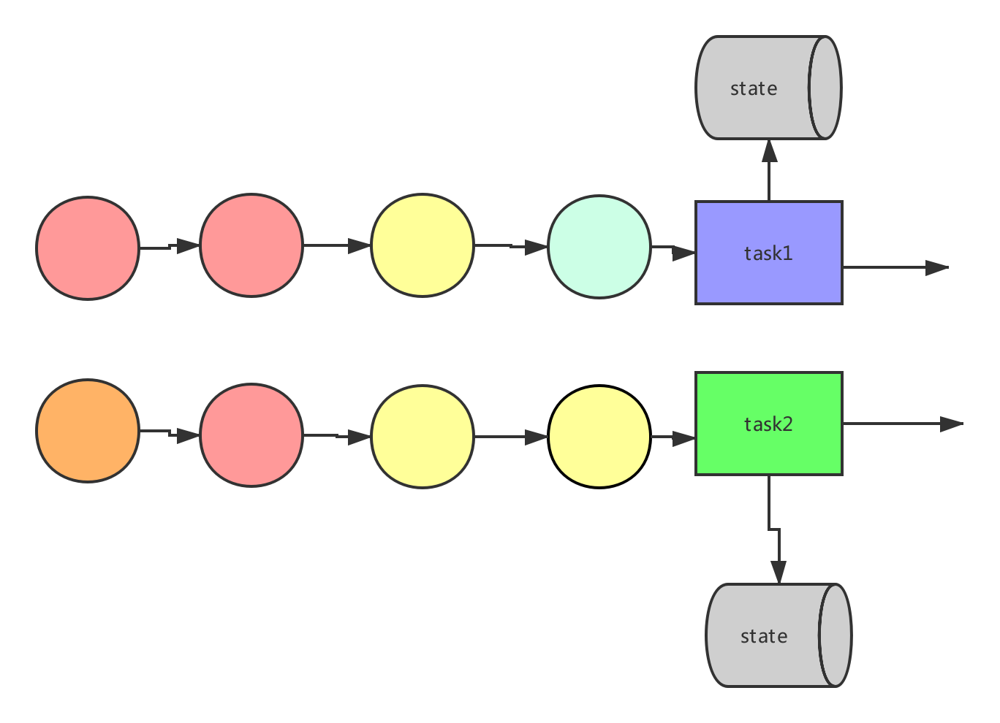
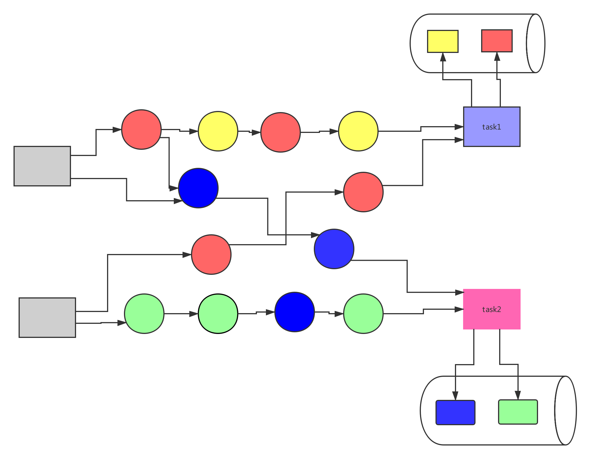
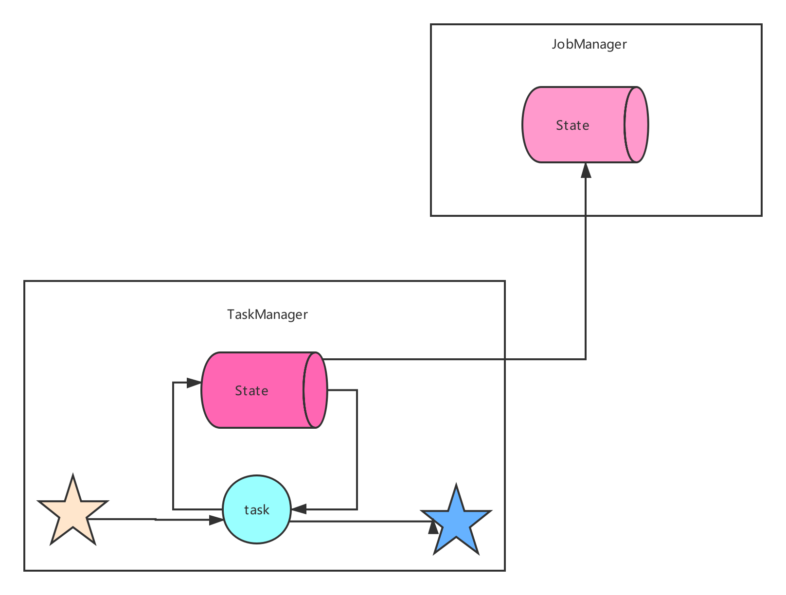
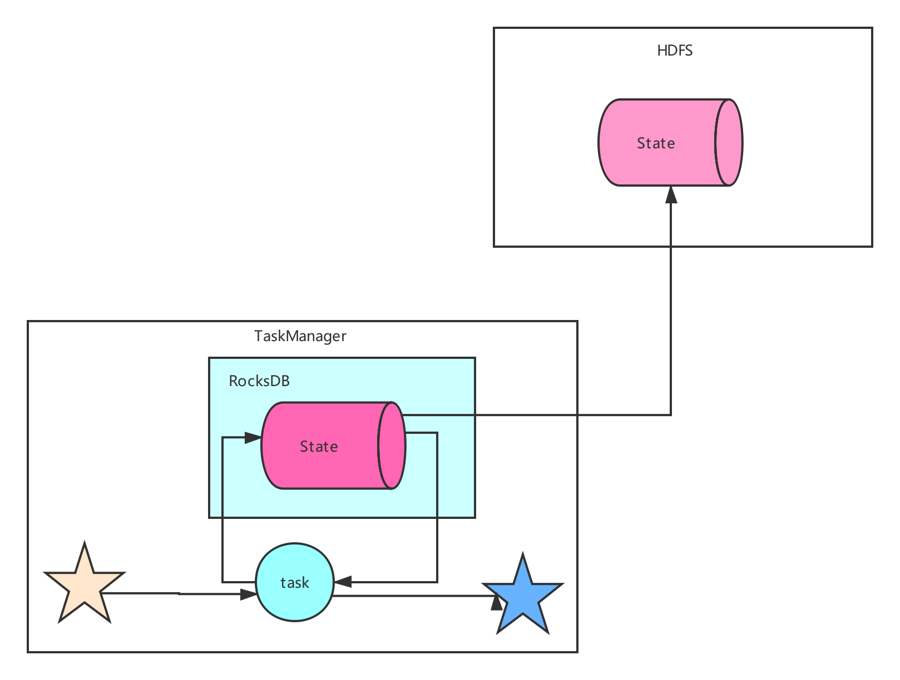
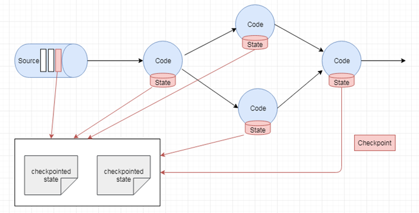
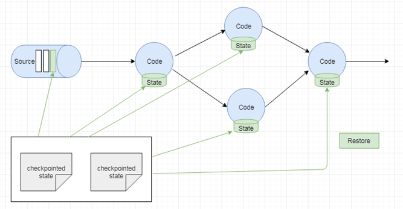

# Flink 高级操作

## 一、State

### 1.1 State概述

**Apache Flink® — Stateful Computations over Data Streams**

```java
/**
 * 单词计数
 */
public class WordCount {
    public static void main(String[] args) throws Exception {
        StreamExecutionEnvironment env = StreamExecutionEnvironment.getExecutionEnvironment();
        DataStreamSource<String> data = env.socketTextStream("localhost", 8888);
        SingleOutputStreamOperator<Tuple2<String, Integer>> result = data.flatMap(new FlatMapFunction<String, Tuple2<String, Integer>>() {
            @Override
            public void flatMap(String line, Collector<Tuple2<String, Integer>> collector) throws Exception {
                String[] fields = line.split(",");
                for (String word : fields) {
                    collector.collect(new Tuple2<>(word, 1));
                }
            }
        }).keyBy("0")
                .sum(1);

        result.print();

        env.execute("WordCount");
    }
}
```

运行程序，我们会发现单词出现的次数时有累计的效果的。如果没有状态的管理，是不会有累积的效果的（这里像Spark Streaming[checkpoint/updateStateByKey/mapWithState]）。所以Flink里面，还有State的概念。



**State**：一般之一个具体的task/operate的状态。State可以被记录，在失败的情况下数据还可以恢复，Flink中有两种基本类型的State：Keyed State，Operator State，他们两个都还可以一两种形式存在：原始状态(raw state)和托管状态(managed state)

**托管状态**：由Flink框架管理的状态，我们通常使用的就是这种。

**原始状态**：由用户自行管理状态具体的数据结构，框架在做checkpoint的时候，使用byte[]来读写状态内容，对其内部数据结构一无所知。通常在DataStream上的状态推荐使用托管的状态，当实现一个用户自定义的operator时，**会使用到原始状态**。但是我们工作中一般不常用，所以我们不考虑他。

### 1.2 State类型

#### 1.2.1 Operator State

没发生Suffle



* Operaor States是Task級別的State，也就是说，每个Task都对应着一个State。
* Kafka Connector source中的每个分区（task）都需要记录消费的topic的partition和offset等信息。
* operator state 只有一种托管状态：`ValueState` `

#### 1.2.2 Keyed State

发生Suffle



1. keyed state 记录的是每个key的状态
2. Keyed state托管状态有六种类型：
   1. ValueState
   2. ListState
   3. MapState
   4. ReducingState
   5. AggregatingState
   6. FoldingState

### 1.3 Keyed State的案例

#### 1.3.1 ValueState

```java
/**
 *  ValueState<T> ：这个状态为每一个 key 保存一个值
 *      value() 获取状态值
 *      update() 更新状态值
 *      clear() 清除状态
 */
public class CountWindowAverageWithValueState
        extends RichFlatMapFunction<Tuple2<Long, Long>, Tuple2<Long, Double>> {
    // 用以保存每个 key 出现的次数，以及这个 key 对应的 value 的总值
    // managed keyed state
    //1. ValueState 保存的是对应的一个 key 的一个状态值
    private ValueState<Tuple2<Long, Long>> countAndSum;

    @Override
    public void open(Configuration parameters) throws Exception {
        // 注册状态
        ValueStateDescriptor<Tuple2<Long, Long>> descriptor =
                new ValueStateDescriptor<Tuple2<Long, Long>>(
                        "average",  // 状态的名字
                        Types.TUPLE(Types.LONG, Types.LONG)); // 状态存储的数据类型
        countAndSum = getRuntimeContext().getState(descriptor);
    }

    @Override
    public void flatMap(Tuple2<Long, Long> element,
                        Collector<Tuple2<Long, Double>> out) throws Exception {
        // 拿到当前的 key 的状态值
        Tuple2<Long, Long> currentState = countAndSum.value();

        // 如果状态值还没有初始化，则初始化
        if (currentState == null) {
            currentState = Tuple2.of(0L, 0L);
        }

        // 更新状态值中的元素的个数
        currentState.f0 += 1;

        // 更新状态值中的总值
        currentState.f1 += element.f1;

        // 更新状态
        countAndSum.update(currentState);

        // 判断，如果当前的 key 出现了 3 次，则需要计算平均值，并且输出
        if (currentState.f0 >= 3) {
            double avg = (double)currentState.f1 / currentState.f0;
            // 输出 key 及其对应的平均值
            out.collect(Tuple2.of(element.f0, avg));
            //  清空状态值
            countAndSum.clear();
        }
    }
}


/**
 * 需求：当接收到的相同 key 的元素个数等于 3 个或者超过 3 个的时候
 *  就计算这些元素的 value 的平均值。
 *  计算 keyed stream 中每 3 个元素的 value 的平均值
 */
public class TestKeyedStateMain {
    public static void main(String[] args) throws  Exception{
        StreamExecutionEnvironment env = StreamExecutionEnvironment.getExecutionEnvironment();

        DataStreamSource<Tuple2<Long, Long>> dataStreamSource =
                env.fromElements(Tuple2.of(1L, 3L), Tuple2.of(1L, 5L), Tuple2.of(1L, 7L),
                        Tuple2.of(2L, 4L), Tuple2.of(2L, 2L), Tuple2.of(2L, 5L));

        // 输出：
        //(1,5.0)
        //(2,3.6666666666666665)
        dataStreamSource
                .keyBy(0)
                .flatMap(new CountWindowAverageWithValueState())
                .print();

        env.execute("TestStatefulApi");
    }
}
```

#### 1.3.2 ListState

```java
/**
 *  ListState<T> ：这个状态为每一个 key 保存集合的值
 *      get() 获取状态值
 *      add() / addAll() 更新状态值，将数据放到状态中
 *      clear() 清除状态
 */
public class CountWindowAverageWithListState
        extends RichFlatMapFunction<Tuple2<Long, Long>, Tuple2<Long, Double>> {
    // managed keyed state
    //1. ListState 保存的是对应的一个 key 的出现的所有的元素
    private ListState<Tuple2<Long, Long>> elementsByKey;

    @Override
    public void open(Configuration parameters) throws Exception {
        // 注册状态
        ListStateDescriptor<Tuple2<Long, Long>> descriptor =
                new ListStateDescriptor<Tuple2<Long, Long>>(
                        "average",  // 状态的名字
                        Types.TUPLE(Types.LONG, Types.LONG)); // 状态存储的数据类型
        elementsByKey = getRuntimeContext().getListState(descriptor);
    }

    @Override
    public void flatMap(Tuple2<Long, Long> element,
                        Collector<Tuple2<Long, Double>> out) throws Exception {
        // 拿到当前的 key 的状态值
        Iterable<Tuple2<Long, Long>> currentState = elementsByKey.get();

        // 如果状态值还没有初始化，则初始化
        if (currentState == null) {
            elementsByKey.addAll(Collections.emptyList());
        }

        // 更新状态
        elementsByKey.add(element);

        // 判断，如果当前的 key 出现了 3 次，则需要计算平均值，并且输出
        List<Tuple2<Long, Long>> allElements = Lists.newArrayList(elementsByKey.get());
        if (allElements.size() >= 3) {
            long count = 0;
            long sum = 0;
            for (Tuple2<Long, Long> ele : allElements) {
                count++;
                sum += ele.f1;
            }
            double avg = (double) sum / count;
            out.collect(Tuple2.of(element.f0, avg));

            // 清除状态
            elementsByKey.clear();
        }
    }
}


/**
 * 需求：当接收到的相同 key 的元素个数等于 3 个或者超过 3 个的时候
 *  就计算这些元素的 value 的平均值。
 *  计算 keyed stream 中每 3 个元素的 value 的平均值
 */
public class TestKeyedStateMain {
    public static void main(String[] args) throws  Exception{
        StreamExecutionEnvironment env = StreamExecutionEnvironment.getExecutionEnvironment();

        DataStreamSource<Tuple2<Long, Long>> dataStreamSource =
                env.fromElements(Tuple2.of(1L, 3L), Tuple2.of(1L, 5L), Tuple2.of(1L, 7L),
                        Tuple2.of(2L, 4L), Tuple2.of(2L, 2L), Tuple2.of(2L, 5L));

        // 输出：
        //(1,5.0)
        //(2,3.6666666666666665)
        dataStreamSource
                .keyBy(0)
                .flatMap(new CountWindowAverageWithListState())
                .print();

        env.execute("TestStatefulApi");
    }
}
```

#### 1.3.3 MapState

```java
/**
 *  MapState<K, V> ：这个状态为每一个 key 保存一个 Map 集合
 *      put() 将对应的 key 的键值对放到状态中
 *      values() 拿到 MapState 中所有的 value
 *      clear() 清除状态
 */
public class CountWindowAverageWithMapState
        extends RichFlatMapFunction<Tuple2<Long, Long>, Tuple2<Long, Double>> {
    // managed keyed state
    //1. MapState ：key 是一个唯一的值，value 是接收到的相同的 key 对应的 value 的值
    private MapState<String, Long> mapState;

    @Override
    public void open(Configuration parameters) throws Exception {
        // 注册状态
        MapStateDescriptor<String, Long> descriptor =
                new MapStateDescriptor<String, Long>(
                        "average",  // 状态的名字
                        String.class, Long.class); // 状态存储的数据类型
        mapState = getRuntimeContext().getMapState(descriptor);
    }

    @Override
    public void flatMap(Tuple2<Long, Long> element,
                        Collector<Tuple2<Long, Double>> out) throws Exception {
        mapState.put(UUID.randomUUID().toString(), element.f1);

        // 判断，如果当前的 key 出现了 3 次，则需要计算平均值，并且输出
        List<Long> allElements = Lists.newArrayList(mapState.values());
        if (allElements.size() >= 3) {
            long count = 0;
            long sum = 0;
            for (Long ele : allElements) {
                count++;
                sum += ele;
            }
            double avg = (double) sum / count;
            out.collect(Tuple2.of(element.f0, avg));

            // 清除状态
            mapState.clear();
        }
    }
}


/**
 * 需求：当接收到的相同 key 的元素个数等于 3 个或者超过 3 个的时候
 *  就计算这些元素的 value 的平均值。
 *  计算 keyed stream 中每 3 个元素的 value 的平均值
 */
public class TestKeyedStateMain {
    public static void main(String[] args) throws  Exception{
        StreamExecutionEnvironment env = StreamExecutionEnvironment.getExecutionEnvironment();

        DataStreamSource<Tuple2<Long, Long>> dataStreamSource =
                env.fromElements(Tuple2.of(1L, 3L), Tuple2.of(1L, 5L), Tuple2.of(1L, 7L),
                        Tuple2.of(2L, 4L), Tuple2.of(2L, 2L), Tuple2.of(2L, 5L));

        // 输出：
        //(1,5.0)
        //(2,3.6666666666666665)
        dataStreamSource
                .keyBy(0)
                .flatMap(new CountWindowAverageWithMapState())
                .print();

        env.execute("TestStatefulApi");
    }
}
```

#### 1.3.4 ReducingState

```java
/**
 *  ReducingState<T> ：这个状态为每一个 key 保存一个聚合之后的值
 *      get() 获取状态值
 *      add()  更新状态值，将数据放到状态中
 *      clear() 清除状态
 */
public class SumFunction
        extends RichFlatMapFunction<Tuple2<Long, Long>, Tuple2<Long, Long>> {
    // managed keyed state
    // 用于保存每一个 key 对应的 value 的总值
    private ReducingState<Long> sumState;

    @Override
    public void open(Configuration parameters) throws Exception {
        // 注册状态
        ReducingStateDescriptor<Long> descriptor =
                new ReducingStateDescriptor<Long>(
                        "sum",  // 状态的名字
                        new ReduceFunction<Long>() { // 聚合函数
                            @Override
                            public Long reduce(Long value1, Long value2) throws Exception {
                                return value1 + value2;
                            }
                        }, Long.class); // 状态存储的数据类型
        sumState = getRuntimeContext().getReducingState(descriptor);
    }

    @Override
    public void flatMap(Tuple2<Long, Long> element,
                        Collector<Tuple2<Long, Long>> out) throws Exception {
        // 将数据放到状态中
        sumState.add(element.f1);

        out.collect(Tuple2.of(element.f0, sumState.get()));
    }
}


public class TestKeyedStateMain2 {
    public static void main(String[] args) throws  Exception{
        StreamExecutionEnvironment env = StreamExecutionEnvironment.getExecutionEnvironment();

        DataStreamSource<Tuple2<Long, Long>> dataStreamSource =
                env.fromElements(Tuple2.of(1L, 3L), Tuple2.of(1L, 5L), Tuple2.of(1L, 7L),
                        Tuple2.of(2L, 4L), Tuple2.of(2L, 2L), Tuple2.of(2L, 5L));

        // 输出：
        //(1,5.0)
        //(2,3.6666666666666665)
        dataStreamSource
                .keyBy(0)
                .flatMap(new SumFunction())
                .print();

        env.execute("TestStatefulApi");
    }
}
```

#### 1.3.5 AggregatingState

```java
/**
 * 类似与ReduceingState，字符串拼接
 *
 **/
public class ContainsValueFunction
        extends RichFlatMapFunction<Tuple2<Long, Long>, Tuple2<Long, String>> {

    private AggregatingState<Long, String> totalStr;

    @Override
    public void open(Configuration parameters) throws Exception {
        // 注册状态
        AggregatingStateDescriptor<Long, String, String> descriptor =
                new AggregatingStateDescriptor<Long, String, String>(
                        "totalStr",  // 状态的名字
                        new AggregateFunction<Long, String, String>() {
                            // 创建初始化变量
                            @Override
                            public String createAccumulator() {
                                return "Contains：";
                            }

                            // 添加变量
                            @Override
                            public String add(Long value, String accumulator) {
                                if ("Contains：".equals(accumulator)) {
                                    return accumulator + value;
                                }
                                return accumulator + " and " + value;
                            }

                            // 获取结果
                            @Override
                            public String getResult(String accumulator) {
                                return accumulator;
                            }
                            
                            // 合并
                            @Override
                            public String merge(String a, String b) {
                                return a + " and " + b;
                            }
                        }, String.class); // 状态存储的数据类型
        totalStr = getRuntimeContext().getAggregatingState(descriptor);
    }

    @Override
    public void flatMap(Tuple2<Long, Long> element,
                        Collector<Tuple2<Long, String>> out) throws Exception {
        totalStr.add(element.f1);
        out.collect(Tuple2.of(element.f0, totalStr.get()));
    }
}


public class TestKeyedStateMain2 {
    public static void main(String[] args) throws  Exception{
        StreamExecutionEnvironment env = StreamExecutionEnvironment.getExecutionEnvironment();

        DataStreamSource<Tuple2<Long, Long>> dataStreamSource =
                env.fromElements(Tuple2.of(1L, 3L), Tuple2.of(1L, 5L), Tuple2.of(1L, 7L),
                        Tuple2.of(2L, 4L), Tuple2.of(2L, 2L), Tuple2.of(2L, 5L));
        
        dataStreamSource
                .keyBy(0)
                .flatMap(new ContainsValueFunction())
                .print();

        env.execute("TestStatefulApi");
    }
}

```

### 1.4  Operator State案例演示

#### 1.4.1 ListState

```java
public class CustomSink
        implements SinkFunction<Tuple2<String, Integer>>, CheckpointedFunction {

    // 用于缓存结果数据的
    private List<Tuple2<String, Integer>> bufferElements;
    // 表示内存中数据的大小阈值
    private int threshold;
    // 用于保存内存中的状态信息
    private ListState<Tuple2<String, Integer>> checkpointState;
    // StateBackend
    // checkpoint

    public CustomSink(int threshold) {
        this.threshold = threshold;
        this.bufferElements = new ArrayList<>();
    }

    @Override
    public void invoke(Tuple2<String, Integer> value, Context context) throws Exception {
        // 可以将接收到的每一条数据保存到任何的存储系统中
        bufferElements.add(value);
        if (bufferElements.size() == threshold) {
            // 简单打印
            System.out.println("自定义格式：" + bufferElements);
            bufferElements.clear();
        }
    }

    // 用于将内存中数据保存到状态中
    @Override
    public void snapshotState(FunctionSnapshotContext context) throws Exception {
        checkpointState.clear();
        for (Tuple2<String, Integer> ele : bufferElements) {
            checkpointState.add(ele);
        }
    }
    // 用于在程序挥发的时候从状态中恢复数据到内存
    @Override
    public void initializeState(FunctionInitializationContext context) throws Exception {
        ListStateDescriptor<Tuple2<String, Integer>> descriptor =
                new ListStateDescriptor<Tuple2<String, Integer>>(
                        "bufferd -elements",
                        TypeInformation.of(new TypeHint<Tuple2<String, Integer>>() {}));
        // 注册一个 operator state
        checkpointState = context.getOperatorStateStore().getListState(descriptor);

        if (context.isRestored()) {
            for (Tuple2<String, Integer> ele : checkpointState.get()) {
                bufferElements.add(ele);
            }
        }
    }
}


/**
 * 需求: 每两条数据打印一次结果
 */
public class TestOperatorStateMain {
    public static void main(String[] args) throws  Exception{
        StreamExecutionEnvironment env = StreamExecutionEnvironment.getExecutionEnvironment();

        DataStreamSource<Tuple2<String, Integer>> dataStreamSource =
                env.fromElements(Tuple2.of("Spark", 3), Tuple2.of("Hadoop", 5), Tuple2.of("Hadoop", 7),
                        Tuple2.of("Spark", 4));

        // 输出：
        //(1,5.0)
        //(2,3.6666666666666665)
        dataStreamSource
                .addSink(new CustomSink(2)).setParallelism(1);

        env.execute("TestStatefulApi");
    }
}
```

### 1.5 KeyedState 案例演示

需求：将两个流中，订单号一样的数据合并在一起输出

orderinfo1数据

```java
123,拖把,30.0
234,牙膏,20.0
345,被子,114.4
333,杯子,112.2
444,Mac电脑,30000.0
```


orderinfo2数据

```java
123,2019-11-11 10:11:12,江苏
234,2019-11-11 11:11:13,云南
345,2019-11-11 12:11:14,安徽
333,2019-11-11 13:11:15,北京
444,2019-11-11 14:11:16,深圳
```

代码实现：

```java
public class Constants {
    public static final String ORDER_INFO1_PATH="D:\\kkb\\flinklesson\\src\\main\\input\\OrderInfo1.txt";
    public static final String ORDER_INFO2_PATH="D:\\kkb\\flinklesson\\src\\main\\input\\OrderInfo2.txt";
}

```


```java
public class OrderInfo1 {
    //订单ID
    private Long orderId;
    //商品名称
    private String productName;
    //价格
    private Double price;

   public OrderInfo1(){

   }

   public OrderInfo1(Long orderId,String productName,Double price){
       this.orderId=orderId;
       this.productName=productName;
       this.price=price;
   }

    @Override
    public String toString() {
        return "OrderInfo1{" +
                "orderId=" + orderId +
                ", productName='" + productName + '\'' +
                ", price=" + price +
                '}';
    }

    public Long getOrderId() {
        return orderId;
    }

    public void setOrderId(Long orderId) {
        this.orderId = orderId;
    }

    public String getProductName() {
        return productName;
    }

    public void setProductName(String productName) {
        this.productName = productName;
    }

    public Double getPrice() {
        return price;
    }

    public void setPrice(Double price) {
        this.price = price;
    }

    public static OrderInfo1 string2OrderInfo1(String line){
        OrderInfo1 orderInfo1 = new OrderInfo1();
        if(line != null && line.length() > 0){
           String[] fields = line.split(",");
            orderInfo1.setOrderId(Long.parseLong(fields[0]));
            orderInfo1.setProductName(fields[1]);
            orderInfo1.setPrice(Double.parseDouble(fields[2]));
       }
       return orderInfo1;
    }
}
```

```java
public class OrderInfo2 {
    //订单ID
    private Long orderId;
    //下单时间
    private String orderDate;
    //下单地址
    private String address;

    public OrderInfo2(){

    }
    public OrderInfo2(Long orderId,String orderDate,String address){
        this.orderId = orderId;
        this.orderDate = orderDate;
        this.address = address;
    }

    @Override
    public String toString() {
        return "OrderInfo2{" +
                "orderId=" + orderId +
                ", orderDate='" + orderDate + '\'' +
                ", address='" + address + '\'' +
                '}';
    }

    public Long getOrderId() {
        return orderId;
    }

    public void setOrderId(Long orderId) {
        this.orderId = orderId;
    }

    public String getOrderDate() {
        return orderDate;
    }

    public void setOrderDate(String orderDate) {
        this.orderDate = orderDate;
    }

    public String getAddress() {
        return address;
    }

    public void setAddress(String address) {
        this.address = address;
    }


    public static OrderInfo2 string2OrderInfo2(String line){
        OrderInfo2 orderInfo2 = new OrderInfo2();
        if(line != null && line.length() > 0){
            String[] fields = line.split(",");
            orderInfo2.setOrderId(Long.parseLong(fields[0]));
            orderInfo2.setOrderDate(fields[1]);
            orderInfo2.setAddress(fields[2]);
        }

        return orderInfo2;
    }
}
```


```java
/**
 * 自定义source
 */
public class FileSource implements SourceFunction<String> {
    //文件路径
    public String filePath;
    public FileSource(String filePath){
        this.filePath = filePath;
    }

    private InputStream inputStream;
    private BufferedReader reader;

    private Random random = new Random();

    @Override
    public void run(SourceContext<String> ctx) throws Exception {

           reader = new BufferedReader(new InputStreamReader(new FileInputStream(filePath)));
           String line = null;
           while ((line = reader.readLine()) != null) {
               // 模拟发送数据
               TimeUnit.MILLISECONDS.sleep(random.nextInt(500));
               // 发送数据
               ctx.collect(line);
           }
        if(reader != null){
            reader.close();
        }
        if(inputStream != null){
            inputStream.close();
        }

    }

    @Override
    public void cancel()  {
      try{
          if(reader != null){
              reader.close();
          }
          if(inputStream != null){
              inputStream.close();
          }
      }catch (Exception e){

      }
    }
}

```


```java
public class OrderStream {
    public static void main(String[] args) throws  Exception {
        StreamExecutionEnvironment env = StreamExecutionEnvironment.getExecutionEnvironment();
        DataStreamSource<String> info1 = env.addSource(new FileSource(Constants.ORDER_INFO1_PATH));
        DataStreamSource<String> info2 = env.addSource(new FileSource(Constants.ORDER_INFO2_PATH));

        KeyedStream<OrderInfo1, Long> orderInfo1Stream = info1.map(line -> string2OrderInfo1(line))
                .keyBy(orderInfo1 -> orderInfo1.getOrderId());

        KeyedStream<OrderInfo2, Long> orderInfo2Stream = info2.map(line -> string2OrderInfo2(line))
                .keyBy(orderInfo2 -> orderInfo2.getOrderId());

        orderInfo1Stream.connect(orderInfo2Stream)
                .flatMap(new EnrichmentFunction())
                .print();

        env.execute("OrderStream");

    }

    /**
     *   IN1, 第一个流的输入的数据类型 
         IN2, 第二个流的输入的数据类型
         OUT，输出的数据类型
     */
    public static class EnrichmentFunction extends
            RichCoFlatMapFunction<OrderInfo1,OrderInfo2,Tuple2<OrderInfo1,OrderInfo2>>{
		//定义第一个流 key对应的state
        private ValueState<OrderInfo1> orderInfo1State;
        //定义第二个流 key对应的state
        private ValueState<OrderInfo2> orderInfo2State;

        @Override
        public void open(Configuration parameters) {
            orderInfo1State = getRuntimeContext()
                    .getState(new ValueStateDescriptor<OrderInfo1>("info1", OrderInfo1.class));
            orderInfo2State = getRuntimeContext()
                    .getState(new ValueStateDescriptor<OrderInfo2>("info2",OrderInfo2.class));

        }

        @Override
        public void flatMap1(OrderInfo1 orderInfo1, Collector<Tuple2<OrderInfo1, OrderInfo2>> out) throws Exception {
            OrderInfo2 value2 = orderInfo2State.value();
            if(value2 != null){
                orderInfo2State.clear();
                out.collect(Tuple2.of(orderInfo1,value2));
            }else{
                orderInfo1State.update(orderInfo1);
            }

        }

        @Override
        public void flatMap2(OrderInfo2 orderInfo2, Collector<Tuple2<OrderInfo1, OrderInfo2>> out)throws Exception {
            OrderInfo1 value1 = orderInfo1State.value();
            if(value1 != null){
                orderInfo1State.clear();
                out.collect(Tuple2.of(value1,orderInfo2));
            }else{
                orderInfo2State.update(orderInfo2);
            }

        }
    }
}
```

## 二、State backend

### 2.1 概述

Flink支持的StateBackend:

- *MemoryStateBackend*
- *FsStateBackend*
- *RocksDBStateBackend*

### 2.2 MemoryStateBackend



默认情况下，状态信息是存储在 TaskManager 的堆内存中的，c heckpoint 的时候将状态保存到 JobManager 的堆内存中。
缺点：

​	只能保存数据量小的状态

​	状态数据有可能会丢失

优点：

​	开发测试很方便

### 2.3 FSStateBackend


状态信息存储在 TaskManager 的堆内存中的，checkpoint 的时候将状态保存到指定的文件中 (HDFS 等文件系统)

缺点：
	状态大小受TaskManager内存限制(默认支持5M)
优点：
	状态访问速度很快
	状态信息不会丢失
用于： 生产，也可存储状态数据量大的情况

### 2.4 RocksDBStateBackend



状态信息存储在 RocksDB 数据库 (key-value 的数据存储服务)， 最终保存在本地文件中
checkpoint 的时候将状态保存到指定的文件中 (HDFS 等文件系统)
缺点：
	状态访问速度有所下降
优点：
	可以存储超大量的状态信息
	状态信息不会丢失
用于： 生产，可以存储超大量的状态信息

### 2.5 StateBackend配置方式

（1）单任务调整

```java
修改当前任务代码
env.setStateBackend(new FsStateBackend("hdfs://namenode:9000/flink/checkpoints"));
或者new MemoryStateBackend()
或者new RocksDBStateBackend(filebackend, true);【需要添加第三方依赖】

```

（2）全局调整

```java
修改flink-conf.yaml
state.backend: filesystem
state.checkpoints.dir: hdfs://namenode:9000/flink/checkpoints
注意：state.backend的值可以是下面几种：jobmanager(MemoryStateBackend), filesystem(FsStateBackend), rocksdb(RocksDBStateBackend)

```

## 三、checkpoint

### 3.1 checkpoint概述

（1）为了保证state的容错性，Flink需要对state进行checkpoint。
（2）Checkpoint是Flink实现容错机制最核心的功能，它能够根据配置周期性地基于Stream中各个Operator/task的状态来生成快照，从而将这些状态数据定期持久化存储下来，当Flink程序一旦意外崩溃时，重新运行程序时可以有选择地从这些快照进行恢复，从而修正因为故障带来的程序数据异常
（3）Flink的checkpoint机制可以与(stream和state)的持久化存储交互的前提：
持久化的source，它需要支持在一定时间内重放事件。这种sources的典型例子是持久化的消息队列（比如Apache Kafka，RabbitMQ等）或文件系统（比如HDFS，S3，GFS等）
用于state的持久化存储，例如分布式文件系统（比如HDFS，S3，GFS等）

生成快照



恢复快照




### 3.2 checkpoint配置

默认checkpoint功能是disabled的，想要使用的时候需要先启用，checkpoint开启之后，checkPointMode有两种，Exactly-once和At-least-once，默认的checkPointMode是Exactly-once，Exactly-once对于大多数应用来说是最合适的。At-least-once可能用在某些延迟超低的应用程序（始终延迟为几毫秒）。

```java
默认checkpoint功能是disabled的，想要使用的时候需要先启用
StreamExecutionEnvironment env = StreamExecutionEnvironment.getExecutionEnvironment();
// 每隔1000 ms进行启动一个检查点【设置checkpoint的周期】
env.enableCheckpointing(1000);
// 高级选项：
// 设置模式为exactly-once （这是默认值）
env.getCheckpointConfig().setCheckpointingMode(CheckpointingMode.EXACTLY_ONCE);
// 确保检查点之间有至少500 ms的间隔【checkpoint最小间隔】
env.getCheckpointConfig().setMinPauseBetweenCheckpoints(500);
// 检查点必须在一分钟内完成，或者被丢弃【checkpoint的超时时间】
env.getCheckpointConfig().setCheckpointTimeout(60000);
// 同一时间只允许进行一个检查点
env.getCheckpointConfig().setMaxConcurrentCheckpoints(1);
// 表示一旦Flink处理程序被cancel后，会保留Checkpoint数据，以便根据实际需要恢复到指定的Checkpoint【详细解释见备注】
env.getCheckpointConfig().enableExternalizedCheckpoints(ExternalizedCheckpointCleanup.RETAIN_ON_CANCELLATION);
```

## 四、恢复数据

### 4.1 重启策略概述

Flink支持不同的重启策略，以在故障发生时控制作业如何重启，集群在启动时会伴随一个默认的重启策略，在没有定义具体重启策略时会使用该默认策略。 如果在工作提交时指定了一个重启策略，该策略会覆盖集群的默认策略，默认的重启策略可以通过 Flink 的配置文件 flink-conf.yaml 指定。配置参数 restart-strategy 定义了哪个策略被使用。
常用的重启策略
（1）固定间隔 (Fixed delay)
（2）失败率 (Failure rate)
（3）无重启 (No restart)
如果没有启用 checkpointing，则使用无重启 (no restart) 策略。 
如果启用了 checkpointing，但没有配置重启策略，则使用固定间隔 (fixed-delay) 策略， 尝试重启次数默认值是：Integer.MAX_VALUE，重启策略可以在flink-conf.yaml中配置，表示全局的配置。也可以在应用代码中动态指定，会覆盖全局配置。

### 4.2 重启策略

固定间隔 (Fixed delay)

```java
第一种：全局配置 flink-conf.yaml
restart-strategy: fixed-delay
restart-strategy.fixed-delay.attempts: 3
restart-strategy.fixed-delay.delay: 10 s
第二种：应用代码设置
env.setRestartStrategy(RestartStrategies.fixedDelayRestart(
  3, // 尝试重启的次数
  Time.of(10, TimeUnit.SECONDS) // 间隔
));

```

失败率 (Failure rate)

```java
第一种：全局配置 flink-conf.yaml
restart-strategy: failure-rate
restart-strategy.failure-rate.max-failures-per-interval: 3
restart-strategy.failure-rate.failure-rate-interval: 5 min
restart-strategy.failure-rate.delay: 10 s
第二种：应用代码设置
env.setRestartStrategy(RestartStrategies.failureRateRestart(
  3, // 一个时间段内的最大失败次数
  Time.of(5, TimeUnit.MINUTES), // 衡量失败次数的是时间段
  Time.of(10, TimeUnit.SECONDS) // 间隔
));

```

无重启 (No restart)

```java
第一种：全局配置 flink-conf.yaml
restart-strategy: none
第二种：应用代码设置
env.setRestartStrategy(RestartStrategies.noRestart());
```

### 4.3 多checkpoint

默认情况下，如果设置了Checkpoint选项，则Flink只保留最近成功生成的1个Checkpoint，而当Flink程序失败时，可以从最近的这个Checkpoint来进行恢复。但是，如果我们希望保留多个Checkpoint，并能够根据实际需要选择其中一个进行恢复，这样会更加灵活，比如，我们发现最近4个小时数据记录处理有问题，希望将整个状态还原到4小时之前Flink可以支持保留多个Checkpoint，需要在Flink的配置文件conf/flink-conf.yaml中，添加如下配置，指定最多需要保存Checkpoint的个数：

```java
state.checkpoints.num-retained: 20
```


这样设置以后就查看对应的Checkpoint在HDFS上存储的文件目录
hdfs dfs -ls hdfs://namenode:9000/flink/checkpoints
如果希望回退到某个Checkpoint点，只需要指定对应的某个Checkpoint路径即可实现

### 4.4 从checkpoint恢复数据

如果Flink程序异常失败，或者最近一段时间内数据处理错误，我们可以将程序从某一个Checkpoint点进行恢复

```java
bin/flink run -s hdfs://namenode:9000/flink/checkpoints/467e17d2cc343e6c56255d222bae3421/chk-56/_metadata flink-job.jar
```

程序正常运行后，还会按照Checkpoint配置进行运行，继续生成Checkpoint数据。

当然恢复数据的方式还可以在自己的代码里面指定checkpoint目录，这样下一次启动的时候即使代码发生了改变就自动恢复数据了。

### 4.5 savepoint

Flink通过Savepoint功能可以做到程序升级后，继续从升级前的那个点开始执行计算，保证数据不中断
全局，一致性快照。可以保存数据源offset，operator操作状态等信息，可以从应用在过去任意做了savepoint的时刻开始继续消费

checkPoint vs savePoint

**checkPoint**
应用定时触发，用于保存状态，会过期，内部应用失败重启的时候使用。
**savePoint**
用户手动执行，是指向Checkpoint的指针，不会过期，在升级的情况下使用。
注意：为了能够在作业的不同版本之间以及 Flink 的不同版本之间顺利升级，强烈推荐程序员通过 uid(String) 方法手动的给算子赋予 ID，这些 ID 将用于确定每一个算子的状态范围。如果不手动给各算子指定 ID，则会由 Flink 自动给每个算子生成一个 ID。只要这些 ID 没有改变就能从保存点（savepoint）将程序恢复回来。而这些自动生成的 ID 依赖于程序的结构，并且对代码的更改是很敏感的。因此，强烈建议用户手动的设置 ID。

```
.setId("xxxx");
算子后面指定算子的方法。
```

savepoint的使用

```java
1：在flink-conf.yaml中配置Savepoint存储位置
不是必须设置，但是设置后，后面创建指定Job的Savepoint时，可以不用在手动执行命令时指定Savepoint的位置
state.savepoints.dir: hdfs://namenode:9000/flink/savepoints

2：触发一个savepoint【直接触发或者在cancel的时候触发】
bin/flink savepoint jobId [targetDirectory] [-yid yarnAppId]【针对on yarn模式需要指定-yid参数】
bin/flink cancel -s [targetDirectory] jobId [-yid yarnAppId]【针对on yarn模式需要指定-yid参数】

3：从指定的savepoint启动job
bin/flink run -s savepointPath [runArgs]

```


