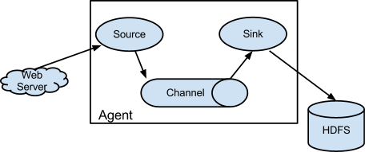

# Flume日志采集框架

## 一、Flume框架介绍


```
在一个完整的离线大数据处理系统中，除了hdfs+mapreduce+hive组成分析系统的核心之外，还需要数据采集、结果数据导出、任务调度等不可或缺的辅助系统，而这些辅助工具在hadoop生态体系中都有便捷的开源框架。
```

- Flume是Cloudera提供的一个高可用的，高可靠的，分布式的**海量日志采集、聚合和传输的系统**；
- Flume支持在日志系统中定制各类数据发送方，用于收集数据；
- Flume提供对数据进行简单处理，并写到各种数据接受方（可定制）的能力。

## 二、Flume的架构



* Flume 的核心是把数据从数据源收集过来，再送到目的地。为了保证输送一定成功，在送到目的地之前，会先缓存数据，待数据真正到达目的地后，删除自己缓存的数据。
* Flume分布式系统中==最核心的角色是agent==，flume采集系统就是由一个个agent所连接起来形成。
* ==每一个agent相当于一个数据传递员，内部有三个组件==
  - **source**
    - 采集组件，用于跟数据源对接，以获取数据
  - **channel**
    - 传输通道组件，缓存数据，用于从source将数据传递到sink
  - **sink**
    - 下沉组件，数据发送给最终存储系统或者下一级agent中

## 三、Flume采集系统结构图

### 1. 简单结构

* 单个agent采集数据


### 2. 复杂结构

* 2个agent串联

  

* 多个agent串联

  

* 多个channel

  

## 四、Flume安装部署

1. 下载、解压

2. 修改配置文件

   ```bash
   # 复制配置文件
   mv flume-env.sh.template flume-env.sh
   # 添加java环境变量
   vim flume-env.sh
   export JAVA_HOME=/opt/bigdata/jdk
   ```

3. 设置环境变量

   ```
   # 配置flume的环境变量
   export FLUME_HOME=/opt/apache-flume-1.8.0-bin
   export PATH=$PATH:$FLUME_HOME/bin
   ```

## 五、Flume实战

### 5.1 采集目录到HDFS

* 一个目录中不断有新的文件产生，需要把目录中的文件不断地进行数据收集保存到HDFS上

  

* 配置文件dir2Hdfs.conf

  ```
  # Name the components on this agent
  a1.sources = r1
  a1.sinks = k1
  a1.channels = c1
  
  # 配置source
  ##注意：不能往监控目中重复丢同名文件
  a1.sources.r1.type = spooldir
  a1.sources.r1.spoolDir = /opt/bigdata/flumeData
  # 是否添加一个key存储目录下文件的绝对路径
  a1.sources.r1.fileHeader = true
  # 存储目录下文件的绝对路径key
  a1.sources.r1.fileHeaderKey = mm
  # 文件名
  a1.sources.r1.basenameHeader = true
  # 文件名 key
  a1.sources.r1.basenameHeaderKey = nn
  a1.sources.r1.channels = c1
  
  #配置channel
  a1.channels.c1.type = memory
  # capacity > transactionCapacity
  a1.channels.c1.capacity = 1000
  a1.channels.c1.transactionCapacity = 100
  
  #配置sink
  a1.sinks.k1.type = hdfs
  a1.sinks.k1.channel = c1
  a1.sinks.k1.hdfs.path = hdfs://node1:9000/spooldir/files/%y-%m-%d/%H%M/
  a1.sinks.k1.hdfs.filePrefix = events-
  # 滚动生成目录，每10minute生成一个新目录
  a1.sinks.k1.hdfs.round = true
  a1.sinks.k1.hdfs.roundValue = 10
  a1.sinks.k1.hdfs.roundUnit = minute
  # 达到一定时间写入
  a1.sinks.k1.hdfs.rollInterval = 60
  # 达到一定大小写入
  a1.sinks.k1.hdfs.rollSize = 50
  # 达到一定行数写入
  a1.sinks.k1.hdfs.rollCount = 10
  # 每批次数据
  a1.sinks.k1.hdfs.batchSize = 100
  a1.sinks.k1.hdfs.useLocalTimeStamp = true
  #生成的文件类型，默认是Sequencefile，可用DataStream，则为普通文本
  a1.sinks.k1.hdfs.fileType = DataStream
  ```

* 启动

  ```
  flume-ng agent -n a1 -c /opt/flume/myconf -f /opt/flume/myconf/dir2Hdfs.conf -Dflume.root.logger=info,console
  ```

### 5.2 采集文件到HDFS

* 监控一个文件如果有新增的内容就把数据采集到HDFS上

  

* 配置文件file2Hdfs.conf

  ```
  # Name the components on this agent
  a1.sources = r1
  a1.sinks = k1
  a1.channels = c1
  
  #配置source
  a1.sources.r1.type = exec
  a1.sources.r1.command = tail -F /opt/bigdata/flumeData/tail.log
  a1.sources.r1.channels = c1
  
  #配置channel
  a1.channels.c1.type
  #指定channel类型
  a1.channels.c1.type = file
  #检查点文件目录
  a1.channels.c1.checkpointDir=/opt/flume_checkpoint
  #缓存数据文件夹
  a1.channels.c1.dataDirs=/opt/flume_data
  
  
  #配置sink
  a1.sinks.k1.channel = c1
  a1.sinks.k1.type = hdfs
  a1.sinks.k1.hdfs.path = hdfs://node1:9000/tailFile/files/%y-%m-%d/%H%M/
  a1.sinks.k1.hdfs.filePrefix = events-
  a1.sinks.k1.hdfs.round = true
  a1.sinks.k1.hdfs.roundValue = 10
  a1.sinks.k1.hdfs.roundUnit = minute
  a1.sinks.k1.hdfs.rollInterval = 60
  a1.sinks.k1.hdfs.rollSize = 50
  a1.sinks.k1.hdfs.rollCount = 10
  a1.sinks.k1.hdfs.batchSize = 100
  a1.sinks.k1.hdfs.useLocalTimeStamp = true
  #生成的文件类型，默认是Sequencefile，可用DataStream，则为普通文本
  a1.sinks.k1.hdfs.fileType = DataStream
  ```

* 启动

  ```
  flume-ng agent -n a1 -c /opt/flume/myconf -f /opt/flume/myconf/file2Hdfs.conf -Dflume.root.logger=info,console
  ```

### 5.3 采集文件到控制台

* 监控一个文件如果有新增的内容就把数据采集之后打印控制台，通常用于测试/调试目的

* 配置文件tail-memory-logger.conf

  ```
  # Name the components on this agent
  a1.sources = r1
  a1.sinks = k1
  a1.channels = c1
  
  #配置source
  a1.sources.r1.type = exec
  a1.sources.r1.command = tail -F /opt/bigdata/flumeData/tail.log
  a1.sources.r1.channels = c1
  
  #配置channel
  a1.channels.c1.type = memory
  a1.channels.c1.capacity = 1000
  a1.channels.c1.transactionCapacity = 100
  
  #配置sink
  a1.sinks.k1.channel = c1
  #类型是日志格式
  a1.sinks.k1.type = logger
  ```

* 启动

  ```
  flume-ng agent -n a1 -c /opt/flume/myconf -f /opt/flume/myconf/tail-memory-logger.conf -Dflume.root.logger=info,console
  ```

## 六、高可用配置案例

#### 6.1 failover故障转移


- 节点分配

|    名称    | 服务器主机名 |     ip地址      |    角色    |
| :--------: | :----------: | :-------------: | :--------: |
|   Agent1   |    node1     | 192.168.200.200 | WebServer  |
| Collector1 |    node2     | 192.168.200.210 | AgentMstr1 |
| Collector2 |    node3     | 192.168.200.220 | AgentMstr2 |

```
Agent1数据分别流入到Collector1和Collector2，Flume NG本身提供了Failover机制，可以自动切换和恢复。
```

* Agent1配置文件flume-client-failover.conf	

  ```bash
  #agent name
  a1.channels = c1
  a1.sources = r1
  a1.sinks = k1 k2
  
  #set gruop
  a1.sinkgroups = g1
  
  #set sink group
  a1.sinkgroups.g1.sinks = k1 k2
  
  #set source
  a1.sources.r1.channels = c1
  a1.sources.r1.type = exec
  a1.sources.r1.command = tail -F /opt/bigdata/flumeData/tail.log
  
  #set channel
  a1.channels.c1.type = memory
  a1.channels.c1.capacity = 1000
  a1.channels.c1.transactionCapacity = 100
  
  # set sink1
  a1.sinks.k1.channel = c1
  a1.sinks.k1.type = avro
  a1.sinks.k1.hostname = node2
  a1.sinks.k1.port = 52020
  
  # set sink2
  a1.sinks.k2.channel = c1
  a1.sinks.k2.type = avro
  a1.sinks.k2.hostname = node3
  a1.sinks.k2.port = 52020
  
  #set failover 故障转移
  a1.sinkgroups.g1.processor.type = failover
  # 优先权重
  a1.sinkgroups.g1.processor.priority.k1 = 10
  a1.sinkgroups.g1.processor.priority.k2 = 5
  a1.sinkgroups.g1.processor.maxpenalty = 10000
  
  #这里首先要申明一个sinkgroups,然后再设置2个sink ,k1与k2,其中2个优先级是10和5。
  #而processor的maxpenalty被设置为10秒，默认是30秒.表示故障转移的最大时间
  ```

  

* Collector1节点 flume-server-failover.conf

  ```
  #set Agent name
  a1.sources = r1
  a1.channels = c1
  a1.sinks = k1
  
  #set channel
  a1.channels.c1.type = memory
  a1.channels.c1.capacity = 1000
  a1.channels.c1.transactionCapacity = 100
  
  # set source
  a1.sources.r1.type = avro
  a1.sources.r1.bind = 0.0.0.0
  a1.sources.r1.port = 52020
  a1.sources.r1.channels = c1
  
  #配置拦截器
  a1.sources.r1.interceptors = i1 i2
  a1.sources.r1.interceptors.i1.type = timestamp
  a1.sources.r1.interceptors.i2.type = host
  a1.sources.r1.interceptors.i2.hostHeader=hostname
  
  #set sink to hdfs
  a1.sinks.k1.channel = c1
  a1.sinks.k1.type=hdfs
  a1.sinks.k1.hdfs.path=hdfs://node1:9000/failover/logs/%{hostname}
  a1.sinks.k1.hdfs.filePrefix=%Y-%m-%d
  a1.sinks.k1.hdfs.round = true
  a1.sinks.k1.hdfs.roundValue = 10
  a1.sinks.k1.hdfs.roundUnit = minute
  a1.sinks.k1.hdfs.rollInterval = 60
  a1.sinks.k1.hdfs.rollSize = 50
  a1.sinks.k1.hdfs.rollCount = 10
  a1.sinks.k1.hdfs.batchSize = 100
  a1.sinks.k1.hdfs.fileType = DataStream
  ```

* 启动

  ```
  # node2和node3上启动
  flume-ng agent -n a1 -c /opt/flume/myconf -f /opt/flume/myconf/flume-server-failover.conf -Dflume.root.logger=info,console
  # node1启动
  flume-ng agent -n a1 -c /opt/flume/myconf -f /opt/flume/myconf/ flume-client-failover.conf -Dflume.root.logger=info,console
  ```

#### 6.2 load balance负载均衡

- 实现多个flume采集数据的时候避免单个flume的负载比较高，实现多个flume采集器负载均衡。

- Agent1节点   flume-client-loadbalance.conf

  ```bash
  #agent name
  a1.channels = c1
  a1.sources = r1
  a1.sinks = k1 k2
  
  #set gruop
  a1.sinkgroups = g1
  
  #set sink group
  a1.sinkgroups.g1.sinks = k1 k2
  
  #set source
  a1.sources.r1.channels = c1
  a1.sources.r1.type = exec
  a1.sources.r1.command = tail -F /opt/bigdata/flumeData/tail.log
  
  #set channel
  a1.channels.c1.type = memory
  a1.channels.c1.capacity = 1000
  a1.channels.c1.transactionCapacity = 100
  
  
  # set sink1
  a1.sinks.k1.channel = c1
  a1.sinks.k1.type = avro
  a1.sinks.k1.hostname = node2
  a1.sinks.k1.port = 52020
  
  # set sink2
  a1.sinks.k2.channel = c1
  a1.sinks.k2.type = avro
  a1.sinks.k2.hostname = node3
  a1.sinks.k2.port = 52020
  
  #set load-balance
  a1.sinkgroups.g1.processor.type =load_balance
  # 默认是round_robin，还可以选择random
  a1.sinkgroups.g1.processor.selector = round_robin
  #如果backoff被开启，则sink processor会屏蔽故障的sink
  a1.sinkgroups.g1.processor.backoff = true
  ```

- Collector flume-server-loadbalance.conf

  ```
  #set Agent name
  a1.sources = r1
  a1.channels = c1
  a1.sinks = k1
  
  #set channel
  a1.channels.c1.type = memory
  a1.channels.c1.capacity = 1000
  a1.channels.c1.transactionCapacity = 100
  
  # set source
  a1.sources.r1.type = avro
  a1.sources.r1.bind = 0.0.0.0
  a1.sources.r1.port = 52020
  a1.sources.r1.channels = c1
  
  #配置拦截器
  a1.sources.r1.interceptors = i1 i2
  a1.sources.r1.interceptors.i1.type = timestamp
  a1.sources.r1.interceptors.i2.type = host
  a1.sources.r1.interceptors.i2.hostHeader=hostname
  a1.sources.r1.interceptors.i2.useIP=false
  
  #set sink to hdfs
  a1.sinks.k1.channel = c1
  a1.sinks.k1.type=hdfs
  a1.sinks.k1.hdfs.path=hdfs://node1:9000/loadbalance/logs/%{hostname}
  a1.sinks.k1.hdfs.filePrefix=%Y-%m-%d
  a1.sinks.k1.hdfs.round = true
  a1.sinks.k1.hdfs.roundValue = 10
  a1.sinks.k1.hdfs.roundUnit = minute
  a1.sinks.k1.hdfs.rollInterval = 60
  a1.sinks.k1.hdfs.rollSize = 50
  a1.sinks.k1.hdfs.rollCount = 10
  a1.sinks.k1.hdfs.batchSize = 100
  a1.sinks.k1.hdfs.fileType = DataStream
  ```

- 启动

  ```
  # node2和node3上启动
  flume-ng agent -n a1 -c /opt/flume/myconf -f /opt/flume/myconf/flume-server-loadbalance.conf -Dflume.root.logger=info,console
  # node1启动
  flume-ng agent -n a1 -c /opt/flume/myconf -f /opt/flume/myconf/ flume-client-loadbalance.conf -Dflume.root.logger=info,console
  ```

## 七、案例

### 7.1 静态拦截器

* 案例场景

  A、B两台日志服务机器实时生产日志主要类型为access.log、nginx.log、web.log 
  现在需要把A、B 机器中的access.log、nginx.log、web.log 采集汇总到C机器上然后统一收集到hdfs中。
  但是在hdfs中要求的目录为：
  /source/logs/access/20180101/**
  /source/logs/nginx/20180101/**
  /source/logs/web/20180101/**

* 场景分析

  

* 数据流程处理分析

  

* 配置文件

  * 服务器A、B  exec_source_avro_sink.conf

  ```bash
  # Name the components on this agent
  a1.sources = r1 r2 r3
  a1.sinks = k1
  a1.channels = c1
  
  # Describe/configure the source
  a1.sources.r1.type = exec
  a1.sources.r1.command = tail -F /home/hadoop/taillogs/access.log
  a1.sources.r1.interceptors = i1
  a1.sources.r1.interceptors.i1.type = static
  ## static拦截器的功能就是往采集到的数据的header中插入自己定义的key-value对
  a1.sources.r1.interceptors.i1.key = type
  a1.sources.r1.interceptors.i1.value = access
  
  a1.sources.r2.type = exec
  a1.sources.r2.command = tail -F /home/hadoop/taillogs/nginx.log
  a1.sources.r2.interceptors = i2
  a1.sources.r2.interceptors.i2.type = static
  a1.sources.r2.interceptors.i2.key = type
  a1.sources.r2.interceptors.i2.value = nginx
  
  a1.sources.r3.type = exec
  a1.sources.r3.command = tail -F /home/hadoop/taillogs/web.log
  a1.sources.r3.interceptors = i3
  a1.sources.r3.interceptors.i3.type = static
  a1.sources.r3.interceptors.i3.key = type
  a1.sources.r3.interceptors.i3.value = web
  
  # Use a channel which buffers events in memory
  a1.channels.c1.type = memory
  a1.channels.c1.capacity = 20000
  a1.channels.c1.transactionCapacity = 10000
  
  # Describe the sink
  a1.sinks.k1.type = avro
  a1.sinks.k1.hostname = node3
  a1.sinks.k1.port = 41414
  a1.sinks.k1.channel = c1
  
  # Bind the source and sink to the channel
  a1.sources.r1.channels = c1
  a1.sources.r2.channels = c1
  a1.sources.r3.channels = c1
  ```

  ```bash
  flume-ng agent -n a1 -c /opt/flume/myconf -f /opt/flume/myconf/avro_source_hdfs_sink.conf -Dflume.root.logger=info,console
  ```

  * 服务器C  avro_source_hdfs_sink.conf

  ```bash
  a1.sources = r1
  a1.sinks = k1
  a1.channels = c1
  #定义source
  a1.sources.r1.type = avro
  a1.sources.r1.bind = node3
  a1.sources.r1.port =41414
  
  #定义channels
  a1.channels.c1.type = memory
  a1.channels.c1.capacity = 20000
  a1.channels.c1.transactionCapacity = 10000
  
  #定义sink
  a1.sinks.k1.type = hdfs
  a1.sinks.k1.hdfs.path=hdfs://node1:9000/source/logs/%{type}/%Y%m%d
  a1.sinks.k1.hdfs.filePrefix =events
  a1.sinks.k1.hdfs.fileType = DataStream
  a1.sinks.k1.hdfs.writeFormat = Text
  #时间类型
  a1.sinks.k1.hdfs.useLocalTimeStamp = true
  #生成的文件不按条数生成
  a1.sinks.k1.hdfs.rollCount = 0
  #生成的文件按时间生成
  a1.sinks.k1.hdfs.rollInterval = 30
  #生成的文件按大小生成
  a1.sinks.k1.hdfs.rollSize  = 10485760
  #批量写入hdfs的个数
  a1.sinks.k1.hdfs.batchSize = 10000
  #flume操作hdfs的线程数（包括新建，写入等）
  a1.sinks.k1.hdfs.threadsPoolSize=10
  #操作hdfs超时时间
  a1.sinks.k1.hdfs.callTimeout=30000
  
  #组装source、channel、sink
  a1.sources.r1.channels = c1
  a1.sinks.k1.channel = c1
  ```

  ```bash
  flume-ng agent -n a1 -c /opt/flume/myconf -f /opt/flume/myconf/exec_source_avro_sink.conf -Dflume.root.logger=info,console
  ```


### 7.2 自定义拦截器

* 案例场景

  在数据采集之后，通过flume的拦截器，实现不需要的数据过滤掉，并将指定的第一个字段进行加密，加密之后再往hdfs上面保存

* 数据文件user.txt

  ```
  13901007610,male,30,sing,beijing
  18600000035,male,40,dance,shanghai
  13366666659,male,20,Swimming,wuhan
  13801179888,female,18,dance,tianjin
  18511111114,male,35,sing,beijing
  13718428888,female,40,Foodie,shanghai
  13901057088,male,50,Basketball,taiwan
  13671057777,male,60,Bodybuilding,xianggang
  ```

  

* Code

  ```java
  
  import com.google.common.base.Charsets;
  import org.apache.flume.Context;
  import org.apache.flume.Event;
  import org.apache.flume.interceptor.Interceptor;
  
  import java.math.BigInteger;
  import java.security.MessageDigest;
  import java.security.NoSuchAlgorithmException;
  import java.util.ArrayList;
  import java.util.List;
  
  public class MyInterceptor implements Interceptor {
      /** encrypted_field_index. 指定需要加密的字段下标 */
      private final String encrypted_field_index;
  
  
      /** The out_index. 指定不需要对应列的下标*/
      private final String out_index;
  
      /**
       * 提供构建方法，后期可以接受配置文件中的参数
       * @param encrypted_field_index
       * @param out_index
       */
      public MyInterceptor( String encrypted_field_index, String out_index) {
          this.encrypted_field_index=encrypted_field_index.trim();
          this.out_index=out_index.trim();
  
      }
  
  
      /*
           *
           * 单个event拦截逻辑
           */
      public Event intercept(Event event) {
          if (event == null) {
              return null;
          }
          try {
              String line = new String(event.getBody(), Charsets.UTF_8);
              String[] fields = line.split(",");
  
              String newLine = "";
              for (int i = 0; i < fields.length; i++) {
                  //字符串数字转换成int
                  int encryptedField = Integer.parseInt(encrypted_field_index);
                  int outIndex = Integer.parseInt(out_index);
  
                  if (i == encryptedField) {
                       newLine+=md5(fields[i])+",";
                  }else if(i !=outIndex) {
                      newLine+=fields[i]+",";
                  }
              }
              newLine=newLine.substring(0,newLine.length()-1);
  
                event.setBody(newLine.getBytes(Charsets.UTF_8));
              return event;
          } catch (Exception e) {
              return event;
          }
  
      }
  
      /*
       *
       * 批量event拦截逻辑
       */
      public List<Event> intercept(List<Event> events) {
          List<Event> out = new ArrayList<Event>();
          for (Event event : events) {
              Event outEvent = intercept(event);
              if (outEvent != null) {
                  out.add(outEvent);
              }
          }
          return out;
      }
  
  
      public void close() {
  
      }
  
  
      public void initialize() {
  
      }
  
      //写一个md5加密的方法
      public static String md5(String plainText) {
          //定义一个字节数组
          byte[] secretBytes = null;
          try {
              // 生成一个MD5加密计算摘要
              MessageDigest md = MessageDigest.getInstance("MD5");
              //对字符串进行加密
              md.update(plainText.getBytes());
              //获得加密后的数据
              secretBytes = md.digest();
          } catch (NoSuchAlgorithmException e) {
              throw new RuntimeException("没有md5这个算法！");
          }
          //将加密后的数据转换为16进制数字
          String md5code = new BigInteger(1, secretBytes).toString(16);// 16进制数字
          // 如果生成数字未满32位，需要前面补0
          for (int i = 0; i < 32 - md5code.length(); i++) {
              md5code = "0" + md5code;
          }
          return md5code;
      }
  
  
      /**
       * 相当于自定义Interceptor的工厂类
       * 在flume采集配置文件中通过制定该Builder来创建Interceptor对象
       * 可以在Builder中获取、解析flume采集配置文件中的拦截器Interceptor的自定义参数：
       * 指定需要加密的字段下标 指定不需要对应列的下标等
       * @author
       *
       */
      public static class MyBuilder implements Interceptor.Builder {
  
          /**
           * encrypted_field_index. 指定需要加密的字段下标
           */
          private  String encrypted_field_index;
  
  
          /**
           * The out_index. 指定不需要对应列的下标
           */
          private  String out_index;
  
          public void configure(Context context) {
              this.encrypted_field_index = context.getString("encrypted_field_index", "");
              this.out_index = context.getString("out_index", "");
          }
  
          /*
           * @see org.apache.flume.interceptor.Interceptor.Builder#build()
           */
          public MyInterceptor build() {
              return new MyInterceptor(encrypted_field_index, out_index);
          }
  
      }
  
  }
  ```

* 把jar包放在flume文件夹下lib内

* 配置文件  flume-interceptor-hdfs.conf

  ```bash
  # Name the components on this agent
  a1.sources = r1
  a1.sinks = k1
  a1.channels = c1
  
  #配置source
  a1.sources.r1.type = exec
  a1.sources.r1.command = tail -F /opt/bigdata/data/user.txt
  a1.sources.r1.channels = c1
  a1.sources.r1.interceptors =i1
  a1.sources.r1.interceptors.i1.type =com.XXX.MyInterceptor$MyBuilder
  #下面这两个是入参
  a1.sources.r1.interceptors.i1.encrypted_field_index=0
  a1.sources.r1.interceptors.i1.out_index=3
  
  #配置channel
  a1.channels.c1.type = memory
  a1.channels.c1.capacity = 1000
  a1.channels.c1.transactionCapacity = 100
  
  
  
  #配置sink
  a1.sinks.k1.type = hdfs
  a1.sinks.k1.channel = c1
  a1.sinks.k1.hdfs.path = hdfs://node1:9000/interceptor/files/%y-%m-%d/%H%M/
  a1.sinks.k1.hdfs.filePrefix = events-
  a1.sinks.k1.hdfs.round = true
  a1.sinks.k1.hdfs.roundValue = 10
  a1.sinks.k1.hdfs.roundUnit = minute
  a1.sinks.k1.hdfs.rollInterval = 5
  a1.sinks.k1.hdfs.rollSize = 50
  a1.sinks.k1.hdfs.rollCount = 10
  a1.sinks.k1.hdfs.batchSize = 100
  a1.sinks.k1.hdfs.useLocalTimeStamp = true
  #生成的文件类型，默认是Sequencefile，可用DataStream，则为普通文本
  a1.sinks.k1.hdfs.fileType = DataStream
  ```

## 八、flume自定义Source

* 场景描述

	官方提供的source类型已经很多，但是有时候并不能满足实际开发当中的需求，此时我们就需要根据实际需求自定义某些source。如：实时监控MySQL，从MySQL中获取数据传输到HDFS或者其他存储框架，所以此时需要我们自己实现MySQLSource。

官方也提供了自定义source的接口：
官网说明：https://flume.apache.org/FlumeDeveloperGuide.html#source

* 自实现对应的方法

  1. 根据官方说明自定义mysqlsource需要继承AbstractSource类并实现Configurable和PollableSource接口

  2. 实现对应的方法

     1. configure(Context context)

        初始化context

     2. process()

        从mysql表中获取数据，然后把数据封装成event对象写入到channel，该方法被一直调用

     3. stop()

        关闭相关资源
* 代码

  

## 九、flume自定义Sink

* 场景描述

```
    官方提供的sink类型已经很多，但是有时候并不能满足实际开发当中的需求，此时我们就需要根据实际需求自定义某些sink。如：需要把接受到的数据按照规则进行过滤之后写入到某张mysql表中，所以此时需要我们自己实现MySQLSink。官方也提供了自定义sink的接口：官网说明：https://flume.apache.org/FlumeDeveloperGuide.html#sink
```

根据官方说明自定义MysqlSink需要继承AbstractSink类并实现Configurable

- 实现对应的方法

  1. configure(Context context)

  2. 初始化context

  3. start()

     启动准备操作

  4. process()

     从channel获取数据，然后解析之后，保存在mysql表中

  5. stop()

     关闭相关资源

* 代码


## 十、断点续传

* 如果是tail文件时，如果flume挂掉，可能日志就没有办法冲洗你监控了

* tailDir

  ```
  # 监控一个目录下的新增的文件、以及文件中新增的内容
  # 并且可以记录每一给文件的采集位置
  source.type=taildir
  ```

* 运行后看，会生成taildir_position.json文件，标记inode，文件以及位置