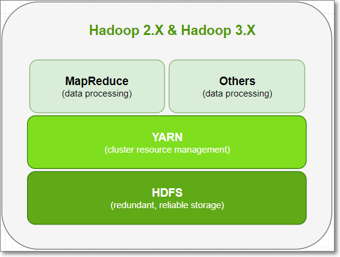

# HADOOP

HADOOP分三个模块组成：
1. 分布式存储 HDFS

2. 分布式计算 MapReduce

3. 资源调度引擎 Yarn

   


## HDFS(Hadoop Distributed File SystemHadoop分布式文件系统)

1. 分布式是什么
    * 通过网络连接通信多台机器，完成一台机器无法完成的存储、计算任务。
    * 什么是集群？两者的概念区别？

2. 为什么使用HDFS
    * 高可用、容错、可扩展

## HDFS 数据块block

1. HDFS block块
    * 在HDFS3.X的文件系统中，文件默认时按照`128M`为一个单位，切分成一个个block，分散的数存储在集群的不同的数据节点上`datanode`。
    

  
    
2. block副本
    * replication = 3 (默认副本是有三个的)
    
* 可通过修改`hdfs-default.xml`中的`dfs.replication`配置来调整数量
  
  
3. 机架副本存放策略
    1. 第一个副本在client所处的节点上。如果客户端在集群外，随机选一个。
    2. 第二个副本在和第一个副本不同机架的随机节点上
    3. 第三个副本和第二个副本相同机架，节点随机。

    机架感应

    

    1. distance(/D1/R1/H1,/D1/R1/H1)=0 相同的datanode
    2. distance(/D1/R1/H1,/D1/R1/H3)=2 同一rack下的不同datanode
    3. distance(/D1/R1/H1,/D1/R2/H4)=4 同一IDC下的不同datanode
    4. distance(/D1/R1/H1,/D2/R3/H7)=6 不同IDC下的datanode

4. block 操作
    * 修改文件副本数
    ```
    hadoop fs setrep -R 4 /test
    ```
    * 查看文件的block信息
    ```
    hadoop fsck /file -files -blocks -locations
    ```


## HDFS架构图

HDFS 是主从架构 Master/！Slave、管理节点/工作节点

​	

1. NameNode
    * 管理节点，负责关键文件系统和命名系空间，存放了HDSFS的元数据（在内存中）。
    * 元数据信息：包括文件系统树、所有目录和文件、每个文件的块列表、块所在的DataNode等。
    * 文件、block、目录占用大概**150Byte字节的元数据**；所以HDFS适合存储大文件，不适合存储小文件
    * 元数据信息以命名空间镜像文件**fsimage**和编辑日志（**edits log**）的方式保存
        * fsimage:元数据镜像文件，保存了文件系统目录书信息以及文件和块的对应关系
        * 日志文件，保存文件系统的更改记录
    
2. DataNode
   
* 存储block，以及bloc元数据包括数据块的长度、块数据的校验和、时间戳
  
3. SecondaryNameNode（辅助NameNode）
    * 定期将编辑日志和元数据信息合并，防止编辑日志文件过大，并且能保证其信息与namenode信息保持一致。
    * SN一般在另一台单独的物理计算机上运行，因为它需要占用大量CPU时间来与namenode进行合并操作，一般情况是单独开一个线程来执行操作过程
    
    

    当namenode运行了3600s后，SN取出fsimage和edits，合并，更新fsimage，命名为fsimage.ckpt，将fsimage.ckpt文件传入namenode中，合并过程中，客户端会继续上传文件。同时，namenode会创建新的edits.new文件，将合并过程中，产生的日志存入edits.new，namenode将 fsimage.ckpt,更名为fsimage，edits.new更名为edits。
    
    如果在合并过程中，namenode损坏，那么，丢失了在合并过程中产生的edits.new,因此namenode失效时，难免会丢失部分数据。

## HDFS四大机制

1. 心跳机制
   
    
    
    **原理：**
    
1. Master启动之后，会启动一个Ipc Server。
    2. Salve启动，连接Master，每隔3秒钟向Master发送一个心跳指令，携带这状态信息
    3. Master通过这个心跳的返回值，想Salve节点传达指令

    **作用：**

   1. NameNode 全权管理数据块的复制，它周期性地从集群中的每个DataNode节点接受心跳信号和块状态报告（BlockReport）。接受到心跳信号以为这该DataNode节点工作正常。块转台报告包含了一个该DataNode上所有数据块的列表。
   
   2. DataNode启动后想NameNode注册，，通过后，周期性（1小时）的向NameNode上报所有的块的列表；每3秒向NameNode发送一次心跳，返回NameNode给该DataNode的命令：如复制数据到另一台机器或删除某个数据块。如果NameNode超过10分钟没有收到某个DataNode的心跳，则认为该节点不可用。
   3. hadoop集群刚开始启动时，会进入安全模式（99.9%），就用到了心跳机制
   
2. 负载均衡

    * 当集群内新增、删除节点，或者某个节点机器内硬盘存储达到饱和值。导致非常的容易出现机器磁盘利用率不一致的问题。
    * 需要迁移数据到不同的节点。
    * 当机器负载差距超过10%的时候，负载均衡开始调整
    ```bash
    $HADOOP_HOME/sbin/start-balancer.sh -t 10%
    ```

3. HDFS  安全模式
4. 副本存放策略

## HDFS 读写流程

特点
* 能够运行在廉价机器上，硬件出错常态，需要具备高容错性
* 流式数据访问，而不是随机读写
* 面向大规模数据集，能够进行批处理、能够横向扩展
* 简单一致性模型，假定文件是一次写入、多次读取

缺点：
* 不支持低延迟数据访问
* 不适合大量小文件存储（因为每条元数据占用空间是一定的）
* 不支持并发写入，一个文件只能有一个写入者
* 不支持文件随机修改，仅支持追加写入

单位

* block
  
    文件上传前需要分块，这个块就是block，一般为128MB，当然你可以去改，不顾不推荐。因为块太小：寻址时间占比过高。块太大：Map任务数太少，作业执行速度变慢。它是最大的一个单位。

* packet
  
    packet是第二大的单位，它是client端向DataNode，或DataNode的PipLine之间传数据的基本单位，默认64KB。

* chunk

    chunk是最小的单位，它是client向DataNode，或DataNode的PipLine之间进行数据校验的基本单位，默认512Byte，因为用作校验，故每个chunk需要带有4Byte的校验位。所以实际每个chunk写入packet的大小为516Byte。由此可见真实数据与校验值数据的比值约为128 : 1。（即64*1024 / 512）

    在client端向DataNode传数据的时候，HDFSOutputStream会有一个chunk buff，写满一个chunk后，会计算校验和并写入当前的chunk。之后再把带有校验和的chunk写入packet，当一个packet写满后，packet会进入dataQueue队列，其他的DataNode就是从这个dataQueue获取client端上传的数据并存储的。同时一个DataNode成功存储一个packet后之后会返回一个ack packet，放入ack Queue中。


写文件


1. 客户端向NameNode发出写文件请求。
2. 检查是否已存在文件、检查权限。若通过检查，直接先将操作写入EditLog，并返回输出流对象。（（注：WAL，write ahead log，先写Log，再写内存，因为EditLog记录的是最新的HDFS客户端执行所有的写操作。如果后续真实写操作失败了，由于在真实写操作之前，操作就被写入EditLog中了，故EditLog中仍会有记录，我们不用担心后续client读不到相应的数据块，因为在第5步中DataNode收到块后会有一返回确认信息，若没写成功，发送端没收到确认信息，会一直重试，直到成功）
3. client端按128MB的块切分文件
4. client将NameNode返回的分配的可写的DataNode列表和Data数据一同发送给最近的第一个DataNode节点，此后client端和NameNode分配的多个DataNode构成pipeline管道，client端向输出流对象中写数据。client每向第一个DataNode写入一个packet，这个packet便会直接在pipeline里传给第二个、第三个…DataNode。
5. 每个DataNode写完一个块后，会返回确认信息。 
6. 写完数据，关闭输输出流。
7. 发送完成信号给NameNode。 
（注：发送完成信号的时机取决于集群是强一致性还是最终一致性，强一致性则需要所有DataNode写完后才向NameNode汇报。最终一致性则其中任意一个DataNode写完后就能单独向NameNode汇报，HDFS一般情况下都是强调强一致性）

读文件


1. 客户端与NameNode通讯获取文件的块位置信息，其中包括了块的所有冗余备份的位置信息：DataNode的列表；
2. 客户端获取文件位置信息后直接同有文件块的DataNode通讯，读取文件
3. 如果第一个DataNode无法连接，客户端将自动联系下一个DataNode
4. 如果块数据的校验值出错，则客户端需要向NameNode报告，并联系下一个NameNode

QA

    Q:读写过程，数据完整性如何保持？
    A:通过校验和。因为每个chunk中都有一个校验位，一个个chunk构成packet，一个个packet最终形成block，故可在block上求校验和。

`可了解下Hadoop下data文件夹下内容`

### Hadoop HA高可用

​	

### Hadoop联邦

- 集群的元数据保存在namenode内存中
- 每个文件、目录、block占用约150字节
- 对于一个拥有大量文件的超大集群来说，内存将成为限制系统横向扩展的瓶颈。
- 共享内存


### Hadoop存储小文件
1. HAR文件方案
2. SequenceFile方案
   1. NONE：不压缩
   2. RECORD：每条记录对value进行一次压缩
   3. BLOCK：   块压缩，当缓存的key和value字节大小达到指定的阈值，则进行压缩，阈值由配置项io.seqfile.compress.blocksize指定，默认值为1000000字节