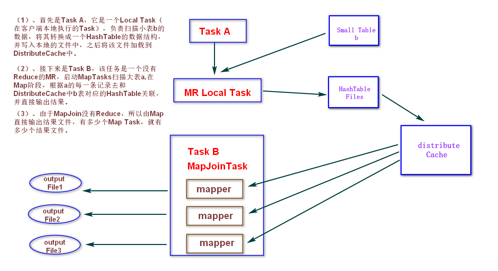

## 一、Hive表的数据压缩

### 1. 压缩性能评价

1. 压缩比：压缩比越高、压缩后文件越小；压缩比越高越好。
2. 压缩时间：越快越好。
3. 再分割：已经压缩的格式文件是否可以再分割，可以分割的格式允许单一文件由多个Mapper程序处理，可以更好的并行化

### 2. 常见的压缩格式

| 压缩方式 | 压缩比 | 压缩速度 | 解压缩速度 | 是否可分割 |
| :------: | :----: | :------: | :--------: | :--------: |
|   gzip   | 13.4%  | 21 MB/s  |  118 MB/s  |     否     |
|  bzip2   | 13.2%  | 2.4MB/s  |  9.5MB/s   |     是     |
|   lzo    | 20.5%  | 135 MB/s |  410 MB/s  |     是     |
|  snappy  | 22.2%  | 172 MB/s |  409 MB/s  |     是     |

### 3. Hadoop 编码、解码方式

| 压缩格式 |             对应的编码/解码器              |
| :------: | :----------------------------------------: |
| DEFLATE  | org.apache.hadoop.io.compress.DefaultCodec |
|   Gzip   |  org.apache.hadoop.io.compress.GzipCodec   |
|  BZip2   |  org.apache.hadoop.io.compress.BZip2Codec  |
|   LZO    |     com.hadoop.compress.lzo.LzopCodec      |
|  Snappy  | org.apache.hadoop.io.compress.SnappyCodec  |

### 4. 数据压缩使用

* hive表中间数据压缩intermediate

  ```bash
  #设置为true为激活中间数据压缩功能，默认是false，没有开启
  set hive.exec.compress.intermediate=true;
  #设置中间数据的压缩算法
  set mapred.map.output.compression.codec=org.apache.hadoop.io.compress.SnappyCodec;
  ```

* hive表最终数据压缩output

  ```bash
  set hive.exec.compress.output=true;
  set mapred.output.compression.codec=org.apache.hadoop.io.compress.SnappyCodec;
  ```

## 二、 hive表的文件存储格式

### 1. 格式说明

* Hive支持的存储数的格式主要有：**textFile**、**sequencefile**、**orc**、**parquet**。
* 其中textFile为默认格式，建表时默认为这个格式，导入数据时会直接把数据文件拷贝到hdfs上不进行处理。**sequencefile**、**orc**、**parquet**格式的表不能直接从本地文件导入数据，数据要先导入到TextFile格式的表中，然后再从textFile表中用insert导入到sequencefile、orc、parquet表中。
* **textFile **和 **sequencefile**的存储格式都是基于行存储的；
* **orc** 和 **parquet** 是基于列式存储的。

### 2. 文件存储格式对比


## 三、Hive 函数

### 1. 默认函数

```sql
show functions;
desc function max;
```

### 2. 自定义函数

用户自定义函数类别分为三种：

1. UDF (User-Defuned-Funtion)    一进一出
2. UDAF(User-Defined Aggregation Funciton)     聚合函数，多进一出
3. UDTF(User-Defined Table0Generating Function)    一进多出


## 四、Hive的企业级调优

### 1. Fetch抓取

* Fetch 抓取是指，**Hive中对某些情况的查询可以不必使用MapReduce计算**

  * 例如：select * from table_name;
  * 这种情况下，Hive可以简单地读取比表中对应地存储目录下的文件，然后输出查询结果。

* 在hive-default.xml.template文件中**hive.fetch.task.conversion默认是more**，老版本hive默认是minimal，该属性修改为more以后，在全局查找、字段查找、limit查找等都不走mapreduce。

* ```sql
  # 都会执行mapreduce程序
  set hive.fetch.task.conversion=none;
  select * from employee;
  select sex from employee;
  select sex from employee limit 3;
  # 简单执行都不会执行mapreduce程序
  set hive.fetch.task.conversion=more;
  select * from employee;no
  select sex from employee;
  select sex from employee limit 3;
  ```

### 2. 本地模式

* 默认情况下是启用hadoop的job模式,把任务提交到集群中运行，这样会导致计算非常缓慢；

* Hive可以通过本地模式在单台机器上处理任务。对于小数据集，执行时间可以明显被缩短。

* ```sql
  --开启本地模式，并执行查询语句
  set hive.exec.mode.local.auto=true;  //开启本地mr
  
  --设置local mr的最大输入数据量，当输入数据量小于这个值时采用local  mr的方式，
  --默认为134217728，即128M
  set hive.exec.mode.local.auto.inputbytes.max=50000000;
  
  --设置local mr的最大输入文件个数，当输入文件个数小于这个值时采用local mr的方式，
  --默认为4
  set hive.exec.mode.local.auto.input.files.max=5;
  
  --执行查询的sql语句
   select * from employee cluster by deptid;
  ```

### 3. 表的优化

1. 

#### 2. Map join

* 如果不指定MapJoin 或者不符合 MapJoin的条件，那么Hive解析器会将Join操作转换成Common Join，即：在Reduce阶段完成join。容易发生数据倾斜。可以用 MapJoin 把小表全部加载到内存在map端进行join，避免reducer处理。

* ```sql
   --默认为true
  set hive.auto.convert.join = true;
  ```

* ```
  -- 大表小表的阈值设置（默认25M一下认为是小表）
  hive.mapjoin.smalltable.filesize=25000000;
  ```

* 

#### 3. Group by

* 默认情况下，Map阶段同一Key数据分发给一个reduce，当一个key数据过大时就倾斜了。

* 并不是所有的聚合操作都需要在Reduce端完成，很多聚合操作都可以先在Map端Combiner进行部分聚合，最后在Reduce端得出最终结果。

* ```sql
  --是否在Map端进行聚合，默认为True
  set hive.map.aggr = true;
  --在Map端进行聚合操作的条目数目
  set hive.groupby.mapaggr.checkinterval = 100000;
  --有数据倾斜的时候进行负载均衡（默认是false）
  set hive.groupby.skewindata = true;
  
  --  当选项设定为 true，生成的查询计划会有两个MR Job。第一个MR Job中，Map的输出结果会随机分布到Reduce中，每个Reduce做部分聚合操作，并输出结果，这样处理的结果是相同的Group By Key有可能被分发到不同的Reduce中，从而达到负载均衡的目的；第二个MR Job再根据预处理的数据结果按照Group By Key分布到Reduce中（这个过程可以保证相同的Group By Key被分布到同一个Reduce中），最后完成最终的聚合操作。
  ```

#### 4. count(distinct)

*  数据量小的时候无所谓，数据量大的情况下，由于count distinct 操作需要用一个reduce Task来完成，这一个Reduce需要处理的数据量太大，就会导致整个Job很难完成，一般count distinct使用先group by 再count的方式替换

* ```sql
  --每个reduce任务处理的数据量 默认256000000（256M）
  set hive.exec.reducers.bytes.per.reducer=32123456;
  select  count(distinct ip )  from log_text;
  --> 
  select count(ip) from (select ip from log_text group by ip) t;
  -- 虽然会多用一个Job来完成，但在数据量大的情况下，这个绝对是值得的。
  ```

#### 5. 笛卡尔积

* 尽量避免笛卡尔积，即避免join的时候不加on条件，或者无效的on条件
* Hive只能使用1个reducer来完成笛卡尔积。

### 4. 使用分区剪裁、列剪裁

- **列剪裁**
  - 只获取需要的列的数据，减少数据输入。
- **分区裁剪**
  - 分区在hive实质上是目录，分区裁剪可以方便直接地过滤掉大部分数据。
  - 尽量使用分区过滤，少用select  *

### 5. 并行执行

```sql
--开启并行执行
set hive.exec.parallel=true;
--同一个sql允许最大并行度，默认为8。
set hive.exec.parallel.thread.number=16;
```

### 6. 严格模式

* Hive提供了一个严格模式，可以防止用户执行那些可能意想不到的不好的影响的查询。

* 通过设置属性hive.mapred.mode值为默认是非严格模式**nonstrict** 。开启严格模式需要修改hive.mapred.mode值为**strict**，开启严格模式可以禁止3种类型的查询。

* ```sql
  -- （1）对于分区表，除非where语句中含有分区字段过滤条件来限制范围，否则不允许执行=
  select * from order_partition；
  
  -- 异常信息：Error: Error while compiling statement: FAILED: SemanticException [Error 10041]: No partition predicate found for Alias "order_partition" Table "order_partition" 
  
  -- (2)对于使用了order by语句的查询，要求必须使用limit语句=
  select * from order_partition where month='2019-03' order by order_price; 
  
  -- 异常信息：Error: Error while compiling statement: FAILED: SemanticException 1:61 In strict mode, if ORDER BY is specified, LIMIT must also be specified. Error encountered near token 'order_price'
  
  -- (3)限制笛卡尔积的查询
  ```

