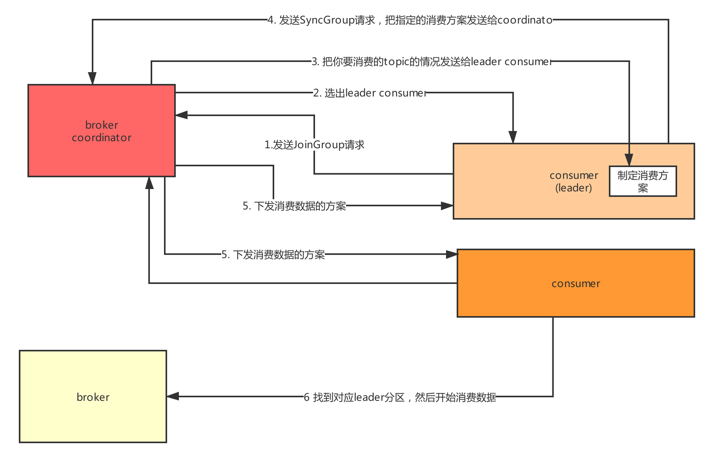

# Kafka Comsumer

## 一、Consumer架构

### 1.1 offset管理

每个consumer内存里数据结构保存对每个topic的每个分区的消费offset，定期会提交offset，老版本是写入zk，但是那样高并发请求zk是不合理的架构设计，zk是做分布式系统的协调的，轻量级的元数据存储，不能负责高并发读写，作为数据存储。所以后来就是提交offset发送给内部topic：__consumer_offsets，提交过去的时候，key是group.id+topic+分区号，value就是当前offset的值，每隔一段时间，kafka内部会对这个topic进行compact。也就是每个group.id+topic+分区号就保留最新的那条数据即可。而且因为这个 __consumer_offsets可能会接收高并发的请求，所以默认分区50个，这样如果你的kafka部署了一个大的集群，比如有50台机器，就可以用50台机器来抗offset提交的请求压力，就好很多。

### 1.2 Coordinator

**Coordinator的作用**

每个consumer group都会选择一个broker作为自己的coordinator，他是负责监控这个消费组里的各个消费者的心跳，以及判断是否宕机，然后开启rebalance，根据内部的一个选择机制，会挑选一个对应的Broker，Kafka总会把你的各个消费组均匀分配给各个Broker作为coordinator来进行管理的，consumer group中的每个consumer刚刚启动就会跟选举出来的这个consumer group对应的coordinator所在的broker进行通信，然后由coordinator分配分区给你的这个consumer来进行消费。coordinator会尽可能均匀的分配分区给各个consumer来消费。

**如何选择哪台是coordinator**

首先对消费组的groupId进行hash，接着对__consumer_offsets的分区数量取模，默认是50，可以通过offsets.topic.num.partitions来设置，找到你的这个consumer group的offset要提交到__consumer_offsets的哪个分区。比如说：groupId，“membership-consumer-group” -> hash值（数字）-> 对50取模 -> 就知道这个consumer group下的所有的消费者提交offset的时候是往哪个分区去提交offset，找到__consumer_offsets的一个分区，__consumer_offset的分区的副本数量默认来说1，只有一个leader，然后对这个分区找到对应的leader所在的broker，这个broker就是这个consumer group的coordinator了，consumer接着就会维护一个Socket连接跟这个Broker进行通信。



## 二、Rebalance策略

比如我们消费的一个主题有12个分区：
p0,p1,p2,p3,p4,p5,p6,p7,p8,p9,p10,p11
假设我们的消费者组里面有三个消费者
**1.range策略**
range策略就是按照partiton的序号范围
	p0~3             consumer1
	p4~7             consumer2
	p8~11            consumer3
	默认就是这个策略；

**2.round-robin策略**
consumer1:0,3,6,9
consumer2:1,4,7,10
consumer3:2,5,8,11

但是前面的这两个方案有个问题：
	假设consuemr1挂了:p0-5分配给consumer2,p6-11分配给consumer3
	这样的话，原本在consumer2上的的p6,p7分区就被分配到了 consumer3上。

**3.sticky策略**
最新的一个sticky策略，就是说尽可能保证在rebalance的时候，让原本属于这个consumer
的分区还是属于他们，
然后把多余的分区再均匀分配过去，这样尽可能维持原来的分区分配的策略

consumer1：0-3
consumer2:  4-7
consumer3:  8-11 
假设consumer3挂了
consumer1：0-3，+8,9
consumer2: 4-7，+10,11

**Rebalance分代机制**
在rebalance的时候，可能你本来消费了partition3的数据，结果有些数据消费了还没提交offset，结果此时rebalance，把partition3分配给了另外一个cnosumer了，此时你如果提交partition3的数据的offset，能行吗？必然不行，所以每次rebalance会触发一次consumer group generation，分代，每次分代会加1，然后你提交上一个分代的offset是不行的，那个partiton可能已经不属于你了，大家全部按照新的partiton分配方案重新消费数据。

## 三、代码开发

```java
mport java.util.Arrays;
import java.util.Properties;
import java.util.concurrent.ExecutorService;
import java.util.concurrent.Executors;

import org.apache.kafka.clients.consumer.ConsumerRecord;
import org.apache.kafka.clients.consumer.ConsumerRecords;
import org.apache.kafka.clients.consumer.KafkaConsumer;

import com.alibaba.fastjson.JSONObject;

public class ConsumerDemo {

	private static ExecutorService threadPool = Executors.newFixedThreadPool(20);
	
	public static void main(String[] args) throws Exception {
		KafkaConsumer<String, String> consumer = createConsumer();
		consumer.subscribe(Arrays.asList("order-topic"));  
		try {
			while(true) {  
				ConsumerRecords<String, String> records = consumer.poll(Integer.MAX_VALUE); 
				for(ConsumerRecord<String, String> record : records) {
					JSONObject order = JSONObject.parseObject(record.value()); 
					threadPool.submit(new CreditManageTask(order));
				}
			}
		} catch(Exception e) {
			e.printStackTrace();
			consumer.close();
		}
	}
	
	private static KafkaConsumer<String, String> createConsumer() {
		Properties props = new Properties();
		props.put("bootstrap.servers", "hadoop03:9092,hadoop04:9092,hadoop05:9092");
		props.put("group.id", "test-group");
		props.put("key.deserializer", "org.apache.kafka.common.serialization.StringDeserializer");
		props.put("value.deserializer", "org.apache.kafka.common.serialization.StringDeserializer");
		props.put("heartbeat.interval.ms", 1000); // 这个尽量时间可以短一点
		props.put("session.timeout.ms", 10 * 1000); // 如果说kafka broker在10秒内感知不到一个consumer心跳
		props.put("max.poll.interval.ms", 30 * 1000); // 如果30秒才去执行下一次poll
		// 就会认为那个consumer挂了，此时会触发rebalance
		// 如果说某个consumer挂了，kafka broker感知到了，会触发一个rebalance的操作，就是分配他的分区
		// 给其他的cosumer来消费，其他的consumer如果要感知到rebalance重新分配分区，就需要通过心跳来感知
		// 心跳的间隔一般不要太长，1000，500
		props.put("fetch.max.bytes", 10485760);
		props.put("max.poll.records", 500); // 如果说你的消费的吞吐量特别大，此时可以适当提高一些
		props.put("connection.max.idle.ms", -1); // 不要去回收那个socket连接
		// 开启自动提交，他只会每隔一段时间去提交一次offset
		// 如果你每次要重启一下consumer的话，他一定会把一些数据重新消费一遍
		props.put("enable.auto.commit", "true");
		// 每次自动提交offset的一个时间间隔
		props.put("auto.commit.ineterval.ms", "1000");
		// 每次重启都是从最早的offset开始读取，不是接着上一次
		props.put("auto.offset.reset", "earliest"); 
		

		KafkaConsumer<String, String> consumer = new KafkaConsumer<String, String>(props);
		return consumer;
	}
	
	static class CreditManageTask implements Runnable {
		private JSONObject order;
		public CreditManageTask(JSONObject order) {
			this.order = order;
		}
		
		@Override
		public void run() {
			System.out.println("对订单进行积分的维护......" + order.toJSONString());    
			// 就可以做一系列的数据库的增删改查的事务操作
		}
	}
}

```

## 四、Consumer核心参数

```
【heartbeat.interval.ms】
consumer心跳时间，必须得保持心跳才能知道consumer是否故障了，然后如果故障之后，就会通过心跳下发rebalance的指令给其他的consumer通知他们进行rebalance的操作

【session.timeout.ms】
kafka多长时间感知不到一个consumer就认为他故障了，默认是10秒

【max.poll.interval.ms】
如果在两次poll操作之间，超过了这个时间，那么就会认为这个consume处理能力太弱了，会被踢出消费组，分区分配给别人去消费，一遍来说结合你自己的业务处理的性能来设置就可以了

【fetch.max.bytes】
获取一条消息最大的字节数，一般建议设置大一些

【max.poll.records】
一次poll返回消息的最大条数，默认是500条

【connection.max.idle.ms】
consumer跟broker的socket连接如果空闲超过了一定的时间，此时就会自动回收连接，但是下次消费就要重新建立socket连接，这个建议设置为-1，不要去回收

【auto.offset.reset】
	earliest
		当各分区下有已提交的offset时，从提交的offset开始消费；无提交的offset时，从头开始消费
		topica -> partition0:1000   
				  partitino1:2000  			  
	latest
		当各分区下有已提交的offset时，从提交的offset开始消费；无提交的offset时，从当前位置开始消费
	none
		topic各分区都存在已提交的offset时，从offset后开始消费；只要有一个分区不存在已提交的offset，则抛出异常
		
注：我们生产里面一般设置的是latest

【enable.auto.commit】
这个就是开启自动提交唯一

【auto.commit.ineterval.ms】
这个指的是多久条件一次偏移量
```

