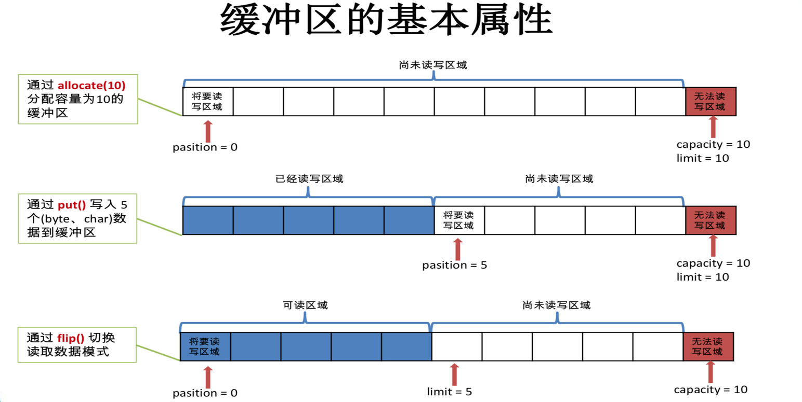
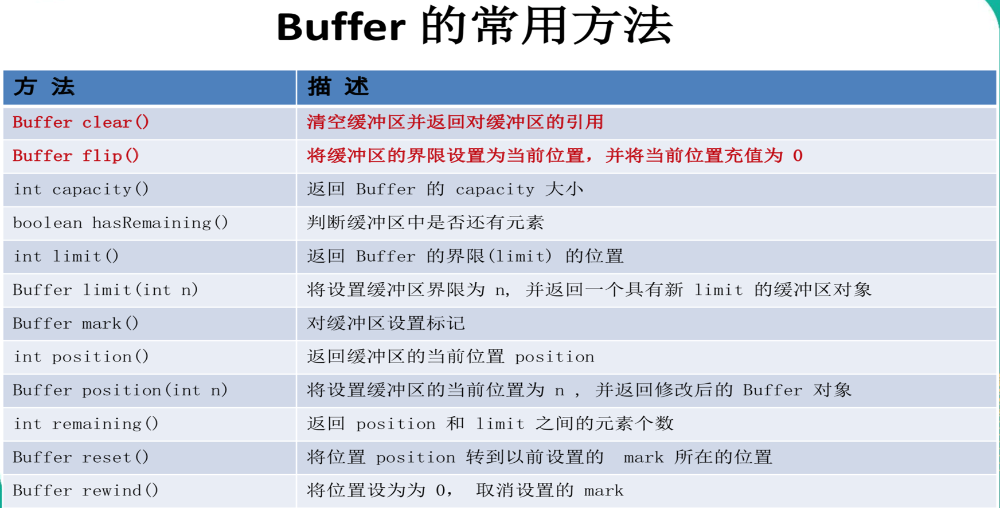
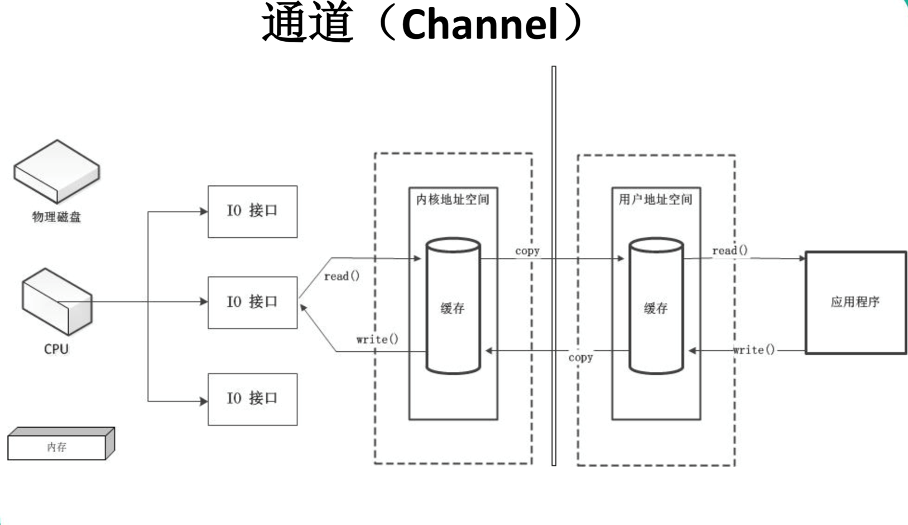
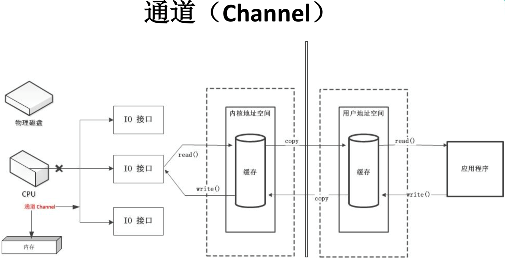
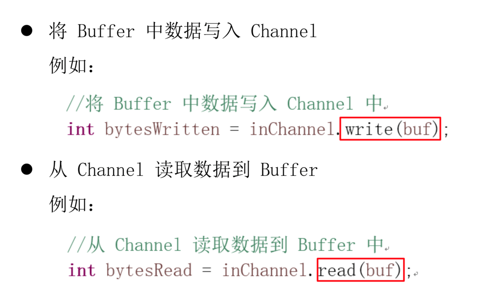
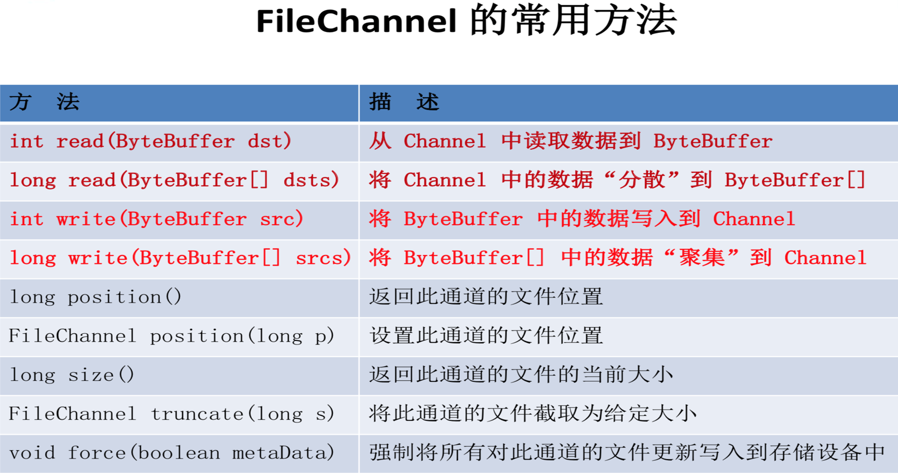
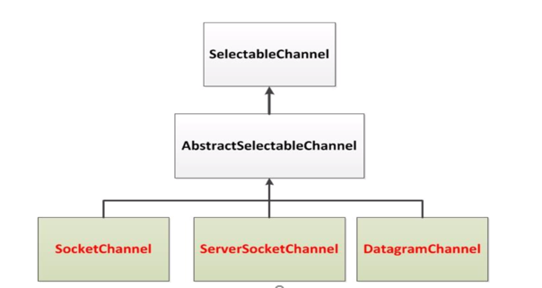
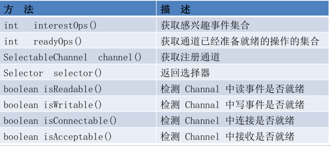
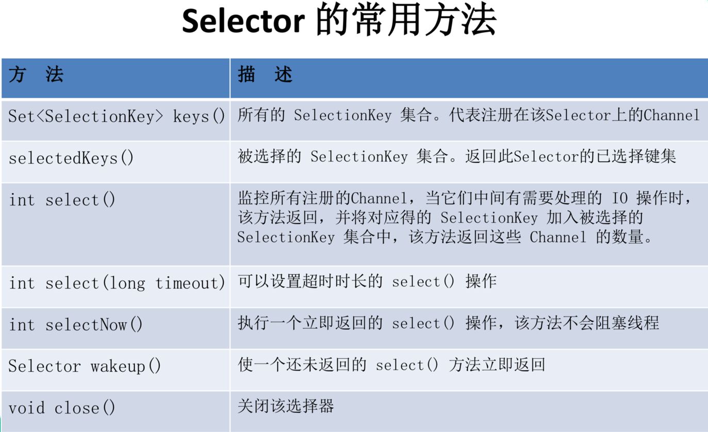
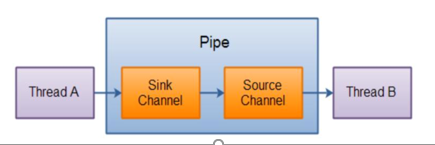

# NIO

## 一、NIO简介

* JavaNIO (New IO)是从Java 1.4版本开始引入的一个新的10API,可以替代标准的Java 10API。
* NIO与原来的IO有同样的作用和目的，但是使用的方式完全不同，NI0支持面向缓冲区的、基于通道的IO操作。
* NI0将以更加高效的方式进行文件的读写操作。

## 二、NIO与IO的区别

| IO                      | NIO                         |
| ----------------------- | --------------------------- |
| 面向流(Stream Oriented) | 面向缓冲区(Buffer Oriented) |
| 阻塞 IO( Blocking IO)   | 非阻塞IO(Non Blocking IO)   |
| 无                      | 选择器(Selectors)           |

## 三、通道(Channel)与缓冲区(Buffer)

* Java NIO系统的核心在于：通道(Channel)和缓冲区(Buffer)。

* 通道表示打开到IO设备(例如：文件、套接字)的连接。
* 若需要使用NI0系统，需要获取用于连接IO设备的通道以及用于容纳数据的缓冲区。然后操作缓冲区，对数据进行处理。
* ==**Channel负责传输，Buffer负责存储**==

### 3.1 缓冲区(Buffer)

* **缓冲区**(Buffer)**： —个用于特定基本数据类型的容器。由java.nio包定义的，所有缓冲区都是Buffer抽象类的子类。
*  Java NI0中的Buffer主要用于与NI0通道进行交互，数据是从通道读入缓冲区，从缓冲区写入通道中的。

* Buffer就像一个数组，可以保存多个相同类型的数据。根
   据数据类型不同(boolean除外),有以下Buffer常用子类:
  *   ByteBuffer
  * CharBuffer
  * ShortBuffer
  * IntBuffer
  * LongBuffer
  * FloatBuffer
  * DoubleBuffer

### 3.2 缓冲区的基本属性

* ==**容量(capacity)**==:表示Buffer最大数据容量，缓冲区容量不能为负，并且创建后不能更改。
  
* ==**限制(limit)**==：第一个不应该读取或写入的数据的索引，即位于limit后的数据不可读写。缓冲区的限制不能为负，并且不能大于其容量。
  
* ==**位置(position)**==：下一个要读取或写入的数据的索引。缓冲区的位置不能为负，并且不能大于其限制。

* ==**标记(mark)与重置(reset)**==：标记是一个索引，通*it* Buffer中的mark()方法指定Buffer中一个特定的position,之后可以通过调用reset()方法恢复到这个 position。

* 0 <= mark <= position <= limit <= capacity

  

### 3.3 Buffer的常用方法



### 3.4 缓存区的数据操作

* Buffer所有子类提供了两个用于数据操作的方法：get()与put()方法
  * 获取Buffer中的数据
    * get():读取单个字节
    * get(byte[] dst)：批量读取多个字节到dst中
    * get(int index)：读取指定索引位置的字节(不会移动position)
  * 放入数据到Buffer中
    * put(byteb)：将给定单个字节写入缓冲区的当前位置
    * put(byte[] src)：将src中的字节写入缓冲区的当前位置
    * put(int index, byte b)：将指定字节写入缓冲区的索引位置(不会移动position)

### 3.5 直接与非直接缓存区

* 字节缓冲区要么是直接的，要么是非直接的。
  * 如果为直接字节缓冲区，则Java虚拟机会尽最大努力直接在此缓冲区上执行本机I/O操作。也就是说，在毎次I/O用基础操作系统的一个本机I/O操作之前(或之后)，虚拟机都会尽量遊免将缓冲区的内容复制到中间缓冲区中(或从中间缓冲区中复制内容)。
* 直接字节缓冲区可以通过调用此类NallocateDirectO()工厂方法来创建。此方法返回的级冲区进行分配和取消分配所需成本通带高于非直接缓冲区。直接缓冲区的内容可以驻留在垃圾回收堆之外，因此，它们对应用程序的内存常求造成的彭响可能并不明显。所以，建议将直接缓冲区主要分配给那些易受基础系统的本机I/O操作彫响的大型、持久的缓冲区.一般情况下，最好仅在直接缓冲区能在程序性能方面带来明显好处时分民它们.
* 直接字节缓冲区还可以FileChannel的map()方法将文件区域直接映射到内存中来创建该方法返回MappedByteBuffer.Java平台/的实现有助于通过JNI从本机代码创建直接字节缓冲区.如果以上这些级冲区中的某个缓冲区实例指的是不可访问的内存区域，则试图访问该区域不会更改该级冲区的内容，并且将会在访问期间或稍后的某个时间导致抛出不确定的异常
* 字节缓冲区是直接缓冲区还是非直接缓冲区可通过isDirect方法来确定。提供次方法是为了能够在性能关键型号=代码中执行显式缓冲区管理。

### 3.6 通道(Channel)

通道(Channel)：由 java.nio.channels 包定义。Channel表示IO源与目标打开的连接。

Channel类似于传统的“流”。只不过Channel本身不能直接访问数据，Channel只能与

Buffer进行交互。





 Java为Channel接口提供的最主要实现类如下:

* FileChannel：用于读取、写入、映射和操作文件的通道。
* DatagramChannel：通过UDP读写网络中的数据通道。
* SocketChannel：通过TCP读写网络中的数据。
* ServerSocketChanneL可以监听新进来的TCP连接，对每一个新进来的连接都会创建一个SocketChannel0



### 3.7 通道的常用方法



## 四、阻塞与非阻塞

* 传统的IO流都是阻塞式的.也就是说，当一个线程调用read()或write()时，该线程披阻塞，直到有一些St据披读取或写入，该线程在此期何不能执行其他任务.因此,在完成网络通借进行10操作时，由于线程会阻塞，所以服务器端必须为每容户端都提供一独立的线程进行处理,当服务器端需要处理犬量容户端时，性能急剧下降.
*  JavaNIO是非阻塞模式的.当线程从某通道进行读写数据时，若没有数据可用时，该线程可以进行其他任务。线程通常将非阻塞IO的空闲是按用于在其他通道上执行I0操作，所以单独旳线程可以管理多输入 利输出通道.因此, NIO可以让服务器端使用一个或有限限几个线程来同时处理连接服务器端的所有容户端.

## 五、选择器

### 5.1 选择器介绍

选择器(Selector)是 SelectableChannle 对象的多路复用器，Selector可以同时监控多个SelectableChannel的IO状况，也就是说，利用Selector可使一个单独旳线程管理多不Channel。Selector是非阻塞IO的核心.



### 5.2 选择器的应用

* 当调用register(Selector sel, int ops)将通道注册选择器时，选择器
  对通道的监听事件，需要通过第二个参数ops指定。

* 可以监听的事件类型(可使用SelectionKey的四个常量表示)：

  1. 读：SelectionKey.OP_READ (1)
  2. 写：SelettionKey.OP_WRITE(4)
  3. 连接：SelettionKey.OR_CONNECT(8)
  4. 接收：SelectionKey.OP_ACCEPT(16)

* 也可以用或来监听多个时间

  ```java
  int ops = SelectionKey.OP_READ | SelettionKey.OP_WRITE;
  ```

### 5.3 SelectionKey

* SelectionKey：表示 SelectableChannel 利 Selector之间的注册关系。每次向
  选择器注册通道时都会选一个事件（选择键）。选择键包含两个表示为整数值的操作集。操作集的每一位都表示该间的通道锁支持的一类可选择操作。

  

### 5.4 选择器的常用方法



## 六、 SocketChannel/DatagramChannel

#### 6.1 SocketChannel

* Java NIO中的SocketChannel是一个连接到TCP网络套接字的通道。

* 操作步骤：

  1. 打开 Socketchannel

  2. 读写数据

  3. 关闭 SocketChannel

* 

* Java NIO中的 ServerSocketChannel 是一个可以监听新进来的TCP连接的通道，就像标准IO中的ServerSocket 一样。

#### 6.2 **DatagramChannel**

* Java NIO中的Datagramchannel是一个能收发UDP包的通道。

* 操作步骤：

  1. 打开 DatagramChannel

  2. 读写数据

## 七、管道

* Java NIO管道是2个线程之间的单向数据连接。
* Pipe有一个source通道和一个sink通道。数据会被写到sink通道，从source通道读取。



## 八、NIO.2 - Path、Paths、Files

### 8.1 NIO.2

* 随着JDK 7的发布，Java对NIO进行了极大的扩展，增强了对文件处理和文件系统特性的支持,以至于我们称他们为NIO.2。因为NIO提供的些功能，NIO已经成为文件处理中越来越重要的部分。

* 增加内容：

  1. 新增Path接口，Paths工具类，Files工具类。 这些接口和工具类对NIO中的功能进行了高度封装，大大简化了文件系统的IO编程。

  2. 基于异步Channel的IO

### 8.2 Path与Paths

* java.nio.file.Path接口代表一个平台无关的平台路径，描述了目 录结构中文件的位置
* Paths 提供的 get() 方法用来获取 Path 对象：
  * Path get(String first, String ... more) : 用于将多个字符串串连成路径

* Path 常用方法：
  * boolean  endsWith(String path) : 判断是否以 path 路径结束
  * boolean startsWith(String path) :判断是否以 path 路径开始
  * boolean isAbsolute() : 判断是否是绝对路径
  *  Path getFileName() : 返回与调用Path 对象关联的文件名
  * Path getName(int idx) : 返回的指定索引位置 idx 的路径名称
  * int getNameCount()  : 返回 Path 根目录后面元素的数量
  * Path getParent() ：返回 Path 对象包含整个路径，不包含 Path 对象指定的文件路径
  * Path getRoot() ：返回调用 Path 对象的根路径
  * Path resolve(Path p) : 将相对路径解析为绝对路径
  * Path   toAbsolutePath() : 作为绝对路径返回调用 Path 对象
  * String toString() ： 返回调用 Path 对象的字符串表示形式

### 8.3 FIles类

Files类java.nio.file.Files 用于操作文件或目录的工具类。

* Files常用方法：
  * Path copy(Path src, Path dest, CopyOption … how) : 文件的复制
  * Path createDirectory(Path path, FileAttribute<?> … attr) : 创建一个目录
  * Path createFile(Path path, FileAttribute<?> … arr) : 创建一个文件
  * void delete(Path path) : 删除一个文件/目录，如果不存在，执行报错
  * void deleteIfExists(Path path) : Path对应的文件/目录如果存在，执行删除
  * Path move(Path src, Path dest, CopyOption…how) : 将 src 移动到 dest 位置
  * long size(Path path) : 返回 path 指定文件的大小

* Files常用方法：用于判断
  * boolean exists(Path path, LinkOption … opts) : 判断文件是否存在
  * boolean isDirectory(Path path, LinkOption … opts) : 判断是否是目录
  * boolean isRegularFile(Path path, LinkOption … opts) : 判断是否是文件
  * boolean isHidden(Path path) : 判断是否是隐藏文件
  * boolean isReadable(Path path) : 判断文件是否可读
  * boolean isWritable(Path path) : 判断文件是否可写
  * boolean notExists(Path path, LinkOption … opts) : 判断文件是否不存在

* Files常用方法：用于操作内容
  * SeekableByteChannel newByteChannel(Path path, OpenOption…how) : 获取与指定文件的连接，how 指定打开方式。
  * DirectoryStream newDirectoryStream(Path path) : 打开 path 指定的目录
  * InputStream newInputStream(Path path, OpenOption…how):获取 InputStream 对象
  * OutputStream newOutputStream(Path path, OpenOption…how) : 获取 OutputStream 对象