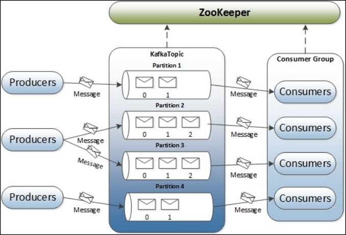

# Kafka

## 一、Kafka基础知识

### 1.1 为什么会有消息系统

1. ==**解耦**==

   允许你独立的扩展或修改两边的处理过程，只要确保它们遵守同样的接口约束。

2. ==**冗余**==

   消息队列把数据进行持久化直到它们已经被完全处理，通过这一方式规避了数据丢失风险。许多消息队列所采用的"插入-获取-删除"范式中，在把一个消息从队列中删除之前，需要你的处理系统明确的指出该消息已经被处理完毕，从而确保你的数据被安全的保存直到你使用完毕。

3. ==**扩展性**==

   因为消息队列解耦了你的处理过程，所以增大消息入队和处理的频率是很容易的，只要另外增加处理过程即可。

4. ==**灵活性 & 峰值处理能力**==

   在访问量剧增的情况下，应用仍然需要继续发挥作用，但是这样的突发流量并不常见。如果为以能处理这类峰值访问为标准来投入资源随时待命无疑是巨大的浪费。使用消息队列能够使关键组件顶住突发的访问压力，而不会因为突发的超负荷的请求而完全崩溃。

5. ==**可恢复性**==

   系统的一部分组件失效时，不会影响到整个系统。消息队列降低了进程间的耦合度，所以即使一个处理消息的进程挂掉，加入队列中的消息仍然可以在系统恢复后被处理。

6. ==**顺序保证**==

   在大多使用场景下，数据处理的顺序都很重要。大部分消息队列本来就是排序的，并且能保证数据会按照特定的顺序来处理。（Kafka 保证一个 Partition 内的消息的有序性）

7. ==**缓冲**==

   有助于控制和优化数据流经过系统的速度，解决生产消息和消费消息的处理速度不一致的情况。

8. ==**异步通信**==

   很多时候，用户不想也不需要立即处理消息。消息队列提供了异步处理机制，允许用户把一个消息放入队列，但并不立即处理它。想向队列中放入多少消息就放多少，然后在需要的时候再去处理它们。

### 1.2 kafka核心概念

* ==**Producer**==

  消息生产者，发布消息到 Kafka集群的终端或服务。

* ==**Broker**==

  Kafka集群包含的服务器

* ==**Topic**==

  每条发布到Kafka集群的消息属于的类别，即Kafka是面向topic的

* ==**partition**==

  partition是物理上的概念，每个Topic包含一个或者多个partition。Kafka分配的单位就是partition。

* ==**Consumer**==

  Kafka集群中的消费者

* ==**Consumer Group**==

  high-level consumer api中，每个Consumer都属于一个consumer greoup，每条消息只能被consumer group中的一个Consiume消费，但是可以被多个consumer group 消费

* ==**Replica**==

  partition的副本，保障了partition的高可用

* ==**Leader**==

  replica的一个角色，prodicer和consumer只能leader交互。

* ==**Follower**==

  replica的一个角色，从leader中复制数据

* ==**Controller**==

  **负责管理整个Kafka集群范围内的各种东西。**

  * Kafka集群中某个broker宕机之后，是谁负责感知到他的宕机，以及负责进行Leader Partition的选举？
  * 在Kafka集群里新加入了一些机器，此时谁来负责把集群里的数据进行负载均衡的迁移？
  * Kafka集群的各种元数据，比如说每台机器上有哪些partition，谁是leader，谁是follower，是谁来管理的？
  * 删除一个topic，那么背后的各种partition如何删除，是谁来控制？
  * Kafka集群扩容加入一个新的broker，是谁负责监听这个broker的加入？
  * 某个broker崩溃了，是谁负责监听这个broker崩溃？

* ==**Zookeeper**==

  1. Kafka 通过 zookeeper 来存储集群的 meta 信息。
  2. 一旦controller所在broker宕机了，此时临时节点消失，集群里其他broker会一直监听这个临时节点，发现临时节点消失了，就争抢再次创建临时节点，保证有一台新的broker会成为controller角色。

  