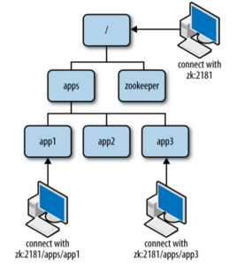
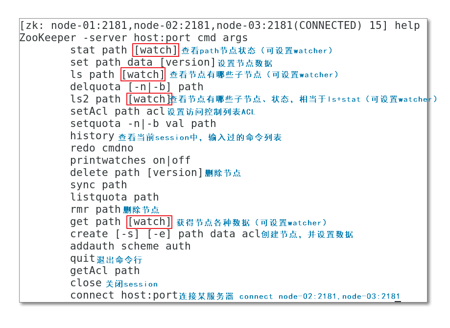
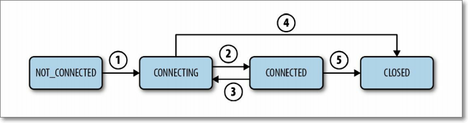
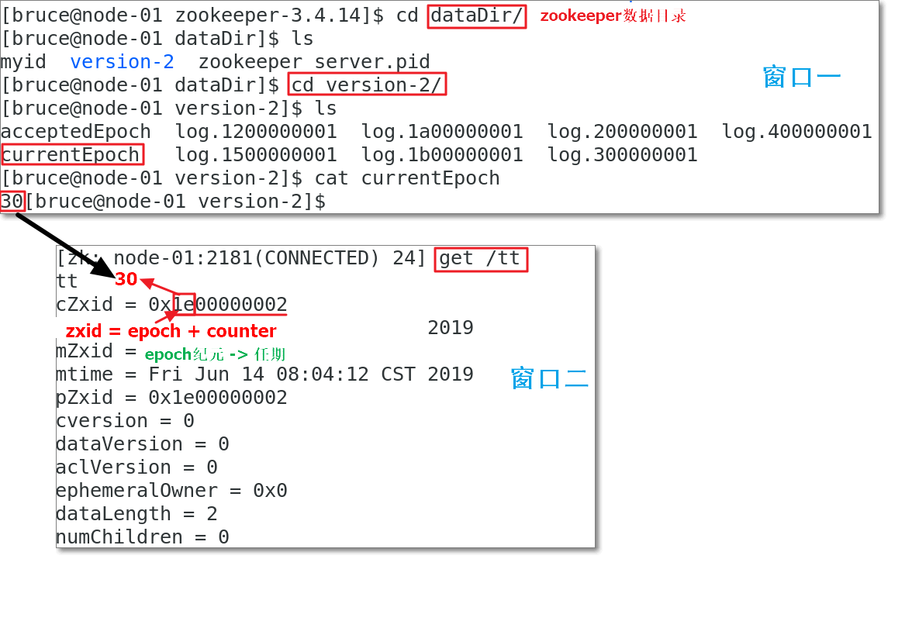
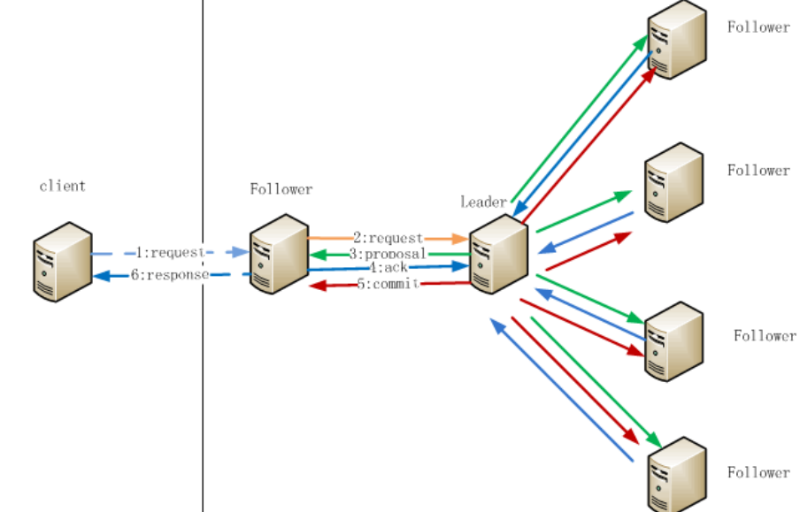
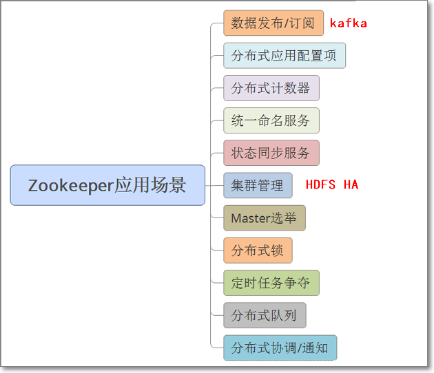

# Zookeeper

##  Zookeper

1. ZooKeeper简单易用，能够很好的解决分布式框架在运行中，出现的各种协调问题。比如集群master主备切换、节点的上下线感知等等。

2. ZooKeeper是一个分布式的，开放源码的，用于`分布式应用程序的协调服务`（service）；是Google的Chubby的一个开源实现版。
   

## Zookeeper 架构概览

### Zookeeper外部

1. ZooKeeper服务端有两种不同的运行模式。单机的称为"**独立模式**"(standalone mode)；集群的称为“**仲裁模式**(quorum mode)“

   

2. 主从架构：Master + Slave

3. leader在通知follower执行某条命令时，如何保障每个follower都收到，队列结构。

### Zookeeper内部

1. 四个状态
   1. looking：服务器处于寻找Leader群首的状态
   2. leading：服务器作为群首时的状态
   3. following：服务器作为follower跟随者时的状态
   4. observing：服务器作为观察者时的状态
2. leader选举分**两种情况**
   - ZAB协议
   - 集群初始启动时
   - 集群运行中leader挂了时
   - raft算法动图地址：http://thesecretlivesofdata.com/raft/#replication

## Zookeeper命令行操作

1. 启动、停止、状态

   ```bash
   zkServer.sh start/stop/status
   ```

2. 连接Zookeeper	
   ```bash
   zkCli.sh -server node1:2181,node2:2181,node3:2181
   ```

3. 连接后命令

   ```bash
   # 列出列表
   ls /
   #[zookeeper, zk_test]
   
   # 创建了一个新的znode 节点“ zk ”以及与它关联的字符串
   create /zk myData
   # Created /zk
   
   # 获取节点
   get /zk
   #myData
   #cZxid = 0x300000002  节点创建时的zxid.
   #ctime = Fri Jul 26 23:48:10 EDT 2019 节点创建时的时间戳.
   #mZxid = 0x300000002 节点最新一次更新发生时的zxid.
   #mtime = Fri Jul 26 23:48:10 EDT 2019 节点最新一次更新发生时的时间戳.
   #pZxid = 0x300000002 
   #cversion = 0  其子节点的更新次数.
   #dataVersion = 0  节点数据的更新次数.
   #aclVersion = 0 节点ACL(授权信息)的更新次数.
   #ephemeralOwner = 0x0  如果该节点为ephemeral节点, ephemeralOwner值表示与该节点绑定的session id. 如果该节点不是ephemeral节点, ephemeralOwner值为0. 
   #dataLength = 6 节点数据的字节数.
   #numChildren = 0 子节点个数.
   
   # 删除节点
   delete /zk
   # 
   
   # 创建有序节点
   create -s /zk_order 1
   # Created /zk_order0000000003
   
   get /zk_order0000000003
   #1
   #cZxid = 0x300000006
   #ctime = Fri Jul 26 23:58:10 EDT 2019
   #mZxid = 0x300000006
   #mtime = Fri Jul 26 23:58:10 EDT 2019
   #pZxid = 0x300000006
   #cversion = 0
   #dataVersion = 0
   #aclVersion = 0
   #ephemeralOwner = 0x0
   #dataLength = 1
   #numChildren = 0
   
   create -s /zk_order 2
   # Created /zk_order0000000004
   
   # 创建临时节点
   create -e /zk_tem 1
   #Created /zk_tem
   get /zk_tem        
   #1
   #cZxid = 0x300000008
   #ctime = Sat Jul 27 00:01:16 EDT 2019
   #mZxid = 0x300000008
   #mtime = Sat Jul 27 00:01:16 EDT 2019
   #pZxid = 0x300000008
   #cversion = 0
   #dataVersion = 0
   #aclVersion = 0
   #ephemeralOwner = 0x100071e8e970000 临时节点
   #dataLength = 1
   #numChildren = 0
   
   # quit在zkClient
   get /zk_tem 
   # Ctrl+C不会节点不会马上消失，需要过一段时间
   # 当你客户端会话失效后，所产生的节点也不是一下子就消失了，也要过一段时间，大概是 10 秒以内，可以试一下，本机操作生成节点，在服务器端用命令来查看当前的节点数目，你会发现客户端已经 stop，但是产生的节点还在
   
   # 临时有序节点
   create -e -s /zk_tem_order 1
   #Created /zk_tem_order0000000009
   ```

## Zookeeper特殊概念

### 数据节点

​	**ZooKeeper=简版文件系统(Znode)+原语+通知机制(Watcher)。**



### Watcher监视通知

客户端如何获取ZooKeeper服务器上的最新数据？

- **方式一**轮询：ZooKeeper以远程服务的方式，被客户端访问；客户端以轮询的方式获得znode数据，效率会比较低（代价比较大）

  

- **方式二**基于通知的机制：客户端在znode上注册一个Watcher监视器，当znode上数据出现变化，watcher监测到此变化，通知客户端

  
  
  监听事件




​	示例1:

```bash
#ls pat	h [watch]
#node-01 上执行
ls /zk_test watch

#node-02 上执行
create /zk_test/dir01 dir01-data

#node-01上
[zk: node-01:2181,node-02:2181,node-03:2181(CONNECTED) 87] 
WATCHER::
WatchedEvent state:SyncConnected type:NodeChildrenChanged path:/zk_test
```
​	示例2：

```bash
# node1
get /zk_test watch

# node2
set /zk_test zk_test_new

# node1
WATCHER::
WatchedEvent state:SyncConnected type:NodeDataChanged path:/zk_test
```

​	上下线感知

1. 原理
   1. 节点1（client1）创建临时节点
   2. 节点2（client2）在临时节点，注册监听器watcher
   3. 当client1与zk集群断开连接，临时节点会被删除
   4. watcher发送消息，通知client2，临时节点被删除的事件
2. 用到的zk特性：
   
   1. Watcher+临时节点
3. 好处
   
   1. 通过这种方式，检测和被检测系统不需要直接关联（如client1与client2），而是通过ZK上的某个节点进行关联，大大减少了系统**耦合**。
4. 实现
    1. client1操作

       ```shell
       # 创建临时节点
       create -e /zk_tmp tmp-data
       ```

    2. client2操作

       ```shell
       # 在/zk_tmp注册监听器
       ls /zk_tmp watch
       ```

    3. client1操作

       ```shell
       # 模拟节点下线
       close
       ```

    4. 观察client2

       ```shell
       WATCHER::
       WatchedEvent state:SyncConnected type:NodeDeleted path:/zk_tmp
       ```

### 会话Session


1. 长连接：客户端与某一服务器建立TCP长连接，建立一个会话Session。

2. 特点

   1. 客户端打开一个Session中的请求以FIFO（先进先出）的顺序执行；
   2. 若打开两个Session，无法保证Session间，请求FIFO执行

3. 会话的生命周期

   

   1. Session从NOT_CONNECTED状态开始，并随着Zookeeper客户端初始化，转移到CONNECTING状态。
   2. 正常情况下，客户端会与Zookeeper服务器连接成功，并且转移到CONNECTED状态。
   3. 当客户端失去了与ZooKeeper服务器的连接或者不能听到服务器，它会转移回CONNECTING
   4. 并且尝试寻找另一个ZooKeeper服务器。如果它能找到另一个服务器或者重新连接到之前的服务器，并确认了这个Session仍然有效，它会转移回CONNECTED状态。否则，它会定义这个Session失效，并转移到CLOSED
   5. 应用可以显示关闭Session。

### 请求

读写请求


### 事务zxid(ZooKeeper Transaction Id)

增删改的操作，会形成一次事务。

ACID：原子性atomicity | 一致性consistency | 隔离性isolation | 持久性durability

每个事务有一个全局唯一的事务ID，用 ZXID 表示，全局有序。

ZXID通常是一个64位的数字。由**epoch（32位）+counter（32位）**组成



epoch：leader周期的epoch编号

counter：事务编号

### Zookeeper工作原理



1. 在Client向Follwer发出一个写的请求
2. Follwer把请求发送给Leader
3. Leader接收到以后开始发起投票并通知Follwer进行投票
4. Follwer把投票结果发送给Leader
5. Leader将结果汇总后如果需要写入，则开始写入同时把写入操作通知给Follwer，然后commit
6. Follwer把请求结果返回给Client

###  ZooKeeper状态同步

完成leader选举后，zk就进入ZooKeeper之间状态同步过程

1. leader等待server连接；
2. Follower连接leader，将最大的zxid发送给leader；
3. Leader根据follower的zxid确定同步点；
4. 完成同步后通知follower 已经成为uptodate状态；
5. Follower收到uptodate消息后，又可以重新接受client的请求进行服务了。


## 应用场景

1. NameNode使用ZooKeeper实现高可用.
2. Yarn ResourceManager使用ZooKeeper实现高可用.
3. 利用ZooKeeper对HBase集群做高可用配置
4. kafka使用ZooKeeper
   - 保存消息消费信息比如offset.
   - 用于检测崩溃
   - 主题topic发现
   - 保持主题的生产和消费状态

