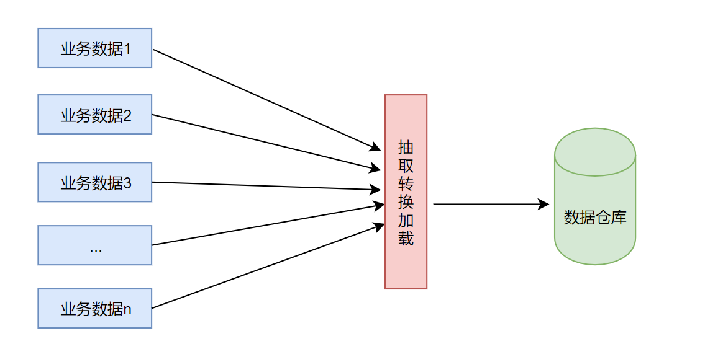
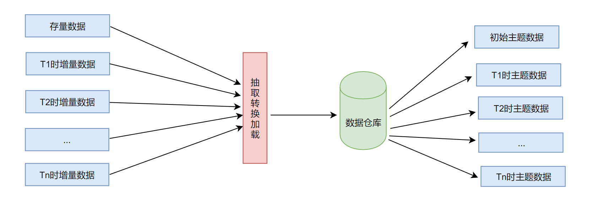
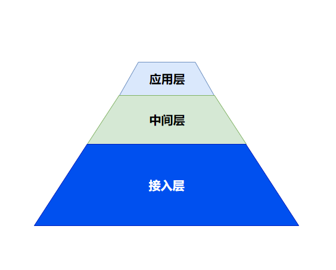
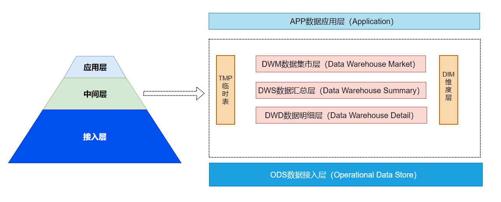
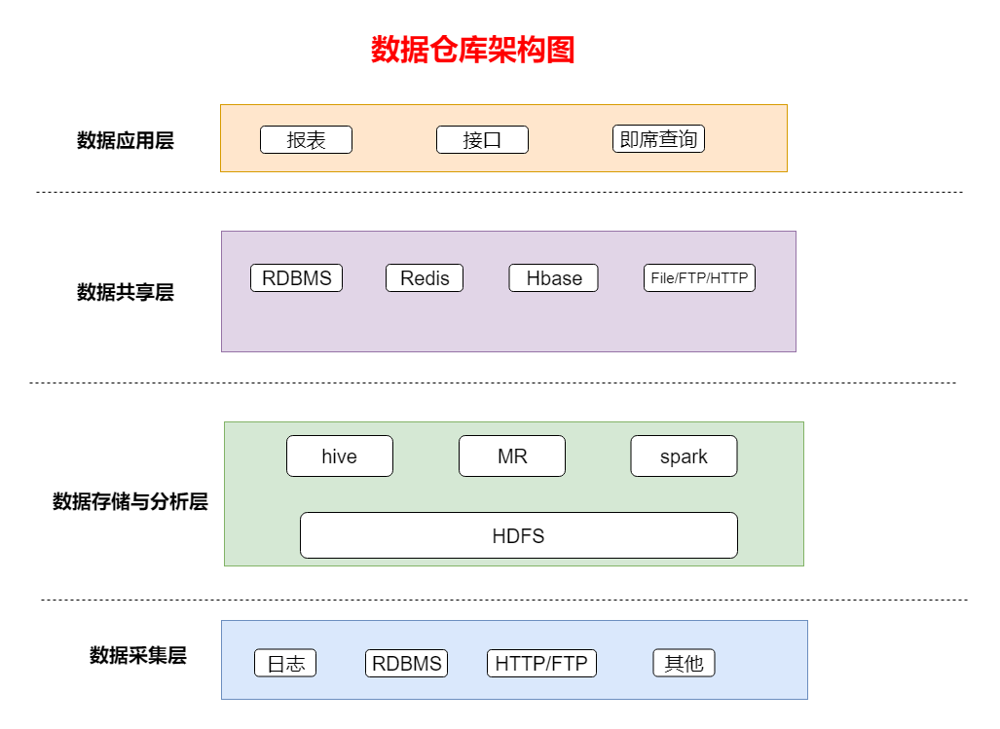
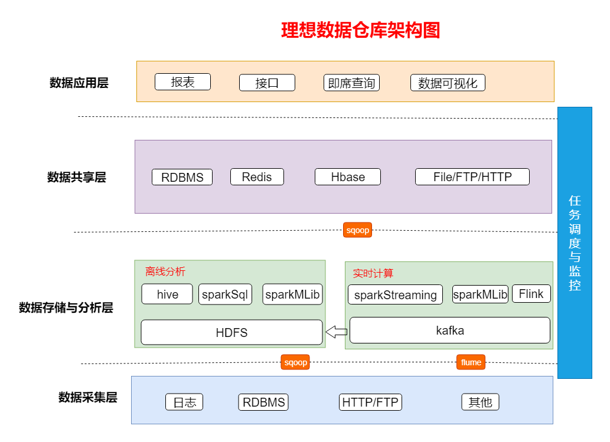

# 数据仓库

##  一、数据仓库介绍

英文名称为`Data Warehouse` ，简写为DW。数据仓库的目的是`构建面向分析的集成化数据环境`，为企业提供`决策支持`（Decision Support）。它处于分析性报告和决策支持目的而常见。

数据仓库本身并不“生产”任何数据，同时自身也不需要“消费”任何的数据，数据来源于外部，并且开放给外部应用，这也是为什么叫“仓库”，而不叫“工厂”的原因。

## 二、数据仓库的定义

四个特性：`面向主题`、`集成`、`稳定`、`时变`

### 1. 面向主题

数据仓库中的数据是按照一定的主题域进行组织。

主题是一个抽象的概念，是指用户使用数据仓库进行决策时所关心的重点方面，一个主题通常与多个操作型信息系统相关。

### 2. 继承性

根据决策分析的要求，将分散于各处的源数据进行抽取、筛选、清理、综合（ETL ）等工作，最终集成到数据仓库中。



### 3. 稳定性

数据的相对稳定性，数据仓库中的数据只进行新增，没有更新操作、删除操作处理。

反映历史变化，以查询分析为主。

### 4. 时变性

数据仓库的数据一般都带有时间属性，随着时间的推移而发生变化，不断地生成主题的新快照。



## 三、数据仓库与数据库的区别

数据库与数据仓库的区别实际讲的是 OLTP 与 OLAP 的区别。

**OLTP**： On-Line Transaction Processing  叫**联机事务处理**， 也可以称面向交易的处理系统，它是针对具体业务在数据库联机的日常操作，通常对少数记录进行查询、修改。用户较为关心操作的响应时间、数据的安全性、完整性和并发支持的用户数等问题。传统的数据库系统作为数据管理的主要手段，主要用于操作型处理 .

 **OLAP**：On-Line Analytical Processing  叫**联机分析处理**，一般针对某些主题的历史数据进行分析，支持管理决策。

简而言之，==数据库是面向事务的设计，数据仓库是面向主题设计的==。 

数据库一般存储在线交易数据，有很高的事务要求；数据仓库存储的一般是历史数据。 

数据库设计是尽量避免冗余，一般采用符合范式的规则来设计，数据仓库在设计是有意引入冗余，采用反范式的方式来设计。 

数据库是**为捕获数据而设计**，数据仓库是**为分析数据而设计**，它的两个基本的元素是维表和事实表。维是看问题的角度，比如时间，部门，维表放的就是这些东西的定义，事实表里放着要查询的数据，同时有维的ID。

| **功能** | **数据仓库**                           | **数据库**                             |
| -------- | -------------------------------------- | -------------------------------------- |
| 数据范围 | 存储历史的、完整的、反应历史变化的     | 当前状态数据                           |
| 数据变化 | 可添加、无删除、无变更的、反应历史变化 | 支持频繁的增、删、改、查操作           |
| 应用场景 | 面向分析、支持战略决策                 | 面向业务交易流程                       |
| 设计理论 | 违范式、适当冗余                       | 遵照范式(第一、二、三等范式)、避免冗余 |
| 处理量   | 非频繁、大批量、高吞吐、有延迟         | 频繁、小批次、高并发、低延迟           |

## 四、构建数据仓库常用手段

• 传统数仓建设更多的基于成熟的商业数据集成平台，比如Teradata、Oracle、Informatica等，技术体系比较成熟完善，但相对比较封闭，对实施者技术面要求也相对专业且单一，一般更多应用于银行、保险、电信等“有钱”行业.

• 基于大数据的数仓建设一般是基于非商业、开源的技术，常见的是基于hadoop生态构建，涉及技术较广泛、复杂，同时相对于商业产品，稳定性、服务支撑较弱，需要自己维护更多的技术框架。在大数据领域，==常用的数据仓库构建手段很多基于hive，sparkSQL，impala等各种技术框架==.

## 五、数据仓库分层

### 1. 概念

- 数据仓库更多代表的是一种对数据的管理和使用的方式，它是一整套包括了etl、调度、建模在内的完整的理论体系。现在所谓的大数据更多的是一种数据量级的增大和工具的上的更新。 两者并无冲突，相反，而是一种更好的结合。数据仓库在构建过程中通常都需要进行分层处理。业务不同，分层的技术处理手段也不同。

- 分层是数据仓库解决方案中，数据架构设计的一种数据逻辑结构 ，通过分层理念建立的数据仓库，它的可扩展性非常好，这样设计出来的模型架构，可以任意地增减、替换数据仓库中的各个组成部分。

  

  从整体的逻辑划分来讲，数据仓库模型实际上就是这三层架构。

  1. 接入层：底层的数据源或者是操作数据层，一般在公司的话，统一都是称为ODS层

  2. 中间层：是做数据仓库同学需要花费更多精力的一层，这一层包括的内容是最多的、最复杂的。

  3. 应用层：对不同的应用提供对应的数据。该层主要是提供数据产品和数据分析使用的数据，比如我们经常说的报表数据

- 这三层架构之上，有以下具体的划分：

  

  * ODS：原始数据
  * DWD：它主要是针对于接入层的数据进行数据的清洗和转换。还有就是一些维度的补充
  * DWS：按照一定的粒度进行了汇总聚合操作。它是单业务场景
  * DWM：在DWS数据汇总层之上，集市层它是多业务场景的
  * APP：数据仓库的最后一层数据，为应用层数据，直接可以给业务人员使用
  * TMP临时表：在做一些中间层表计算的时候，大量使用tmp临时表。
    DIM维度层：基于ODS层和DWD层抽象出一些公共的维度，典型的公共维度主要包括城市信息、渠道信息、个人基础属性信息。

## 六、数据仓库建模

主要介绍**范式建模法** 、**维度建模法**、**实体建模法**；

### 1. 范式建模法

范式建模法是基于整个关系型数据库的理论基础之上发展而来的，其实是我们在构建数据模型常用的一个方法，主要解决关系型数据库得数据存储，利用的一种技术层面上的方法。目前，我们在关系型数据库中的建模方法，大部分采用的是三范式建模法。

从其表达的含义来看，一个符合第三范式的关系必须具有以下三个条件 :

（1）每个属性值唯一，不具有多义性 ;
（2）每个非主属性必须完全依赖于整个主键，而非主键的一部分 ;
（3）每个非主属性不能依赖于其他关系中的属性，因为这样的话，这种属性应该归到其他关系中去。

### 2. 维度建模法

维度建模(dimensional modeling)是专门用于分析型数据库、数据仓库、数据集市建模的方法。维度建模法简单描述就是按照事实表、维度表来构建数仓、集市。
维度建模从分析决策的需求出发构建模型，为分析需求服务，因此它重点关注用户如何更快速地完成需求分析，同时具有较好的大规模复杂查询的相应性能。

* 维度表

```
维度表示你要对数据进行分析时所用的一个量,比如你要分析产品销售情况, 
你可以选择按类别来进行分析,或按区域来分析。

通常来说维度表信息比较固定，且数据量小。
```

* 事实表

```表示对分析主题的度量。
事实表包含了与各维度表相关联的外键，并通过join方式与维度表关联。事实表的度量通常是数值类型，且记录数会不断增加，表规模迅速增长。

消费事实表：Prod_id(引用商品维度表), TimeKey(引用时间维度表), Place_id(引用地点维度表), Unit(销售量)。
```


总的说来，在数据仓库中不需要严格遵守规范化设计原则。因为数据仓库的主导功能就是面向分析，以查询为主，不涉及数据更新操作。事实表的设计是以能够正确记录历史信息为准则，维度表的设计是以能够以合适的角度来聚合主题内容为准则。

三个维度建模模型

1. 星型模式
2. 雪花模式
3. 星座模式

### 3. 实体建模法

```
实体建模法并不是数据仓库建模中常见的一个方法，它来源于哲学的一个流派。

从哲学的意义上说，客观世界应该是可以细分的，客观世界应该可以分成由一个个实体，以及实体与实体之间的关系组成。

那么我们在数据仓库的建模过程中完全可以引入这个抽象的方法，将整个业务也可以划分成一个个的实体，而每个实体之间的关系，以及针对这些关系的说明就是我们数据建模需要做的工作。
```

参考文档：<http://www.uml.org.cn/sjjmck/201810163.asp>

## 七、数据仓库架构



