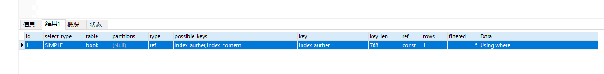

今天面试涉及到mysql索引优化问题，回答得不是很好，写个专题记录以下。同时作为复习。

### 

创建表：

```sql
SET FOREIGN_KEY_CHECKS=0;

-- ----------------------------
-- Table structure for book
-- ----------------------------
DROP TABLE IF EXISTS `book`;
CREATE TABLE `book` (
  `book_id` bigint(20) NOT NULL AUTO_INCREMENT,
  `book_name` varchar(255) COLLATE utf8_bin DEFAULT NULL,
  `book_auther` varchar(255) COLLATE utf8_bin DEFAULT NULL,
  `book_content` varchar(255) COLLATE utf8_bin DEFAULT NULL,
  `book_create_date` datetime DEFAULT NULL,
  `book_type` varchar(255) COLLATE utf8_bin DEFAULT NULL,
  PRIMARY KEY (`book_id`)
) ENGINE=InnoDB AUTO_INCREMENT=5745294 DEFAULT CHARSET=utf8 COLLATE=utf8_bin;
```

先使用java写了几个单元，调用多线程插入万级数量，后通过sql语句批量升级。

```sql
INSERT INTO book (
	book_name,
	book_auther,
	book_content,
	book_create_date,
	book_type
)
SELECT
	book_name,
	book_auther,
	book_content,
	book_create_date,
	book_type
from book;
```

最终形成1400万条记录。

这里先讲一下索引类型：

- 单列缩影
  - 普通索引：最普通
  - 唯一索引：唯一，可为空
  - 主键索引：唯一，不可为空
- 组合索引：为了更多的提高mysql效率可建立组合索引，遵循”最左前缀“原则。创建复合索引时应该将最常用（频率）作限制条件的列放在最左边，依次递减。
- 全文索引：仅可用于 MyISAM 表，针对较大的数据，生成全文索引很耗时好空间。

|索引类型|特点
| ------   | -----
|PRIMARY KEY（主键索引）|ALTER TABLE table_name ADD PRIMARY KEY ( col )
|UNIQUE(唯一索引)|ALTER TABLE table_name ADD UNIQUE index_name(col)
|INDEX(普通索引)|ALTER TABLE table_name ADD INDEX index_name (col)
|FULLTEXT(全文索引)|ALTER TABLE table_name ADD FULLTEXT ( col )
|组合索引|ALTER TABLE table_name ADD INDEX index_name (col1, col2, col3 )


创建索引的另一种方法

CREATE INDEX index_name ON table_name(cloumn_name);

删除索引

ALTER TABLE table_name DROP INDEX index_name;

DROP INDEX index_name ON table_name;

**EXPLAIN关键字，用来查看索引是否正在被使用，并且输出其使用的索引的信息。**


id:SELECT识别符。这是SELECT的查询序列号,也就是一条语句中，该select是第几次出现。在次语句中，select就只有一个，所以是1.

select_type:所使用的SELECT查询类型，SIMPLE表示为简单的SELECT，不实用UNION或子查询，就为简单的SELECT。也就是说在该SELECT查询时会使用索引。其他取值，PRIMARY：最外面的SELECT.在拥有子查询时，就会出现两个以上的SELECT。UNION：union(两张表连接)中的第二个或后面的select语句  SUBQUERY：在子查询中，第二SELECT。

table：数据表的名字。他们按被读取的先后顺序排列，这里因为只查询一张表，所以只显示book

type：consts：单表中最多只有一个匹配行（主键或者唯一索引），在优化阶段即可读取到数据。ref：使用普通的索引（Normal Index）。range：对索引进行范围检索。当 type=index 时，索引物理文件全扫，速度非常慢。

possible_keys：MySQL在搜索数据记录时可以选用的各个索引，该表中就只有一个索引，

key：实际选用的索引

key_len：显示了mysql使用索引的长度(也就是使用的索引个数)，当 key 字段的值为 null时，索引的长度就是 null。注意，key_len的值可以告诉你在联合索引中mysql会真正使用了哪些索引。这里就使用了1个索引，所以为1，

ref:给出关联关系中另一个数据表中数据列的名字。常量（const），这里使用的是1990，就是常量。

rows：MySQL在执行这个查询时预计会从这个数据表里读出的数据行的个数。

extra：提供了与关联操作有关的信息，没有则什么都不写。　　　
  

使用普通索引前
```sql
select * from book where book_name = 'auther22'

受影响的行: 0
时间: 8.865s
```


使用普通索引后
```sql
select * from book where book_auther = 'auther22'

受影响的行: 0
时间: 0.001s
```

唯一索引、主键索引与普通索引类似，但是较多限制，注意创建语句


组合索引

ALTER TABLE table_name ADD INDEX index_name (col1, col2, col3 )

**最左前缀**

针对这里由col1,col2,col3个字段构成的索引，索引行中就按col1/col2/col3的顺序存放，索引可以索引下面字段组合(col1,col2,col3)、(col1,col2)或者(col1)。如果要查询的字段不构成索引最左面的前缀，那么就不会是用索引，比如，col2或者（col2,col3）组合就不会使用索引查询。


### 查看索引

```sql
　SHOW INDEX FROM TABLE
```
