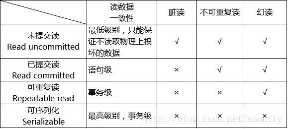
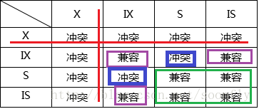

# mysql 锁机制

**表级锁**：开销小，加锁快；不会出现死锁；锁定粒度大，发生锁冲突的概率最高，并发度最低。

**行级锁**：开销大，加锁慢；会出现死锁；锁定粒度最小，发生锁冲突的概率最低，并发度也最高。

**页面锁**：开销和加锁时间界于表锁和行锁之间；会出现死锁；锁定粒度界于表锁和行锁之间，并发度一般 


## MyISAM


```sql
CREATE TABLE `my_user` (
  `id` bigint(20) NOT NULL AUTO_INCREMENT,
  `name` varchar(255) COLLATE utf8_bin DEFAULT NULL,
  `age` int(11) DEFAULT NULL,
  `birthday` datetime DEFAULT NULL,
  `address` varchar(255) COLLATE utf8_bin DEFAULT NULL,
  PRIMARY KEY (`id`)
) ENGINE=MyISAM DEFAULT CHARSET=utf8 COLLATE=utf8_bin;
```
MyISAM：表共享读锁（Table Read Lock）和表独占写锁（Table Write Lock）。 

对MyISAM表的和和写都是保证了锁的，数据都是准确的，比如说：A读不影响B读，但是会影响B写、A写影响B读和写。这是针对一个线程作为一个执行单位。


读锁：B读可执行，B写只有在unlock之后才能写
```sql
lock table my_user read

select * from my_user

unlock tables;

```


写锁：B读和写只有在unlock之后才能执行
```sql
lock table my_user write 

select * from my_user

unlock tables;

```
1.上述锁只针对lock锁的表，MyISAM会针对加锁，这里的sql只是为了演示。

2.另外，加了读锁，只能执行执行查询，不能执行过更新操作。

3.MyISAM总是一次获取sql语句的全部锁。

4.加锁之后，无法执行对未加锁的表的操作。即使是别名的表。如果要用别名，必须对表加锁也要使用别名

```sql
lock table actor as a read,actor as b read;
```

5.查询表级锁竞争情况，如果出现Table_locks_waited的值比较高的情况下，说明存在比较严重的表级锁竞争的情况。
```sql
show status like 'table%';
```


6.并发插入
读与写并行,concurrent_insert，专门用以控制并发插入的行为，其值可以为0，1，2；
- 当为0时，不允许并发插入；
- 当为1时，如果表中没有空洞(即表中间没有被删除行)，允许A读的同时，B在表尾插入。这也是mysql的默认配置；
- 当为2时，无论有没有空洞，都允许在表尾并发插入记录。

这里简单描述以下并发插入。
A加入读锁 LOCAL锁定 允许并发插入；
```sql
lock table my_user read local;
```
这时候A和B都不会对select加锁，但是执行更新的时候却不同。A无法插入成功，因为加了READ锁，所以无法操作。B可以插入成功，因为并发插入机制，所以可以插入。

这里额外有两点内容，插入之后，再执行select，B可以看到新插入的一条，而A却不行。对表进行删除一行后（形成空洞），就无法并发插入，修改concurrent_insert
```sql
SHOW GLOBAL VARIABLES LIKE '%concurrent_insert%';

SET GLOBAL concurrent_insert = 2;
```
一个写进程和一个读进程同时访问时、或是一个读在等待，一个写进程加入，都是会写先执行。这里理解为mysql认为写比读重要。这也是MyISAM不适合大量更新和查询的原因，不然的话，查询可能很难获取到锁，导致阻塞。可以通过设置调整MyISAM的调度行为。但是不管怎样，都会有一个锁机制存在，一个执行慢会导致其他进程卡死。


# InnoDB

```sql
CREATE TABLE `in_user` (
  `id` bigint(20) NOT NULL AUTO_INCREMENT,
  `name` varchar(255) CHARACTER SET utf8 COLLATE utf8_bin DEFAULT NULL,
  `age` int(11) DEFAULT NULL,
  `birthday` datetime DEFAULT NULL,
  `address` varchar(255) CHARACTER SET utf8 COLLATE utf8_bin DEFAULT NULL,
  PRIMARY KEY (`id`)
) ENGINE=InnoDB DEFAULT CHARSET=utf8 COLLATE=utf8_bin;
```


innnoDB最大的不同有两点：一是事务支持，二是行级锁。

1. 事务的四大属性，ACID;

2. 并发带来的问题：
 - 第一类更新丢失：A、B事务执行更新某一行，B务获取到了第一次更新结果，突然A发生回滚，把B事务也回滚了。
 - 脏读：A事务正在修改某一行，提交之前，B事务也读取这条这一行记录，B就会读取脏数据。
 - 不可重复读：A事务读取老数据，B事务更新数据并提交了事务，导致A再读数据就不一致。
 - 第二类更新丢失：多个事务执行某一行，最后的更新会覆盖之前的更新，导致前面的更新失败。
  - 幻读：两个事务独立查询的异常，A事务查询共有10条，B事务新增一条，此时两个事务独立执行，会导致幻读。

3. 事务隔离级别：

  第一类更新丢失和第二类更新丢失是存在写入问题，才会导致问题。所以这类问题应该由程序来解决，而不是数据库。

  藏读，不可重读，幻读这几类问题是出现在读上，都是数据一致性的问题，这类问题就可以有数据库的事务隔离级别来处理。有两种方案
 - 读数据加锁，避免其他数据修改；
 - 不加锁，针对某个实际按点生成一个数据快照，通过一定机制来实现某个程度上的一致性。这就是（MultiVersion Concurrentcy Control，简称MVCC 或MCC），也称多版本数据库

 4. MVCC

 可分为两种，快照读与当前读。
  - 快照读，读取记录的可见版本，也可能是历史版本，不加锁
    - 简单的select 语句：
    ```sql
    select * from table where ?; 
    ```
  - 当前读，读取最新版本，当前发返回的记录，都会加上锁，保证其他事务不会在并发修改这条记录。
    - 特殊的读操作，非查询操作，属于当前读，需要加锁。下面的语句都属于当前读，读取记录的最新版本。并且，读取之后，还需要保证其他并发事务不能修改当前记录，对读取记录加锁。其中，第一条语句，对都记录加S锁（共享锁）外，其他，都是加的X锁（排他锁）。
    ```sql
    select * from table where ? lock in share mode;
    select * from table where ? for update;
    insert into table values (…);
    update table set ? where ?;
    delete from table where ?;
    ``` 

5. 数据库的事务隔离越严格，并发副作用就越小，但是付出的代价就越大。因为事务隔壁本身就是让事务在一定程度上“串行”，但是这与“并发”矛盾。不同的业务，对数据的一致性与事务隔离程度要求不同，可以牺牲小部分的数据异常，保证并发能力。

6. 下图是隔离级别与并发的矛盾图：

    

7. 检查InnoDB行锁争用情况
    ```sql
    show status like 'innodb_row_lock%';
    ```

8. InnoDB的行锁模式与加锁方法
 - **共享锁(S):又称读锁**。允许一个事务去读一行，阻止其他事务获取相同数据集的排他锁。若事务T对数据对象A加上S锁，则事务T可以读A但不能修改A，其他事务只能在对A加上S锁，不能加X锁，直到T释放S锁，这保证了其他事务可以读A,但在T释放A上的S锁时，不会对A做任何修改。
  - **排他锁(X):又称写锁**。允许获取排他锁的事务更新数据，阻止其他事务取得相同数据集共享读写锁和排他写锁。若事务T对数据对象A加上X锁，事务A可以读A也可以修改A，其他事务不能对A加上任何锁，直到T释放在A上的锁。
  - 共享锁可以理解为多个事务只能去读数据不能改数据；而排他锁，是加了排他锁之后，其他事务不能在加任何锁。mysql的InnoDB默认修改（update，insert，delete）会自动加排他锁，而select不会加任务锁，如果非要加锁，则要根据前面提到的加。
9. 排他锁和共享锁都是行锁，InnoDB额外有个一个**意向锁**，意向锁都是表锁。
 - 意向共享锁（IS）；
 - 意向排他锁（IX）；
 - 排他锁与任意锁冲突（红色）；
 - 共享锁互不冲突 。(绿色)
 - 意向锁相互兼容，因为IX、IS申请的是更低级别的X、S操作。（紫色）
 - S与X护卫冲突。（蓝色）
 

 
10. 事务可以通过以下语句显式给记录集加共享锁或排他锁：
 - 共享锁（S）：SELECT * FROM table_name WHERE ... LOCK IN SHARE MODE。
 - 排他锁（X）：SELECT * FROM table_name WHERE ... FOR UPDATE。

11. 锁的实现
 
    设置自动提交关闭
    ```sql
    set autocommit = 1;
    ```
    查询（排他锁）
    ```sql
    A事务执行
    select * from in_user where name='name1' for update
    B事务执行会有锁等待
    select * from in_user where name='name2' for update
    ```

    这里额外注意一点，没有索引的情况下，InnoDB使用的是表锁。有索引才会使用行锁。这里可以看出，行锁是针对索引加的，而不是记录。
    ```sql
    A事务执行
    select * from in_user where id = 1 for update;
    B事务执行，不会有锁等待
    select * from in_user where id = 2 for update;
    B事务执行，会有锁等待
    select * from in_user where id = 1 for update;
    ```
12. 只要查询条件中没有使用索引，就必须要等待锁释放，这也很好理解为锁是针对索引上的了。

13. 间隙锁
    当我们使用范围条件而不是相等条件检索数据时，并请求共享或排他锁是，innoDB会给符合的数据加锁，给其他的数据在条件范围内但是不存在的记录，加上一个间隙锁。这样可以通过一个例子查看：

    ```sql 
    A事务执行
    select * from in_user where id > 4 for update;
    B事务执行，需等待
    INSERT INTO `demo`.`in_user` (`name`, `age`, `birthday`, `address`) VALUES ('name', '10', '2019-03-20 20:37:04', 'hangzhou');
    ```
    这样避免了之前提到的幻读，但是也存在可能性堵塞，所以，尽量业务逻辑上避免该类查询。