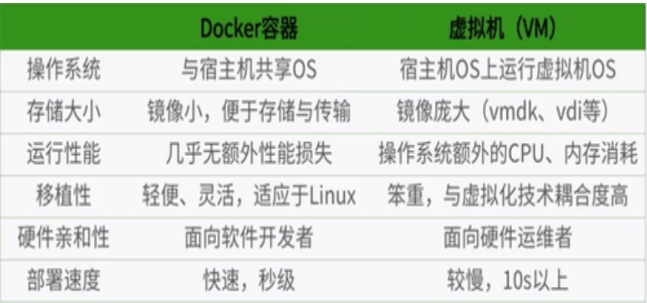

# Docker

## 一、Docker简介

### 1.1 Docker是什么

* 解决了运行环境和配置环境问题软件容器，方便做持续集成并有助于整体发布的容器虚拟化技术。
* ==理念：一次封装，多处运行==

* 解决了运行环境和配置问题软件容器，方便做持续集成并有助于整体发布的容器虚拟化技术。

### 1.2 Docker 能干嘛

* 传统的虚拟机：可以在一种操作系统里面运行另一种完整的操作系统
* 容器虚拟化技术：有了容器，就可以将软件运行所需的所有资源打包到一个隔离的容器中。容器内的应用进程直接运行于宿主的内核，容器内没有自己的内核，而且也没有进行硬件虚拟。
* 开发与运维：一次构建、随处运行
  1. 更快速的应用交付和部署
  2. 更便捷的升级和扩缩容
  3. 更简单的系统运维
  4. 更高效的计算资源利用

## 二、Docker 的安装

### 2.1 Docker架构图


### 2.2 Docker安装

见官网：[https://www.docker.com](https://www.docker.com/)

后续开发会以centOS7以上基础开发。

### 2.3 相关配置

1. 阿里巴巴镜像加速：https://cr.console.aliyun.com/cn-hangzhou/instances/mirrors

### 2.4 底层原理

1. Docker是如何工作的

   ​	Docker是一个Client-Server结构的系统，Docker守护进程运行在主机上， 然后通过Socket连接从客户端访问，守护进程从客户端接受命令并管理运行在主机上的容器。 容器，是一个运行时环境，就是我们前面说到的集装箱。

   

2. 为什么Docker比较比VM快

   1. docker有着比虚拟机更少的抽象层。由亍docker不需要Hypervisor实现硬件资源虚拟化,运行在docker容器上的程序直接使用的都是实际物理机的硬件资源。因此在CPU、内存利用率上docker将会在效率上有明显优势。
   2. docker利用的是宿主机的内核,而不需要Guest OS。因此,当新建一个容器时,docker不需要和虚拟机一样重新加载一个操作系统内核。仍而避免引寻、加载操作系统内核返个比较费时费资源的过程,当新建一个虚拟机时,虚拟机软件需要加载Guest OS,返个新建过程是分钟级别的。而docker由于直接利用宿主机的操作系统,则省略了返个过程,因此新建一个docker容器只需要几秒钟。

    

    

## 三、 Docker常用命令

### 3.1 帮助命令

```bash
docker version
docker info
docker --help
```

### 3.2 镜像命令

1. docker images

   列出可本地主机的镜像

   -a :列出本地所有的镜像（含中间映像层）

   -q :只显示镜像ID。

   --digests :显示镜像的摘要信息

   --no-trunc :显示完整的镜像信息

2. dockers search 某个XXX镜像名字

   查询仓库中镜像

   --no-trunc : 显示完整的镜像描述

   -s : 列出收藏数不小于指定值的镜像。

   --automated : 只列出 automated build类型的镜像；

3. docker pull 某个XXX镜像名字

   下载镜像

4. docker rmi 某个XXX镜像名字ID

   删除镜像

   删除单个	docker rmi  -f 镜像ID 

   删除多个	docker rmi -f 镜像名1:TAG 镜像名2:TAG 

   删除全部	docker rmi -f $(docker images -qa)

### 3.3 容器命令

1. 新建并启动容器

   ```bash
   docker run [OPTIONS] IMAGE [COMMAND] [ARG...]
    OPTIONS说明（常用）：有些是一个减号，有些是两个减号
    
    
   OPTIONS说明（常用）：有些是一个减号，有些是两个减号
   
   --name="容器新名字": 为容器指定一个名称；
   -d: 后台运行容器，并返回容器ID，也即启动守护式容器；
   -i：以交互模式运行容器，通常与 -t 同时使用；
   -t：为容器重新分配一个伪输入终端，通常与 -i 同时使用；
   -P: 随机端口映射；
   -p: 指定端口映射，有以下四种格式
         ip:hostPort:containerPort
         ip::containerPort
         hostPort:containerPort
         containerPort
   
   #使用镜像centos:latest以交互模式启动一个容器,在容器内执行/bin/bash命令。
   docker run -it centos /bin/bash 
   ```

2. 列出正在运行的容器

   ```bash
   docker ps [OPTIONS]
   OPTIONS说明（常用）：
    
   -a :列出当前所有正在运行的容器+历史上运行过的
   -l :显示最近创建的容器。
   -n：显示最近n个创建的容器。
   -q :静默模式，只显示容器编号。
   --no-trunc :不截断输出。
   ```

3. 退出容器

   ```bash
   exit 容器停止退出
   ctrl+P+Q 容器不停止退出
   ```

4. 容器操作

   ```
   # 启动容器
   docker start 容器ID或者容器名
   # 重启容器
   docker restart 容器ID或者容器名
   # 停止容器
   docker stop 容器ID或者容器名
   # 强制停止容器
   docker kill 容器ID或者容器名
   # 删除已停止的容器
   docker rm 容器ID
   # 删除多个
   docker rm -f $(docker ps -a -q)
   docker ps -a -q | xargs docker rm
   ```

5. 附加操作

   ```bash
   # 查看容器日志
   docker logs -f -t --tail 容器ID
   # 查看容器内运行的进程
   docker top 容器ID
   # 查看容器内部细节
   docker inspect 容器ID
   # 进入正在运行的容器并以命令行交互
   docker exec -it 容器ID /bin/bash # 是在容器中打开新的终端，并且可以启动新的进程
   docker attach 容器ID # 直接进入容器启动命令的终端，不会启动新的进程
   # 从容器内拷贝文件到主机上
   docker cp  容器ID:容器内路径 目的主机路径
   
   ```

6. 命令图

   

   ```bash
   attach    Attach to a running container                 # 当前 shell 下 attach 连接指定运行镜像
   build     Build an image from a Dockerfile              # 通过 Dockerfile 定制镜像
   commit    Create a new image from a container changes   # 提交当前容器为新的镜像
   cp        Copy files/folders from the containers filesystem to the host path   #从容器中拷贝指定文件或者目录到宿主机中
   create    Create a new container                        # 创建一个新的容器，同 run，但不启动容器
   diff      Inspect changes on a container's filesystem   # 查看 docker 容器变化
   events    Get real time events from the server          # 从 docker 服务获取容器实时事件
   exec      Run a command in an existing container        # 在已存在的容器上运行命令
   export    Stream the contents of a container as a tar archive   # 导出容器的内容流作为一个 tar 归档文件[对应 import ]
   history   Show the history of an image                  # 展示一个镜像形成历史
   images    List images                                   # 列出系统当前镜像
   import    Create a new filesystem image from the contents of a tarball # 从tar包中的内容创建一个新的文件系统映像[对应export]
   info      Display system-wide information               # 显示系统相关信息
   inspect   Return low-level information on a container   # 查看容器详细信息
   kill      Kill a running container                      # kill 指定 docker 容器
   load      Load an image from a tar archive              # 从一个 tar 包中加载一个镜像[对应 save]
   login     Register or Login to the docker registry server    # 注册或者登陆一个 docker 源服务器
   logout    Log out from a Docker registry server          # 从当前 Docker registry 退出
   logs      Fetch the logs of a container                 # 输出当前容器日志信息
   port      Lookup the public-facing port which is NAT-ed to PRIVATE_PORT    # 查看映射端口对应的容器内部源端口
   pause     Pause all processes within a container        # 暂停容器
   ps        List containers                               # 列出容器列表
   pull      Pull an image or a repository from the docker registry server   # 从docker镜像源服务器拉取指定镜像或者库镜像
   push      Push an image or a repository to the docker registry server    # 推送指定镜像或者库镜像至docker源服务器
   restart   Restart a running container                   # 重启运行的容器
   rm        Remove one or more containers                 # 移除一个或者多个容器
   rmi       Remove one or more images             # 移除一个或多个镜像[无容器使用该镜像才可删除，否则需删除相关容器才可继续或 -f 强制删除]
   run       Run a command in a new container              # 创建一个新的容器并运行一个命令
   save      Save an image to a tar archive                # 保存一个镜像为一个 tar 包[对应 load]
   search    Search for an image on the Docker Hub         # 在 docker hub 中搜索镜像
   start     Start a stopped containers                    # 启动容器
   stop      Stop a running containers                     # 停止容器
   tag       Tag an image into a repository                # 给源中镜像打标签
   top       Lookup the running processes of a container   # 查看容器中运行的进程信息
   unpause   Unpause a paused container                    # 取消暂停容器
   version   Show the docker version information           # 查看 docker 版本号
   wait      Block until a container stops, then print its exit code   # 截取容器停止时的退出状态值
   ```

## 四、Docker镜像

### 4.1 介绍

1. UnionFS（联合文件系统）

   一次同时加载多个文件系统，但从外面看起来，只能看到一个文件系统，联合加载会把各层文件系统叠加起来，这样最终的文件系统会包含所有底层的文件和目录

2.  Docker镜像加载原理

   bootfs(boot file system)主要包含bootloader和kernel, bootloader主要是引导加载kernel, Linux刚启动时会加载bootfs文件系统，在Docker镜像的最底层是bootfs。这一层与我们典型的Linux/Unix系统是一样的，包含boot加载器和内核。当boot加载完成之后整个内核就都在内存中了，此时内存的使用权已由bootfs转交给内核，此时系统也会卸载bootfs。

   rootfs (root file system) ，在bootfs之上。包含的就是典型 Linux 系统中的 /dev, /proc, /bin, /etc 等标准目录和文件。rootfs就是各种不同的操作系统发行版，比如Ubuntu，Centos等等。 1

   

   对于一个精简的OS，rootfs可以很小，只需要包括最基本的命令、工具和程序库就可以了，因为底层直接用Host的kernel，自己只需要提供 rootfs 就行了。由此可见对于不同的linux发行版, bootfs基本是一致的, rootfs会有差别, 因此不同的发行版可以公用bootfs。

3. 分层的镜像

   在pull以及build操作的时候，以我们的pull为例，在下载的过程中我们可以看到docker的镜像好像是在一层一层的在操作的。

4. 特点：==共享资源==

### 4.2 特点

Docker镜像都是只读的
当容器启动时，一个新的可写层被加载到镜像的顶部。
这一层通常被称作“容器层”，“容器层”之下的都叫“镜像层”。

### 4.3 Commit操作

作用：docker commit提交容器副本使之成为一个新的镜像

```bash
docker commit -m=“提交的描述信息” -a=“作者” 容器ID 要创建的目标镜像名:[标签名]
```

## 五、容器数据卷

### 5.1 介绍

从容器持久化到宿主机磁盘:有点类似我们Redis里面的rdb和aof文件

### 5.2 作用

* 容器的持久化
* 容器间继承+共享数据

### 5.3 数据卷配置

命令添加：

```bash
docker run -it -v /宿主机绝对路径目录:/容器内目录    镜像名
# ro只读
docker run -it -v /宿主机绝对路径目录:/容器内目录:ro 镜像名
```

Dockerfile：

```dockerfile
VOLUME ["/dataVolumeContainer","/dataVolumeContainer2","/dataVolumeContainer3"]
容器的目录会挂载到某一个docker的volume文件夹下
```

### 5.3 数据卷容器

命名的容器挂载数据卷，其它容器通过挂载这个(父容器)实现数据共享，挂载数据卷的容器，称之为数据卷容器。

--volumes-from

```bash
docker run -it --name app02 --volumes-from app01 mycentos
```

容器之间配置信息的传递，数据卷的生命周期一直持续到没有容器使用它为止。

## 六、DockerFile解析

### 6.1 介绍

Dockerfile是用来构建Docker镜像的构建文件，是由一系列命令和参数构成的脚本。

### 6.2 DockerFile构建过程解析

* 基础知识：
  1. 每条保留字指令都必须为大写字母且后面要跟随至少一个参数。
  2. 指令按照从上到下，顺序执行
  3. #表示注释
  4. 每条指令都会创建一个新的镜像层，并对镜像进行提交
* 基础流程：
  1. docker从基础镜像运行一个容器
  2. 执行一条指令并对容器作出修改
  3. 执行类似docker commit的操作提交一个新的镜像层
  4. docker再基于刚提交的镜像运行一个新容器
  5. 执行dockerfile中的下一条指令直到所有指令都执行完成

* 总结

  从应用软件的角度来看，Dockerfile、Docker镜像与Docker容器分别代表软件的三个不同阶段，

  * Dockerfile是软件的原材料

  * Docker镜像是软件的交付品

  * Docker容器则可以认为是软件的运行态。
    Dockerfile面向开发，Docker镜像成为交付标准，Docker容器则涉及部署与运维，三者缺一不可，合力充当Docker体系的基石。

    

  * Dockerfile，需要定义一个Dockerfile，Dockerfile定义了进程需要的一切东西。Dockerfile涉及的内容包括执行代码或者是文件、环境变量、依赖包、运行时环境、动态链接库、操作系统的发行版、服务进程和内核进程(当应用进程需要和系统服务和内核进程打交道，这时需要考虑如何设计namespace的权限控制)等等;

  * Docker镜像，在用Dockerfile定义一个文件之后，docker build时会产生一个Docker镜像，当运行 Docker镜像时，会真正开始提供服务;
  * Docker容器，容器是直接提供服务的。

###  6.3 DockerFile关键字

1. ==FROM== 基础镜像，当前新镜像是基于哪个镜像的

2. ==MAINTAINER== 镜像维护者的姓名和邮箱地址

3. ==RUN== 容器构建时需要运行的命令

4. ==EXPOSE== 当前容器对外暴露出的端口

5. ==WORKDIR== 指定在创建容器后，终端默认登陆的进来工作目录，一个落脚点

6. ==ENV== 用来在构建镜像过程中设置环境变量

7. ==ADD== 将宿主机目录下的文件拷贝进镜像且ADD命令会自动处理URL和解压tar压缩包

8. ==COPY== 类似ADD，拷贝文件和目录到镜像中。将从构建上下文目录中 <源路径> 的文件/目录复制到新的一层的镜像内的 <目标路径> 位置

9. ==VOLUME== 容器数据卷，用于数据保存和持久化工作

10. ==CMD== 指定一个容器启动时要运行的命令。==Dockerfile 中可以有多个 CMD 指令，但只有最后一个生效，CMD 会被 docker run 之后的参数替换==

11. ==ENTRYPOINT== 指定一个容器启动时要运行的命令，==ENTRYPOINT 的目的和 CMD 一样，都是在指定容器启动程序及参数==

12. ==ONBUILD== 当构建一个被继承的Dockerfile时运行命令，父镜像在被子继承后父镜像的onbuild被触发

    

* ==Base镜像(scratch)==:Docker Hub 中 99% 的镜像都是通过在 base 镜像中安装和配置需要的软件构建出来的

* DockerFile

  ```dockerfile
  FROM centos
  MAINTAINER test<test@qq.com>
   
  ENV MYPATH /usr/local
  WORKDIR $MYPATH
   
  RUN yum -y install vim
  RUN yum -y install net-tools
   
  EXPOSE 80
   
  CMD echo $MYPATH
  CMD echo "success--------------ok"
  CMD /bin/bash
  ```

* 构建

  ```
  docker build -t 新镜像名字:TAG .
  ```

* 运行

  ```
  docker run -it 新镜像名字:TAG 
  ```

* 列出镜像的变更历史

  ```
  docker history 镜像名
  ```


## 七、本地镜像发布到阿里云

### 7.1 介绍


### 7.2 流程

1. 提交镜像

```bash
docker commit -m=“提交的描述信息” -a=“作者” 容器ID 要创建的目标镜像名:[标签名]
```

2. 推送示例

   ```bash
   $ sudo docker login --username=1092465834@qq.com registry.cn-hangzhou.aliyuncs.com
   $ sudo docker tag [ImageId] registry.cn-hangzhou.aliyuncs.com/hurenjieee/centos7-ssh:[镜像版本号]
   $ sudo docker push registry.cn-hangzhou.aliyuncs.com/hurenjieee/centos7-ssh:[镜像版本号]
   ```

   

