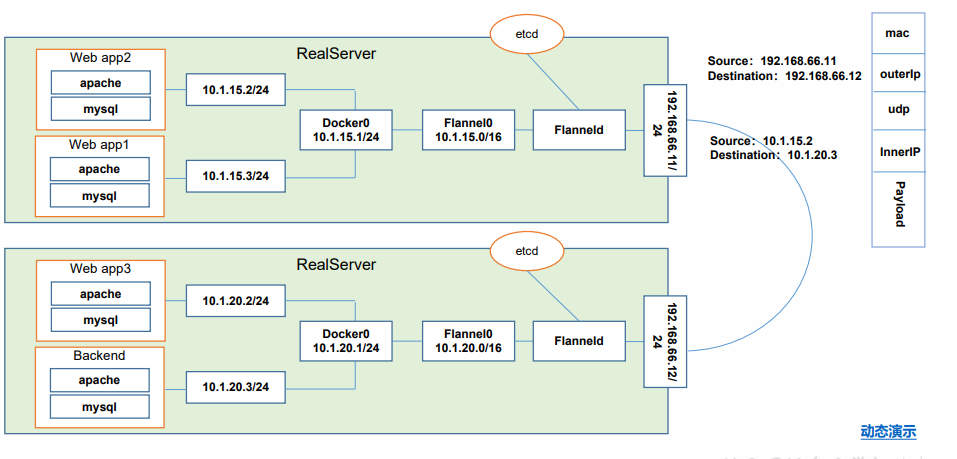
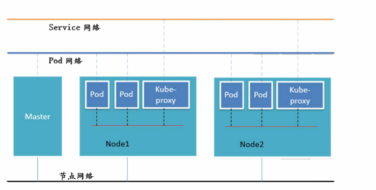

# Kubernate 基础概念

## 一、Pod

### 1.1 自主式Pod

* 通过自主创建的Pod，由yaml文件来创建的pod。
* 这类控制器一旦因为容器失败，会有重启策略，但是不会有重新创建的策略，也就是说，当删除pod的时候，由于没有控制器管理，它不会被重新创建。

  ```yaml
  kubectl apply -f nginx-pod.yml
  # nginx-pod.yaml
  apiVersion: v1
  kind: Pod
  metadata:
    name: nginx
    labels:
      app: nginx
  spec:
    #容器的重启策略。有三种Always(只有退出就重启)，OnFailure(失败退出时不重启),Never(只要退出就不重启)，kubelet重新启动的已退出容器将以指数退避延迟（10秒，20秒，40秒......）重新启动，上限为五分钟，并在成功执行十分钟后重置
    restartPolicy: Never
    containers:
    - name: nginx
      image: nginx
  ```


### 1.2 控制器管理的Pod

#### 1.2.1 ReplicationController  & ReplicaSet & Deployment & HPA

##### 1.2.1.1 ReplicationController

* 用来确保容器应用的副本数始终保持在用户定义的副本数，即如果有容器异常退出，会自动床架你新的Pod来替代，而异常多出出来的容器也会自动回收。
* 新版本中建议使用ReplicaSet 替代 ReplicationController

##### 1.2.1.2 ReplicaSet

* ReplicationController的升级版本，增加了集合是的selector

##### 1.2.1.3 Deployment

* Deployment为Pod和ReplicaSet提供了一的声明式定义，用来代替以前的鹅ReplicationController来方便管理应用，典型的场景包括：
  * 定义Deployment 来创建Pod和ReplicatSet
  * 滚动升级和回滚应用
  * 扩容和水溶
  * 暂停和继续Deployment

##### 1.2.1.4 HPA(Horzontal Pod Auto Scale)

* 适用于Deployment和ReplicaSet，根据Pod的CPU、内存或者自定义的metric的内容自动扩缩容。

#### 1.2.2 StatefulSet

* StatefulSet是为了解决有状态服务的问题（对应的Deployment 和 ReplicaSet是为无状态服务而设计），其应用场景包括：
  * **稳定的持久化存储**，即Pod重新调度后还是能访问到相同的持久化数据，基于PVC来实现。
  * **稳定的网络标志**，即Pod重新调度后其PodName和HostName不变，基于HeadlessService（即没有Cluster IP的Service）来实现
  * **有序部署，有序扩展**，即Pod是有顺序的，在部署或者扩展的时候依据定义的顺序依次进行（即从0到n-1，在下一个Pod运行之前所有的的Pod必须都是Running和Ready状态），基于init containers实现。
  * **有序收缩，有序删除**（即从N-1到0）
* 

#### 1.2.3 DaemonSet

* DaemonSet 确保全部（或者一些）Node上运行一个Pod的副本，当有Node加入集群是，也会为他们创建一个新的Pod。当有Node从集群中一寸时，这些Pod也会被回收。删除DaemonSet将会删除它创建的所有Pod。使用DaemonSet的一些典型用法：
  * **运行集群存储daemon**，例如在每个Node运行glusterd、ceph
  * **在每个Node上运行日志收集daemon**，例如fluentd、logstash
  * **在每个Node上运行监控daemon**，例如Prometheus Node Exporter

#### 1.2.4 Job & CronJob

##### 1.2.4.1 Job

* Job负责批处理任务，即仅执行一次的任务，它保证批处理任务的一个或者多个Pod成功技术

##### 1.2.4.2  CornJob

* Cron JOb 管理基于时间的Job，即：
  * 在给定的时间点只运行一次
  * 周期性的在给定时间运行

### 二、网络通讯方式

#### 2.1 通讯方式

* 同一个Pod内的多个容器之间：localhost
* 各个Pod之间的通讯：Overlay Network
* Pod 与 Service之前的通讯：各节点的Iptables规则

#### 2.2 Flannel

* Flannel是CoreOs团队针对Kubernetes设计的一个网络贵伐服务，它的功能是让集群中的不同节点主机创建的Docker容器都具有全集群唯一的虚拟UP地址。而且他还能在这些IP地址之间建立一个覆盖网络（Overlay Network），通过这个覆盖网络，将数据包原封不动地传递到目标容器内。

  
  * etcd之Flannel提供说明：
    * 存储管理Flannel可分配地IP地址端资源
    * 监控etcd中每个Pod地实际地址，并在内存中建立维护Pod节点路由表

#### 2.3 不同情况下网络通信方式：

* 同一个Pod内部通讯：
  * 同一个Pod共享同一个网络命名空间，共享同一个Linux协议栈
* Pod1至Pod2（不在同一台主机）：
  * Pod地地址是与Docker0在同一个网段的， 但是Docker0网段与宿主机网卡是两个完全不同地IP网段，并且不同Node之间地通信只能通过宿主机地物理网络卡进行。将Pod的UIP和所在Node的IP关联起来，通过这个关联让Pod可以互相访问
* Pod1与Pod2在同一台机器：
  * 由Docker网桥直接转发请求至Pod2，不需要经过Fannel
* Pod至Service的网络：
  * 基于性能考虑，全部为iptables、IPVS维护和转发
* Pod至外网：
  * Pod向外网发送请求，查找路由表，转发数据包到宿主机的网卡，宿主网卡完成路由选择之后，iptables执行Masuerade（地址伪装），把源IP更改为宿主网卡的IP，然后向外网服务器发送请求
* 外网访问Pod：Service

