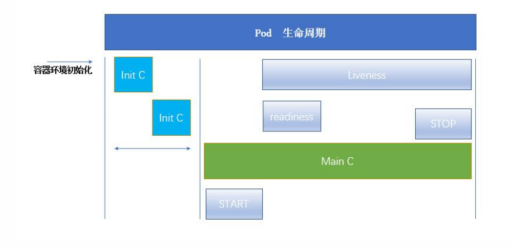

# Kubernetes生命周期



## 一、Init 容器

* Pod能够具有多个容器，应用运行在容器里面，单位是它也可能有一个或者多个先于应用容器启动的Init容器。

* Init容器与普通的容器非常像，除了以如下两点：
  * Init 容器总是运行到成功位置
  * 每个Init容器必须在下一个Init容器启动之前成功完成
* 如果Pod的Init的容器失败，Kubernetes会不断地重启该Pod，知道Init容器成功位置。然而，如果Pod对应地restartPolicy为Never，它不会重新启动

## 二、Init容器的作用

* 因为Init容器具有与应用程序容器分离的单独镜像，所以他们的启动相关代码又有如下优势：
  * 他们可以包含并运行实用工具，但是处于安全考虑，是不建议在应用容器镜像中包含这些使用工具的。
  * 他们可以包含使用工具和定制化代码来安装，但是不能出现在应用程序镜像中。例如，创建镜像没必要FROM另外一个容器，只需要在安装过程中使用类似sed、awk、、python或dig这样的工具。
  * 应用程序镜像可以分离创建和部署的角色，没有必要联合它们拆功能键一个单独的镜像。
  * Init容器使用果Linux Namespace。所以像对应用程序来说具有不同的文件系统视图，因此，他们能有具有访问Secret的权限，而应用程序容器不能。
  * 他们比也许在应用程序容器启动之前运行完成，而应用程序容器时并行运行的，所以Init容器能够提供了一种简单的阻塞和延迟与延迟应用容器的启动的方法，知直到满足了一组先决条件。

## 三、特殊说明

* 在Pod启动过程中，Init容器会按顺序在网络和数据卷初始化之后启动。每个容器必须在下一个容器启动之前成功退出。
* 如果由于运行时或者失败退出，将导致容器启动失败，它会根据Pod的restartPolicy指定的策略进行重试。然而，如果Pod的restartPolicy设置为Always，Init容器失败时会使用restartPolicy策略。
* 在所有Init容器没有启动成功之前，Pod将不会变成Ready状态。INit容器的端口将不会再Service种进行聚集。正在初始化的Pod处于Pending状态，但应该会将Initializing状态设置为true
* 如果Pod重启，所有Init容器必须重新启动
* 对Init容器spec的修改被限制在容器image字段，修改其他字段都不会生效。更改Init容器的image字段，等价于重启该Pod
* Init容器具有应用容器的所有字段。除了readinessProbe，因为Init容器无法定义不同于完成（completion）和就绪（readiness）之外的其他状态。这会在验证过程种强制执行。
* 在Pod种每个app和Init容器的名称必须唯一；与其他容器共享同一个名称，会在验证时抛出错误。

## 四、容器探针

* 探针时Kubelet对容器执行的定期诊断。要执行诊断，kubelet调用容器实现的Handler。有三种类型的处理程序：
  * **ExecAction**：在容器内部执行指定命令。退出返回码为0为成功，其他为失败。
  * **TCPSocketAction**：对指定端端口上的容器进行TCP检查。端口打开为成功，其他为失败。
  * **HTTPGetAction**：对指定端口和路径上的容器执行Http Get请求。状态码（200<=code<400）为成功，其他为失败。
* 探针会获取三种结果：
  * 成功：不操作
  * 失败：处理失败情况，受重启策略影响。
  * 未知：容器挂死
* 探测方式：
  * readinessProbe：
    * 指定容器是否准备好服务请求。如果就绪探针失败，端点控制器将从与Pod匹配的所有Service的端点种删除该Pod的IP地址。初始延迟之前的就绪状态默认为Faiulure。如果容器不提供就绪探针，则默认状态为Success。
  * liveinessProbe：
    - 只是容器是否正在运行。如果存活探针失败，则kublet会杀死容器，并根据重启策略处理。如果容器不提供存活探针，则默认状态为Success

## 五、Pod Phase

* Pod的status字段是一个PodStatus对象，PodSatus中有个phase字段。
* Pod的相位(phase)时Pod在其生命周期中的简单宏观概述。
* Pod的phase可能存在的值：
  * 挂起（Pending）：Pod已被Kubernetes系统接受，但有一个或者多个容器镜像尚未创建。等待时间包括调度Pod的时间和通过网络下载镜像的时间。
  * 运行中（Running）：该Pod已经绑定到了一个节点上，Pod中的所有容器都已经被创建。至少有一个容器正在运行中，或者处于启动或重启状态
  * 成功（Successed）：Pod中所有的容器都被成功启动，并且不会再重启。
  * 失败（Failed）：Pod中所有的容器都已种植，并且至少有一个容器时因为失败终止。也就是说，容器以非0 状态退出或者被系统终止。
  * 未知（Unkown）：因为某些原因无法获取得Pod的状态，通常是因为Pod所在的主机通信失败。

## 六、Init容器测试

* myapp-pod 必须要依赖initContainers验证通过

```yaml
# 必须要
apiVersion: v1
kind: Pod
metadata:
  name: myapp-pod
  labels:
    app: myapp
spec:
  containers:
  - name: myapp-container
    image: busybox
    command: ['sh', '-c', 'echo The app is running! && sleep 3600']
  initContainers:
  - name: init-myservice
    image: busybox
    command: ['sh', '-c', 'until nslookup myservice; do echo waiting for myservice; sleep 2; done;']
  - name: init-mydb
    image: busybox
    command: ['sh', '-c', 'until nslookup mydb; do echo waiting for mydb; sleep 2; done;']

```

```yaml
# 必须提前创建依赖
kind: Service
apiVersion: v1
metadata:
  name: myservice
spec:
ports:
  - protocol: TCP
    port: 80
    targetPort: 9376
---
kind: Service
apiVersion: v1
metadata:
   name: mydb
spec:
  ports:
  - protocol: TCP
    port: 80
    targetPort: 9377

```

## 七、探针测试

### 7.1 **readinessProbe-httpget**

* **检测探针-就绪检测**
* 容器后启动后等待1s，每3秒循环一次，一旦能获取http get页面，就会标记pod为Ready。

```yaml
apiVersion: v1
kind: Pod
metadata:
  name: readiness-httpget-pod
  namespace: default
spec:
  containers:
  - name: readiness-httpget-container
    image: myapp:v1
    imagePullPolicy: IfNotPresent
    readinessProbe:
      httpGet:
        port: 80
        path: /index1.html
      initialDelaySeconds: 1
      periodSeconds: 3

```

### 7.2 livenessProbe-exec

* **检测探针-存活检测**
* 一开始时运行状态，过了60s，文件删除。
* 探针执行，等文件被删除后，检测失败，Pod被重启，RESTART数量增加。

```yaml
apiVersion: v1
kind: Pod
metadata:
  name: liveness-exec-pod
  namespace: default
spec:
  containers:
  - name: liveness-exec-container
    image: busybox
    imagePullPolicy: IfNotPresent
    command: ["/bin/sh","-c","touch /tmp/live ; sleep 60; rm -rf /tmp/live; sleep
3600"]
    livenessProbe:
      exec:
        command: ["test","-e","/tmp/live"]
      initialDelaySeconds: 1
      periodSeconds: 3

```

### 7.3 livenessProbe-httpget

* **检测探针-存活检测**
* 探针执行HttpGet，一旦http get失败，Pod被重启，RESTART数量增加。

```yaml
apiVersion: v1
kind: Pod
metadata:
  name: liveness-httpget-pod
  namespace: default
spec:
  containers:
    - name: liveness-httpget-container
      image: myapp:v1
      imagePullPolicy: IfNotPresent
      ports:
      - name: http
        containerPort: 80
      livenessProbe: 
      httpGet:
        # 复用ports中的端口
        port: http
        path: /index.html
      initialDelaySeconds: 1
      periodSeconds: 3
      timeoutSeconds: 10
```

### 7.4 livenessProbe-tcp

- **检测探针-存活检测**
- 探针执行tcp 请求，一旦tcp失败，Pod被重启，RESTART数量增加。

```yaml
apiVersion: v1
kind: Pod
metadata:
  name: probe-tcp
spec:
  containers:
  - name: nginx
    image: myapp:v1
    livenessProbe:
      tcpSocket:
        port: 80
      initialDelaySeconds: 5
      timeoutSeconds: 1
```

### 7.5 启动退出动作

```yaml
apiVersion: v1
kind: Pod
metadata:
  name: lifecycle-demo
spec:
  containers:
  - name: lifecycle-demo-container
    image: nginx
    lifecycle:
      postStart:
        exec:
          command: ["/bin/sh", "-c", "echo Hello from the postStart handler > /usr/share/message"]
      preStop:
        exec:
          command: ["/bin/sh", "-c", "echo Hello from the poststop handler > /usr/share/message"]

```

