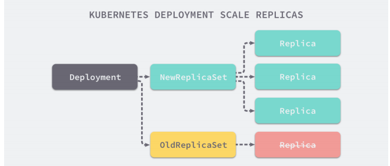

# Kubernetes资源控制器

* Kubernetes中建立了很多的Controller，这些相当于一个状态机，用来控制Pod的具体状态和行为。

## 一、ReplicationController  & ReplicaSet

- 用来确保容器应用的副本数始终保持在用户定义的副本数，即如果有容器异常退出，会自动床架你新的Pod来替代，而异常多出出来的容器也会自动回收。
- 新版本中建议使用ReplicaSet 替代 ReplicationController

* 部署ReplicaSet：

  ```yaml
  apiVersion: extensions/v1beta1
  kind: ReplicatSet
  metadata:
    name: frontend
  spec:
    replicas: 3
    selector:
      matchLabels:
        tier: frontend
    template:
      metadata:
        labels:
          tier: frontend
      spec:
        containers:
        - name: php-redis
          image: gcr.io/google_samples/gb-frontend:v3
          env:
          - name: GET_HOSTS_FROM
            values: dns
          ports:
          - containerPort: 80
  ```

## 二、Deployment

- Deployment为Pod和ReplicaSet提供了一的声明式定义，用来代替以前的鹅ReplicationController来方便管理应用，典型的场景包括：

  - 定义Deployment 来创建Pod和ReplicatSet
  - 滚动升级和回滚应用
  - 扩容和水溶
  - 暂停和继续Deployment

- Deployment部署升级：

  

- 部署Deployment for Nginx：

  ```yaml
  # nginx-deployment.yaml
  apiVersion: extensions/v1beta1
  kind: Deployment
  metadata:
    name: nginx-deployment
  sepc:
    replica: 3
    template:
     metadata:
       labels:
         app: nginx
     spec:
       containers:
       - name: nginx
         image: nginx:1.7.9
         ports:
         - containerPort: 80
  ```

  * 部署集群

    ```sh
    kubectl create -f nginx-deployment.yaml --record
    ## --record可参数可以记住命令，我可以很方便地看到每次revision的变化
    ```

  * 扩容

    ```
    kubectl scale deployment nginx-deployment --replicas 10
    ```

  * 更新镜像

    ```sh
    kubectl set image deployment/nginx-deployment nginx=nginx:1.9.1
    # 也可以通过edit命令修改
    kubectl edit deployment/nginx-deployment
    ```

  * 查看历史RS

    ```sh
    kubectl get rs
    # 可以看到保留了两个版本的rs
    ```

  * 回滚

    ```
    kubectl rollout undo deployment/nginx-deployment 
    ```

  * 查看回滚状态

    ```sh
    kubectl rollout status deployment/nginx-deployment 
    ```

  * HPA

    ```sh
    kubectl autoscale deployment/nginx-deployment --min=5 --max=10 --cpu-percent=80
    ```

- **Deployment更新策略**

  - Deployment可以保证升级时一定数量的Pod时down的。默认的，它会确保至少有比期望的Pod数量至少一个是up状态（最多一个不可用）
  - Deployment同时也可以确保值创建出超过期望数量的一定数量的Pod。默认的，它会确保最多比期望Pod数量多一个Pod是up的（最多一个surge）
  - 中间的一个可以理解为升级替换的数量，新的rs升级一个，老的rs下线一个。同时，新版本中的数量1更改为比例25%
  
- **Rollover（多个rollout并行）**

  - 假如创建了一个有五个`nginx:1.7.9 `Replica得Deployment，但是还只有3个`nginx:1.7.9 `Replica创建出来的时候，就开始更新`nginx：1.9.1`Replica的deployment。这种情况下，Deployment会里斯杀死已经创建的3个`nginx:1.7.9 `的Pod，并开始创建`nginx:1.9.1`的Pod。它不会等到所有的五个`nginx1.7.9`的Pod都创建好之后才开始改变航道。

- **回滚Deployment**

  ```sh
  kubectl set image deployment/nginx-deployment nginx=nginx:1.9.1
  kubectl rollout status deployment/nginx-deployment
  kubectl get pod
  kubectl rollout history deployment/nginx-deployment
  kubectl rollout undo deployment/nginx-deployment
  # 指定回滚版本
  kubectl rollout undo deployment/nginx-deployment --to-version=2
  # 暂停更新
  kubectl rollout pause deployment/nginx-deployment
  ```
  可以使用`kuberctl rollout status`命令查看Deployment是否完成。如果rollout完成，`kuberctl rollout status`将会返回一个0值得Exit Code
  ```
  $ kuberctl rollout status deployment/nginx-deployment
  ....
  $echo $?
  0
  ```

- **清理Policy**

  你可以设置sepc.revisionHistoryLimit项来指定Deployment得保留多少Revision历史记录，默认会保存所哟的revision。如果该项设置为0，Deployment就不允许回滚了。

## 三、StatefulSet

- StatefulSet是为了解决有状态服务的问题（对应的Deployment 和 ReplicaSet是为无状态服务而设计），其应用场景包括：
  - **稳定的持久化存储**，即Pod重新调度后还是能访问到相同的持久化数据，基于PVC来实现。
  - **稳定的网络标志**，即Pod重新调度后其PodName和HostName不变，基于HeadlessService（即没有Cluster IP的Service）来实现
  - **有序部署，有序扩展**，即Pod是有顺序的，在部署或者扩展的时候依据定义的顺序依次进行（即从0到n-1，在下一个Pod运行之前所有的的Pod必须都是Running和Ready状态），基于init containers实现。
  - **有序收缩，有序删除**（即从N-1到0）

## 四、DaemonSet

- DaemonSet 确保全部（或者一些）Node上运行一个Pod的副本，当有Node加入集群是，也会为他们创建一个新的Pod。当有Node从集群中一寸时，这些Pod也会被回收。删除DaemonSet将会删除它创建的所有Pod。使用DaemonSet的一些典型用法：
  - **运行集群存储daemon**，例如在每个Node运行glusterd、ceph
  - **在每个Node上运行日志收集daemon**，例如fluentd、logstash
  - **在每个Node上运行监控daemon**，例如Prometheus Node Exporter
  
- Example：

  ```yaml
  apiVersion: apps/v1
  kind: DaemonSet
  metadat:
    name: daemenset-example
    labels:
      app: daemonset
  spec:
    selector:
      matchLabels:
        name: daemonset-example
    template:
      metadata:
        labels:
          nameL: daemonset-example
      spec:
        containers:
        - name: daemonset-example
          image: nginx
  ```

## 五、 Job

- Job负责批处理任务，即仅执行一次的任务，它保证批处理任务的一个或者多个Pod成结束

- 特殊说明：

  - 单个Pod时，默认Pod成功运行后Job结束。
  - `spec.template`格式同Pod
  - `.spec.restartPolicy`仅支持Never或者onFailure
  - `.spec.completions`标志job结束需要成功运行的Pod个数，默认为1
  - `.spec.parallelism`标志并行运行的个数，默认为1
  - `sepc.activeDeadlineSeconds`标志失败Pod的重试最大时间，超过这个时间不会继续重启。

- Example：

  ```yaml
  api: batch/v1
  kind: Job
  metadata:
    name: p1
  spec：
    template:
      metadata:
        name: pi
      spec:
        containers:
        - name: pi
          image: perl
          command: ["perl","-Mbignum=bpi","-wle","print bpi(2000)"]
        restartPolicy: Never
  ```

## 六、CornJob

- Cron JOb 管理基于时间的Job，即：
  - 在给定的时间点只运行一次
  - 周期性的在给定时间运行
  
- 典型用法：

  - 在给定的时间点调度Job运行
  - 创建周期性运行的Job，例如：数据库备份、发送邮件

- 特殊说明：

  - 单个Pod时，默认Pod成功运行后Job结束。
  - `spec.template`格式同Pod
  - `.spec.restartPolicy`仅支持Never或者onFailure
  - `.spec.completions`标志job结束需要成功运行的Pod个数，默认为1
  - `.spec.parallelism`标志并行运行的个数，默认为1
  - `sepc.activeDeadlineSeconds`标志失败Pod的重试最大时间，超过这个时间不会继续重启。
  - `spec.schedule`：调度，必须字段，指定任务运行周期，格式同Cron
  - `spec.jobTemplate`：Job模板，必须字段，指定需要运行的任务，格式同Job
  - `.spec.startingDeadlineSeconds`：启动Job的期限（秒级别），可选字段。如果因为任务原因而错过了被调度的时间，那么错过执行时间的Job将被认为时失败的，如果没有指定，则没有期限。
  - `.spec.concurrencyPolicy`：并发策略，可选字段，它指定CronJob创建的Job的并发执行，只允许下列策略种的一种：
    - `Allow`：允许并发运行Job
    - `Forbid`：禁止并发运行，如果前一个没有完成，之后跳过下一个
    - `Replace`：取消当前正在运行的Job，用一个新的来替换
  - `.spec.supend`：挂起，可选字段。如果设置为true，后续所有执行都会被改期，它对已经开始执行的Job不起作用。默认为false。
  - `.spec.successfulJobHistoryLimit`和`.spec.failedJobHistoryLimit`：历史限制，可选，他们制定了可以保留多少完成和失败的Job，默认情况分别为3和1，设置为0的话，相关的Job执行结束后不会保留。

- Example

  ```yaml
  apiVersion: batch/v1beta1
  kind: CronJob
  netadata:
    name: hello
  spec:
    schedule: "*/1 * * * *"
    jobTemplate:
      spec:
        template:
          spec:
            containers:
            - name: hello
              image: busybox
              args:
              - /bin/sh
              - -c
              - data;echo Hello World
            restartPolicy: OnFailure
  ```

  ```sh
  $ kubectl get cronjob
  $ kubectl get jobs
  
  # JOB_NAME替换为JOB实际name
  $ pods=$(kubectl get --selector-job=job-name=JOB_NAME --output=jsonpath={.item..metadata.name})
  $ kubectl logs $pods
  # Hello World
  
  # 删除cronjob并不会删除job
  $ kubectl delete coonjob hello
  ```

## 七、HPA